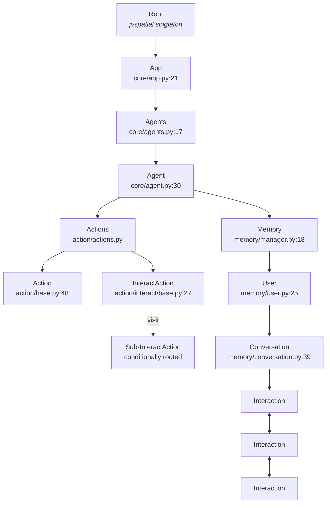
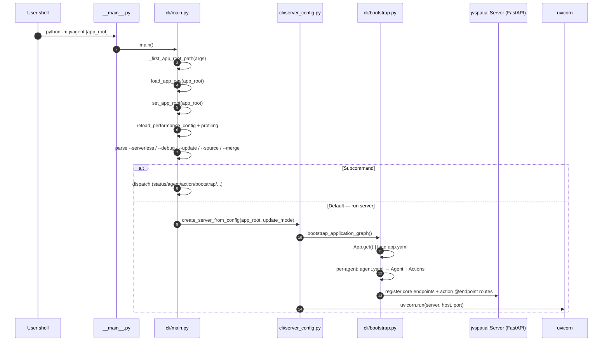
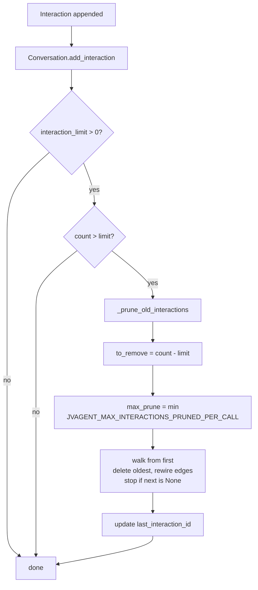

# jvagent Architecture

> Diagrams + flow walkthroughs. Normative semantics live in [`SPEC.md`](SPEC.md); this doc is the visual companion.

---

## 1. Graph hierarchy



**Edge semantics**
- Solid arrows: structural edges (`Root → App`, `Agent → Actions`, etc.).
- `Conv → I1` is `direction="out"`. `I1 ↔ I2` (and onward) are `direction="both"` after the second `Interaction` lands ([`conversation.py:315-317`](../jvagent/memory/conversation.py)).
- `IA1 -. visit .-> IAChild` is a runtime walker hop, NOT a persisted edge from the parent's `execute()` — top-level `InteractAction`s explicitly route the walker into their children ([`interact/base.py:280-290`](../jvagent/action/interact/base.py)).

---

## 2. Boot sequence



References:
- `cli/main.py:119-244` — entry
- `cli/server_config.py:60-180` — `create_server_from_config`
- `cli/bootstrap.py` — `bootstrap_application_graph()`
- `core/app_loader.py` — `app.yaml → App`
- `core/agent_loader.py` — `agent.yaml → Agent`

---

## 3. Interaction flow — `POST /agents/{id}/interact`

```mermaid
sequenceDiagram
    autonumber
    participant C as Client
    participant FE as FastAPI endpoint<br/>(action/interact/endpoints.py:208+)
    participant W as InteractWalker<br/>(action/interact/interact_walker.py)
    participant MEM as Memory + Conversation
    participant IA as InteractAction(s)<br/>weight-ordered
    participant RB as ResponseBus
    participant BG as Background queue

    C->>FE: POST /agents/{id}/interact { utterance, channel, session_id, ... }
    FE->>W: InteractWalker(payload).spawn(agent)
    W->>MEM: _bootstrap_interaction()
    MEM->>MEM: resolve/create User (lock_manager)
    MEM->>MEM: resolve/create Conversation by session_id
    MEM->>MEM: append Interaction (chain edges; check interaction_limit; prune if over)
    loop For each top-level InteractAction in weight order
        W->>IA: on_interact_action() → execute(walker)
        alt run_in_background == True
            W->>BG: queue (don't execute inline)
        else inline
            IA->>RB: publish(...) or respond(...) via ReplyAction
            IA->>W: optionally visitor.visit(child)
        end
    end
    W->>FE: build_interact_response()
    alt streaming
        FE-->>C: SSE stream chunks
    else single response
        FE-->>C: JSON response
    end
    Note over FE,BG: After response sent
    FE->>BG: _run_background_actions(walker)
    BG->>IA: execute() each (try/except isolated)
```

References:
- `action/interact/endpoints.py:208+` — endpoint
- `action/interact/webhook_pipeline.py:53+` — background runner
- `action/interact/interact_walker.py:47-1013` — walker logic
- `action/interact/interact_walker.py:267-467` — bootstrap
- `memory/conversation.py:235-575` — append + prune

---

## 4. Orchestrator turn (continuation check + think-act-observe loop)

```mermaid
sequenceDiagram
    autonumber
    participant W as InteractWalker
    participant SE as OrchestratorInteractAction
    participant CC as Continuation check (deterministic)
    participant FL as Active flow IA (e.g. interview)
    participant M as LanguageModel
    participant T as Tool surface
    participant PER as ReplyAction reply/respond

    W->>SE: execute(walker)
    SE->>CC: active_flow_owner(visitor)? (deterministic TaskStore read, no model)
    alt active flow-task owns the turn (turn-lock)
        CC-->>SE: owner_action (== the flow IA's tool name)
        SE->>FL: restrict tool surface to that owner + dispatch the IA-as-tool
        FL-->>SE: IA runs the turn; its own COMPLETE/YIELD clears/advances the task, else the lock persists
    else no active flow
        CC-->>SE: None → fall through ↓
    end
    loop think-act-observe (one model call per tick, bounded)
        SE->>M: model tick over the unified tool surface
        M-->>SE: select a tool (routing = tool selection)
        SE->>T: dispatch tool (AC-gated): IA-as-tool · action tool ·\ncore tool · find_skill/use_skill · find_tool/load_tool
        T-->>SE: observation
    end
    SE->>PER: reply / respond (model-discretionary egress)
    PER-->>W: published; execute() returns once
```

**Why one `execute()` call instead of walker-revisit?** The Orchestrator re-derives the per-step concerns — one model call per tick, access control, observability, runaway bound — at loop level inside a single `execute()`, so the turn completes without graph-traversal overhead per iteration. The continuation check reads persisted state only (no model); resume is never re-decided by the model. See [`adr/0012-skill-executive-architecture.md`](adr/0012-skill-executive-architecture.md) (supersedes ADR-0010).

References:
- `action/orchestrator/orchestrator_interact_action.py` — orchestrator entry: walk-path curation + tool-surface assembly + loop entry
- `action/orchestrator/loop.py` / `loop_helpers.py` — the bounded think-act-observe loop and its per-tick helpers
- `action/orchestrator/continuation.py` — active-flow surfacing (`active_flow_owner` + `active_flow_note`)
- `action/orchestrator/walk_path.py` — walk-path curation (which IAs surface as tools)
- `action/orchestrator/egress.py` — model-discretionary egress (reply/respond dispatch)
- `action/orchestrator/uploads.py` — inbound attachment/upload handling
- `action/orchestrator/constants.py` — shared orchestrator constants
- `action/orchestrator/tools.py` — SkillTool primitives + helpers
- `action/interact/base.py` — `InteractAction.get_tools()` (an IA furnishes its own tool, forwarding to `execute`)
- `action/reply/reply_action.py` — `ReplyAction.get_tools()` (reply/respond, visitor-bound inline via `wrap_action_tool`)
- `action/orchestrator/core_tools.py` — built-in core tools
- `action/orchestrator/catalog.py` / `skills.py` — find_tool/load_tool and find_skill/use_skill

---

## 5. Memory pruning



References:
- `memory/conversation.py:490-575` — full pruning routine
- `memory/conversation.py:514-531` — env-bounded cap
- `memory/conversation.py:538-543` — never-delete-last invariant

---

## 6. Response emission

```
InteractAction.publish() ─┬─ visitor.response_bus.publish(...)
                          │
                          ├─ stream=True (default) → SSE flush
                          ├─ stream=False          → adhoc single message
                          ├─ category=user|thought → ResponseMessage type
                          └─ relay_to_adapters     → channel adapters fan-out
                                                      (WhatsApp, Messenger, Email, SSE, ...)
```

- Source: [`action/interact/base.py:293-374`](../jvagent/action/interact/base.py).
- Channel adapters: `action/response/channel_adapter.py`.
- Filters: `action/response/channel_filter.py`.
- Per-agent bus: `Agent.get_response_bus()` ([`agent.py:256`](../jvagent/core/agent.py)).

### 6.1 Proactive (out-of-walker) sends

```
Agent.send_proactive_message(user_id, content, channel, ...)
   │
   ├─ Memory.get_user(user_id, create_if_missing=True)
   ├─ user.get_conversation_by_session(session_id) OR get_active_conversation() OR create_conversation()
   ├─ conversation.add_interaction(utterance="")     ── empty utterance = proactive marker
   ├─ interaction.add_parameter({"is_proactive": True, ...metadata}, source_action)
   └─ response_bus.publish(category="user", interaction=..., content=..., channel=...)
         │
         ├─ channel adapter dispatch (e.g. WhatsAppAdapter.send → provider API)
         └─ _append_to_interaction_response_impl → interaction.set_response + save
```

- Source: [`agent.py:271-358`](../jvagent/core/agent.py).
- Empty-utterance entries are suppressed from the `role: "user"` slot in LLM history at [`conversation.py:741-752`](../jvagent/memory/conversation.py); they render as standalone `assistant` turns.
- User-facing reference: [`../docs/proactive-messages.md`](../docs/proactive-messages.md).

---

## 7. Logical layers

```
┌─────────────────────────────────────────────────────────────────┐
│  CLI (jvagent/cli/) — entry, subcommands, server bootstrap      │
├─────────────────────────────────────────────────────────────────┤
│  Core (jvagent/core/) — App/Agent nodes, config, repair         │
├─────────────────────────────────────────────────────────────────┤
│  Memory (jvagent/memory/) — User/Conversation/Interaction       │
├─────────────────────────────────────────────────────────────────┤
│  Action library (jvagent/action/) — plugins                     │
│    ├─ interact/  — base + walker + endpoints                    │
│    ├─ orchestrator/ — Orchestrator + tools    │
│    ├─ model/     — LLM + embedding actions                      │
│    ├─ response/  — bus + channel adapters                       │
│    └─ <vertical actions>: google, microsoft, whatsapp, email... │
├─────────────────────────────────────────────────────────────────┤
│  Logging (jvagent/logging/) — separate logs DB + query endpoints│
├─────────────────────────────────────────────────────────────────┤
│  Scaffolding (jvagent/scaffold/) — `jvagent app create` flow    │
├─────────────────────────────────────────────────────────────────┤
│  jvspatial (sibling pkg) — Object/Node/Edge/Walker, FastAPI,    │
│                            JSON/SQLite/MongoDB/DynamoDB         │
└─────────────────────────────────────────────────────────────────┘
```

---

## 8. Where data lives

| Concern | Storage |
|---|---|
| Graph nodes | jvspatial-managed DB (JSON / SQLite / MongoDB / DynamoDB; configurable per env) |
| Logs | **Separate** `logs` DB via `get_logging_service(database_name="logs")` (`logging/endpoints.py:39+`) |
| Files | `App.file_storage_provider` — local FS or S3 (`core/app.py:51`) |
| Locks | In-process per-event-loop (`core/app.py:90-124`); jvspatial may add distributed locks |

---

## 9. Where to look next

| If you want to... | Read |
|---|---|
| Build an action | [`action-authoring.md`](reference/action-authoring.md) |
| Understand the Orchestrator deeply | [`../docs/ORCHESTRATOR.md`](../docs/ORCHESTRATOR.md) + [`adr/0012-skill-executive-architecture.md`](adr/0012-skill-executive-architecture.md) |
| Tune logging | [`observability.md`](reference/observability.md) |
| Run locally | [`runbooks/local-dev.md`](runbooks/local-dev.md) |
| See every action | [`actions-catalog.md`](reference/actions-catalog.md) |
| Understand jvspatial | [`jvspatial-integration.md`](reference/jvspatial-integration.md) |
