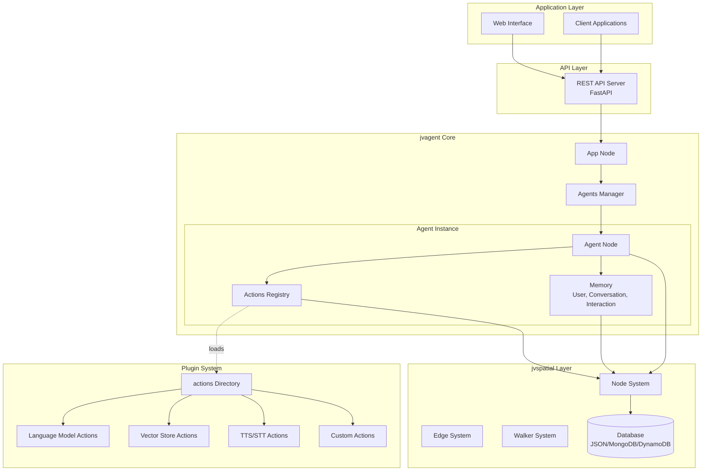
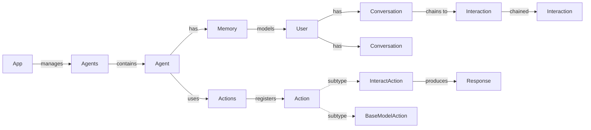

# jvagent

A modular, pluggable agentive platform built on jvspatial that provides a production-ready framework for AI agent development with enterprise-grade observability and scalability.

## Table of Contents

- [Installation](#installation)
- [Quick Start](#quick-start)
- [Running jvagent in an App Directory](#running-jvagent-in-an-app-directory)
- [Core Concepts](#core-concepts)
  - [Actions](#actions)
  - [InteractActions](#interactactions)
  - [Agents](#agents)
- [Memory System](#memory-system)
- [Namespaces](#namespaces)
- [Logging System](#logging-system)
- [Architecture](#architecture)
- [Directory Structure](#directory-structure)
- [Configuration Files](#configuration-files)
- [Creating Actions](#creating-actions)
  - [InteractActions](#interactactions-1)
  - [Using Core Actions](#using-core-actions)
  - [Creating Custom Actions](#creating-custom-actions)
- [Action Lifecycle](#action-lifecycle)
- [Property Configuration](#property-configuration)
- [Namespace System](#namespace-system)
- [API Usage](#api-usage)
- [Development](#development)
- [Deployment](#deployment)
  - [Dockerfile Generation](#dockerfile-generation)
- [Documentation Index](#documentation-index)

## Installation

### Prerequisites

- Python 3.8 or higher
- pip

### Install from Source

1. Clone the repository:
   ```bash
   git clone <repository-url>
   cd jvagent
   ```

2. Install in development mode:
   ```bash
   pip install -e .
   ```

   Or install with development dependencies:
   ```bash
   pip install -e ".[dev]"
   ```

   Or install with PageIndex support (for document ingestion/retrieval):
   ```bash
   pip install -e ".[pageindex]"
   ```

### Install from Distribution

If you have a built distribution:
```bash
pip install dist/jvagent-*.whl
```

## Examples

A complete example application is provided in the `examples/jvagent_app/` directory. This includes:

- **Example Agent** (`jvagent/example_agent`): Demonstrates agent configuration and action setup
- **Example Action** (`jvagent/example_action`): Shows action structure, lifecycle hooks, and API endpoints
- **Model Action** (`jvagent/model_openai`): Demonstrates LLM integration with OpenAI

### Running the Bundled Example

After installing jvagent, you can run the bundled example application:

**Option 1: Using app root path (recommended)**
```bash
# From the jvagent repository root
jvagent examples/jvagent_app
```

**Option 2: Change to the example directory first**
```bash
cd examples/jvagent_app
jvagent
```

**With flags:**
```bash
# Run with debug logging
jvagent examples/jvagent_app --debug

# Run with merge update (non-destructive)
jvagent examples/jvagent_app --update

# Run with source update (destructive)
jvagent examples/jvagent_app --update --source

# Run with serverless runtime simulation (single-threaded, no background tasks)
jvagent examples/jvagent_app --serverless
```

**Note:** Before running the example, ensure you have:
1. Set up a `.env` file in `examples/jvagent_app/` with at least:
   - `JVAGENT_ADMIN_PASSWORD` - Admin user password
   - `OPENAI_API_KEY` - (Optional) For the model_openai action

See [examples/jvagent_app/README.md](examples/jvagent_app/README.md) for detailed information about the example application structure.

## Quick Start

### 1. Configure Environment

Copy the example environment file and update with your values:
```bash
cp .env.example .env
```

Edit `.env` and set at minimum:
- `JVAGENT_ADMIN_PASSWORD` - Password for the initial admin user
- `JVSPATIAL_JWT_SECRET` - Secret key for JWT authentication (change from default in production)

### 2. Run jvagent

After installation, you can run jvagent in several ways:

**Option 1: Using the console command**
```bash
jvagent
```

**Option 2: Using Python module**
```bash
python -m jvagent
```

The server will start on `http://127.0.0.1:8000` by default (configurable via `.env`).

### 3. Access the API

- **API Documentation**: http://localhost:8000/docs
- **Alternative Docs**: http://localhost:8000/redoc

### 4. Login

Use the admin credentials from your `.env` file:
```bash
curl -X POST "http://localhost:8000/auth/login" \
  -H "Content-Type: application/json" \
  -d '{
    "email": "admin@jvagent.example",
    "password": "your-admin-password"
  }'
```

## Running jvagent in an App Directory

jvagent is designed to work with a declarative app directory structure. You can run jvagent with a path to your app directory, or from within the app directory itself. When an `app.yaml` file is found, jvagent automatically discovers and loads all agents and actions defined in your YAML configuration files.

### Creating a jvagent App Directory

A jvagent app directory should have the following structure:

```
my_jvagent_app/
├── app.yaml                    # Application configuration
├── .env                        # Environment variables
└── agents/
    └── {namespace}/
        └── {agent_name}/
            ├── agent.yaml      # Agent configuration
            └── actions/
                └── {namespace}/
                    └── {action_name}/
                        ├── __init__.py
                        ├── {action_name}.py
                        ├── endpoints.py
                        ├── info.yaml
                        └── requirements.txt
```

### Running jvagent from an App Directory

jvagent supports two ways to specify the app directory:

**Option 1: Specify app root path (recommended)**
```bash
# Run from anywhere, specifying the app directory path
jvagent /path/to/my_jvagent_app

# With flags
jvagent /path/to/my_jvagent_app --update --debug
```

**Option 2: Run from within the app directory**
```bash
# Navigate to your app directory
cd /path/to/my_jvagent_app

# Run jvagent (uses current directory as app root)
jvagent
```

**Using Python module:**
```bash
# With path
python -m jvagent /path/to/my_jvagent_app

# From within directory
cd /path/to/my_jvagent_app
python -m jvagent
```

**Benefits of specifying the app root path:**
- Run jvagent from any directory
- Easier to manage multiple app directories
- Better for scripts and automation
- Clearer which app you're running

### What Happens When You Run jvagent

When jvagent starts in a directory with `app.yaml`, it automatically:

1. **Reads `app.yaml`** to get application configuration
2. **Creates/updates the App node** from `app.yaml` context
3. **Discovers agents** from the `agents/` directory structure
4. **For each agent listed in `app.yaml`:**
   - Reads `agent.yaml` to get agent configuration
   - Creates/updates the Agent node
   - Discovers actions from `actions/{namespace}/{action_name}/` directories
   - Reads `info.yaml` for each action
   - Loads and registers actions with their configuration

### Default Behavior vs. Update Modes

**Default Behavior (No `--update` flag):**
- Uses existing agents and actions from the database
- Only installs new agents/actions from `app.yaml` that don't exist
- Does **not** overwrite existing agent/action context
- Safe for repeated runs - won't overwrite manual changes
- **Important**: Agents can only be installed via `app.yaml` - there is no direct agent installation

**Merge Update Mode (`--update` or `--update --merge`):**
- Non-destructive: preserves database state and runtime modifications
- Only updates properties that are explicitly set in YAML files
- Preserves child nodes, graph connections, and runtime-modified properties
- Updates metadata to reflect the current source code state
- **Action removal**: Actions removed from `agent.yaml` are deregistered and deleted from the graph, including those whose class modules are no longer imported (ghost nodes). jvspatial's standard `Node.get()` + `node.delete()` interface handles cleanup so edges and dependent nodes are properly removed.
- Use when you've updated YAML files and want to apply changes without losing DB state

**Source Update Mode (`--update --source`):**
- Destructive: fully overwrites database state from YAML source
- Overwrites all agent/action context with values from YAML files
- Deletes and recreates action nodes (child nodes are lost)
- Use for a complete reset to source configuration

### Examples

**Example 1: First Run (Default Mode)**
```bash
# Using app root path
jvagent /path/to/my_jvagent_app

# Or from within the directory
cd /path/to/my_jvagent_app
jvagent
```
This will:
- Create the App node from `app.yaml`
- Install all agents listed in `app.yaml`
- Register all actions for each agent
- Start the server

**Example 2: Subsequent Runs (Default Mode)**
```bash
jvagent /path/to/my_jvagent_app
```
This will:
- Use existing App node (won't overwrite)
- Skip existing agents (won't overwrite their context)
- Skip existing actions (won't overwrite their context)
- Start the server with existing configuration

**Example 3: Merge Update (Non-Destructive)**
```bash
jvagent /path/to/my_jvagent_app --update
```
This will:
- Update App/Agent/Action nodes with explicitly set YAML properties only
- Preserve database state for properties not in YAML
- Preserve child nodes and graph connections for actions
- Apply source code changes while keeping runtime modifications

**Example 4: Source Update (Destructive)**
```bash
jvagent /path/to/my_jvagent_app --update --source
```
This will:
- Fully overwrite App/Agent nodes from YAML files
- Delete and recreate action nodes from source
- Reset all properties to YAML/source values (previous `--update` behavior)

**Example 5: Bootstrap Only (No Server)**
```bash
jvagent /path/to/my_jvagent_app bootstrap
```
This will:
- Bootstrap the application graph
- Install agents and actions (skip existing)
- Exit without starting the server

**Example 6: Bootstrap with Merge Update**
```bash
jvagent /path/to/my_jvagent_app bootstrap --update
```
This will:
- Non-destructively merge source changes into existing DB state
- Exit without starting the server

**Example 7: Run with Debug Logging**
```bash
jvagent /path/to/my_jvagent_app --debug
```
This will:
- Start the server with verbose debug logging
- Show detailed information about bootstrap process
- Display individual agent and action registration

**Example 8: Fresh Start with Purge (Development Only)**
```bash
jvagent /path/to/my_jvagent_app --purge
```
This will:
- Delete the `jvagent_db` and `jvagent_logs` directories
- Start with a completely fresh database
- Bootstrap the application from scratch

**Note:** The `--purge` flag is only available in development mode (`JVAGENT_ENVIRONMENT=development`, which is the default). It will be blocked in production mode to prevent accidental data loss.

### Running Without an App Directory

If you run `jvagent` without specifying an app directory (or from a directory without `app.yaml`):
- jvagent will start with a basic App node
- No agents or actions will be automatically installed
- Agents can only be installed via `app.yaml` - there is no direct agent installation
- To use agents, create an app directory with `app.yaml` and agent definitions
- Useful for testing the API without a full app structure

### Best Practices

1. **Specify app root path explicitly:**
   ```bash
   # Recommended: Always specify the app root path
   jvagent /path/to/my_jvagent_app

   # This makes it clear which app you're running and works from any directory
   ```

2. **Use default mode for normal operation:**
   - Default mode preserves manual changes
   - Safe to run repeatedly
   - Won't overwrite runtime modifications

3. **Use `--update` (merge) when changing YAML files:**
   - After modifying `app.yaml` or `agent.yaml`
   - Applies only explicitly set YAML properties
   - Preserves runtime modifications and child nodes
   - Safe for incremental configuration updates

4. **Use `--update --source` for a full reset:**
   - When you need a clean slate from source configuration
   - During major migrations or schema changes
   - Be aware that child nodes and runtime state will be lost

4. **Keep your app directory in version control:**
   - Track `app.yaml`, `agent.yaml`, and `info.yaml` files
   - Don't commit `.env` or database files
   - Use `.env.example` for documentation

5. **Use absolute paths for clarity:**
   ```bash
   # Clear and explicit
   jvagent /absolute/path/to/my_jvagent_app

   # Relative paths also work
   jvagent ./my_jvagent_app
   jvagent ../other_app
   ```

## Core Concepts

### Actions

**Actions** are plugins that extend agent functionality. They:
- Follow a standard interface defined by the `Action` base class
- Are organized in standardized directories under namespaces
- Have their own lifecycle hooks for initialization and cleanup
- Can be enabled/disabled dynamically
- Support type-safe property configuration

### InteractActions

**InteractActions** are specialized actions that participate in the interact subsystem. They:
- Extend the `InteractAction` base class
- Are automatically traversed by `InteractWalker` during agent interactions
- Support a simplified API for adding directives and parameters
- Can generate responses via PersonaAction using the `respond()` method
- Support bulk operations for efficient interaction management

**Key Features:**
- **Simplified API**: Pass directives and parameters directly to `respond()` method
- **Bulk Operations**: Use `add_directives()` and `add_parameters()` for efficient batch operations
- **Automatic Persistence**: Interactions are automatically saved after adding directives/parameters
- **Routing Support**: Can be routed via InteractRouter based on anchor statements

See the [InteractAction API Guide](jvagent/action/interact/README.md) for complete documentation.

### Agents

**Agents** are the primary execution units in jvagent. They:
- Contain one or more actions
- Have their own configuration and metadata
- Are defined via `agent.yaml` descriptors
- Are installed automatically from `app.yaml` when you run jvagent or bootstrap
- **Important**: Agents can only be installed via `app.yaml` - there is no direct agent installation command

### Memory System

**Memory System** manages user conversations and interactions with optimized architecture:

**Interaction Chaining:**
- Interactions are stored as a chronological chain using bidirectional edges
- Pattern: `Interaction1 <-> Interaction2 <-> Interaction3`
- Enables efficient forward and backward traversal through conversation history
- Conversation connects only to the first interaction for optimal structure

**Rolling Window Pruning:**
- Conversations can automatically prune old interactions when a limit is set
- Configure via `interaction_limit` attribute on Conversation (0 = disabled)
- When limit is exceeded, oldest interactions are automatically removed
- Maintains conversation continuity while managing memory usage
- Ideal for long-running conversations with memory constraints

**Performance Optimizations:**
- Uses database-level `count()` for efficient record counting
- Uses `find_one()` for optimized single-record retrieval
- Uses `node()` for direct single-node graph traversal
- Automatic database indexes on frequently queried fields
- Cached reference to last interaction for O(1) access

**Task Tracking:**
- Conversations maintain an `active_tasks` list for ongoing activities requiring user input
- Tasks have unique IDs, descriptions, and optional `action_name` for management
- Used by interviews (ACTIVE/REVIEW), PersonaAction (reminder when user strays), and InteractRouter (context signals)
- See [Task Tracking](docs/task-tracking.md) for details
- See [Memory System](jvagent/memory/README.md) for full API reference

### Namespaces

**Namespaces** organize actions to prevent naming conflicts:
- Actions are grouped by namespace (e.g., `jvagent`, `contrib`, `custom`)
- Same action name can exist in different namespaces
- Actions are referenced using `namespace/action_name` format

### Logging System

jvagent includes a comprehensive logging system that maintains complete interaction and error logs in a separate database. This enables audit trails, compliance, and debugging without impacting main database performance.

**Key Features:**
- Separate logging database connection
- Complete interaction data capture
- Automatic error logging via DBLogHandler
- Custom INTERACTION log level for interaction tracking
- Query logs by agent, user, conversation, or time range
- Archive logs to external storage (JSON/CSV)
- Configurable retention policies
- Non-blocking async logging

**Documentation:**
- [Logging System](docs/logging.md) - Comprehensive logging system documentation
- [Interaction Logging](docs/interaction-logging.md) - INTERACTION log level and interaction logging
- [Error Logging](docs/error-logging.md) - Error logging and querying

## Architecture

jvagent is built on jvspatial's graph-based primitives. The system follows a server-based, plugin-first design with YAML-driven agent configuration.

### Graph Hierarchy

The application graph is rooted at `Root` and follows this structure:

```
Root -> App -> Agents -> Agent
                Agent -> Memory -> User -> Conversation -> Interaction (chained)
                Agent -> Actions -> Action (registered)
```

- **App**: Root application node; connects to Root. Manages file storage, logging config, and app-level datetime via `timezone` and `now()`.
- **Agents**: Structural branchpoint; connects to App. Aggregates all Agent nodes.
- **Agent**: Individual agent; connects to Agents. Has one Memory and one Actions child.
- **Memory**: Connects to Agent. Manages User nodes (User -> Conversation -> Interaction chain).
- **Actions**: Connects to Agent. Registers Action nodes (plugins) discovered from `info.yaml`.
- **Interaction chain**: Conversation connects to first Interaction; Interactions are bidirectionally chained (Interaction1 <-> Interaction2 <-> Interaction3).

### High-Level Architecture



### Component Relationships



**Note:** "Collection" in the codebase is a logical namespace (string, e.g., `agent_id`) used by vectorstores and PageIndex for document scoping—not a graph Node. The Memory node manages Users and their Conversation/Interaction chains.

### Technology Stack

- **Core**: Python 3.12+, jvspatial (graph primitives), Pydantic v2, FastAPI
- **Storage**: jvspatial database (JSON, MongoDB, or DynamoDB backends)
- **AI/ML**: OpenAI SDK, Anthropic SDK, Sentence Transformers (embeddings)
- **Observability**: structlog, separate logging database for audit trails

## Directory Structure

```
jvagent_app/
├── app.yaml                    # Application configuration
├── agents/
│   └── {namespace}/
│       └── {agent_name}/
│           ├── agent.yaml     # Agent configuration
│           └── actions/
│               └── {namespace}/   # Namespace directory
│                   └── {action_name}/
│                       ├── __init__.py      # Package initialization (imports action & endpoints)
│                       ├── {action_name}.py  # Action implementation (Action class)
│                       ├── endpoints.py      # API endpoints (standard pattern)
│                       ├── info.yaml         # Action metadata
│                       ├── requirements.txt  # Action dependencies
│                       └── README.md
└── .env
```

### Example Structure

```
jvagent_app/
├── app.yaml
├── agents/
│   └── jvagent/
│       └── example_agent/
│           ├── agent.yaml
│           └── actions/
│               ├── jvagent/              # Official namespace
│               │   └── example_action/
│               │       ├── __init__.py
│               │       ├── example_action.py
│               │       ├── endpoints.py
│               │       ├── info.yaml
│               │       └── requirements.txt
│               ├── contrib/              # Community namespace
│               │   └── slack_notifier/
│               │       ├── info.yaml
│               │       └── slack_notifier.py
│               └── custom/              # Custom namespace
│                   └── custom_action/
│                       ├── info.yaml
│                       └── custom_action.py
```

## Configuration Files

For a complete mapping of app.yaml paths to environment variables and secrets, see [docs/configuration.md](docs/configuration.md).

### app.yaml

Application-level configuration that bootstraps the entire jvagent application:

```yaml
# Application reference
app: jvagent_demo_app

# Application metadata
version: 1.0.0
author: Your Name/Organization

# jvagent version requirement (optional)
jvagent: ~0.0.1

# Application context: Properties that configure the App node
context:
  name: jvagent Demo App
  description: Demo application
  file_storage_provider: local
  file_storage_root_dir: ./.files
  file_storage_enabled: true
  timezone: America/New_York  # Optional IANA timezone for app-level datetime

# Application metadata (not stored in App node)
license: MIT
homepage: https://github.com/your-org/jvagent_demo_app
tags:
  - demo
  - example

# Application configuration defaults
config:
  server:
    host: 0.0.0.0
    port: 8000

  database:
    type: json
    path: ./jvagent_db

  file_storage:
    provider: local
    root_dir: ./.files
    enabled: true

  # Interact endpoint configuration
  interact:
    rate_limit_per_minute: 60  # per IP+agent_id combination
    max_utterance_length: 2000  # maximum characters for utterance input (set to null to disable)

  # Performance optimization
  performance:
    enable_profiling: false      # Enable request latency profiling
    enable_agent_caching: true   # Cache agent nodes
    agent_cache_ttl: 300         # Agent cache TTL (seconds)
    enable_action_cache: true    # Cache action instances during discovery
    action_cache_ttl: 60         # Action cache TTL (seconds)
    enable_interact_router_cache: false  # Skip LLM for repeated context (requires enable_routing_cache in agent.yaml)
    interact_router_cache_ttl: 45        # Interact router cache TTL (seconds)

# Agents (list of namespace/agent_name strings)
# Agents listed here are automatically installed when you run jvagent or bootstrap
agents:
  - jvagent/example_agent
  - contrib/another_agent
```

#### App Node API

The App node provides singleton access and app-level utilities:

**`App.get()`** – Get the App node (cached):

```python
from jvagent.core.app import App

app = await App.get()
if app:
    # Use app utilities
    content = await app.get_file("path/to/file")
```

**`App.now()`** – Current datetime in app timezone (or server local if unset). Configure `timezone` in `app.yaml` context (e.g. `America/New_York`) for consistent timestamps across the application:

```python
from jvagent.core.app import App

app = await App.get()
if app:
    # Get datetime object
    now = await app.now()

    # Get formatted string
    timestamp = await app.now("%Y-%m-%d %H:%M:%S")
    iso_str = (await app.now()).isoformat()
```

**Actions** can use `self.now()` and `self.get_app()` from the Action base class:

```python
# In any Action subclass
now = await self.now()
date_str = (await self.now()).strftime("%A, %d %B, %Y")
app = await self.get_app()
```

### agent.yaml

Agent-level configuration defining the agent and its actions:

```yaml
# Agent reference in namespace/agent_name format
agent: jvagent/example_agent

# Agent metadata
version: 1.0.0
author: Your Name

# jvagent version requirement (optional)
jvagent: ~0.0.1

# Agent context: Properties that configure the agent
context:
  alias: Example Agent
  description: An example agent demonstrating jvagent agent configuration
  enabled: true
  interaction_limit: 100  # Default interaction limit for conversations (0 = disabled)
  custom_field: value  # Any additional public properties

# Action Assignments
# Actions are discovered from:
# 1. Local actions: actions/{namespace}/{action_name}/ (takes precedence)
# 2. Core actions: jvagent library (jvagent/action/*/) if not found locally
# Actions are referenced using the format: namespace/action_name
actions:
  # Core action from jvagent library (no stub directory needed)
  - action: jvagent/interact_router
    context:
      enabled: true
      model_action_type: "OpenAILanguageModelAction"

  # Local custom action
  - action: jvagent/example_action
    context:
      enabled: true
      description: "Customized example action for demonstration"
      timeout: 60
      retries: 5
      api_endpoint: "https://prod.api.example.com"

  # Another custom action from different namespace
  - action: contrib/slack_notifier
    context:
      enabled: true
      webhook_url: "https://hooks.slack.com/..."
```

**Key Points:**
- `agent`: Agent reference in `namespace/agent_name` format
- `context`: Object containing all overridable agent properties (alias, description, enabled, interaction_limit, etc.)
- `actions`: List of action assignments, each with `action: namespace/action_name` and `context:` for overridable properties
- `interaction_limit`: Default interaction limit for all conversations created by this agent (0 = disabled, no pruning)

### Interact Endpoint Configuration

The interact endpoint (`/agents/{agent_id}/interact`) supports anonymous access and includes rate limiting and input validation to prevent abuse. Configure these settings in the `config.interact` section of `app.yaml`:

```yaml
config:
  # Interact endpoint configuration
  interact:
    # Rate limiting: Maximum requests per minute per IP+agent_id combination
    # Default: 60 requests per minute
    # This prevents abuse by limiting how many requests a single IP can make to a specific agent
    rate_limit_per_minute: 60

    # Input validation: Maximum character length for the 'utterance' parameter
    # Default: 2000 characters (typical chat message length)
    # Set to null to disable length validation
    max_utterance_length: 2000
```

**Configuration Options:**

- **`rate_limit_per_minute`** (integer, default: 60)
  - Maximum number of requests allowed per minute for each unique IP address + agent_id combination
  - Rate limiting uses a sliding window algorithm
  - Each IP address has its own limit per agent (different IPs don't share limits)
  - When exceeded, returns `429 Too Many Requests` error
  - **Example**: If set to 60, a single IP can make 60 requests per minute to agent A, and another 60 requests per minute to agent B

- **`max_utterance_length`** (integer or null, default: 2000)
  - Maximum number of characters allowed in the `utterance` input parameter
  - Prevents abuse by limiting input size
  - Default of 2000 characters aligns with typical chat message limits (Discord: 2000, Slack: 4000)
  - Set to `null` to disable length validation (not recommended for production)
  - When exceeded, returns `400 Bad Request` with validation error

**Example Configurations:**

```yaml
# Conservative settings (strict rate limiting)
config:
  interact:
    rate_limit_per_minute: 30
    max_utterance_length: 1000

# Default settings (balanced)
config:
  interact:
    rate_limit_per_minute: 60
    max_utterance_length: 2000

# Permissive settings (higher limits)
config:
  interact:
    rate_limit_per_minute: 120
    max_utterance_length: 4000

# Disable utterance length validation (not recommended)
config:
  interact:
    rate_limit_per_minute: 60
    max_utterance_length: null
```

**Security Considerations:**

- The interact endpoint is **anonymous-only** (no authentication required)
- Rate limiting is essential to prevent abuse and DoS attacks
- Utterance length validation prevents resource exhaustion from extremely long inputs
- Both validations are applied before processing the request
- Rate limits are tracked per IP address, properly handling proxy headers (X-Forwarded-For, X-Real-IP, CF-Connecting-IP)

**Error Responses:**

- **429 Too Many Requests**: Returned when rate limit is exceeded
  ```json
  {
    "error_code": "rate_limit_exceeded",
    "message": "Rate limit exceeded: 60 requests per minute",
    "details": {
      "rate_limit": 60,
      "ip": "192.168.1.1",
      "agent_id": "agent_abc123"
    }
  }
  ```

- **400 Bad Request**: Returned when utterance exceeds maximum length
  ```json
  {
    "error_code": "validation_error",
    "message": "utterance exceeds maximum length of 2000 characters (current: 2500 characters)",
    "details": {
      "utterance_length": 2500,
      "max_length": 2000
    }
  }
  ```

### info.yaml

Action package descriptor:

```yaml
package:
  # Action name in namespace/action_name format
  # Note: The namespace is also determined by the folder structure
  name: jvagent/example_action

  # Package author
  author: Your Name/Organization

  # Archetype: The main Action class name (same as the Action Node class)
  archetype: ExampleAction

  # Package version
  version: 1.0.0

  # Package metadata
  meta:
    title: Example Action
    description: A boilerplate action demonstrating jvagent action structure
    group: jvagent
    type: action

  # Package configuration
  config:
    order:
      weight: 0

  # Package dependencies
  dependencies:
    # jvagent version requirement
    jvagent: ~0.0.1
    # Other action dependencies (by namespace/action_name)
    actions:
      # - jvagent/another_action: ~1.0.0
```

**Key Points:**
- `package.name`: Action reference in `namespace/action_name` format
- `package.archetype`: The Action class name (must match the class in the Python file)
- `package.meta`: Metadata object with title, description, group, and type
- `package.config`: Configuration object (e.g., for ordering, singleton)
  - `singleton`: When `true` (default), only one instance of this action type may be registered per agent. Set to `false` to allow multiple instances (e.g. MCP, one per server; Google Sheets, one per spreadsheet). Enforced at load and registration time.
- `package.dependencies`: Dependencies object with `jvagent` version and `actions` list
  - `actions`: List of action dependencies (by `namespace/action_name`) that will be automatically loaded if this action is loaded
  - Dependencies are resolved transitively (if A depends on B, and B depends on C, all three are loaded when A is required)
- All configuration should be defined as typed Pydantic fields in your Action class
- Override these properties in agent.yaml using the `context` object
- **Conditional Loading**: Actions are only loaded if explicitly listed in `agent.yaml` or required as dependencies. Unused actions remain unloaded and their endpoints are not accessible.

**Singleton Actions:** Actions are singletons by default (one instance per agent). Set `config.singleton: false` to allow multiple instances (e.g. MCP, one per MCP server; Google actions, one per connection). Duplicate registrations are rejected at the registration gate, filtered at load time, and deduped on startup.


## Creating Actions

### InteractActions

InteractActions are actions that participate in the interact subsystem. They serve as **modular points of execution** that may exist in a prescribed chain of interact actions. The InteractWalker traverses and executes this modular pipeline.

**Architecture:**
- InteractActions are modular execution points in a chain
- The InteractWalker traverses and executes the modular pipeline
- Core actions like InteractRouter can alter/curate the walker's path based on input
- InteractActions may have branches of other InteractActions
- **Top-level InteractActions** (directly connected to the Actions branch node) **must explicitly route the walker to their children** conditionally - the walker does not automatically traverse child actions from top-level actions

**Basic Usage:**

```python
from jvagent.action.interact.base import InteractAction
from jvagent.action.interact.interact_walker import InteractWalker

class MyInteractAction(InteractAction):
    async def execute(self, visitor: InteractWalker) -> None:
        # Simplified API: Pass directives and parameters directly
        await self.respond(
            visitor,
            directives=["Use the provided context to answer"],
            parameters=[{
                "condition": "No relevant context found",
                "response": "Inform the user that no relevant information was found"
            }]
        )
```

**Top-Level Action with Children:**

```python
class MyTopLevelAction(InteractAction):
    async def execute(self, visitor: InteractWalker) -> None:
        # Perform action logic
        # ...

        # Explicitly route to child actions conditionally
        if some_condition:
            child_action = await self.node(node="ChildInteractAction")
            if child_action:
                await visitor.visit(child_action)
```

**Key Benefits:**
- Single method call to add directives/parameters and generate response
- Automatic persistence (interaction saved automatically)
- Bulk operations for efficiency
- Type-safe API with proper validation
- Modular pipeline design with explicit routing control

See the [InteractAction API Guide](jvagent/action/interact/README.md) for complete documentation and examples.

### Using Core Actions

jvagent provides many core actions that can be used directly. Simply reference them in your `agent.yaml`:

```yaml
actions:
  - action: jvagent/interact_router
    context:
      enabled: true
      model_action_type: "OpenAILanguageModelAction"

  - action: jvagent/openai_lm
    context:
      enabled: true
      api_key: ${OPENAI_API_KEY}
      model: gpt-4o-mini
```

**Available Core Actions:**
- **Interact Actions**: `jvagent/interact_router`, `jvagent/retrieval_interact_action`, `jvagent/intro_interact_action`, `jvagent/interview_interact_action`, `jvagent/converse_interact_action`, `jvagent/pageindex_retrieval_interact_action` (requires `[pageindex]` extra)
- **Language Models**: `jvagent/openai_lm`, `jvagent/openrouter_lm`
- **Embedding Models**: `jvagent/openai_embedding`, `jvagent/openrouter_embedding`, `jvagent/huggingface_embedding`, `jvagent/generic_embedding`
- **Vector Stores**: `jvagent/typesense_vectorstore`
- **Other**: `jvagent/persona` (can be overridden locally), `jvagent/mcp` (MCP gateway: fulfill NL commands via an MCP server; see [jvagent/action/mcp/README.md](jvagent/action/mcp/README.md))

**Conditional Loading**: Core actions are only loaded if they are explicitly listed in `agent.yaml` or are required as dependencies of a loaded action. This ensures that unused actions remain unloaded and their endpoints are not accessible.

**Action Dependencies**: Actions can declare dependencies in their `info.yaml` file. Dependencies are resolved transitively - if Action A depends on Action B, and Action B depends on Action C, all three are loaded when Action A is required. This allows actions to automatically load their required dependencies without explicitly listing them in `agent.yaml`.

**Core Action Documentation:**
- [InteractAction API Guide](jvagent/action/interact/README.md) - Complete guide to InteractAction API including `respond()` method
- [InteractRouter](jvagent/action/router/README.md) - Intent-based routing for InteractActions
- [RetrievalInteractAction](jvagent/action/retrieval/README.md) - Vector store retrieval with simplified API
- [IntroInteractAction](jvagent/action/intro/README.md) - First-time user welcome messages
- [InterviewInteractAction](jvagent/action/interview/README.md) - Reusable interview system for stepwise information collection with validation
- [PageIndex](jvagent/action/pageindex/README.md) - Document ingestion and retrieval (requires `[pageindex]` extra)
- [MCPAction](jvagent/action/mcp/README.md) - Gateway for fulfilling natural language commands via an MCP server
- [Model Actions](jvagent/action/model/README.md) - Language and embedding model integrations

**System Documentation:**
- [Logging System](docs/logging.md) - Comprehensive interaction logging with separate database, archiving, and retention policies

The action loader automatically discovers core actions from the jvagent library if they're not found locally. However, actions are only loaded if they are explicitly listed in an `agent.yaml` file or are required as dependencies of a loaded action. This ensures that unused actions remain unloaded and their endpoints are not accessible.

### Creating Custom Actions

#### Step 1: Create Action Directory

```bash
cd agents/jvagent/my_agent/actions
mkdir -p jvagent/my_action
cd jvagent/my_action
```

### Step 2: Create info.yaml

```yaml
package:
  # Action name in namespace/action_name format
  name: jvagent/my_action

  # Package author
  author: Your Name/Organization

  # Archetype: The main Action class name (same as the Action Node class)
  archetype: MyAction

  # Package version
  version: 1.0.0

  # Package metadata
  meta:
    title: My Action
    description: Does something useful
    group: jvagent
    type: action

  # Package configuration
  config:
    order:
      weight: 0

  # Package dependencies
  dependencies:
    # jvagent version requirement
    jvagent: ~0.0.1
    # Other action dependencies (by namespace/action_name)
    actions: []
```

### Step 3: Create Action Class

```python
# my_action.py
from typing import Any, Dict

from jvagent.action.base import Action
from jvspatial.core.annotations import attribute


class MyAction(Action):
    """My custom action implementation."""

    # Define type-safe configuration properties
    timeout: int = attribute(default=30, description="Operation timeout in seconds", ge=1)
    retries: int = attribute(default=3, description="Number of retry attempts", ge=0, le=10)
    api_endpoint: str = attribute(default="https://api.example.com", description="API endpoint URL")

    async def on_register(self) -> None:
        """Called when action is registered."""
        print(f"MyAction registered:")
        print(f"  Timeout: {self.timeout}s")
        print(f"  Retries: {self.retries}")
        print(f"  API Endpoint: {self.api_endpoint}")

    async def on_enable(self) -> None:
        """Called when action is enabled."""
        print(f"MyAction enabled (timeout={self.timeout}s)")

    async def on_disable(self) -> None:
        """Called when action is disabled."""
        print("MyAction disabled")

    async def execute(self, input_data: Dict[str, Any]) -> Dict[str, Any]:
        """Execute the action with input data."""
        # Use configuration properties directly
        print(f"Executing with timeout: {self.timeout}s, retries: {self.retries}")

        result = {
            "processed": True,
            "input": input_data,
            "output": "Action executed successfully",
            "timeout_used": self.timeout
        }

        return result
```

### Step 3b: Create API Endpoints (Optional but Recommended)

For actions that expose HTTP endpoints, create an `endpoints.py` file following the standard pattern:

```python
# endpoints.py
"""API endpoints for my_action.

This module defines all HTTP endpoints for this action.
Endpoints are automatically discovered when this module is imported.
"""

import logging
from typing import Any, Dict

from jvspatial.api import endpoint
from jvspatial.api.endpoints.response import ResponseField, success_response
from jvspatial.api.exceptions import ResourceNotFoundError

from .my_action import MyAction

logger = logging.getLogger(__name__)


@endpoint(
    "/actions/{action_id}/custom",
    methods=["POST"],
    auth=True,
    tags=["My Action"],
    response=success_response(
        data={
            "result": ResponseField(
                field_type=str,
                description="Custom action result",
            ),
        }
    ),
)
async def custom_endpoint(action_id: str, data: Dict[str, Any]) -> Dict[str, Any]:
    """Custom endpoint for my action.

    Args:
        action_id: ID of the action instance
        data: Request data

    Returns:
        Result dictionary
    """
    action = await MyAction.get(action_id)
    if not action:
        raise ResourceNotFoundError(
            message=f"Action with ID '{action_id}' not found",
            details={"action_id": action_id},
        )

    # Use action instance to perform operations
    result = await action.execute(data)

    return {"result": result}
```

**Important**: Create an `__init__.py` file in the action directory to import the action class and endpoints:

```python
# __init__.py
"""My Action Package"""

# Import the action class so it can be imported from the package
from .my_action import MyAction

# Import endpoints module to ensure endpoints are discovered and registered
from . import endpoints  # noqa: F401

__all__ = ["MyAction"]
```

This is the standard pattern that ensures endpoints are discovered when the action package is loaded. Note that endpoints are only registered for actions that are explicitly listed in `agent.yaml` or required as dependencies.

### Step 4: Register in agent.yaml

```yaml
actions:
  - action: jvagent/my_action
    context:
      enabled: true
      timeout: 60
      retries: 5
      api_endpoint: "https://prod.api.example.com"
```

## Action Lifecycle

Actions have well-defined lifecycle hooks:

1. **on_register()** - Called when action is first registered
   - Use for initialization tasks
   - Validate configuration
   - Set up connections

2. **on_enable()** - Called when action is enabled
   - Start background tasks
   - Initialize active resources
   - Connect to external services

3. **post_register()** - Called after all actions are registered
   - Perform cross-action initialization
   - Set up inter-action communication
   - Validate action dependencies

4. **pulse()** - Called periodically for maintenance
   - Perform periodic operations
   - Health checks
   - Cleanup tasks

5. **on_disable()** - Called when action is disabled
   - Stop background tasks
   - Clean up active resources
   - Disconnect from external services

6. **on_reload()** - Called when action is reloaded (both merge and source update modes)
   - Refresh configuration
   - Reinitialize resources
   - Update connections

7. **on_deregister()** - Called when action is removed
   - Final cleanup
   - Release resources
   - Close connections

   **Note**: The deregistration process automatically handles:
   - Unregistering all API endpoints associated with the action
   - Unloading action-specific modules from memory (when safe)
   - The `on_deregister()` hook is called after cleanup, allowing for additional action-specific cleanup if needed

### Contributing to Persona Capabilities

Actions can contribute capabilities to PersonaAction's system prompt by overriding `get_capabilities()`:

```python
def get_capabilities(self) -> List[str]:
    """Return capabilities for PersonaAction when enabled."""
    if not self.enabled:
        return []
    return [
        "Join WhatsApp groups and send messages to groups",
        "Send and receive voice notes over WhatsApp",
    ]
```

PersonaAction aggregates capabilities from all enabled actions at runtime. When an action is enabled, its capabilities are included; when disabled or deregistered, they are excluded. See [PersonaAction README](jvagent/action/persona/README.md#capabilities-base-config-and-action-contributed) for details.

## Property Configuration

### Type-Safe Properties

All action configuration is done through **typed Pydantic fields**, not dictionaries:

```python
from jvspatial.core.annotations import attribute

class MyAction(Action):
    # Type-safe properties with validation
    timeout: int = attribute(default=30, description="Operation timeout in seconds", ge=1, le=300)
    api_url: str = attribute(default="https://api.example.com", description="API endpoint URL")
    retries: int = attribute(default=3, description="Number of retry attempts", ge=0, le=10)
```

**Benefits:**
- ✅ Type validation by Pydantic
- ✅ Clear schema (know what properties exist)
- ✅ IDE autocomplete
- ✅ Runtime type checking
- ✅ Single, clear way to configure actions

### Context-Based Overrides

Properties are overridden in `agent.yaml` using the `context` object:

```yaml
actions:
  - action: jvagent/my_action
    context:
      enabled: true
      timeout: 60
      retries: 5
      api_url: "https://prod.api.example.com"
```

**Why Context?**
- Clear separation between configuration metadata (`name`, `enabled`) and properties
- Easy to understand what can be customized
- Scalable for complex actions with many properties
- Self-documenting structure

### Property Resolution

1. Action class defines default values
2. `agent.yaml` `context` overrides defaults
3. Pydantic validates all properties
4. Action instance created with final values

## Namespace System

### Overview

The namespace system organizes actions to prevent naming conflicts and clearly indicate their source.

### Directory Structure

Actions are organized under namespace directories within each agent:

```
agents/{namespace}/{agent_name}/actions/
├── jvagent/          # Official jvagent actions
├── contrib/          # Community contributions
├── custom/           # Generic custom actions
└── {vendor}/         # Third-party vendor actions
```

### Namespace Conventions

| Namespace | Purpose | Examples |
|-----------|---------|----------|
| `jvagent` | Official core actions | `example_action`, `file_processor` |
| `contrib` | Community contributed actions | `slack_notifier`, `twitter_bot` |
| `custom` | Generic custom actions | `internal_tool`, `custom_workflow` |
| `{vendor}` | Third-party vendor actions | `openai`, `anthropic`, `aws` |
| `{org}` | Organization-specific | `acme_corp`, `my_company` |

### Action References

Actions are referenced using `namespace/action_name` format:

```yaml
actions:
  - action: jvagent/example_action
  - action: contrib/slack_notifier
  - action: custom/custom_workflow
```

**Benefits:**
- Explicit namespace prevents ambiguity
- Same action name can exist in different namespaces
- Self-documenting configuration
- Copy-paste safe between agents

### Full Action Identity

An action is uniquely identified by:
1. **Agent ID**: Which agent it belongs to
2. **Namespace**: Which namespace it's in
3. **Action Name**: The action's unique identifier

Example: `agent_123 / jvagent / example_action`

## API Usage

### Action Structure and Endpoints

Actions follow a standard structure that separates business logic from API endpoints:

- **Action Class** (`{action_name}.py`): Contains the `Action` subclass with business logic, lifecycle hooks, and configuration properties
- **Endpoints Module** (`endpoints.py`): Contains all HTTP API endpoints decorated with `@endpoint`. This is the **standard pattern** for organizing action endpoints.

Endpoints auto-register when their modules are imported; no `packages=` needed. Core endpoints are imported in the CLI; action-specific endpoints load via bootstrap.

**Benefits of the `__init__.py` + `endpoints.py` pattern:**
- ✅ **Separation of concerns**: Business logic separate from API layer
- ✅ **Clean organization**: Action class focused on core functionality
- ✅ **Package structure**: Standard Python package pattern with `__init__.py`
- ✅ **Automatic discovery**: Endpoints discovered when action package is loaded
- ✅ **Conditional loading**: Endpoints are only registered for actions listed in `agent.yaml`
- ✅ **Scalable**: Actions can have multiple modules, all organized in `__init__.py`
- ✅ **Easy to maintain**: All endpoints in one place, package initialization centralized
- ✅ **Consistent structure**: Standard pattern across all actions

### Action CRUD Endpoints

Actions have full CRUD endpoints automatically provided by the Action base class:

- `GET /actions/{action_id}` - Get action by ID
- `PUT /actions/{action_id}` - Update action
- `DELETE /actions/{action_id}` - Delete action
- `GET /actions` - List actions (with pagination)
- `POST /actions/{action_id}/enable` - Enable action
- `POST /actions/{action_id}/disable` - Disable action
- `POST /actions/{action_id}/reload` - Reload action
- `GET /actions/{action_id}/health` - Health check

### Example API Calls

```bash
# List all actions
curl -X GET "http://localhost:8000/actions" \
  -H "Authorization: Bearer {token}"

# Get specific action
curl -X GET "http://localhost:8000/actions/{action_id}" \
  -H "Authorization: Bearer {token}"

# Enable action
curl -X POST "http://localhost:8000/actions/{action_id}/enable" \
  -H "Authorization: Bearer {token}"

# Update action
curl -X PUT "http://localhost:8000/actions/{action_id}" \
  -H "Authorization: Bearer {token}" \
  -H "Content-Type: application/json" \
  -d '{
    "enabled": true,
    "description": "Updated description"
  }'
```

## Development

### Environment Variables

Key environment variables (see `.env.example` for full list):

**Server Configuration:**
- `JVAGENT_HOST` - Server host (default: `127.0.0.1`)
- `JVAGENT_PORT` - Server port (default: `8000`)
- `JVAGENT_TITLE` - API title
- `JVAGENT_VERSION` - Application version
- `JVAGENT_ENVIRONMENT` - Environment mode: `development` or `production` (default: `development`)
  - In `production` mode: Shorter, secure interact payloads—API responses exclude observability metrics, walker reports, and debugging data (id, utterance, response only)
  - In `development` mode: API responses include full debugging and observability information
  - Case-insensitive. Can also be set via `config.environment` in app.yaml (env var takes precedence)

**Database Configuration:**
- `JVSPATIAL_DB_TYPE` - Database type: `json` or `mongodb` (default: `json`)
- `JVSPATIAL_DB_PATH` - Database path (default: `./jvagent_db`)

**Authentication:**
- `JVAGENT_AUTH_ENABLED` - Enable authentication (default: `true`)
- `JVSPATIAL_JWT_SECRET` - JWT secret key (change in production!)
- `JVSPATIAL_JWT_EXPIRE_MINUTES` - JWT expiration (default: `60`)

**Admin User:**
- `JVAGENT_ADMIN_USERNAME` - Admin username (default: `admin`)
- `JVAGENT_ADMIN_PASSWORD` - Admin password (required)
- `JVAGENT_ADMIN_EMAIL` - Admin email (default: `admin@jvagent.example`)

**Performance Optimization:**
- `JVAGENT_ENABLE_PROFILING` - Enable request latency profiling (default: `false`)
- `JVAGENT_ENABLE_AGENT_CACHING` - Enable agent node caching (default: `true`)
- `JVAGENT_AGENT_CACHE_TTL` - Agent cache TTL in seconds (default: `300`)
- `JVAGENT_ENABLE_ACTION_CACHE` - Enable action caching during discovery (default: `true`)
- `JVAGENT_ACTION_CACHE_TTL` - Action cache TTL in seconds (default: `60`)
- `JVAGENT_ENABLE_DSPY_CACHE` - Enable DSPy response caching (default: `false`)
- `JVAGENT_ENABLE_INTERACT_ROUTER_CACHE` - Enable interact router cache to skip LLM for repeated context (default: `false`)
- `JVAGENT_INTERACT_ROUTER_CACHE_TTL` - Interact router cache TTL in seconds (default: `45`)
- `JVSPATIAL_ENABLE_DEFERRED_SAVES` - Batch entity saves for rapid updates (default: `true`)

These can also be configured in `app.yaml` under `config.performance`:
```yaml
config:
  performance:
    enable_profiling: false
    enable_agent_caching: true
    agent_cache_ttl: 300
    enable_action_cache: true
    action_cache_ttl: 60
    enable_interact_router_cache: false
    interact_router_cache_ttl: 45
```

### Install Development Dependencies

```bash
pip install -e ".[dev]"
```

### Pre-commit Hooks

Install pre-commit hooks to run checks before each commit:

```bash
pre-commit install
```

Run all checks manually on the entire codebase:

```bash
pre-commit run --all-files
```

### Run Tests

```bash
pytest tests/
```

### Code Formatting and Linting

Manual runs (pre-commit runs these automatically):

```bash
black jvagent/
isort jvagent/ --profile black
flake8 jvagent/ --config=.flake8
mypy jvagent/
```

### Project Structure

```
jvagent/
├── jvagent/              # Main package
│   ├── cli.py            # CLI entry point
│   ├── action/           # Action system
│   │   ├── base.py       # Action base class
│   │   ├── actions.py    # Actions manager
│   │   ├── action_loader.py  # Action loader
│   │   └── model/        # Model action implementations
│   ├── core/             # Core entities
│   │   ├── app.py        # App node
│   │   ├── agent.py      # Agent node
│   │   ├── agents.py     # Agents manager
│   │   ├── agent_loader.py  # Agent loader
│   │   ├── app_loader.py # App loader
│   │   └── env_resolver.py  # Environment variable resolver
│   ├── memory/           # Memory system
│   │   ├── manager.py    # Memory manager (root node)
│   │   ├── user.py       # User node
│   │   ├── conversation.py  # Conversation node (with chaining & pruning)
│   │   └── interaction.py   # Interaction node (chained)
│   └── version.py        # Version info
├── examples/             # Example applications
│   └── jvagent_app/      # Example app with agents and actions
├── tests/                # Test suite
├── .env.example          # Environment template
├── pyproject.toml        # Package configuration
└── README.md             # This file
```

## What Happens on Startup

When jvagent starts from an app directory, it automatically:

1. **Bootstraps the application graph**:
   - Creates an `App` node (if it doesn't exist)
   - Creates an `Agents` node (if it doesn't exist)
   - Connects `App` to the Root node
   - Connects `Agents` to `App`

2. **Loads application configuration**:
   - Reads `app.yaml` from the app root directory if present
   - Resolves environment variable placeholders (e.g., `${VAR_NAME}`)
   - Installs agents listed in `app.yaml` (agents can only be installed via app.yaml)

3. **Discovers and loads actions conditionally**:
   - Scans `agent.yaml` files to identify required actions
   - Resolves transitive dependencies from `info.yaml` files
   - Only loads actions explicitly listed in `agent.yaml` (plus their dependencies)
   - Scans `agents/{namespace}/{agent_name}/actions/{namespace}/{action_name}/` for local actions
   - Discovers actions from `info.yaml` files
   - Resolves environment variables in action configs
   - Loads action classes dynamically only for required actions
   - Imports `endpoints.py` modules for endpoint discovery (only for loaded actions)
   - Applies configuration from `agent.yaml`
   - **Important**: Actions not listed in any `agent.yaml` remain unloaded and their endpoints are not accessible

4. **Creates admin user** (if it doesn't exist):
   - Uses credentials from `.env` file
   - Hashed password stored securely

5. **Starts the API server**:
   - Registers all discovered endpoints
   - Enables authentication if configured
   - Serves API documentation at `/docs`

## Memory System Usage

### Working with Conversations and Interactions

The memory system provides efficient conversation and interaction management:

#### Creating Conversations with Interaction Limits

Interaction limits can be configured at the agent level or per-conversation:

```python
from jvagent.core.agent import Agent
from jvagent.memory.conversation import Conversation

# Configure agent-level default (applies to all new conversations)
agent = await Agent.get(agent_id)
agent.interaction_limit = 100  # Default limit for all conversations
await agent.save()

# Create conversation (uses agent's default limit)
conversation = await user.create_conversation(
    session_id="session456",
    channel="default"
    # Will use agent.interaction_limit (100 in this example)
)

# Override agent default for specific conversation
conversation = await user.create_conversation(
    session_id="session456",
    channel="default",
    interaction_limit=50  # Override: use 50 instead of agent's default
)

# Disable pruning for specific conversation
conversation = await user.create_conversation(
    session_id="session456",
    channel="default",
    interaction_limit=0  # No pruning (keep all interactions)
)
```

#### Adding Interactions (Automatic Chaining)

```python
# Create and add interaction (automatically chained)
interaction = await conversation.create_interaction(
    utterance="Hello, how are you?",
    channel="default"
)

# Interactions are automatically chained chronologically
# Pattern: Interaction1 <-> Interaction2 <-> Interaction3
```

#### Accessing Interactions

```python
# Get last interaction (optimized O(1) access via cached reference)
last_interaction = await conversation.get_last_interaction()

# Get first interaction
first_interaction = await conversation.get_first_interaction()

# Get all interactions (chronological order)
all_interactions = await conversation.get_interactions()

# Get interactions in reverse order (newest first)
recent_interactions = await conversation.get_interactions(reverse=True)

# Get limited number of interactions
recent_10 = await conversation.get_interactions(limit=10, reverse=True)

# Traverse chain manually
current = await conversation.get_first_interaction()
while current:
    print(f"Interaction: {current.utterance}")
    current = await current.get_next_interaction()  # Forward traversal
```

#### Rolling Window Pruning

```python
# Set interaction limit (triggers auto-pruning)
conversation.interaction_limit = 50
await conversation.save()

# When adding interactions beyond the limit, oldest are auto-pruned
# Example: If limit is 50 and conversation has 51 interactions,
# the oldest interaction is automatically removed
```

#### Optimized Query Patterns

```python
from jvagent.memory.user import User
from jvagent.memory.conversation import Conversation

# Use count() for efficient counting
active_count = await Conversation.count({"context.status": "active"})

# Use find_one() for single record retrieval
conversation = await Conversation.find_one({
    "context.session_id": "session123"
})

# Use node() for direct graph traversal
user = await memory.node(node=User, user_id="user123")
```

## Best Practices

### 1. Use Type-Safe Properties

```python
from jvspatial.core.annotations import attribute

# Good: Type-safe properties
class MyAction(Action):
    timeout: int = attribute(default=30, description="Operation timeout", ge=1, le=300)
    api_url: str = attribute(default="https://api.example.com", description="API endpoint")

# Avoid: Unvalidated dictionary
class MyAction(Action):
    config: Dict[str, Any] = {}  # Not recommended
```

### 2. Use Context for Property Overrides

```yaml
# Good: Properties in context
actions:
  - action: jvagent/my_action
    context:
      enabled: true
      timeout: 60

# Avoid: Mixing levels
actions:
  - action: jvagent/my_action
    enabled: true  # Should be in context
    timeout: 60   # Should be in context
```

### 3. Use Namespace/Action_Name Format

```yaml
# Good: Explicit namespace
actions:
  - action: jvagent/example_action

# Avoid: Missing namespace
actions:
  - action: example_action  # Missing namespace
```

### 4. Document Your Properties

```python
from jvspatial.core.annotations import attribute

class MyAction(Action):
    timeout: int = attribute(
        default=30,
        description="Operation timeout in seconds",
        ge=1,
        le=300
    )
```

### 5. Provide Sensible Defaults

```python
from jvspatial.core.annotations import attribute

class MyAction(Action):
    # Good: Always provide defaults
    timeout: int = attribute(default=30, description="Operation timeout")

    # Not recommended: Forces user to always provide value
    # required_setting: str = attribute(...)  # No default
```

### 6. Use Optimized Query Methods

```python
# Good: Use count() for counting
active_count = await Conversation.count({"context.status": "active"})

# Bad: Inefficient - loads all records into memory
all_conversations = await Conversation.find({"context.status": "active"})
active_count = len(all_conversations)

# Good: Use find_one() for single record
conversation = await Conversation.find_one({"context.session_id": "session123"})

# Bad: Inefficient - fetches all, then takes first
conversations = await Conversation.find({"context.session_id": "session123"})
conversation = conversations[0] if conversations else None

# Good: Use node() for single-node traversal
user = await memory.node(node=User, user_id="user123")

# Bad: Inefficient - fetches all, then takes first
users = await memory.nodes(node=User, user_id="user123")
user = users[0] if users else None
```

### 7. Configure Interaction Limits Appropriately

```python
from jvagent.core.agent import Agent

# Set agent-level default (recommended for consistency)
agent = await Agent.get(agent_id)
agent.interaction_limit = 100  # Applies to all new conversations
await agent.save()

# Or configure per-conversation if needed
conversation.interaction_limit = 50  # Override for specific conversation
await conversation.save()

# Consider your use case:
# - Chatbots: 50-100 interactions (set at agent level)
# - Support tickets: 0 (keep full history)
# - Analytics: 0 (preserve all data)
# - Mixed use: Set agent default, override per-conversation as needed
```

## Deployment

### Dockerfile Generation

jvagent includes a Dockerfile generator that creates deployment-ready Dockerfiles for your applications. **Note:** The generated Dockerfile is currently optimized for AWS Lambda container-based deployments with EFS support.

The generator automatically discovers all pip dependencies from your actions and includes them in the Dockerfile.

#### Generate Dockerfile

**Method 1: Change to app directory first (recommended)**
```bash
cd /path/to/jvagent_app
jvagent bundle
```

**Method 2: Specify app path as argument**
```bash
jvagent bundle /path/to/jvagent_app
```

The command will:
1. Validate that `app.yaml` exists
2. Scan all actions in `agents/` directory
3. Extract pip dependencies from each action's `info.yaml` file
4. Generate a `Dockerfile` in the app directory

#### Generated Dockerfile

**AWS Lambda Optimized:** The generated Dockerfile is specifically tuned for AWS Lambda container-based deployments.

The generated Dockerfile:
- Uses AWS Lambda Python 3.12 base image (`public.ecr.aws/lambda/python:3.12`)
- Includes Lambda Web Adapter for HTTP API Gateway integration
- Clones and installs jvagent and jvspatial from GitHub (dev branch)
- Installs action-specific pip dependencies (one RUN command per action for better caching)
- Sets up EFS-compatible virtual environment (`/mnt/venv` for writable packages)
- Configures Lambda-specific environment variables and paths
- Includes runtime script optimized for Lambda execution

**Note:** For non-Lambda deployments, you may need to modify the base image and configuration in the generated Dockerfile.

#### Building and Deploying

**AWS Lambda Deployment (Primary Use Case):**

After generating the Dockerfile:

```bash
# Build Docker image
docker build -t my-jvagent-app .

# Tag and push to Amazon ECR
aws ecr get-login-password --region us-east-1 | docker login --username AWS --password-stdin <account-id>.dkr.ecr.us-east-1.amazonaws.com
docker tag my-jvagent-app:latest <account-id>.dkr.ecr.us-east-1.amazonaws.com/my-jvagent-app:latest
docker push <account-id>.dkr.ecr.us-east-1.amazonaws.com/my-jvagent-app:latest
```

Then deploy as a container-based Lambda function with:
- Container image from ECR
- EFS mount point configured (for `/mnt/venv`)
- Environment variables configured (set `JVAGENT_ENVIRONMENT=production` for shorter, secure interact payloads)
- API Gateway HTTP API trigger

**Local Testing:**

For local testing, you can run the container:

```bash
docker run -p 8080:8080 \
  -e JVAGENT_ADMIN_PASSWORD=your-password \
  -e JVSPATIAL_DB_TYPE=json \
  -e JVSPATIAL_DB_PATH=/app/data/jvagent_db \
  my-jvagent-app
```

**Note:** The Dockerfile is optimized for AWS Lambda. For other deployment targets, you may need to modify the base image and configuration.

#### Action Dependencies

The generator automatically discovers dependencies from action `info.yaml` files:

```yaml
package:
  name: jvagent/my_action
  dependencies:
    pip:
      - openai>=1.0.0
      - httpx>=0.24.0
```

Each action's dependencies are installed in separate RUN commands for optimal Docker layer caching.

For more details, see [jvagent/bundle/README.md](jvagent/bundle/README.md).

## Documentation Index

### Core Documentation

- [Memory System](jvagent/memory/README.md) - Conversation, Interaction, User, and Memory APIs
- [Logging System](docs/logging.md) - Interaction logging, archiving, retention
- [Interaction Logging](docs/interaction-logging.md) - INTERACTION log level
- [Error Logging](docs/error-logging.md) - Error logging and querying
- [Task Tracking](docs/task-tracking.md) - Active tasks on Conversation, API, and integrations

### Action Modules

- [InteractAction API](jvagent/action/interact/README.md)
- [InteractRouter](jvagent/action/router/README.md)
- [RetrievalInteractAction](jvagent/action/retrieval/README.md)
- [IntroInteractAction](jvagent/action/intro/README.md)
- [InterviewInteractAction](jvagent/action/interview/README.md)
- [PersonaAction](jvagent/action/persona/README.md)
- [MCPAction](jvagent/action/mcp/README.md)
- [Model Actions](jvagent/action/model/README.md)
- [PageIndex](jvagent/action/pageindex/README.md)
- [WhatsApp](jvagent/action/whatsapp/README.md)
- [Converse](jvagent/action/converse/README.md)
- [Response](jvagent/action/response/README.md)
- [Access Control](jvagent/action/access_control/README.md)
- [TTS](jvagent/action/tts_action/README.md)
- [STT](jvagent/action/stt_action/README.md)
- [Agent Utils](jvagent/action/agent_utils/README.md)

### Deployment and Tooling

- [Dockerfile Generator](jvagent/bundle/README.md)
- [jvchat](jvchat/README.md) - React chat UI

### Example Application

- [jvagent_app](examples/jvagent_app/README.md)
- [App Structure](examples/jvagent_app/STRUCTURE.md)
- [Resolv Demo](examples/jvagent_app/agents/resolv/resolv_demo/README.md)

## License

MIT License - see [LICENSE](LICENSE) file for details.
