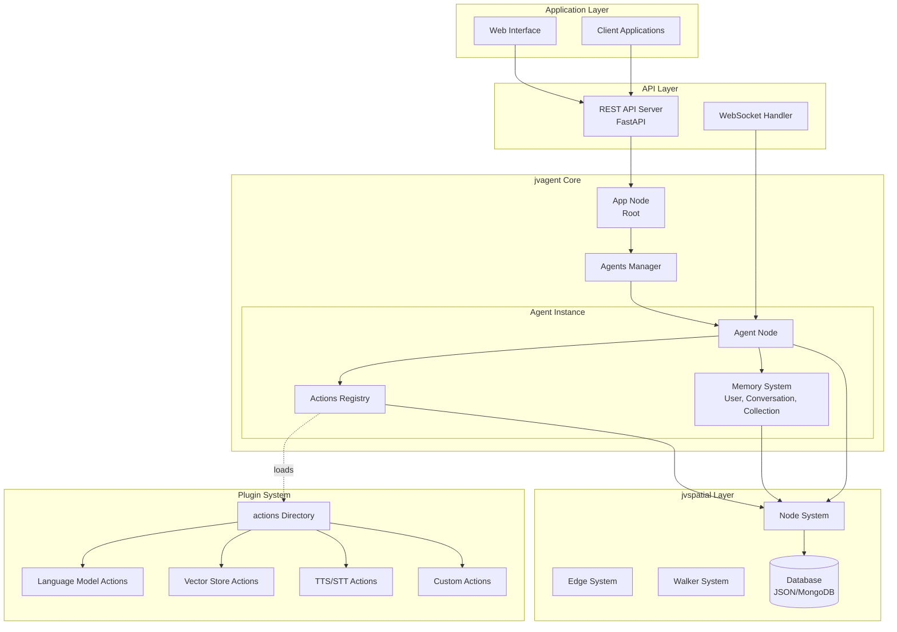
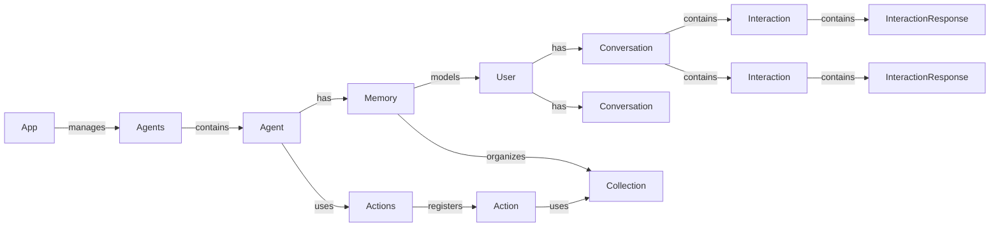

# jvagent Implementation Plan

**Version:** 1.0.0  
**Status:** Planning Document  
**Last Updated:** 2025-01-XX  
**Author:** Implementation Team

---

## Table of Contents

1. [Executive Summary](#executive-summary)
2. [Project Overview](#project-overview)
3. [Architecture Overview](#architecture-overview)
4. [Implementation Phases](#implementation-phases)
5. [Core Components](#core-components)
6. [Dependencies and Prerequisites](#dependencies-and-prerequisites)
7. [Development Guidelines](#development-guidelines)
8. [Testing Strategy](#testing-strategy)
9. [Deployment Strategy](#deployment-strategy)
10. [Risk Assessment](#risk-assessment)
11. [Timeline and Milestones](#timeline-and-milestones)

---

## Executive Summary

jvagent is a modular, pluggable agentive platform built on jvspatial that provides a production-ready framework for AI agent development with enterprise-grade observability and scalability. This document outlines the comprehensive implementation plan for building jvagent from the ground up.

**Key Objectives:**
- Build a production-ready agentive platform leveraging jvspatial's graph-based architecture
- Implement a plugin-based action system for extensibility
- Provide comprehensive observability (logging, metrics, tracing)
- Support multiple communication channels (web, WhatsApp, Slack, etc.)
- Enable YAML-driven agent configuration
- Implement robust memory and conversation management

**Success Criteria:**
- All core entities implemented and tested
- Plugin system functional with at least 5 example actions
- Full REST API with authentication
- Comprehensive observability stack
- Production-ready deployment configuration

---

## Project Overview

### Technology Stack

**Core Framework:**
- Python 3.12+
- jvspatial (graph database & graph primitives)
- Pydantic v2 (validation & serialization)
- FastAPI (HTTP server)

**Observability:**
- structlog (structured logging)
- OpenTelemetry (tracing & metrics)
- Prometheus (metrics collection)

**Storage:**
- jvspatial database (JSON/MongoDB backend)
- Redis (caching & pub/sub, optional)
- S3-compatible storage (files, optional)

**AI/ML:**
- OpenAI SDK
- Anthropic SDK
- Sentence Transformers (embeddings)

### Project Structure

```
jvagent/
├── jvagent/
│   ├── __init__.py
│   ├── core/
│   │   ├── __init__.py
│   │   ├── app.py              # App root node
│   │   ├── agents.py           # Agents manager
│   │   └── agent.py             # Individual agent
│   ├── action/
│   │   ├── __init__.py
│   │   ├── actions.py          # Actions manager
│   │   ├── action.py            # Base action class
│   │   ├── model_action.py     # Base for model actions
│   │   ├── language_model_action.py
│   │   ├── interact_action.py
│   │   ├── state_graph_action.py
│   │   ├── vectorstore_action.py
│   │   ├── retrieval_interact_action.py
│   │   ├── tts_model_action.py
│   │   └── stt_model_action.py
│   ├── memory/
│   │   ├── __init__.py
│   │   ├── memory.py           # Memory manager
│   │   ├── user.py              # User node
│   │   ├── conversation.py      # Conversation node
│   │   ├── interaction.py       # Interaction object
│   │   ├── interaction_response.py  # Response system
│   │   └── collection.py        # Collection node
│   ├── walker/
│   │   ├── __init__.py
│   │   └── interact.py          # Main interaction walker
│   ├── api/
│   │   ├── __init__.py
│   │   └── endpoints.py         # API endpoint definitions
│   ├── observability/
│   │   ├── __init__.py
│   │   ├── logging.py
│   │   ├── metrics.py
│   │   └── tracing.py
│   ├── security/
│   │   ├── __init__.py
│   │   └── encryption.py
│   └── testing/
│       ├── __init__.py
│       └── test_helpers.py
├── actions/                      # Plugin directory
│   ├── example_action/
│   │   ├── example_action.py
│   │   ├── info.yaml
│   │   └── README.md
├── agents/                       # Agent descriptors
│   └── example_agent/
│       └── agent.yaml
├── tests/
│   ├── unit/
│   ├── integration/
│   └── e2e/
├── docs/
├── pyproject.toml
├── requirements.txt
├── requirements-dev.txt
└── README.md
```

---

## Architecture Overview

### System Architecture



### Entity Relationships



---

## Implementation Phases

### Phase 1: Foundation (Weeks 1-2)

**Goal:** Establish core infrastructure and basic entities

**Tasks:**
1. **Project Setup**
   - Initialize project structure
   - Set up pyproject.toml with dependencies
   - Configure development environment
   - Set up testing framework (pytest)
   - Create basic CI/CD pipeline

2. **Core Entities - Base Classes**
   - Implement `App` node (root node)
   - Implement `Agents` node (agent manager)
   - Implement `Agent` node (individual agent)
   - Implement `Actions` node (action manager)
   - Implement `Action` base class
   - Implement `Memory` node
   - Implement `User` node
   - Implement `Conversation` node
   - Implement `Interaction` object
   - Implement `Collection` node

3. **Basic Graph Structure**
   - Establish graph relationships between entities
   - Implement basic CRUD operations
   - Test entity persistence

**Deliverables:**
- All core entity classes implemented
- Basic unit tests for each entity
- Graph relationships established
- Database persistence working

**Success Criteria:**
- Can create App, Agents, Agent, Memory nodes
- Can create and persist User, Conversation, Interaction
- All entities can be retrieved via entity-centric methods

---

### Phase 2: Action System (Weeks 3-4)

**Goal:** Build the plugin-based action system

**Tasks:**
1. **Action Infrastructure**
   - Complete `Actions` manager implementation
   - Implement action discovery mechanism
   - Implement action registration/deregistration
   - Implement action lifecycle hooks
   - Implement dependency resolution

2. **Base Action Classes**
   - Complete `Action` base class
   - Implement `ModelAction` base class
   - Implement `InteractAction` base class
   - Implement `StateGraphAction` base class
   - Implement `VectorstoreAction` base class

3. **Concrete Action Implementations**
   - Implement `LanguageModelAction` (OpenAI, Anthropic)
   - Implement `TTSModelAction` (ElevenLabs)
   - Implement `STTModelAction` (Deepgram)
   - Implement `RetrievalInteractAction`
   - Create at least 2 example custom actions

4. **Plugin System**
   - Implement action discovery from filesystem
   - Implement YAML descriptor parsing
   - Implement runtime action installation
   - Implement action enable/disable

**Deliverables:**
- Complete action system with plugin support
- At least 5 working action implementations
- Action discovery and registration working
- Plugin directory structure established

**Success Criteria:**
- Can discover actions from `/actions` directory
- Can register and enable/disable actions at runtime
- Actions can be executed through the pipeline
- Action dependencies are resolved correctly

---

### Phase 3: Memory and Conversation Management (Weeks 5-6)

**Goal:** Implement comprehensive memory and conversation management

**Tasks:**
1. **Memory System**
   - Complete `Memory` node implementation
   - Implement user management (get/create/update)
   - Implement conversation management
   - Implement collection management
   - Implement memory health checks
   - Implement memory purging/cleanup

2. **Conversation Management**
   - Complete `Conversation` node
   - Implement conversation state management
   - Implement conversation history retrieval
   - Implement conversation context management
   - Implement conversation archiving

3. **Interaction System**
   - Complete `Interaction` object
   - Implement interaction response system
   - Implement `InteractionResponse` with message types
   - Implement `InteractionMessage` hierarchy
   - Implement interaction trail tracking

4. **Collection System**
   - Complete `Collection` node
   - Implement document storage/retrieval
   - Implement collection querying
   - Implement collection export/import

**Deliverables:**
- Complete memory system
- Conversation management working
- Interaction tracking and responses
- Collection system functional

**Success Criteria:**
- Can create and manage users
- Can create and manage conversations
- Can track interactions with full history
- Can store and query collections
- Memory health checks working

---

### Phase 4: Walker and Interaction Pipeline (Weeks 7-8)

**Goal:** Implement the main interaction processing pipeline

**Tasks:**
1. **Interact Walker**
   - Implement `Interact` walker class
   - Implement interaction initialization
   - Implement flood control checking
   - Implement action pipeline execution
   - Implement response generation
   - Implement error handling

2. **Action Pipeline**
   - Implement intent checking
   - Implement authorization
   - Implement action execution
   - Implement stop conditions
   - Implement trail tracking

3. **Flood Control**
   - Implement rate limiting
   - Implement window-based throttling
   - Implement blocking mechanism

4. **Response Generation**
   - Integrate with InteractionResponse system
   - Support multiple message types
   - Generate structured responses

**Deliverables:**
- Complete Interact walker
- Action pipeline functional
- Flood control working
- Response generation complete

**Success Criteria:**
- Can process user interactions through walker
- Actions execute in correct order
- Flood control prevents abuse
- Responses are properly formatted

---

### Phase 5: API Layer (Weeks 9-10)

**Goal:** Build comprehensive REST API

**Tasks:**
1. **Server Setup**
   - Integrate with jvspatial Server
   - Configure authentication
   - Set up CORS
   - Configure middleware

2. **Agent Management Endpoints**
   - POST /api/agents (create)
   - GET /api/agents (list)
   - GET /api/agents/{id} (get)
   - PATCH /api/agents/{id} (update)
   - DELETE /api/agents/{id} (delete)

3. **Interaction Endpoints**
   - POST /api/agents/{id}/interact (process interaction)
   - GET /api/agents/{id}/sessions/{session_id}/frame (get frame)
   - GET /api/agents/{id}/sessions/{session_id}/transcript (get transcript)

4. **Action Management Endpoints**
   - GET /api/agents/{id}/actions (list)
   - GET /api/agents/{id}/actions/{label} (get)
   - POST /api/agents/{id}/actions/install (install)
   - DELETE /api/agents/{id}/actions/{label} (uninstall)
   - POST /api/agents/{id}/actions/{label}/enable (enable)
   - POST /api/agents/{id}/actions/{label}/disable (disable)

5. **Memory Management Endpoints**
   - GET /api/agents/{id}/memory/stats (get stats)
   - DELETE /api/agents/{id}/memory/purge (purge)

6. **Health and Metrics**
   - GET /api/agents/{id}/health (health check)
   - GET /api/metrics (system metrics)

**Deliverables:**
- Complete REST API
- All endpoints documented
- Authentication working
- Response schemas defined

**Success Criteria:**
- All endpoints functional
- Authentication and authorization working
- OpenAPI documentation complete
- Error handling comprehensive

---

### Phase 6: Observability (Weeks 11-12)

**Goal:** Implement comprehensive observability stack

**Tasks:**
1. **Logging**
   - Set up structlog
   - Implement structured logging
   - Add contextual logging
   - Configure log sinks

2. **Metrics**
   - Set up OpenTelemetry metrics
   - Implement performance metrics
   - Implement usage metrics
   - Implement error metrics
   - Set up Prometheus exporter

3. **Tracing**
   - Set up OpenTelemetry tracing
   - Instrument API endpoints
   - Instrument action execution
   - Implement trace correlation

4. **Health Checks**
   - Implement agent health checks
   - Implement system health checks
   - Implement action health checks

5. **Dashboards**
   - Create Grafana dashboards
   - Set up alerting rules
   - Configure visualization

**Deliverables:**
- Complete observability stack
- Logging, metrics, tracing working
- Health checks functional
- Dashboards configured

**Success Criteria:**
- All operations logged
- Metrics collected and exported
- Traces captured end-to-end
- Health checks passing

---

### Phase 7: Security and Production Readiness (Weeks 13-14)

**Goal:** Harden security and prepare for production

**Tasks:**
1. **Security**
   - Implement field encryption
   - Secure API key storage
   - Implement rate limiting
   - Add input validation
   - Implement HTTPS enforcement

2. **Error Handling**
   - Comprehensive error types
   - Error recovery mechanisms
   - Graceful degradation

3. **Performance**
   - Optimize database queries
   - Implement caching
   - Load testing
   - Performance tuning

4. **Documentation**
   - Complete API documentation
   - User guides
   - Developer guides
   - Deployment guides

5. **Deployment**
   - Docker configuration
   - Kubernetes manifests
   - CI/CD pipeline
   - Monitoring setup

**Deliverables:**
- Security hardened
- Production-ready deployment
- Complete documentation
- Performance optimized

**Success Criteria:**
- Security audit passed
- Performance benchmarks met
- Documentation complete
- Deployment automated

---

### Phase 8: Testing and Quality Assurance (Weeks 15-16)

**Goal:** Comprehensive testing and quality assurance

**Tasks:**
1. **Unit Tests**
   - Test all core entities
   - Test action system
   - Test memory system
   - Test walkers

2. **Integration Tests**
   - Test API endpoints
   - Test action pipeline
   - Test memory operations
   - Test plugin system

3. **End-to-End Tests**
   - Test complete interaction flow
   - Test agent lifecycle
   - Test action installation
   - Test error scenarios

4. **Performance Tests**
   - Load testing
   - Stress testing
   - Scalability testing

5. **Security Tests**
   - Penetration testing
   - Vulnerability scanning
   - Security audit

**Deliverables:**
- Comprehensive test suite
- Test coverage > 80%
- Performance benchmarks
- Security audit report

**Success Criteria:**
- All tests passing
- Coverage targets met
- Performance acceptable
- Security issues resolved

---

## Core Components

### 1. Core Entities

#### App Node
- **File:** `jvagent/core/app.py`
- **Dependencies:** jvspatial Node
- **Key Methods:**
  - `get_agents_manager()` - Get agents manager
  - `healthcheck()` - System health
  - `get_metrics()` - System metrics

#### Agents Manager
- **File:** `jvagent/core/agents.py`
- **Dependencies:** jvspatial Node
- **Key Methods:**
  - `register_agent()` - Register agent
  - `get_agent()` - Get agent by ID
  - `list_agents()` - List all agents

#### Agent Node
- **File:** `jvagent/core/agent.py`
- **Dependencies:** jvspatial Node
- **Key Methods:**
  - `get_memory()` - Get memory system
  - `get_actions()` - Get actions manager
  - `healthcheck()` - Agent health

### 2. Action System

#### Actions Manager
- **File:** `jvagent/action/actions.py`
- **Dependencies:** jvspatial Node
- **Key Methods:**
  - `register_action()` - Register action
  - `get_action()` - Get action
  - `discover_action_packages()` - Discover plugins

#### Base Action
- **File:** `jvagent/action/action.py`
- **Dependencies:** jvspatial Node
- **Key Methods:**
  - `on_register()` - Registration hook
  - `on_enable()` - Enable hook
  - `healthcheck()` - Health check

### 3. Memory System

#### Memory Node
- **File:** `jvagent/memory/memory.py`
- **Dependencies:** jvspatial Node
- **Key Methods:**
  - `get_user()` - Get/create user
  - `get_conversation()` - Get conversation
  - `get_collection()` - Get collection

#### User Node
- **File:** `jvagent/memory/user.py`
- **Dependencies:** jvspatial Node
- **Key Methods:**
  - `create_conversation()` - Create conversation
  - `get_conversations()` - Get conversations

#### Conversation Node
- **File:** `jvagent/memory/conversation.py`
- **Dependencies:** jvspatial Node
- **Key Methods:**
  - `add_interaction()` - Add interaction
  - `get_transcript()` - Get transcript

### 4. Walker System

#### Interact Walker
- **File:** `jvagent/walker/interact.py`
- **Dependencies:** jvspatial Walker
- **Key Methods:**
  - `process_interaction()` - Process interaction
  - `finalize_interaction()` - Finalize response

---

## Dependencies and Prerequisites

### Required Dependencies

```toml
[project]
dependencies = [
    "jvspatial>=0.2.0",
    "pydantic>=2.0.0",
    "fastapi>=0.104.0",
    "uvicorn>=0.24.0",
    "structlog>=23.2.0",
    "opentelemetry-api>=1.21.0",
    "opentelemetry-sdk>=1.21.0",
    "prometheus-client>=0.19.0",
    "pyyaml>=6.0.1",
]
```

### Optional Dependencies

```toml
[project.optional-dependencies]
openai = ["openai>=1.0.0"]
anthropic = ["anthropic>=0.7.0"]
vectorstore = ["sentence-transformers>=2.2.0"]
redis = ["redis>=5.0.0"]
```

### Development Dependencies

```toml
[project.optional-dependencies]
dev = [
    "pytest>=7.4.0",
    "pytest-asyncio>=0.21.0",
    "pytest-cov>=4.1.0",
    "black>=23.9.0",
    "ruff>=0.1.0",
    "mypy>=1.6.0",
]
```

---

## Development Guidelines

### Code Style

- Follow PEP 8
- Use type hints throughout
- Use async/await for all I/O operations
- Use Pydantic models for data validation
- Follow jvspatial patterns for entity definitions

### Entity Definition Pattern

```python
from jvspatial.core import Node
from jvspatial.core.annotations import attribute
from pydantic import Field
from typing import Dict, Any

class MyEntity(Node):
    """Entity description."""
    
    # Regular attributes
    name: str = ""
    description: str = ""
    
    # Protected attributes
    id: str = attribute(protected=True, description="Unique identifier")
    
    # Transient attributes
    cache: dict = attribute(transient=True, default_factory=dict)
    
    # Private attributes
    _internal: dict = attribute(private=True, default_factory=dict)
    
    # Entity-centric methods
    @classmethod
    async def create(cls, **kwargs) -> "MyEntity":
        """Create entity."""
        entity = cls(**kwargs)
        await entity.save()
        return entity
    
    async def save(self) -> "MyEntity":
        """Save entity."""
        # Implementation
        return self
```

### Endpoint Definition Pattern

```python
from jvspatial.api import endpoint
from jvspatial.api.decorators import EndpointField
from jvspatial.api.endpoints.response import ResponseField, success_response

@endpoint(
    "/api/endpoint",
    methods=["POST"],
    auth=True,
    response=success_response(
        data={
            "result": ResponseField(str, "Result description")
        }
    )
)
async def my_endpoint(
    param: str = EndpointField(description="Parameter description")
) -> Dict[str, Any]:
    """Endpoint description."""
    # Implementation
    return {"result": "value"}
```

### Testing Pattern

```python
import pytest
from jvagent.testing import AgentTestCase

class TestMyEntity(AgentTestCase):
    """Test my entity."""
    
    async def test_create(self):
        """Test entity creation."""
        entity = await MyEntity.create(name="test")
        assert entity.name == "test"
        assert entity.id != ""
```

---

## Testing Strategy

### Unit Tests
- Test individual entity methods
- Test action lifecycle
- Test memory operations
- Target: 80%+ coverage

### Integration Tests
- Test API endpoints
- Test action pipeline
- Test memory system
- Test plugin system

### End-to-End Tests
- Test complete interaction flow
- Test agent lifecycle
- Test error scenarios

### Performance Tests
- Load testing (1000 req/min)
- Stress testing
- Scalability testing

---

## Deployment Strategy

### Development
- Local JSON database
- No authentication
- Debug logging

### Staging
- MongoDB database
- JWT authentication
- Structured logging
- Metrics collection

### Production
- MongoDB with replication
- Full authentication/authorization
- Comprehensive observability
- Auto-scaling
- Monitoring and alerting

### Docker Configuration

```dockerfile
FROM python:3.12-slim

WORKDIR /app

COPY requirements.txt .
RUN pip install --no-cache-dir -r requirements.txt

COPY . .

CMD ["uvicorn", "jvagent.api:app", "--host", "0.0.0.0", "--port", "8000"]
```

---

## Risk Assessment

### Technical Risks

1. **jvspatial API Changes**
   - **Risk:** Medium
   - **Mitigation:** Pin jvspatial version, monitor for updates

2. **Performance at Scale**
   - **Risk:** Medium
   - **Mitigation:** Load testing, optimization, caching

3. **Plugin System Complexity**
   - **Risk:** Low
   - **Mitigation:** Clear plugin interface, comprehensive examples

### Project Risks

1. **Scope Creep**
   - **Risk:** Medium
   - **Mitigation:** Strict phase boundaries, change control

2. **Resource Availability**
   - **Risk:** Low
   - **Mitigation:** Clear task assignments, regular check-ins

---

## Timeline and Milestones

### Milestone 1: Foundation Complete (Week 2)
- All core entities implemented
- Basic graph structure working
- Database persistence functional

### Milestone 2: Action System Complete (Week 4)
- Plugin system functional
- At least 5 actions implemented
- Action discovery working

### Milestone 3: Memory System Complete (Week 6)
- Memory management working
- Conversation management functional
- Interaction tracking complete

### Milestone 4: Pipeline Complete (Week 8)
- Interact walker functional
- Action pipeline working
- Response generation complete

### Milestone 5: API Complete (Week 10)
- All endpoints implemented
- Authentication working
- Documentation complete

### Milestone 6: Observability Complete (Week 12)
- Logging, metrics, tracing working
- Health checks functional
- Dashboards configured

### Milestone 7: Production Ready (Week 14)
- Security hardened
- Performance optimized
- Deployment configured

### Milestone 8: Release Ready (Week 16)
- All tests passing
- Documentation complete
- Production deployment ready

---

## Next Steps

1. **Immediate Actions:**
   - Set up project structure
   - Initialize git repository
   - Create initial pyproject.toml
   - Set up development environment

2. **Week 1 Tasks:**
   - Implement App node
   - Implement Agents node
   - Implement Agent node
   - Set up testing framework

3. **Ongoing:**
   - Daily standups
   - Weekly progress reviews
   - Continuous integration
   - Documentation updates

---

## Appendix

### A. Entity Reference

See README.md for complete entity specifications.

### B. API Reference

See README.md for complete API documentation.

### C. Plugin Development Guide

See `docs/plugin_development.md` (to be created).

### D. Deployment Guide

See `docs/deployment.md` (to be created).

---

**Document Status:** Draft - Ready for Review

