# jvagent Architecture Specification

> **⚠️ Note:** This is an architecture specification document. It may contain planned features, design proposals, or outdated information. For current implementation details and usage, refer to the main [README.md](../README.md) and [examples](../examples/jvagent_app/README.md).

**Version:** 1.0.0  
**Status:** Specification Document  
**Last Updated:** 2025-10-05  
**Author:** Eldon Marks

---

## Table of Contents

1. [System Overview](#system-overview)
2. [Entity Specifications](#entity-specifications)
3. [Data Flow Diagrams](#data-flow-diagrams)
4. [Action Lifecycle](#action-lifecycle)
5. [YAML Descriptor Schema](#yaml-descriptor-schema)
6. [Plugin Architecture](#plugin-architecture)
7. [API Endpoints](#api-endpoints)
8. [InteractionResponse (Message Response System)](#75-interactionresponse-message-response-system)
    8.1. [InteractionMessage (Base Message Class)](#751-interactionmessage-base-message-class)
    8.2. [TextInteractionMessage (Text Messages)](#752-textinteractionmessage-text-messages)
    8.3. [MediaInteractionMessage (Media Content)](#753-mediainteractionmessage-media-content)
    8.4. [MultiInteractionMessage (Composite Messages)](#754-multiinteractionmessage-composite-messages)
    8.5. [SilentInteractionMessage (No Response)](#755-silentinteractionmessage-no-response)
    8.6. [Integration with Interaction Entity](#756-integration-with-interaction-entity)
9. [Observability Design](#observability-design)
10. [Database Schema](#database-schema)
11. [Security Considerations](#security-considerations)

---

## System Overview

### High-Level Architecture

jvagent is a modular, pluggable agentive platform built on jvspatial that provides a production-ready framework for AI agent development with enterprise-grade observability and scalability.

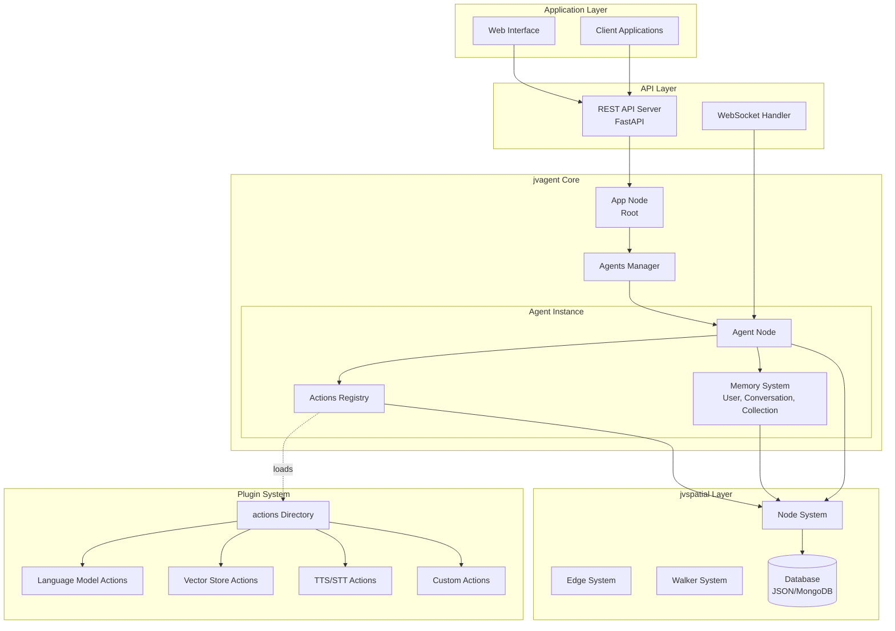

### Core Design Principles

1. **Server-Based Architecture** - All operations expose through REST API
2. **Entity-Centric Design** - Leverages jvspatial's Node/Object/Edge primitives
3. **Plugin-First** - Actions are self-contained, dynamically loadable modules
4. **Async-First** - All operations are async by default for scalability
5. **Type Safety** - Pydantic models throughout with comprehensive type hints
6. **Observability Built-In** - Structured logging, metrics, and tracing from day one
7. **YAML-Driven** - Agents configured via declarative YAML descriptors
8. **Graph-Native** - Full utilization of jvspatial's graph traversal capabilities

### Component Relationships

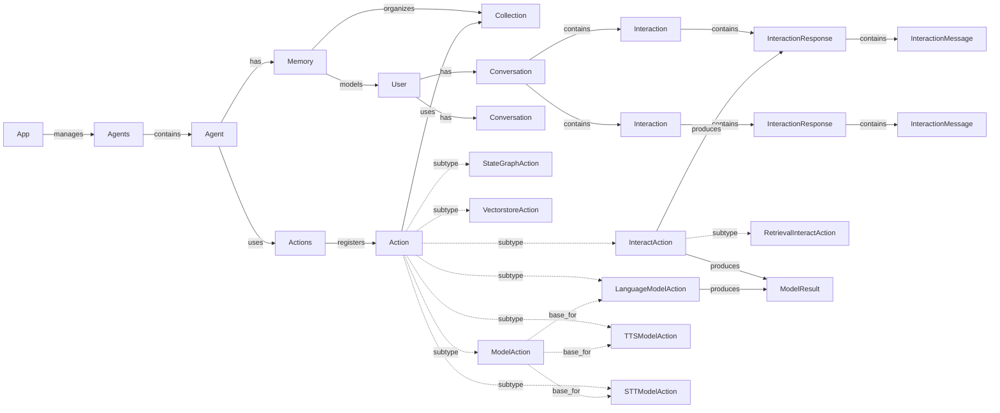

### Technology Stack

**Core Framework:**
- Python 3.12+
- jvspatial (spatial database & graph primitives)
- Pydantic v2 (validation & serialization)
- FastAPI (HTTP server)

**Observability:**
- structlog (structured logging)
- OpenTelemetry (tracing & metrics)
- Prometheus (metrics collection)

**Storage:**
- jvspatial database (JSON/MongoDB backend)
- Redis (caching & pub/sub, optional)
- S3-compatible storage (files, optional)

**AI/ML:**
- OpenAI SDK
- Anthropic SDK
- Sentence Transformers (embeddings)

---

## Entity Specifications

### 1. App (Root Node)

The **App** entity represents the root node of the jvagent application, managing the overall system state and serving as the entry point for the agent graph.

**Type:** [`Node`](jvspatial/jvspatial/core/entities/node.py) (jvspatial Graph Node)  
**Location:** `jvagent/core/app.py` (to be created)

**Attributes:**
```python
from jvspatial.core import Node
from jvspatial.core.annotations import attribute
from pydantic import Field
from datetime import datetime
from typing import Dict, Any

class App(Node):
    """Root node representing the agentive application."""
    name: str = "jvAgent"
    version: str = "1.0.0"
    description: str = ""
    status: str = "active"  # active, inactive, maintenance
    created_at: datetime = Field(default_factory=datetime.now)
    metadata: Dict[str, Any] = Field(default_factory=dict)
```

**Responsibilities:**
- Serves as the root node for graph traversal
- Manages global application configuration
- Provides system-wide health check aggregation
- Controls system-wide maintenance mode
- Tracks application lifecycle events
- Aggregates metrics across all agents

**Graph Relationships:**
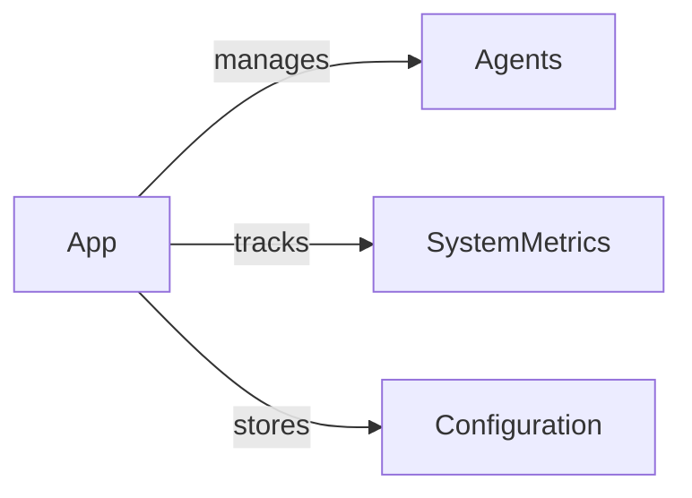

**Key Methods:**
```python
async def get_agents_manager() -> Agents
async def get_configuration() -> Dict[str, Any]
async def set_maintenance_mode(enabled: bool) -> bool
async def healthcheck() -> Dict[str, Any]  # System-wide health aggregation
async def get_metrics() -> Dict[str, Any]  # System-wide metrics aggregation
async def get_agent_health_summary() -> Dict[str, Any]  # Per-agent health status
```

**Example Usage:**
```python
# Initialize application
app = await App.create(
    name="Production Agent System",
    version="1.0.0",
    description="Multi-tenant agent platform"
)

# Get agents manager
agents_manager = await app.get_agents_manager()

# System health check
health = await app.healthcheck()
```

---

### 2. Agents (Agent Manager)

The **Agents** entity manages the registration, discovery, and lifecycle of all agents in the system.

**Type:** [`Node`](jvspatial/jvspatial/core/entities/node.py) (jvspatial Graph Node)  
**Location:** `jvagent/core/agents.py` (to be created)

**Attributes:**
```python
from jvspatial.core import Node
from pydantic import Field
from typing import Dict, Any

class Agents(Node):
    """Manager for all agents in the system."""
    total_agents: int = 0
    active_agents: int = 0
    registry: Dict[str, str] = Field(default_factory=dict)  # agent_name -> agent_id
    metadata: Dict[str, Any] = Field(default_factory=dict)
```

**Responsibilities:**
- Register and deregister agents
- Discover agents by name or ID
- Track agent health status
- Manage agent lifecycle
- Enforce naming uniqueness

**Graph Relationships:**
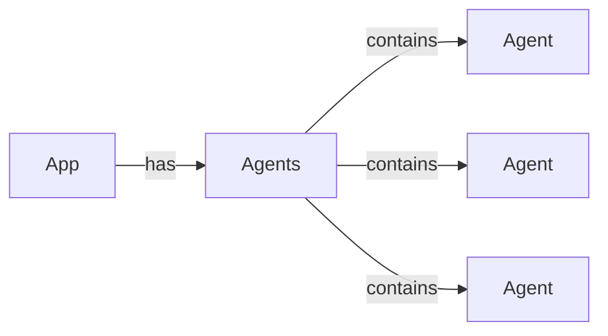

**Key Methods:**
```python
async def register_agent(agent: Agent) -> bool
async def deregister_agent(agent_id: str) -> bool
async def get_agent(agent_id: str) -> Optional[Agent]
async def get_agent_by_name(name: str) -> Optional[Agent]
async def list_agents(filters: Dict[str, Any] = None) -> List[Agent]
async def count_agents(active_only: bool = False) -> int
async def healthcheck_all() -> Dict[str, Any]
```

**Example Usage:**
```python
# Get agents manager
agents = await app.get_agents_manager()

# Register a new agent
agent = await Agent.create(name="CustomerSupport")
await agents.register_agent(agent)

# Find agent by name
support_agent = await agents.get_agent_by_name("CustomerSupport")

# List all active agents
active = await agents.list_agents({"context.published": True})  # Use context. prefix for field queries
```

---

### 3. Agent (Individual Agent Entity)

The **Agent** entity represents a single AI agent with its configuration, memory, and action system.

**Type:** [`Node`](jvspatial/jvspatial/core/entities/node.py) (extends Node)  
**Location:** `jvagent/core/agent.py` (to be created)

**Attributes:**
```python
from jvspatial.core import Node
from jvspatial.core.annotations import attribute
from pydantic import Field
from typing import Dict, Any, List

class Agent(Node):
    """AI Agent node in the jvspatial graph."""
    
    # Core Configuration
    published: bool = True
    name: str = ""
    description: str = ""
    logging: bool = True
    
    # Message Handling
    message_limit: int = 1024
    flood_control: bool = True
    flood_block_time: int = 300  # seconds
    window_time: int = 20  # seconds
    flood_threshold: int = 4  # messages per window
    
    # Memory Configuration (deprecated - will move to Conversation)
    interaction_buffer: int = 10  # formerly frame_size: interactions per conversation
    
    keys: Dict[str, str] = {}  # API keys for services
    
    # Communication
    _channels: List[str] = attribute(private=True, default_factory=lambda: [
        'default', 'whatsapp', 'facebook', 'slack', 'sms', 'email'
    ])
    
    # Health & Metadata
    _healthcheck_status: int = attribute(private=True, default=501)
    metadata: Dict[str, Any] = Field(default_factory=dict)
```

**Responsibilities:**
- Manage agent configuration and state
- Coordinate memory and action systems
- Handle flood control and rate limiting
- Provide health monitoring
- Manage communication channels
- Store agent-specific files

**Graph Relationships:**
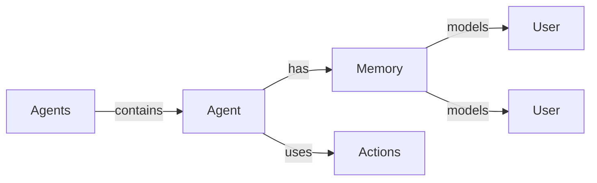

**Key Methods:**
```python
# Memory Management
async def get_memory() -> Optional[Memory]

# Action Management
async def get_actions() -> Optional[List[Action]]
async def get_action(filter: Union[str, Dict], only_enabled: bool = True) -> Optional[Action]
async def get_action_by_type(action_type: type, only_enabled: bool = True) -> Optional[Action]
# Examples:
# await agent.get_action_by_type(STTModelAction)  # Get STT action
# await agent.get_action_by_type(TTSModelAction)  # Get TTS action
# await agent.get_action_by_type(VectorstoreAction)  # Get vectorstore action

# Channel Management
def add_channel(channel: str) -> bool
def remove_channel(channel: str) -> bool
def has_channel(channel: str) -> bool
def validate_channels() -> List[str]

# Configuration
async def update_agent(data: Dict[str, Any], with_actions: bool = False) -> Agent
async def get_descriptor(as_yaml: bool = False, clean: bool = False) -> Union[str, Dict]

# Health & Analytics
async def healthcheck() -> Dict[str, Any]  # Core agent configuration check
async def get_healthcheck_report() -> Dict[str, Any]  # Full health including actions and memory
async def get_metrics() -> Dict[str, Any]  # Agent-specific metrics
async def get_performance_stats() -> Dict[str, Any]  # Performance statistics

# File Management
async def get_file(path: str) -> Optional[bytes]
async def save_file(path: str, content: bytes) -> bool
async def delete_file(path: str) -> bool
async def get_file_url(path: str) -> Optional[str]
```

**Example Usage:**
```python
# Create agent from YAML descriptor
agent = await Agent.create(
    name="CustomerSupport",
    description="24/7 customer support agent",
    published=True,
    flood_threshold=5
)

# Get memory system
memory = await agent.get_memory()

# Get specific action by label
llm_action = await agent.get_action("OpenAIAction")

# Get action by type (replaces get_tts_action, get_stt_action, etc.)
stt_action = await agent.get_action_by_type(STTModelAction)
tts_action = await agent.get_action_by_type(TTSModelAction)

# Agent-level health check and metrics
health = await agent.get_healthcheck_report()
metrics = await agent.get_metrics()
perf_stats = await agent.get_performance_stats()
```

---

### 4. Actions (Action Manager)

The **Actions** entity manages the registration, discovery, and lifecycle of all actions for an agent.

**Type:** [`Node`](jvspatial/jvspatial/core/entities/node.py) (extends Node)  
**Location:** `jvagent/action/actions.py` (to be created)

**Attributes:**
```python
from jvspatial.core import Node
from jvspatial.core.annotations import attribute
from pydantic import Field
from typing import Dict, Any, Set, List, Callable
import asyncio

class Actions(Node):
    """Central node for managing agent actions."""
    
    # Internal registries (transient)
    _action_classes: Dict[str, type] = attribute(transient=True, default_factory=dict)
    _action_modules: Dict[str, Any] = attribute(transient=True, default_factory=dict)
    _action_dependencies: Dict[str, Set[str]] = attribute(transient=True, default_factory=dict)
    _action_hooks: Dict[str, List[Callable]] = attribute(transient=True, default_factory=dict)
    _lock: asyncio.Lock = attribute(transient=True, default_factory=asyncio.Lock)
```

**Responsibilities:**
- Register and deregister actions
- Discover action classes from filesystem
- Manage action dependencies
- Control action lifecycle (enable/disable)
- Provide action search and filtering
- Handle bulk operations
- Trigger lifecycle hooks
- Export/import action configurations

**Graph Relationships:**
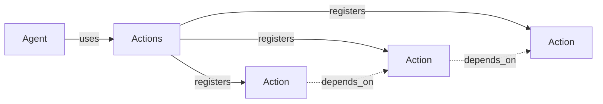

**Key Methods:**
```python
# Action Retrieval
async def get_action(filter: Union[str, Dict], only_enabled: bool = True) -> Optional[Action]
async def get_actions(only_enabled: bool = False) -> List[Action]
async def get_interact_actions(only_enabled: bool = True) -> List[InteractAction]

# Registration
async def register_action(action: Action) -> bool
async def deregister_action(action_label: str = "", action_type: str = "") -> List[Action]
async def deregister_actions() -> List[Action]

# State Management
async def enable_action(action_label: str) -> bool
async def disable_action(action_label: str) -> bool

# Discovery
async def discover_action_packages(search_paths: List[str] = None, pattern: str = "*_action.py") -> Dict[str, type]
async def import_action_class(module_path: str, class_name: str = None) -> Optional[type]
async def create_action_from_class(class_name: str, **kwargs) -> Optional[Action]

# Bulk Operations
async def register_actions_bulk(actions: List[Action]) -> Dict[str, Any]
async def enable_actions_bulk(action_labels: List[str]) -> Dict[str, Any]
async def disable_actions_bulk(action_labels: List[str]) -> Dict[str, Any]

# Dependencies
async def add_dependency(action_label: str, dependency_label: str) -> bool
async def remove_dependency(action_label: str, dependency_label: str) -> bool
async def get_dependencies(action_label: str) -> Set[str]
async def get_dependents(action_label: str) -> Set[str]
async def resolve_start_order() -> List[str]

# Lifecycle
async def post_register_all() -> None
async def trigger_hooks(event: str, *args, **kwargs) -> None

# Analytics
async def get_all_analytics() -> Dict[str, Dict[str, Any]]
async def get_system_metrics() -> Dict[str, Any]
async def healthcheck() -> Dict[str, Any]

# Maintenance
async def cleanup() -> Dict[str, Any]
async def validate_system() -> Dict[str, Any]
async def initialize(auto_discover: bool = True, search_paths: List[str] = None) -> Dict[str, Any]
async def bootstrap(action_configs: List[Dict] = None, auto_enable: bool = True) -> Dict[str, Any]
async def reset(confirm: bool = False) -> Dict[str, Any]
```

**Example Usage:**
```python
# Get actions manager
actions = await agent.get_actions()

# Discover and register actions
discovered = await actions.discover_action_packages(["/actions"])

# Register specific action
action = await MyAction.create(label="custom_action", enabled=True)
await actions.register_action(action)

# Get dependency order
start_order = await actions.resolve_start_order()

# Get action by type
stt_actions = await actions.get_actions_by_type(STTModelAction)
llm_actions = await actions.get_actions_by_type(LanguageModelAction)

# System validation
validation = await actions.validate_system()
```

**New Method for Type-Based Retrieval:**
```python
async def get_actions_by_type(
    action_type: type,
    only_enabled: bool = True
) -> List[Action]:
    """Get all actions of a specific type.
    
    Args:
        action_type: The action class type (e.g., STTModelAction)
        only_enabled: Whether to only return enabled actions
        
    Returns:
        List of actions matching the type
        
    Example:
        # Get all language model actions
        llm_actions = await actions.get_actions_by_type(LanguageModelAction)
        
        # Get enabled TTS actions only
        tts_actions = await actions.get_actions_by_type(TTSModelAction, only_enabled=True)
    """
```

---

### 5. Action (Base Action Type)

The **Action** entity represents the base type for all actions in the system.

**Type:** [`Node`](jvspatial/jvspatial/core/entities/node.py) (extends Node)  
**Location:** `jvagent/action/action.py` (to be created)

**Attributes:**
```python
from jvspatial.core import Node
from jvspatial.core.annotations import attribute
from pydantic import Field
from typing import Dict, Any, Set

class Action(Node):
    """Base action class for all action types."""
    
    # Core Attributes
    agent_id: str = ""
    version: str = ""
    label: str = ""
    description: str = "basic agent action"
    enabled: bool = True
    
    # Package Information
    _package: Dict[str, Any] = attribute(private=True, default_factory=dict)
    
    # Note: protected_attrs and transient_attrs are handled via @attribute decorator
```

**Responsibilities:**
- Define action interface and contracts
- Manage action lifecycle hooks
- Handle enable/disable state
- Provide file storage capabilities
- Integrate with collection system
- Support analytics and health checks

**Lifecycle Hooks:**
```python
async def on_register() -> None
async def on_reload() -> None
async def post_register() -> None
async def on_enable() -> None
async def on_disable() -> None
async def on_deregister() -> None
async def pulse() -> None
async def analytics() -> Dict[str, Any]
async def healthcheck() -> Union[bool, Dict[str, Any]]
```

**Key Methods:**
```python
# Lifecycle
async def update(data: Dict[str, Any] = None) -> Action
async def post_update() -> None

# Graph Navigation
async def get_agent() -> Optional[GraphNode]
async def get_collection() -> Optional[Collection]
async def remove_collection() -> List[Collection]

# Package Information
async def get_namespace() -> Optional[str]
async def get_module() -> Optional[str]
async def get_module_root() -> Optional[str]
async def get_package_path() -> Optional[str]
async def get_version() -> str
async def get_package_name() -> Optional[str]
async def get_type() -> str

# File Management
async def get_file(path: str) -> Optional[bytes]
async def save_file(path: str, content: bytes) -> bool
async def delete_file(path: str) -> bool
async def get_file_url(path: str) -> Optional[str]
async def get_short_file_url(path: str, with_filename: bool = False) -> Optional[str]

# Data Management
async def export_collection() -> Dict[str, Any]
async def import_collection(data: Dict[str, Any], purge: bool = True) -> bool
async def to_dict() -> Dict[str, Any]
```

**Subtype Hierarchy:**
```
Action (base)
├── ModelAction (base for model APIs)
│   ├── LanguageModelAction (LLM integrations)
│   ├── TTSModelAction (text-to-speech)
│   └── STTModelAction (speech-to-text)
├── InteractAction (pipeline subscribers)
├── StateGraphAction (tool-type with state flow)
├── VectorstoreAction (vector databases)
└── RetrievalInteractAction (paired with VectorstoreAction)
```

---

### 6. Action Subtypes

#### 6.1 LanguageModelAction

**Purpose:** Integration with Large Language Model APIs (OpenAI, Anthropic, etc.)

**Type:** Extends [`ModelAction`](jv/jvagent/action/action.py:17)  
**Location:** `jv/jvagent/action/language_model_action.py`

**Additional Attributes:**
```python
class LanguageModelAction(ModelAction):
    """Language model API integration action."""
    
    # Model Configuration
    model_name: str = "gpt-4"
    api_key: str = ""
    api_base: str = ""
    temperature: float = 0.7
    max_tokens: int = 2048
    
    # Usage Tracking (via ModelAction)
    total_calls: int = 0
    total_tokens: int = 0
    total_cost: float = 0.0
    
    # Rate Limiting
    rate_limit_rpm: int = 60  # requests per minute
    rate_limit_tpm: int = 90000  # tokens per minute
```

**Key Methods:**
```python
async def generate(prompt: str, **kwargs) -> ModelResult
async def generate_streaming(prompt: str, **kwargs) -> AsyncIterator[str]
async def count_tokens(text: str) -> int
async def check_rate_limits() -> bool
```

**Example:**
```python
llm = await LanguageModelAction.create(
    label="OpenAI_GPT4",
    model_name="gpt-4-turbo",
    api_key=os.getenv("OPENAI_API_KEY"),
    temperature=0.8
)

result = await llm.generate("Explain quantum computing")
print(result.content)
print(f"Tokens used: {result.usage.total_tokens}")
```

#### 6.2 InteractAction

**Purpose:** Subscribe to the main execution pipeline for conversational interactions

**Type:** Extends [`Action`](jv/jvagent/action/action.py:17)  
**Location:** `jv/jvagent/action/interact_action.py`

**Additional Attributes:**
```python
class InteractAction(Action):
    """Conversational action in the interaction pipeline."""
    
    # Intent Matching
    anchors: List[str] = []  # Intent classification keywords
    functions: List[Dict] = []  # Tool/function definitions
    weight: int = 0  # Execution priority (lower = earlier)
    
    # Execution Control
    stop_on_match: bool = True
    fallback: bool = False
```

**Abstract Methods:**
```python
async def touch(visitor: Walker) -> bool
    """Check if action should execute for this interaction."""

async def execute(visitor: Walker) -> None
    """Main action execution logic."""

async def deny(visitor: Walker) -> None
    """Handle authorization denial."""
```

**Key Methods:**
```python
async def check_intent(interaction: Interaction, context: Dict) -> bool
async def authorize(interaction: Interaction, context: Dict) -> bool
```

**Example:**
```python
class GreetingAction(InteractAction):
    """Greet users warmly."""
    
    def __init__(self):
        super().__init__(
            label="greeting",
            anchors=["hello", "hi", "hey"],
            weight=10
        )
    
    async def touch(self, visitor) -> bool:
        utterance = visitor.interaction.utterance.lower()
        return any(anchor in utterance for anchor in self.anchors)
    
    async def execute(self, visitor) -> None:
        visitor.interaction.set_response("Hello! How can I help you?")
```

#### 6.3 StateGraphAction

**Purpose:** Tool-type action with state-driven flow (e.g., multi-step workflows)

**Type:** Extends [`Action`](jv/jvagent/action/action.py:17)  
**Location:** `jv/jvagent/action/state_graph_action.py` (to be created)

**Additional Attributes:**
```python
class StateGraphAction(Action):
    """Action with state machine workflow."""
    
    # State Configuration
    states: Dict[str, Dict[str, Any]] = {}
    transitions: Dict[str, List[str]] = {}
    initial_state: str = "start"
    final_states: List[str] = ["complete", "error"]
    
    # Execution State (per interaction)
    current_state: str = "start"
    state_data: Dict[str, Any] = Field(default_factory=dict)
```

**Key Methods:**
```python
async def transition_to(state: str) -> bool
async def execute_state(state: str, context: Dict) -> Any
async def can_transition(from_state: str, to_state: str) -> bool
async def get_available_transitions() -> List[str]
async def reset_state() -> None
```

**Example:**
```python
checkout = await StateGraphAction.create(
    label="checkout_flow",
    states={
        "start": {"handler": "init_checkout"},
        "collect_info": {"handler": "get_user_info"},
        "process_payment": {"handler": "charge_card"},
        "complete": {"handler": "send_confirmation"}
    },
    transitions={
        "start": ["collect_info"],
        "collect_info": ["process_payment", "start"],
        "process_payment": ["complete", "collect_info"]
    }
)
```

#### 6.4 VectorstoreAction

**Purpose:** Integration with vector database systems

**Type:** Extends [`Action`](jv/jvagent/action/action.py:17)  
**Location:** `jv/jvagent/action/vectorstore_action.py` (to be created)

**Additional Attributes:**
```python
class VectorstoreAction(Action):
    """Vector database integration action."""
    
    # Connection Configuration
    host: str = "localhost"
    port: int = 8108
    api_key: str = ""
    collection_name: str = ""
    
    # Vector Configuration
    embedding_model: str = "sentence-transformers/all-MiniLM-L6-v2"
    dimension: int = 384
    distance_metric: str = "cosine"  # cosine, euclidean, dotproduct
    
    # Client (transient)
    _client: Any = None
```

**Key Methods:**
```python
async def connect() -> bool
async def disconnect() -> None
async def add_documents(documents: List[Dict], embeddings: List[List[float]] = None) -> bool
async def search(query: str, limit: int = 10, filters: Dict = None) -> List[Dict]
async def search_by_vector(vector: List[float], limit: int = 10) -> List[Dict]
async def delete_document(doc_id: str) -> bool
async def update_document(doc_id: str, data: Dict) -> bool
async def get_collection_stats() -> Dict[str, Any]
```

**Example:**
```python
vectorstore = await VectorstoreAction.create(
    label="TypesenseVectorStore",
    host="localhost",
    port=8108,
    api_key=os.getenv("TYPESENSE_API_KEY"),
    collection_name="agent_knowledge"
)

# Add documents
await vectorstore.add_documents([
    {"id": "1", "content": "How to reset password", "category": "support"},
    {"id": "2", "content": "Billing information", "category": "finance"}
])

# Search
results = await vectorstore.search("password reset", limit=5)
```

#### 6.5 RetrievalInteractAction

**Purpose:** Interface action paired with VectorstoreAction for RAG

**Type:** Extends [`InteractAction`](jv/jvagent/action/interact_action.py)  
**Location:** `jv/jvagent/action/retrieval_interact_action.py` (to be created)

**Additional Attributes:**
```python
class RetrievalInteractAction(InteractAction):
    """RAG-enabled interact action."""
    
    # Retrieval Configuration
    vectorstore_action_label: str = ""
    retrieval_limit: int = 5
    similarity_threshold: float = 0.7
    
    # Context Management
    include_context: bool = True
    context_template: str = "Context:\n{context}\n\nUser: {query}"
```

**Key Methods:**
```python
async def retrieve_context(query: str) -> List[Dict]
async def format_context(results: List[Dict]) -> str
async def augment_prompt(query: str, context: str) -> str
```

**Example:**
```python
rag_action = await RetrievalInteractAction.create(
    label="rag_support",
    vectorstore_action_label="TypesenseVectorStore",
    retrieval_limit=3,
    anchors=["help", "how", "what"]
)

async def execute(self, visitor):
    query = visitor.interaction.utterance
    
    # Retrieve relevant context
    context_docs = await self.retrieve_context(query)
    context_text = await self.format_context(context_docs)
    
    # Augment with retrieved context
    augmented_prompt = await self.augment_prompt(query, context_text)
    
    # Generate response (delegate to LLM action)
    llm = await self.get_agent().get_action("OpenAI_GPT4")
    result = await llm.generate(augmented_prompt)
    
    visitor.interaction.set_response(result.content)
```

#### 6.6 TTSModelAction

**Purpose:** Text-to-speech model integrations

**Type:** Extends [`ModelAction`](jv/jvagent/action/model_action.py)  
**Location:** `jv/jvagent/action/tts_model_action.py` (to be created)

**Additional Attributes:**
```python
class TTSModelAction(ModelAction):
    """Text-to-speech model action."""
    
    # Voice Configuration
    voice_id: str = ""
    voice_name: str = "default"
    language: str = "en-US"
    
    # Audio Configuration
    sample_rate: int = 24000
    audio_format: str = "mp3"  # mp3, wav, ogg
    
    # Quality Settings
    stability: float = 0.5
    similarity_boost: float = 0.75
```

**Key Methods:**
```python
async def synthesize(text: str, **kwargs) -> ModelResult
async def get_available_voices() -> List[Dict]
async def get_voice_settings(voice_id: str) -> Dict[str, Any]
async def stream_audio(text: str) -> AsyncIterator[bytes]
```

**Example:**
```python
tts = await TTSModelAction.create(
    label="ElevenLabsTTS",
    api_key=os.getenv("ELEVENLABS_API_KEY"),
    voice_id="21m00Tcm4TlvDq8ikWAM",
    audio_format="mp3"
)

result = await tts.synthesize("Hello, how can I help you today?")
audio_data = result.content  # MP3 bytes
```

#### 6.7 STTModelAction

**Purpose:** Speech-to-text model integrations

**Type:** Extends [`ModelAction`](jv/jvagent/action/model_action.py)  
**Location:** `jv/jvagent/action/stt_model_action.py` (to be created)

**Additional Attributes:**
```python
class STTModelAction(ModelAction):
    """Speech-to-text model action."""
    
    # Audio Configuration
    language: str = "en-US"
    model_type: str = "general"  # general, phone_call, meeting
    
    # Processing Options
    punctuate: bool = True
    diarize: bool = False
    redact_pii: bool = False
    
    # Advanced Features
    detect_language: bool = False
    translate_to: str = ""  # Optional translation target
```

**Key Methods:**
```python
async def transcribe(audio: bytes, **kwargs) -> ModelResult
async def transcribe_file(file_path: str) -> ModelResult
async def transcribe_streaming(audio_stream: AsyncIterator[bytes]) -> AsyncIterator[str]
```

**Example:**
```python
stt = await STTModelAction.create(
    label="DeepgramSTT",
    api_key=os.getenv("DEEPGRAM_API_KEY"),
    model_type="general",
    punctuate=True
)

# From audio file
result = await stt.transcribe_file("audio.mp3")
transcript = result.content
```

#### 6.8 ModelAction (Base for Model Types)

**Purpose:** Base class for model-based actions with usage tracking

**Type:** Extends [`Action`](jv/jvagent/action/action.py:17)  
**Location:** `jv/jvagent/action/model_action.py`

**Additional Attributes:**
```python
class ModelAction(Action):
    """Base class for AI model actions with usage tracking."""
    
    # API Configuration
    api_key: str = ""
    api_base: str = ""
    timeout: int = 30
    
    # Usage Tracking
    total_calls: int = 0
    total_tokens: int = 0
    total_cost: float = 0.0
    last_call_at: Optional[datetime] = None
    
    # Rate Limiting
    rate_limit_enabled: bool = True
    requests_per_minute: int = 60
    
    # Caching
    cache_enabled: bool = False
    cache_ttl: int = 3600
```

**Key Methods:**
```python
async def call_model(**kwargs) -> ModelResult
async def track_usage(result: ModelResult) -> None
async def get_usage_stats() -> Dict[str, Any]
async def reset_usage_stats() -> None
async def check_rate_limit() -> bool
```

**Example:**
```python
class CustomLLM(ModelAction):
    async def call_model(self, prompt: str) -> ModelResult:
        # Make API call
        response = await self._api_call(prompt)
        
        # Track usage
        result = ModelResult(
            content=response.text,
            usage=UsageInfo(
                total_tokens=response.tokens,
                cost=response.cost
            )
        )
        await self.track_usage(result)
        
        return result
```

---

### 7. ModelResult (Standard Result Entity)

The **ModelResult** entity provides a standard structure for model action call results.

**Type:** Pydantic Model (not a Node)  
**Location:** [`jv/jvagent/action/language_model_result.py`](jv/jvagent/action/language_model_result.py)

**Attributes:**
```python
class UsageInfo(BaseModel):
    """Usage information for model calls."""
    prompt_tokens: int = 0
    completion_tokens: int = 0
    total_tokens: int = 0
    cost: float = 0.0

class ModelResult(BaseModel):
    """Standard result structure for model actions."""
    
    # Response Content
    content: str = ""
    raw_response: Dict[str, Any] = Field(default_factory=dict)
    
    # Metadata
    model_name: str = ""
    action_label: str = ""
    
    # Usage Information
    usage: UsageInfo = Field(default_factory=UsageInfo)
    
    # Performance
    latency_ms: float = 0.0
    timestamp: datetime = Field(default_factory=datetime.now)
    
    # Error Handling
    success: bool = True
    error: Optional[str] = None
```

**Example Usage:**
```python
result = await llm_action.generate("Hello world")

# Access result data
print(result.content)  # Generated text
print(result.usage.total_tokens)  # Token count
print(result.latency_ms)  # Response time
print(result.cost)  # API cost

# Error handling
if not result.success:
    print(f"Error: {result.error}")
```

---

### 7.5. InteractionResponse (Message Response System)

The **InteractionResponse** entity provides a comprehensive message response system for agent interactions, supporting multiple message types and rich content delivery.

**Type:** [`Object`](jvspatial/jvspatial/core/entities/object.py) (jvspatial Object)
**Location:** `jvagent/memory/interaction_response.py` (to be created)

**Attributes:**
```python
from jvspatial.core import Object
from typing import Optional

class InteractionResponse(Object):
    """Complete interaction response with message and metadata."""
    
    # Core response attributes
    session_id: str = ""
    message_type: str = MessageType.TEXT.value
    message: Optional[InteractionMessage] = None
    tokens: int = 0
```

**Responsibilities:**
- Manage agent response messages with rich content support
- Track token consumption for response generation
- Provide type-safe message handling with proper inheritance
- Support multiple message formats (text, media, multi-part, silent)
- Integrate seamlessly with Interaction entities
- Enable structured response serialization

**Message Type System:**
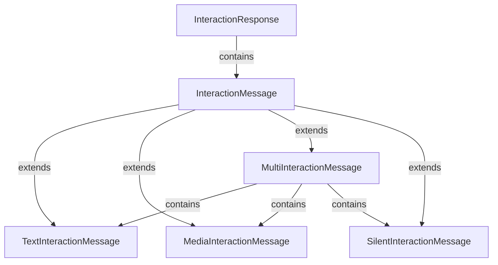

**Key Methods:**
```python
# Message Management
def set_message(message: InteractionMessage) -> None
def get_message() -> Optional[InteractionMessage]
def has_message() -> bool
def get_content() -> Any
def has_content() -> bool

# Token Tracking
def set_tokens(tokens: int) -> None

# Type Information
def get_type() -> str

# Serialization
def to_dict() -> dict
```

**Example Usage:**
```python
# Create text response
response = InteractionResponse(session_id="user_123")
text_msg = TextInteractionMessage(content="Hello! How can I help you?")
response.set_message(text_msg)
response.set_tokens(15)

# Create media response
media_response = InteractionResponse(session_id="user_123")
media_msg = MediaInteractionMessage(
    mime="image/png",
    data=image_bytes,
    content="Here's the requested chart"
)
media_response.set_message(media_msg)

# Create multi-part response
multi_response = InteractionResponse(session_id="user_123")
multi_msg = MultiInteractionMessage()
multi_msg.add_interaction_message(TextInteractionMessage(content="Here are your results:"))
multi_msg.add_interaction_message(MediaInteractionMessage(mime="image/png", data=chart_data))
multi_response.set_message(multi_msg)
```

#### 7.5.1. InteractionMessage (Base Message Class)

The **InteractionMessage** class serves as the abstract base for all message types in the response system.

**Type:** [`Object`](jvspatial/jvspatial/core/entities/object.py) (jvspatial Object)
**Location:** `jvagent/memory/interaction_response.py` (to be created)

**Attributes:**
```python
from jvspatial.core import Object
from typing import Optional, Any

class InteractionMessage(Object):
    """Abstract base class for interaction messages."""
    
    # Core message attributes
    message_type: Optional[str] = None
    content: Any = None
    mime: str = ""
    data: Any = None
```

**Responsibilities:**
- Define common interface for all message types
- Provide content validation and type checking
- Enable polymorphic message handling
- Support message serialization patterns

**Key Methods:**
```python
def get_type() -> str
def get_content() -> Any
def has_content() -> bool
```

#### 7.5.2. TextInteractionMessage (Text Messages)

The **TextInteractionMessage** handles simple text-based responses, the most common message type.

**Type:** Extends [`InteractionMessage`](jv/jvagent/memory/interaction_response.py:91)
**Location:** [`jv/jvagent/memory/interaction_response.py`](jv/jvagent/memory/interaction_response.py)

**Attributes:**
```python
class TextInteractionMessage(InteractionMessage):
    """Text-based interaction message."""
    
    message_type: str = MessageType.TEXT.value
    content: str = ""
```

**Responsibilities:**
- Handle plain text responses
- Provide content validation for text
- Support basic text formatting
- Enable text content retrieval

**Example Usage:**
```python
# Simple text message
text_msg = TextInteractionMessage(content="Thank you for your question!")

# Multi-line text
long_text = TextInteractionMessage(
    content="Here's your summary:\n\n1. Item one\n2. Item two\n3. Item three"
)

# Empty text (valid)
empty_msg = TextInteractionMessage()  # content defaults to ""
```

#### 7.5.3. MediaInteractionMessage (Media Content)

The **MediaInteractionMessage** handles binary content like images, audio, video, and documents.

**Type:** Extends [`InteractionMessage`](jv/jvagent/memory/interaction_response.py:113)
**Location:** [`jv/jvagent/memory/interaction_response.py`](jv/jvagent/memory/interaction_response.py)

**Attributes:**
```python
class MediaInteractionMessage(InteractionMessage):
    """Media-based interaction message."""
    
    message_type: str = MessageType.MEDIA.value
    mime: str = ""
    data: Any = None
    content: str = ""  # Optional description
```

**Responsibilities:**
- Handle binary media content
- Manage MIME type specification
- Provide optional text descriptions
- Support various media formats

**Supported Media Types:**
- **Images:** `image/png`, `image/jpeg`, `image/gif`, `image/webp`
- **Audio:** `audio/mp3`, `audio/wav`, `audio/ogg`
- **Video:** `video/mp4`, `video/webm`
- **Documents:** `application/pdf`, `text/plain`, `application/json`

**Key Methods:**
```python
def has_content() -> bool  # Checks if data exists
```

**Example Usage:**
```python
# Image message
image_msg = MediaInteractionMessage(
    mime="image/png",
    data=png_bytes,
    content="Generated chart showing sales trends"
)

# Audio response
audio_msg = MediaInteractionMessage(
    mime="audio/mp3",
    data=audio_bytes,
    content="Synthesized voice response"
)

# Document with description
doc_msg = MediaInteractionMessage(
    mime="application/pdf",
    data=pdf_bytes,
    content="Detailed report as requested"
)
```

#### 7.5.4. MultiInteractionMessage (Composite Messages)

The **MultiInteractionMessage** enables combining multiple message types into a single cohesive response.

**Type:** Extends [`InteractionMessage`](jv/jvagent/memory/interaction_response.py:149)
**Location:** [`jv/jvagent/memory/interaction_response.py`](jv/jvagent/memory/interaction_response.py)

**Attributes:**
```python
class MultiInteractionMessage(InteractionMessage):
    """Message containing multiple sub-messages."""
    
    message_type: str = MessageType.MULTI.value
    content: List[InteractionMessage] = []
```

**Responsibilities:**
- Combine different message types
- Maintain message ordering
- Prevent infinite nesting (no nested MultiInteractionMessage)
- Aggregate content from sub-messages

**Key Methods:**
```python
def add_interaction_message(message: InteractionMessage) -> None
def clear_interaction_messages() -> None
def get_content() -> str  # Concatenated content
def get_content_items() -> List[InteractionMessage]
def get_message_count() -> int
def has_content() -> bool
```

**Example Usage:**
```python
# Create composite response
multi_msg = MultiInteractionMessage()

# Add text introduction
multi_msg.add_interaction_message(
    TextInteractionMessage(content="Here are your requested analytics:")
)

# Add chart image
multi_msg.add_interaction_message(
    MediaInteractionMessage(
        mime="image/png",
        data=chart_bytes,
        content="Sales performance chart"
    )
)

# Add summary text
multi_msg.add_interaction_message(
    TextInteractionMessage(content="As you can see, sales increased 15% this quarter.")
)

# Check composition
assert multi_msg.get_message_count() == 3
assert multi_msg.has_content() == True

# Get combined text content
combined_text = multi_msg.get_content()
# Returns: "Here are your requested analytics:\nAs you can see, sales increased 15% this quarter."
```

#### 7.5.5. SilentInteractionMessage (No Response)

The **SilentInteractionMessage** represents scenarios where the agent should not provide an audible or visible response.

**Type:** Extends [`InteractionMessage`](jv/jvagent/memory/interaction_response.py:71)
**Location:** [`jv/jvagent/memory/interaction_response.py`](jv/jvagent/memory/interaction_response.py)

**Attributes:**
```python
class SilentInteractionMessage(InteractionMessage):
    """Silent/no-response message."""
    
    message_type: str = MessageType.SILENCE.value
    content: str = "..."
```

**Responsibilities:**
- Indicate intentional non-response
- Maintain interaction logging without output
- Support background processing scenarios
- Enable quiet acknowledgment patterns

**Use Cases:**
- Background data processing
- Silent acknowledgments
- Rate limiting responses
- System maintenance periods
- Privacy-sensitive contexts

**Example Usage:**
```python
# Silent response
silent_msg = SilentInteractionMessage()

# Custom silent indicator
custom_silent = SilentInteractionMessage(content="[Processing...]")

# Attach to response
response = InteractionResponse(session_id="user_123")
response.set_message(silent_msg)

# The response exists but produces no visible output
assert response.has_message() == True
assert response.get_type() == MessageType.SILENCE.value
```

#### 7.5.6. Integration with Interaction Entity

The **InteractionResponse** system integrates seamlessly with the existing [`Interaction`](jv/jvagent/memory/interaction.py) entity to provide rich response capabilities.

**Integration Pattern:**
```python
class Interaction(Object):
    """Enhanced with InteractionResponse support."""
    
    # Existing attributes...
    response: Optional[Dict[str, Any]] = None
    
    def set_interaction_response(self, response: InteractionResponse) -> None:
        """Set rich response object."""
        if response and response.has_content():
            self.response = {
                "type": "interaction_response",
                "session_id": response.session_id,
                "message_type": response.get_type(),
                "content": response.get_content(),
                "tokens": response.tokens,
                "metadata": response.to_dict()
            }
    
    def get_interaction_response(self) -> Optional[InteractionResponse]:
        """Reconstruct InteractionResponse from stored data."""
        if self.response and self.response.get("type") == "interaction_response":
            # Reconstruct response object from stored data
            return self._deserialize_response(self.response)
        return None
```

**Usage in Action Execution:**
```python
class MyInteractAction(InteractAction):
    """Example action using InteractionResponse."""
    
    async def execute(self, visitor):
        """Execute with rich response support."""
        
        # Create response
        response = InteractionResponse(session_id=visitor.session_id)
        
        # Determine response type based on request
        if "image" in visitor.interaction.utterance.lower():
            # Generate image response
            image_data = await self.generate_chart()
            media_msg = MediaInteractionMessage(
                mime="image/png",
                data=image_data,
                content="Generated visualization"
            )
            response.set_message(media_msg)
            
        elif "detailed" in visitor.interaction.utterance.lower():
            # Multi-part response
            multi_msg = MultiInteractionMessage()
            multi_msg.add_interaction_message(
                TextInteractionMessage(content="Here's your detailed analysis:")
            )
            multi_msg.add_interaction_message(
                MediaInteractionMessage(mime="application/pdf", data=pdf_data)
            )
            response.set_message(multi_msg)
            
        else:
            # Simple text response
            text_msg = TextInteractionMessage(
                content="I'd be happy to help with that!"
            )
            response.set_message(text_msg)
        
        # Track token usage
        response.set_tokens(await self.count_tokens(response.get_content()))
        
        # Set enhanced response
        visitor.interaction.set_interaction_response(response)
```

**Benefits of Integration:**
- **Backward Compatibility:** Existing code continues to work with traditional response handling
- **Rich Content:** New actions can leverage enhanced message types
- **Token Tracking:** Automatic integration with usage monitoring
- **Type Safety:** Compile-time validation of message structure
- **Extensibility:** Easy addition of new message types

---

### 8.5. Memory (Session & Context Manager)

The **Memory** entity manages an agent's session memory and contextual data storage.

**Type:** [`Node`](jvspatial/jvspatial/core/entities/node.py) (extends Node)  
**Location:** `jvagent/memory/memory.py` (to be created)

**Attributes:**
```python
from jvspatial.core import Node

class Memory(Node):
    """Root memory node for an agent."""
    
    # No direct attributes - uses graph relationships
    # All data stored in connected nodes (Frame, Collection)
```

**Responsibilities:**
- Manage user models and conversations
- Organize data in collections (action-specific storage)
- Import/export memory state
- Health monitoring
- Memory cleanup and pruning
- Provide isolation between users

**Graph Relationships:**
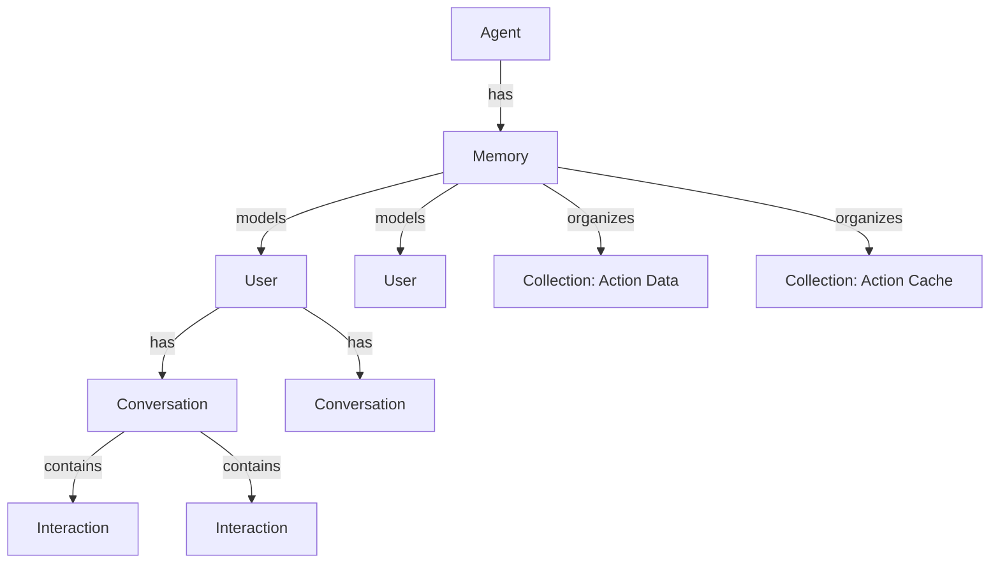

**Note:** User is the internal user model stored under Memory, not a system user account. It represents a person engaging with the agent and maintains their conversation history.

**Key Methods:**
```python
# User Management
async def get_user(user_id: str, create_if_missing: bool = True) -> Optional[User]
async def get_users() -> List[User]

# Conversation Management (via User)
async def get_conversation(user_id: str, conversation_id: str = None) -> Optional[Conversation]

# Collection Management
async def get_collection(collection_name: str) -> Optional[Collection]
async def list_collections() -> List[Collection]

# Import/Export
async def import_memory(data: Dict[str, Any], overwrite: bool = True) -> bool
async def export_memory(user_id: str = "") -> Dict[str, Any]

# Health & Maintenance
async def memory_healthcheck(user_id: str = "") -> Dict[str, int]
async def purge_user_memory(user_id: Optional[str] = None) -> Optional[List[User]]
async def purge_collection_memory(collection_name: Optional[str] = None) -> List[Collection]

# Navigation
async def get_agent() -> Optional[Node]
```

**Example Usage:**
```python
memory = await agent.get_memory()

# Get or create user
user = await memory.get_user(
    user_id="user_123",
    create_if_missing=True
)

# Get or create conversation
conversation = await user.create_conversation()

# Get collection for action data
collection = await memory.get_collection("email_cache")

# Health check
stats = await memory.memory_healthcheck()
print(f"Users: {stats['total_users']}, Conversations: {stats['total_conversations']}, Interactions: {stats['total_interactions']}")
```

---

### 8.6. User (Internal User Model)

The **User** entity represents a single user engaging with the agent.

**Type:** `Node` (jvspatial Graph Node)  
**Location:** `jv/jvagent/memory/user.py` (to be created)

**Attributes:**
```python
class User(Node):
    """Internal model of a person engaging with the agent.
    
    This is NOT a system user account - it represents an end-user
    interacting with the agent and is stored under Memory for isolation
    and proper data management.
    """
    
    # Identity (external reference)
    user_id: str = ""  # External user identifier
    username: str = ""
    display_name: str = ""
    
    # Contact Information
    email: str = ""
    phone: str = ""
    
    # Session Management
    active_conversations: List[str] = []  # Active conversation IDs
    last_active: datetime = Field(default_factory=datetime.now)
    
    # Preferences
    preferred_channel: str = "default"
    language: str = "en"
    timezone: str = "UTC"
    
    # Metadata
    metadata: Dict[str, Any] = Field(default_factory=dict)
    created_at: datetime = Field(default_factory=datetime.now)
```

**Responsibilities:**
- Track user identity and preferences
- Manage user sessions
- Store user-specific metadata
- Track user activity

**Graph Relationships:**
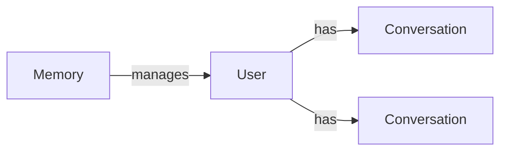

**Important:** User is an internal model stored under Memory, representing a person engaging with the agent. It is NOT a system user account. This provides proper data isolation and allows each agent to maintain its own user models.

**Key Methods:**
```python
async def create_conversation(session_id: str = None) -> Conversation
async def get_conversations(active_only: bool = True) -> List[Conversation]
async def get_active_conversation() -> Optional[Conversation]
async def update_preferences(prefs: Dict[str, Any]) -> bool
async def record_activity() -> None
```

**Example Usage:**
```python
# Create or get user
user = await User.create(
    user_id="ext_user_123",
    username="johndoe",
    email="john@example.com",
    preferred_channel="whatsapp"
)

# Create conversation
conversation = await user.create_conversation()

# Track activity
await user.record_activity()
```

---

### 8.7. Conversation (Interaction Series)

The **Conversation** entity maintains a series of interactions for a user session.

**Type:** `Node` (jvspatial Graph Node)  
**Location:** `jv/jvagent/memory/conversation.py` (to be created)

**Attributes:**
```python
class Conversation(Node):
    """Represents a conversation thread with a user.
    
    Replaces the legacy Frame concept with a cleaner model focused
    on conversation management rather than session framing.
    """
    
    # Identity
    conversation_id: str = Field(default_factory=lambda: str(uuid.uuid4()))
    user_id: str = ""  # References User node under Memory
    agent_id: str = ""
    
    # State
    status: str = "active"  # active, paused, completed, archived
    channel: str = "default"
    
    # Timestamps
    started_at: datetime = Field(default_factory=datetime.now)
    last_interaction_at: datetime = Field(default_factory=datetime.now)
    completed_at: Optional[datetime] = None
    
    # Context
    context: Dict[str, Any] = Field(default_factory=dict)
    tags: List[str] = []
    
    # Statistics
    interaction_count: int = 0
    total_tokens: int = 0
```

**Responsibilities:**
- Group related interactions
- Track conversation state
- Maintain conversation context
- Provide conversation history
- Support conversation analytics

**Graph Relationships:**
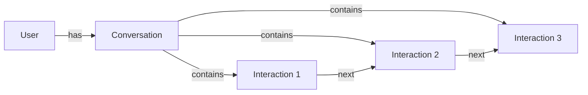

**Key Methods:**
```python
async def add_interaction(interaction: Interaction) -> None
async def get_interactions(limit: int = 0, order: str = "asc") -> List[Interaction]
async def get_transcript(limit: int = 10, with_events: bool = False) -> str
async def update_context(context_update: Dict[str, Any]) -> None
async def complete(summary: str = "") -> None
async def archive() -> bool
async def get_statistics() -> Dict[str, Any]
```

**Example Usage:**
```python
# Create conversation
conversation = await Conversation.create(
    user_id="user_123",
    agent_id=agent.id,
    channel="web"
)

# Add interactions
interaction = await Interaction.create(utterance="Hello")
await conversation.add_interaction(interaction)

# Get history
transcript = await conversation.get_transcript(limit=5)

# Complete conversation
await conversation.complete(summary="Support ticket resolved")
```

---

### 8.8. Interaction (Single Exchange)

The **Interaction** entity represents a single exchange between user and AI.

**Type:** `Object` (jvspatial Object - not graph-connected)  
**Location:** `jv/jvagent/memory/interaction.py`

**Attributes:**
```python
class Interaction(Object):
    """Single conversation turn between user and AI.
    
    Uses Object (not Node) as interactions are standalone data entities
    without graph relationships. They are contained within Conversations.
    """
    
    # Context
    agent_id: str = ""
    conversation_id: str = ""
    channel: str = "default"
    
    # Input
    utterance: str = ""
    tokens: int = 0
    time_stamp: str = Field(default_factory=lambda: datetime.now().isoformat())
    
    # Processing State
    trail: List[str] = []  # Action execution path
    intents: List[str] = []  # Detected intents
    functions: Dict[str, List[Dict]] = {}  # Tool calls per action
    directives: List[str] = []  # Queued directives
    events: List[str] = []  # System events
    
    # Response
    response: Optional[Dict[str, Any]] = None
    
    # Metadata
    data: Dict[str, Any] = Field(default_factory=dict)
    closed: bool = False
```

**Responsibilities:**
- Store user input and AI response
- Track action execution trail
- Record intents and events
- Manage interaction state
- Provide interaction metadata

**Key Methods:**
```python
def is_new_user() -> bool
def add_intent(intent: str) -> None
def add_event(event: str) -> None
def set_response(content: str, metadata: Dict = None) -> None
def close_interaction() -> None
def get_duration() -> float
```

**Example Usage:**
```python
# Create interaction
interaction = await Interaction.create(
    agent_id=agent.id,
    conversation_id=conversation.id,
    utterance="What's the weather?",
    channel="web"
)

# Process through actions
interaction.add_intent("weather_query")
interaction.trail.append("IntentAction")
interaction.trail.append("WeatherAction")

# Set response
interaction.set_response("The weather is sunny, 72°F")

# Close
interaction.close_interaction()
await interaction.save()
```

---

### 8.9. Collection (Flexible Data Organization)

The **Collection** entity provides flexible data organization under Memory for actions.

**Type:** `Node` (jvspatial Graph Node)  
**Location:** `jv/jvagent/memory/collection.py`

**Attributes:**
```python
class Collection(Node):
    """Flexible data storage for action-specific data.
    
    Stored under Memory (not under Action) for safer persistence and
    data isolation. Actions reference collections by name.
    """
    
    # Identity
    name: str = ""
    action_label: str = ""  # Action that uses this collection
    
    # Configuration
    schema: Dict[str, Any] = Field(default_factory=dict)
    indexes: List[str] = []
    
    # Statistics
    document_count: int = 0
    last_modified: datetime = Field(default_factory=datetime.now)
    
    # Metadata
    metadata: Dict[str, Any] = Field(default_factory=dict)
```

**Responsibilities:**
- Store action-specific data
- Provide queryable data structure
- Support bulk operations
- Enable data export/import
- Track collection statistics

**Graph Relationships:**
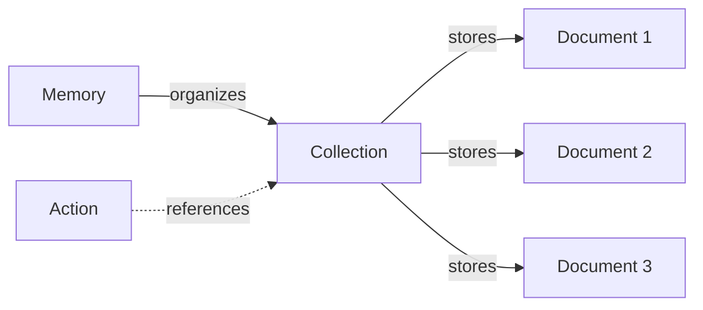

**Note:** Collections are stored under Memory (not under Action) for safer persistence. Actions reference collections by name through the Memory system.

**Key Methods:**
```python
async def add_document(data: Dict[str, Any]) -> str
async def add_documents_bulk(documents: List[Dict]) -> List[str]
async def get_document(doc_id: str) -> Optional[Dict]
async def find_documents(query: Dict[str, Any]) -> List[Dict]
async def update_document(doc_id: str, data: Dict) -> bool
async def delete_document(doc_id: str) -> bool
async def count_documents(query: Dict = None) -> int
async def clear() -> int
async def export_data() -> Dict[str, Any]
async def import_data(data: Dict, overwrite: bool = True) -> bool
```

**Example Usage:**
```python
# Create collection
collection = await Collection.create(
    name="email_cache",
    action_label="EmailAction"
)

# Add documents
doc_id = await collection.add_document({
    "email": "user@example.com",
    "last_sent": datetime.now().isoformat(),
    "count": 5
})

# Query documents
results = await collection.find_documents({
    "context.count": {"$gte": 3}
})

# Export collection
export_data = await collection.export_data()
```

---

### 8.10. Interact (Main Interaction Walker)

The **Interact** walker is the main entry point for processing user interactions through the agent system.

**Type:** [`Walker`](jvspatial/QUICKSTART.md:571) (jvspatial Walker)  
**Location:** `jv/jvagent/walker/interact.py` (to be created)

**Attributes:**
```python
class Interact(Walker):
    """Main walker for processing user interactions."""
    
    # Input Parameters
    agent_id: str = ""
    session_id: str = ""
    utterance: str = ""
    channel: str = "default"
    verbose: bool = False
    
    # Processing State
    frame: Optional[Frame] = None
    interaction: Optional[Interaction] = None
    conversation: Optional[Conversation] = None
    user: Optional[User] = None
    
    # Results
    response: Dict[str, Any] = Field(default_factory=dict)
    execution_time: float = 0.0
```

**Responsibilities:**
- Initialize interaction context
- Validate flood control
- Create interaction record
- Execute action pipeline
- Generate response
- Update conversation state

**Walker Flow:**
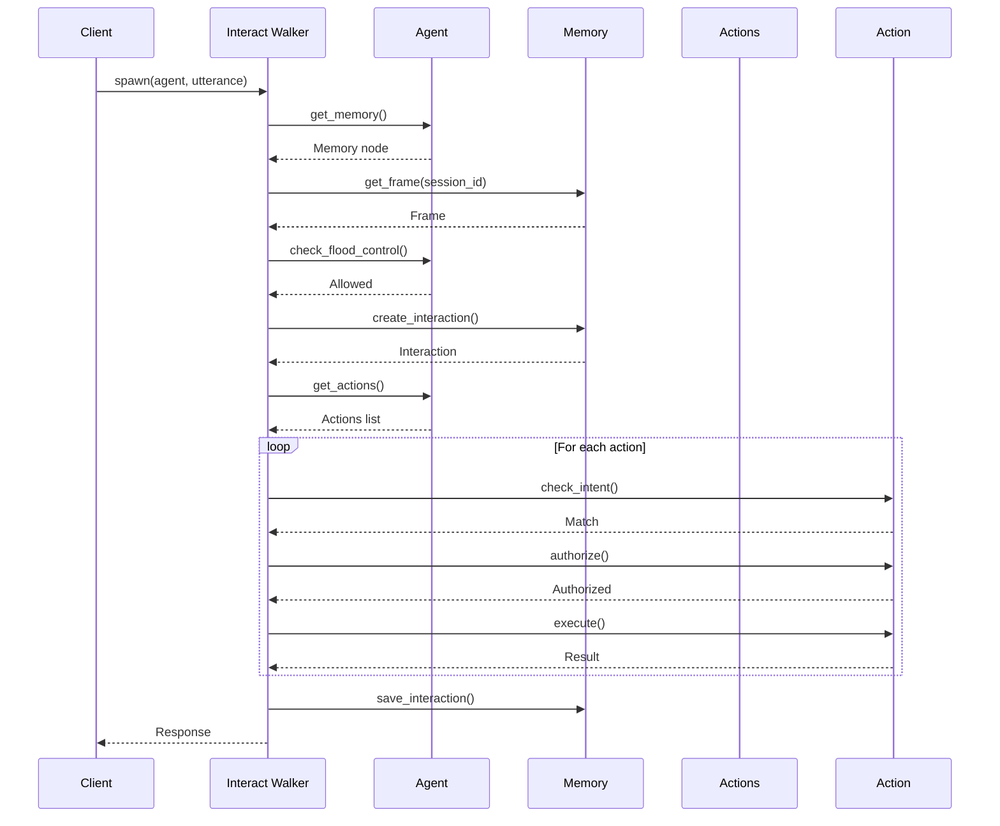

**Key Methods (decorated with @on_visit):**
```python
@on_visit(Agent)
async def process_interaction(self, here: Agent) -> None
    """Main interaction processing."""

@on_exit
async def finalize_interaction(self) -> None
    """Cleanup and response generation."""
```

**Example Usage:**
```python
# Create walker
walker = Interact(
    agent_id=agent.id,
    session_id="user_123_session",
    utterance="What's the weather today?",
    channel="web",
    verbose=True
)

# Execute interaction
result = await walker.spawn(agent)

# Get response
report = result.get_report()
response = report[-1]  # Last report item

print(response['response']['content'])
```

---

## Data Flow Diagrams

### User Interaction Flow

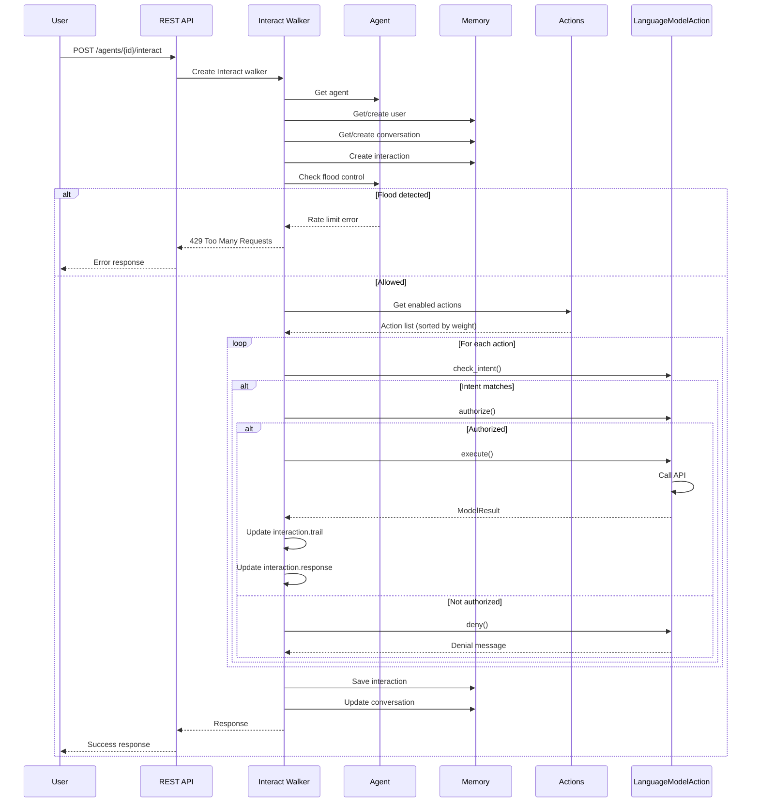

**Note:** Frame has been deprecated in favor of the User → Conversation → Interaction hierarchy for clearer data modeling.

### Agent Initialization Flow

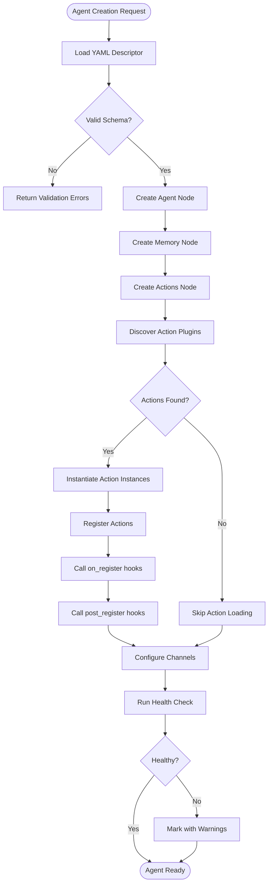

### Action Discovery & Loading Flow

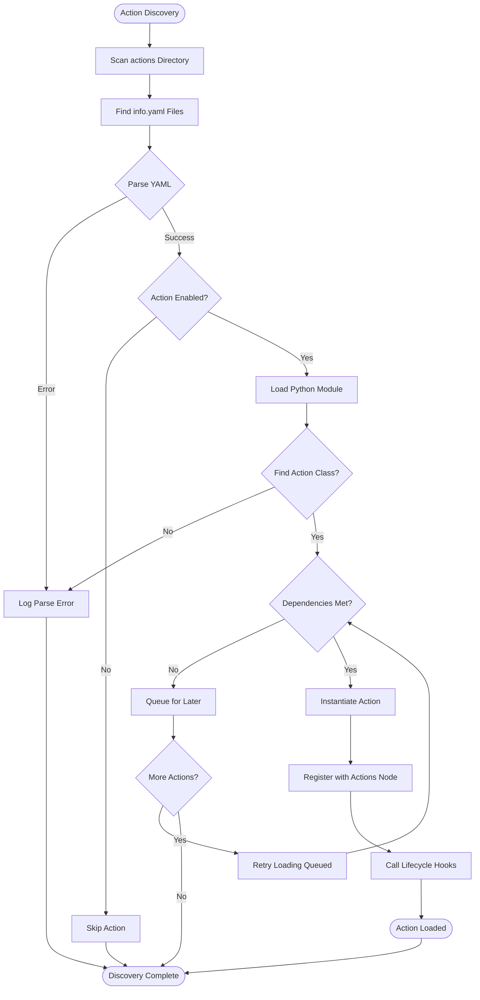

### Memory Write Flow

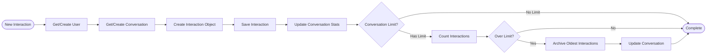

### Action Execution Pipeline

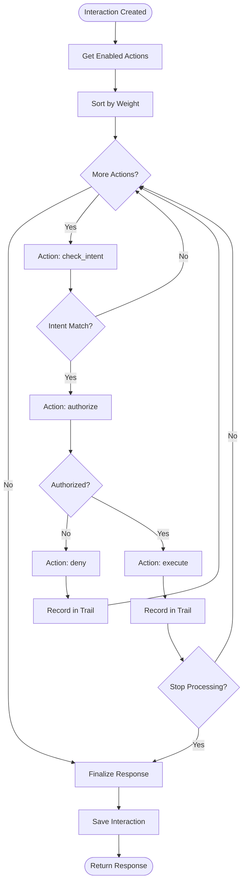

---

## Action Lifecycle

### Complete Lifecycle Sequence

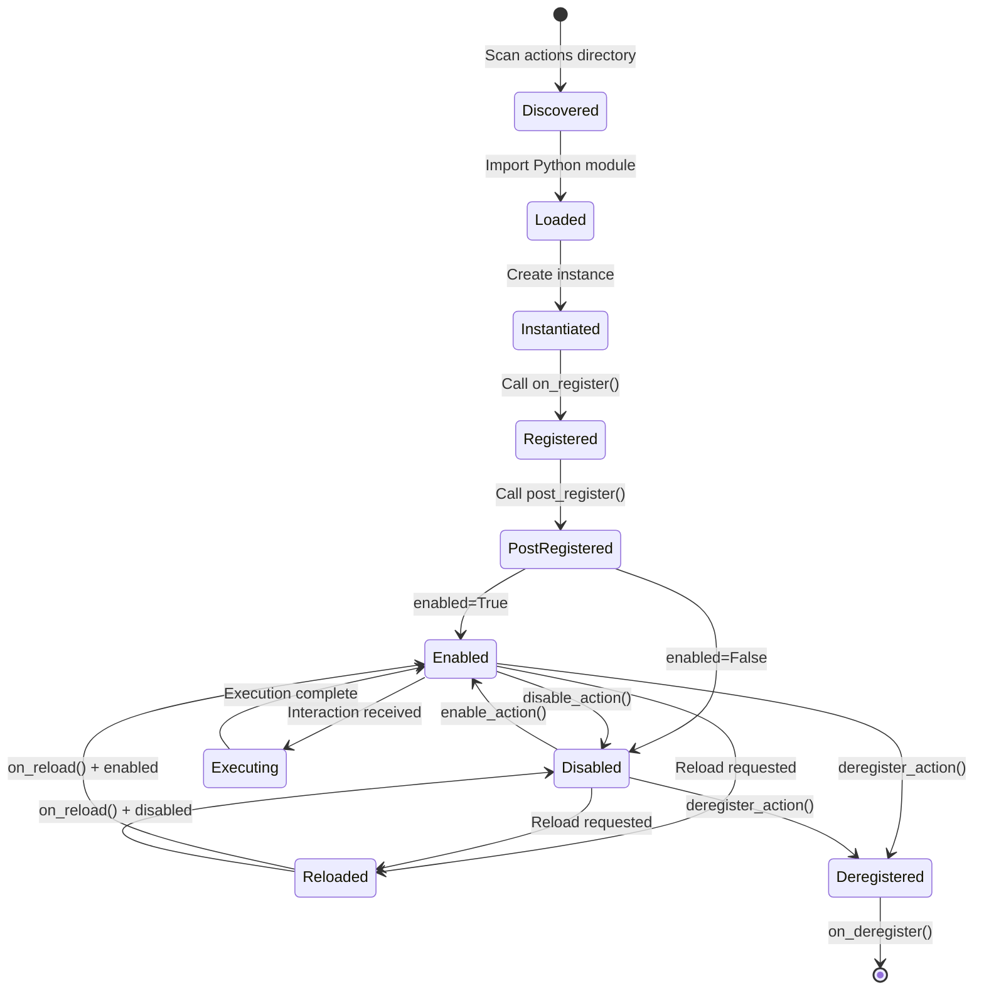

### Registration Workflow

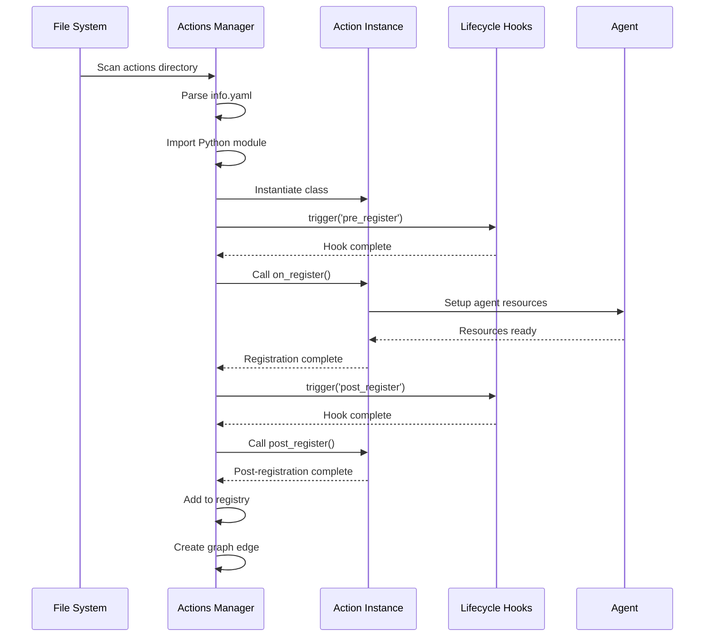

### Execution Workflow

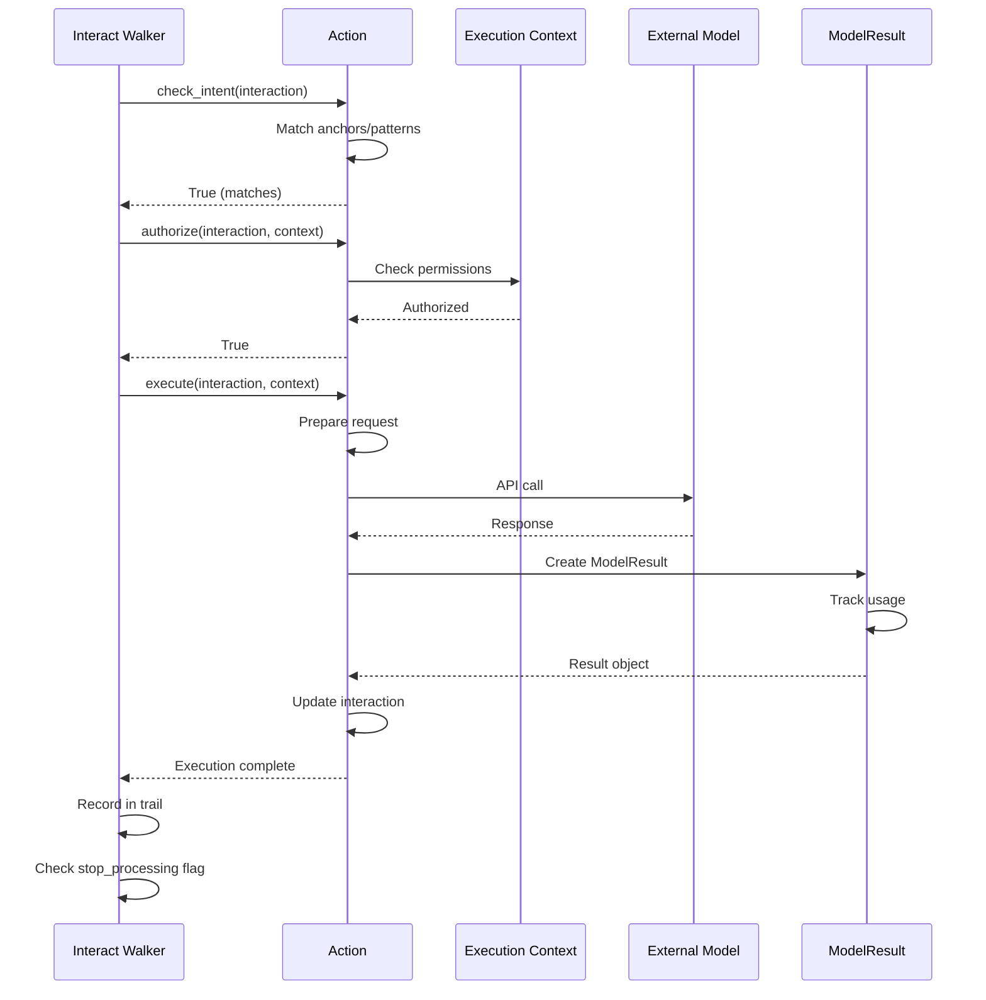

### Uninstallation Workflow

```mermaid
flowchart TD
    Start([Deregister Request]) --> GetAction[Get Action Instance]
    GetAction --> Found{Action Found?}
    
    Found -->|No| NotFound([Action Not Found])
    Found -->|Yes| CheckDependents{Has Dependents?}
    
    CheckDependents -->|Yes| PromptUser{Force Remove?}
    PromptUser -->|No| Cancel([Cancelled])
    PromptUser -->|Yes| RemoveDeps[Remove Dependencies]
    
    CheckDependents -->|No| CallDeregister[Call on_deregister]
    RemoveDeps --> CallDeregister
    
    CallDeregister --> RemoveCollection[Remove Collection]
    RemoveCollection --> DeleteFiles[Delete Action Files]
    DeleteFiles --> RemoveEdge[Delete Graph Edges]
    RemoveEdge --> DeleteNode[Delete Action Node]
    DeleteNode --> UpdateRegistry[Update Registry]
    UpdateRegistry --> Complete([Deregistered])
```

### Runtime Enable/Disable

```mermaid
flowchart LR
    subgraph "Enable Action"
        E1[Get Action] --> E2{Currently Disabled?}
        E2 -->|No| E3[Already Enabled]
        E2 -->|Yes| E4[Call on_enable hook]
        E4 --> E5[Set enabled=True]
        E5 --> E6[Save Action]
        E6 --> E7[Trigger post_enable hooks]
    end
    
    subgraph "Disable Action"
        D1[Get Action] --> D2{Currently Enabled?}
        D2 -->|No| D3[Already Disabled]
        D2 -->|Yes| D4[Call on_disable hook]
        D4 --> D5[Set enabled=False]
        D5 --> D6[Save Action]
        D6 --> D7[Trigger post_disable hooks]
    end
```

---

## YAML Descriptor Schema

### Agent Descriptor Format

The agent descriptor YAML file defines the complete configuration for an agent instance.

**File Location:** `agents/{agent_name}/agent.yaml`

**Complete Schema:**

```yaml
# Agent Descriptor Schema v1.0

# Required Fields
name: string                    # Unique agent name
version: string                 # Semantic version (e.g., "1.0.0")
description: string             # Agent description

# Optional Configuration
published: boolean              # Default: true
logging: boolean                # Default: true

# Message Handling
message_limit: integer          # Default: 1024 characters
flood_control: boolean          # Default: true
flood_block_time: integer       # Default: 300 seconds
window_time: integer            # Default: 20 seconds
flood_threshold: integer        # Default: 4 messages

# Memory Configuration
frame_size: integer             # Default: 10 interactions (0 = unlimited)

# Communication Channels
channels:
  - string                      # e.g., ['default', 'whatsapp', 'slack']

# Action Shortcuts
tts_action: string              # Default TTS action label
stt_action: string              # Default STT action label
vector_store_action: string     # Default vector store label

# API Keys (encrypted in production)
keys:
  openai: string
  anthropic: string
  elevenlabs: string
  # ... other service keys

# Actions Configuration
actions:
  - label: string               # Unique action identifier
    class: string               # Python class name
    enabled: boolean            # Default: true
    weight: integer             # Execution priority (lower = earlier)
    
    # Action-specific configuration
    config:
      # Varies by action type
      model_name: string
      api_key: string
      temperature: float
      # ... other config

# Metadata
metadata:
  author: string
  namespace: string
  tags: [string]
  created_at: datetime
  # ... custom metadata
```

**Example Agent Descriptor:**

```yaml
name: "CustomerSupportAgent"
version: "1.0.0"
description: "24/7 customer support agent with RAG capabilities"

published: true
logging: true

message_limit: 2048
flood_control: true
flood_block_time: 300
window_time: 30
flood_threshold: 5

frame_size: 15

channels:
  - default
  - whatsapp
  - web
  - slack

tts_action: "ElevenLabsTTS"
stt_action: "DeepgramSTT"
vector_store_action: "TypesenseVector"

keys:
  openai: "${OPENAI_API_KEY}"
  typesense: "${TYPESENSE_API_KEY}"
  elevenlabs: "${ELEVENLABS_API_KEY}"

actions:
  # Intent Detection
  - label: "IntentDetector"
    class: "IntentInteractAction"
    enabled: true
    weight: 5
    config:
      model_name: "gpt-4-turbo"
      anchors:
        - "help"
        - "support"
        - "question"
  
  # RAG-Enabled Support
  - label: "RAGSupport"
    class: "RetrievalInteractAction"
    enabled: true
    weight: 10
    config:
      vectorstore_action_label: "TypesenseVector"
      retrieval_limit: 5
      similarity_threshold: 0.75
      llm_action_label: "OpenAI_GPT4"
  
  # Vector Store
  - label: "TypesenseVector"
    class: "VectorstoreAction"
    enabled: true
    weight: 0  # Utility action, no direct execution
    config:
      host: "localhost"
      port: 8108
      api_key: "${TYPESENSE_API_KEY}"
      collection_name: "support_docs"
  
  # Language Model
  - label: "OpenAI_GPT4"
    class: "LanguageModelAction"
    enabled: true
    weight: 0  # Utility action
    config:
      model_name: "gpt-4-turbo"
      api_key: "${OPENAI_API_KEY}"
      temperature: 0.7
      max_tokens: 2048
  
  # TTS (if needed)
  - label: "ElevenLabsTTS"
    class: "TTSModelAction"
    enabled: false  # Disabled by default
    weight: 0
    config:
      api_key: "${ELEVENLABS_API_KEY}"
      voice_id: "21m00Tcm4TlvDq8ikWAM"

metadata:
  author: "Support Team"
  namespace: "support/customer"
  tags: ["customer-service", "rag", "support"]
  created_at: "2025-10-05T00:00:00Z"
```

### Action Descriptor Format

Individual actions can also have their own descriptors in the plugin directory.

**File Location:** `actions/{action_name}/info.yaml`

**Schema:**

```yaml
# Action Info Schema v1.0

# Required Fields
name: string                    # Action package name
version: string                 # Semantic version
class: string                   # Python class name

# Optional Fields
description: string
author: string
license: string

# Dependencies
dependencies:
  python: [string]              # Python package dependencies
  actions: [string]             # Other action dependencies

# Configuration Schema
config_schema:
  type: object
  properties:
    api_key:
      type: string
      required: true
    model_name:
      type: string
      default: "gpt-4"
    # ... other config properties

# Metadata
metadata:
  category: string              # e.g., "llm", "vectorstore", "utility"
  tags: [string]
  homepage: string
  repository: string
```

**Example Action Descriptor:**

```yaml
name: "openai_language_model"
version: "1.2.0"
class: "LanguageModelAction"
description: "OpenAI GPT model integration"
author: "jvagent Team"
license: "Apache-2.0"

dependencies:
  python:
    - openai>=1.0.0
    - tiktoken>=0.5.0
  actions: []

config_schema:
  type: object
  properties:
    api_key:
      type: string
      required: true
      description: "OpenAI API key"
    model_name:
      type: string
      default: "gpt-4-turbo"
      enum: ["gpt-4", "gpt-4-turbo", "gpt-3.5-turbo"]
    temperature:
      type: number
      default: 0.7
      minimum: 0.0
      maximum: 2.0
    max_tokens:
      type: integer
      default: 2048
      minimum: 1
      maximum: 128000

metadata:
  category: "llm"
  tags: ["openai", "language-model", "chat"]
  homepage: "https://github.com/jvagent/actions/openai"
  repository: "https://github.com/jvagent/actions/openai"
```

---

## Plugin Architecture

### Directory Structure

```
/actions/
├── agent_utils_action/
│   ├── agent_utils_action.py       # Main action class
│   ├── info.yaml                   # Action descriptor
│   ├── requirements.txt            # Python dependencies
│   ├── README.md                   # Documentation
│   └── tests/
│       └── test_action.py
│
├── openai_llm_action/
│   ├── openai_llm_action.py
│   ├── info.yaml
│   ├── requirements.txt
│   └── README.md
│
└── typesense_vector_action/
    ├── typesense_vector_action.py
    ├── info.yaml
    ├── requirements.txt
    ├── modules/
    │   └── typesense_client.py     # Helper modules
    └── README.md
```

### Action Discovery Mechanism

**Discovery Process:**

1. **Scan `/actions` directory** for subdirectories
2. **Look for `info.yaml`** in each subdirectory
3. **Parse YAML** to get action metadata
4. **Check `enabled` flag** in YAML
5. **Validate dependencies** (Python packages, other actions)
6. **Import Python module** specified in YAML
7. **Find Action class** by name in module
8. **Instantiate** action with config from YAML
9. **Register** with Actions manager
10. **Call lifecycle hooks** (`on_register`, `post_register`)

**Code Implementation:**

```python
async def discover_and_load_actions(
    actions_dir: str = "/actions",
    agent_id: str = ""
) -> Dict[str, Any]:
    """Discover and load actions from plugin directory."""
    
    results = {
        "discovered": [],
        "loaded": [],
        "skipped": [],
        "errors": []
    }
    
    # Scan actions directory
    actions_path = Path(actions_dir)
    if not actions_path.exists():
        return results
    
    for action_dir in actions_path.iterdir():
        if not action_dir.is_dir():
            continue
        
        info_file = action_dir / "info.yaml"
        if not info_file.exists():
            results["skipped"].append({
                "action": action_dir.name,
                "reason": "No info.yaml found"
            })
            continue
        
        try:
            # Parse info.yaml
            import yaml
            with open(info_file) as f:
                info = yaml.safe_load(f)
            
            results["discovered"].append(info["name"])
            
            # Check if enabled
            if not info.get("enabled", True):
                results["skipped"].append({
                    "action": info["name"],
                    "reason": "Disabled in descriptor"
                })
                continue
            
            # Check dependencies
            if not await check_dependencies(info.get("dependencies", {})):
                results["errors"].append({
                    "action": info["name"],
                    "error": "Missing dependencies"
                })
                continue
            
            # Import module
            module_file = action_dir / f"{action_dir.name}.py"
            if not module_file.exists():
                results["errors"].append({
                    "action": info["name"],
                    "error": "Module file not found"
                })
                continue
            
            spec = importlib.util.spec_from_file_location(
                action_dir.name, 
                module_file
            )
            module = importlib.util.module_from_spec(spec)
            spec.loader.exec_module(module)
            
            # Find action class
            class_name = info["class"]
            if not hasattr(module, class_name):
                results["errors"].append({
                    "action": info["name"],
                    "error": f"Class {class_name} not found"
                })
                continue
            
            action_class = getattr(module, class_name)
            
            # Instantiate with config
            config = info.get("config", {})
            config["agent_id"] = agent_id
            config["label"] = info.get("label", info["name"])
            config["version"] = info["version"]
            
            action = await action_class.create(**config)
            
            # Register
            actions_manager = await get_actions_manager(agent_id)
            if await actions_manager.register_action(action):
                results["loaded"].append(info["name"])
            else:
                results["errors"].append({
                    "action": info["name"],
                    "error": "Registration failed"
                })
        
        except Exception as e:
            results["errors"].append({
                "action": action_dir.name,
                "error": str(e)
            })
    
    return results
```

### Runtime Installation

**Installation API:**

```python
@endpoint("/api/agents/{agent_id}/actions/install", methods=["POST"])
async def install_action(
    agent_id: str,
    action_package: str,
    config: Dict[str, Any] = None,
    enable: bool = True,
    endpoint = None
) -> Any:
    """Install an action at runtime."""
    
    # Validate agent exists
    agent = await Agent.get(agent_id)
    if not agent:
        return endpoint.not_found(message="Agent not found")
    
    # Get actions manager
    actions = await agent.get_actions()
    
    # Discover action from package
    action_info = await discover_action_package(action_package)
    if not action_info:
        return endpoint.not_found(message="Action package not found")
    
    # Check dependencies
    deps_met = await check_action_dependencies(action_info)
    if not deps_met:
        return endpoint.unprocessable_entity(
            message="Action dependencies not met",
            details={"missing": deps_met.get("missing", [])}
        )
    
    # Install action
    action = await create_action_from_package(action_info, config)
    
    # Register
    if await actions.register_action(action):
        # Enable if requested
        if enable:
            await actions.enable_action(action.label)
        
        return endpoint.created(
            data={
                "label": action.label,
                "class": await action.get_type(),
                "enabled": action.enabled
            },
            message="Action installed successfully"
        )
    
    return endpoint.error(
        message="Failed to register action",
        status_code=500
    )
```

### Runtime Uninstallation

```python
@endpoint("/api/agents/{agent_id}/actions/{action_label}", methods=["DELETE"])
async def uninstall_action(
    agent_id: str,
    action_label: str,
    force: bool = False,
    endpoint = None
) -> Any:
    """Uninstall an action at runtime."""
    
    agent = await Agent.get(agent_id)
    if not agent:
        return endpoint.not_found(message="Agent not found")
    
    actions = await agent.get_actions()
    
    # Check for dependents
    dependents = await actions.get_dependents(action_label)
    if dependents and not force:
        return endpoint.conflict(
            message="Action has dependents",
            details={"dependents": list(dependents)}
        )
    
    # Deregister
    deregistered = await actions.deregister_action(action_label=action_label)
    
    if deregistered:
        return endpoint.success(
            data={"deregistered": [a.label for a in deregistered]},
            message="Action uninstalled successfully"
        )
    
    return endpoint.not_found(message="Action not found")
```

### Enable/Disable at Runtime

```python
@endpoint("/api/agents/{agent_id}/actions/{action_label}/enable", methods=["POST"])
async def enable_action_endpoint(
    agent_id: str,
    action_label: str,
    endpoint = None
) -> Any:
    """Enable an action at runtime."""
    
    agent = await Agent.get(agent_id)
    if not agent:
        return endpoint.not_found(message="Agent not found")
    
    actions = await agent.get_actions()
    
    if await actions.enable_action(action_label):
        return endpoint.success(
            data={"label": action_label, "enabled": True},
            message="Action enabled"
        )
    
    return endpoint.not_found(message="Action not found")


@endpoint("/api/agents/{agent_id}/actions/{action_label}/disable", methods=["POST"])
async def disable_action_endpoint(
    agent_id: str,
    action_label: str,
    endpoint = None
) -> Any:
    """Disable an action at runtime."""
    
    agent = await Agent.get(agent_id)
    if not agent:
        return endpoint.not_found(message="Agent not found")
    
    actions = await agent.get_actions()
    
    if await actions.disable_action(action_label):
        return endpoint.success(
            data={"label": action_label, "enabled": False},
            message="Action disabled"
        )
    
    return endpoint.not_found(message="Action not found")
```

---

## API Endpoints

### RESTful API Design

All jvagent APIs follow RESTful conventions and use jvspatial's [`@endpoint`](jvspatial/jvspatial/api/decorators.py) decorator for both functions and Walker classes.

### Agent Management Endpoints

#### Create Agent

```python
@endpoint("/api/agents", methods=["POST"])
async def create_agent(
    agent_data: Dict[str, Any],
    from_yaml: bool = False,
    yaml_path: str = "",
    endpoint = None
) -> Any:
    """Create a new agent instance.
    
    Request Body:
        {
            "name": "MyAgent",
            "description": "Agent description",
            "published": true,
            "channels": ["web", "api"],
            "actions": [...]  // Optional initial actions
        }
    
    Response (201):
        {
            "data": {
                "id": "agent_abc123",
                "name": "MyAgent",
                "status": "created"
            },
            "message": "Agent created successfully"
        }
    """
    try:
        if from_yaml and yaml_path:
            # Load from YAML descriptor
            agent = await Agent.create_from_yaml(yaml_path)
        else:
            # Create from JSON data
            agent = await Agent.create(**agent_data)
        
        # Initialize memory and actions
        memory = await agent.get_memory()
        actions = await agent.get_actions()
        
        # Discover and load actions if specified
        if "actions" in agent_data:
            actions_manager = await agent.get_actions()
            for action_config in agent_data["actions"]:
                # Load action from config
                await load_action_from_config(actions_manager, action_config)
        
        # Health check
        health = await agent.get_healthcheck_report()
        
        return endpoint.created(
            data={
                "id": agent.id,
                "name": agent.name,
                "status": "created",
                "health": health["status"]
            },
            message="Agent created successfully",
            headers={"Location": f"/api/agents/{agent.id}"}
        )
    
    except ValidationError as e:
        return endpoint.unprocessable_entity(
            message="Validation failed",
            details={"errors": e.errors()}
        )
    except Exception as e:
        return endpoint.error(
            message="Failed to create agent",
            status_code=500,
            details={"error": str(e)}
        )
```

#### Get Agent

```python
@endpoint("/api/agents/{agent_id}", methods=["GET"])
async def get_agent(
    agent_id: str,
    include_actions: bool = False,
    include_memory_stats: bool = False,
    endpoint = None
) -> Any:
    """Retrieve agent configuration.
    
    Response (200):
        {
            "data": {
                "id": "agent_abc123",
                "name": "MyAgent",
                "description": "...",
                "published": true,
                "channels": ["web"],
                "actions": [...],  // if include_actions=true
                "memory_stats": {...}  // if include_memory_stats=true
            }
        }
    """
    agent = await Agent.get(agent_id)
    if not agent:
        return endpoint.not_found(message="Agent not found")
    
    # Get base descriptor
    data = await agent.get_descriptor(clean=True)
    
    # Include actions if requested
    if include_actions:
        actions = await agent.get_actions()
        data["actions"] = [await a.to_dict() for a in actions]
    
    # Include memory stats if requested
    if include_memory_stats:
        memory = await agent.get_memory()
        if memory:
            stats = await memory.memory_healthcheck()
            data["memory_stats"] = stats
    
    return endpoint.success(data=data)
```

#### Update Agent

```python
@endpoint("/api/agents/{agent_id}", methods=["PATCH"])
async def update_agent(
    agent_id: str,
    updates: Dict[str, Any],
    endpoint = None
) -> Any:
    """Update agent configuration.
    
    Request Body:
        {
            "description": "Updated description",
            "flood_threshold": 10,
            "published": false
        }
    """
    agent = await Agent.get(agent_id)
    if not agent:
        return endpoint.not_found(message="Agent not found")
    
    try:
        await agent.update_agent(data=updates)
        
        return endpoint.success(
            data={"id": agent.id, "updated": True},
            message="Agent updated successfully"
        )
    except ValidationError as e:
        return endpoint.unprocessable_entity(
            message="Validation failed",
            details={"errors": e.errors()}
        )
```

#### Delete Agent

```python
@endpoint("/api/agents/{agent_id}", methods=["DELETE"])
async def delete_agent(
    agent_id: str,
    purge_data: bool = True,
    endpoint = None
) -> Any:
    """Delete an agent and optionally its data.
    
    Query Parameters:
        purge_data: If true, delete all memory and collections
    """
    agent = await Agent.get(agent_id)
    if not agent:
        return endpoint.not_found(message="Agent not found")
    
    try:
        if purge_data:
            # Purge memory
            memory = await agent.get_memory()
            if memory:
                await memory.purge_frame_memory()
                await memory.purge_collection_memory()
        
        # Deregister all actions
        actions = await agent.get_actions()
        if actions:
            await actions.deregister_actions()
        
        # Delete agent node
        await agent.delete()
        
        return endpoint.success(
            data={"id": agent_id, "deleted": True},
            message="Agent deleted successfully"
        )
    
    except Exception as e:
        return endpoint.error(
            message="Failed to delete agent",
            status_code=500,
            details={"error": str(e)}
        )
```

#### List Agents

```python
@endpoint("/api/agents", methods=["GET"])
async def list_agents(
    published_only: bool = True,
    page: int = 1,
    page_size: int = 20,
    endpoint = None
) -> Any:
    """List all agents with pagination.
    
    Response (200):
        {
            "data": {
                "agents": [...],
                "total": 45,
                "page": 1,
                "page_size": 20,
                "total_pages": 3
            }
        }
    """
    from jvspatial.core.pager import ObjectPager
    
    # Build filters
    filters = {}
    if published_only:
        filters["context.published"] = True
    
    # Create pager
    pager = ObjectPager(
        Agent,
        page_size=page_size,
        filters=filters,
        order_by="name"
    )
    
    # Get page
    agents = await pager.get_page(page)
    
    return endpoint.success(
        data={
            "agents": [await a.get_descriptor(clean=True) for a in agents],
            "pagination": pager.to_dict()
        }
    )
```

### Interaction Endpoints

#### Send Interaction

```python
from jvspatial.api import endpoint
from jvspatial.core import Walker, Node
from jvspatial.api.decorators import EndpointField
from jvspatial.core.entities import on_visit

@endpoint("/api/agents/{agent_id}/interact", methods=["POST"])
class InteractWalker(Walker):
    """Process user interaction with an agent."""
    
    session_id: str = EndpointField(
        description="Session identifier for conversation context"
    )
    
    utterance: str = EndpointField(
        description="User message/input",
        min_length=1,
        max_length=4096
    )
    
    channel: str = EndpointField(
        default="default",
        description="Communication channel",
        examples=["default", "web", "whatsapp", "slack"]
    )
    
    verbose: bool = EndpointField(
        default=False,
        description="Include detailed execution trail in response"
    )
    
    @on_visit(Agent)
    async def process_interaction(self, here: Agent):
        """Process the interaction through the agent."""
        
        # Validate channel
        if not here.has_channel(self.channel):
            return self.endpoint.bad_request(
                message="Invalid channel",
                details={"channel": self.channel, "valid": here.get_channels()}
            )
        
        # Get memory, user, and conversation
        memory = await here.get_memory()
        user = await memory.get_user(
            user_id=self.session_id,  # Using session_id as user_id for now
            create_if_missing=True
        )
        conversation = await user.get_active_conversation()
        if not conversation:
            conversation = await user.create_conversation(channel=self.channel)
        
        # Check flood control
        if here.flood_control:
            is_flooding = await check_flood_control(here, user, conversation)
            if is_flooding:
                return self.endpoint.error(
                    message="Rate limit exceeded",
                    status_code=429,
                    details={"retry_after": here.flood_block_time}
                )
        
        # Create interaction
        interaction = await Interaction.create(
            agent_id=here.id,
            conversation_id=conversation.id,
            utterance=self.utterance,
            channel=self.channel
        )
        
        # Add to conversation
        await conversation.add_interaction(interaction)
        
        # Process through actions
        actions = await here.get_actions()
        for action in await actions.get_interact_actions():
            if not await action.check_intent(interaction, {}):
                continue
            
            if not await action.authorize(interaction, {}):
                continue
            
            await action.execute(interaction, {})
            interaction.trail.append(action.label)
            
            if interaction.data.get("stop_processing"):
                break
        
        # Close interaction
        interaction.close_interaction()
        await interaction.save()
        
        # Build response
        response_data = {
            "interaction_id": interaction.id,
            "response": interaction.response
        }
        
        if self.verbose:
            response_data["trail"] = interaction.trail
            response_data["events"] = interaction.events
            response_data["intents"] = interaction.intents
        
        return self.endpoint.success(
            data=response_data,
            message="Interaction processed"
        )
```

**Request:**
```http
POST /api/agents/agent_123/interact
Content-Type: application/json

{
    "session_id": "user_456_session",
    "utterance": "What's the weather in NYC?",
    "channel": "web",
    "verbose": true
}
```

**Response:**
```json
{
    "data": {
        "interaction_id": "int_789",
        "response": {
            "content": "The weather in NYC is 72°F and sunny.",
            "metadata": {
                "source": "weather_api",
                "cached": false
            }
        },
        "trail": ["IntentAction", "WeatherAction", "ResponseFormatterAction"],
        "events": ["intent_detected:weather"],
        "intents": ["weather_query", "location_query"]
    },
    "message": "Interaction processed"
}
```

### Action Management Endpoints

#### List Actions

```python
@endpoint("/api/agents/{agent_id}/actions", methods=["GET"])
async def list_actions(
    agent_id: str,
    enabled_only: bool = True,
    category: str = None,
    endpoint = None
) -> Any:
    """List all actions for an agent."""
    
    agent = await Agent.get(agent_id)
    if not agent:
        return endpoint.not_found(message="Agent not found")
    
    actions_manager = await agent.get_actions()
    actions = await actions_manager.get_actions(only_enabled=enabled_only)
    
    # Filter by category if specified
    if category:
        actions = [a for a in actions if a.metadata.get("category") == category]
    
    return endpoint.success(
        data={
            "actions": [await a.to_dict() for a in actions],
            "total": len(actions)
        }
    )
```

#### Get Action Details

```python
@endpoint("/api/agents/{agent_id}/actions/{action_label}", methods=["GET"])
async def get_action(
    agent_id: str,
    action_label: str,
    include_analytics: bool = False,
    endpoint = None
) -> Any:
    """Get detailed information about a specific action."""
    
    agent = await Agent.get(agent_id)
    if not agent:
        return endpoint.not_found(message="Agent not found")
    
    action = await agent.get_action(action_label, only_enabled=False)
    if not action:
        return endpoint.not_found(message="Action not found")
    
    data = await action.to_dict()
    
    if include_analytics:
        data["analytics"] = await action.analytics()
    
    return endpoint.success(data=data)
```

### Memory Management Endpoints

#### Get Frame

```python
@endpoint("/api/agents/{agent_id}/sessions/{session_id}/frame", methods=["GET"])
async def get_frame(
    agent_id: str,
    session_id: str,
    endpoint = None
) -> Any:
    """Get memory frame for a session."""
    
    agent = await Agent.get(agent_id)
    if not agent:
        return endpoint.not_found(message="Agent not found")
    
    memory = await agent.get_memory()
    frame = await memory.get_frame(agent_id, session_id, lookup=True)
    
    if not frame:
        return endpoint.not_found(message="Frame not found")
    
    interactions = await frame.get_interactions()
    
    return endpoint.success(
        data={
            "session_id": frame.session_id,
            "user_name": frame.user_name,
            "created_on": frame.created_on,
            "interaction_count": len(interactions),
            "last_interaction": frame.last_interacted_on
        }
    )
```

#### Get Transcript

```python
@endpoint("/api/agents/{agent_id}/sessions/{session_id}/transcript", methods=["GET"])
async def get_transcript(
    agent_id: str,
    session_id: str,
    limit: int = 10,
    with_events: bool = False,
    endpoint = None
) -> Any:
    """Get conversation transcript."""
    
    agent = await Agent.get(agent_id)
    if not agent:
        return endpoint.not_found(message="Agent not found")
    
    memory = await agent.get_memory()
    frame = await memory.get_frame(agent_id, session_id, lookup=True)
    
    if not frame:
        return endpoint.not_found(message="Frame not found")
    
    transcript = await frame.get_transcript(limit, with_events)
    interactions = await frame.get_interactions(limit)
    
    return endpoint.success(
        data={
            "transcript": transcript,
            "interaction_count": len(interactions),
            "session_id": session_id
        }
    )
```

#### Purge Memory

```python
@endpoint("/api/agents/{agent_id}/memory/purge", methods=["DELETE"])
async def purge_memory(
    agent_id: str,
    session_id: str = None,
    purge_collections: bool = False,
    endpoint = None
) -> Any:
    """Purge agent memory data."""
    
    agent = await Agent.get(agent_id)
    if not agent:
        return endpoint.not_found(message="Agent not found")
    
    memory = await agent.get_memory()
    
    # Purge frames
    deleted_frames = await memory.purge_frame_memory(session_id)
    
    # Optionally purge collections
    deleted_collections = []
    if purge_collections:
        deleted_collections = await memory.purge_collection_memory()
    
    return endpoint.success(
        data={
            "deleted_frames": len(deleted_frames) if deleted_frames else 0,
            "deleted_collections": len(deleted_collections)
        },
        message="Memory purged successfully"
    )
```

### Health & Analytics Endpoints

#### Agent Health Check

```python
@endpoint("/api/agents/{agent_id}/health", methods=["GET"])
async def agent_health(
    agent_id: str,
    detailed: bool = False,
    endpoint = None
) -> Any:
    """Get agent health status.
    
    Response (200):
        {
            "data": {
                "status": "healthy",
                "agent": {...},
                "memory": {...},
                "actions": {...}
            }
        }
    """
    agent = await Agent.get(agent_id)
    if not agent:
        return endpoint.not_found(message="Agent not found")
    
    health_report = await agent.get_healthcheck_report()
    
    if not detailed:
        # Simple health status
        return endpoint.success(
            data={
                "status": "healthy" if health_report["status"] == 200 else "unhealthy",
                "code": health_report["status"]
            }
        )
    
    # Detailed health report
    return endpoint.success(data=health_report)
```

#### System Metrics

```python
@endpoint("/api/metrics", methods=["GET"])
async def system_metrics(endpoint = None) -> Any:
    """Get system-wide metrics.
    
    Response:
        {
            "data": {
                "total_agents": 10,
                "active_agents": 8,
                "total_interactions_24h": 1542,
                "avg_response_time_ms": 245.3,
                "actions": {
                    "total": 45,
                    "enabled": 38
                }
            }
        }
    """
    # Get app root
    app = await App.get_root()
    agents_manager = await app.get_agents_manager()
    
    # Collect metrics
    total_agents = await agents_manager.count_agents()
    active_agents = await agents_manager.count_agents(active_only=True)
    
    # Aggregate action metrics
    action_metrics = await collect_action_metrics()
    
    # Interaction statistics
    interaction_stats = await collect_interaction_stats(hours=24)
    
    return endpoint.success(
        data={
            "total_agents": total_agents,
            "active_agents": active_agents,
            "total_interactions_24h": interaction_stats["count"],
            "avg_response_time_ms": interaction_stats["avg_response_time"],
            "actions": action_metrics,
            "timestamp": datetime.now().isoformat()
        }
    )
```

### Complete API Reference

| Method | Endpoint | Description |
|--------|----------|-------------|
| **Agent Management** |
| POST | `/api/agents` | Create agent |
| GET | `/api/agents` | List agents |
| GET | `/api/agents/{id}` | Get agent |
| PATCH | `/api/agents/{id}` | Update agent |
| DELETE | `/api/agents/{id}` | Delete agent |
| GET | `/api/agents/{id}/health` | Agent health check |
| GET | `/api/agents/{id}/descriptor` | Get YAML descriptor |
| **Interactions** |
| POST | `/api/agents/{id}/interact` | Send interaction |
| GET | `/api/agents/{id}/sessions/{sid}/transcript` | Get transcript |
| **Actions** |
| GET | `/api/agents/{id}/actions` | List actions |
| GET | `/api/agents/{id}/actions/{label}` | Get action |
| POST | `/api/agents/{id}/actions/install` | Install action |
| DELETE | `/api/agents/{id}/actions/{label}` | Uninstall action |
| POST | `/api/agents/{id}/actions/{label}/enable` | Enable action |
| POST | `/api/agents/{id}/actions/{label}/disable` | Disable action |
| GET | `/api/agents/{id}/actions/{label}/analytics` | Action analytics |
| **Memory** |
| GET | `/api/agents/{id}/sessions/{sid}/frame` | Get frame |
| DELETE | `/api/agents/{id}/memory/purge` | Purge memory |
| POST | `/api/agents/{id}/memory/import` | Import memory |
| GET | `/api/agents/{id}/memory/export` | Export memory |
| **System** |
| GET | `/api/health` | System health |
| GET | `/api/metrics` | System metrics |
| GET | `/api/version` | API version |

---

## Observability Design

### Logging Strategy

jvagent uses **structured logging** with [`structlog`](https://www.structlog.org/) for machine-readable logs.

**Log Levels:**
- **DEBUG** - Detailed diagnostic information
- **INFO** - General operational events
- **WARNING** - Warning messages for degraded performance
- **ERROR** - Error events that might still allow the application to continue
- **CRITICAL** - Critical events that require immediate attention

**Logging Configuration:**

```python
import structlog
from jvagent.observability import configure_logging

# Configure structured logging
configure_logging(
    level="INFO",
    json_output=True,
    include_timestamp=True,
    include_caller=True
)

logger = structlog.get_logger(__name__)

# Structured log example
logger.info(
    "interaction_processed",
    agent_id=agent.id,
    session_id=session_id,
    duration_ms=duration,
    action_count=len(actions),
    response_length=len(response)
)
```

**Log Structure:**

```json
{
    "timestamp": "2025-10-05T12:30:00.123Z",
    "level": "info",
    "event": "interaction_processed",
    "logger": "jvagent.walker.interact",
    "agent_id": "agent_abc123",
    "session_id": "user_456_session",
    "duration_ms": 245.3,
    "action_count": 3,
    "response_length": 142,
    "caller": "interact.py:process_interaction:87"
}
```

### Metrics Collection

**Prometheus Metrics:**

```python
from prometheus_client import Counter, Histogram, Gauge

# Interaction metrics
interactions_total = Counter(
    'jvagent_interactions_total',
    'Total number of interactions processed',
    ['agent_id', 'channel', 'status']
)

interaction_duration = Histogram(
    'jvagent_interaction_duration_seconds',
    'Interaction processing duration',
    ['agent_id', 'channel']
)

# Action metrics
action_executions = Counter(
    'jvagent_action_executions_total',
    'Total action executions',
    ['agent_id', 'action_label', 'status']
)

action_duration = Histogram(
    'jvagent_action_duration_seconds',
    'Action execution duration',
    ['agent_id', 'action_label']
)

# Model metrics
model_calls = Counter(
    'jvagent_model_calls_total',
    'Total model API calls',
    ['agent_id', 'action_label', 'model_name', 'status']
)

model_tokens = Counter(
    'jvagent_model_tokens_total',
    'Total tokens consumed',
    ['agent_id', 'action_label', 'model_name', 'token_type']
)

model_cost = Counter(
    'jvagent_model_cost_total',
    'Total model API cost in USD',
    ['agent_id', 'action_label', 'model_name']
)

# System metrics
agents_active = Gauge(
    'jvagent_agents_active',
    'Number of active agents'
)

memory_frames = Gauge(
    'jvagent_memory_frames_total',
    'Total memory frames',
    ['agent_id']
)
```

**Metric Usage in Code:**

```python
from jvagent.observability.metrics import (
    interactions_total,
    interaction_duration,
    action_executions
)

# Track interaction
with interaction_duration.labels(
    agent_id=agent.id,
    channel=channel
).time():
    # Process interaction
    result = await process_interaction(agent, utterance)
    
    # Record success
    interactions_total.labels(
        agent_id=agent.id,
        channel=channel,
        status="success"
    ).inc()

# Track action execution
action_executions.labels(
    agent_id=agent.id,
    action_label=action.label,
    status="success"
).inc()
```

### Distributed Tracing

**OpenTelemetry Integration:**

```python
from opentelemetry import trace
from opentelemetry.trace import Status, StatusCode

tracer = trace.get_tracer("jvagent")

async def process_interaction(agent_id: str, utterance: str):
    """Process interaction with distributed tracing."""
    
    with tracer.start_as_current_span("interaction.process") as span:
        # Add attributes
        span.set_attribute("agent.id", agent_id)
        span.set_attribute("utterance.length", len(utterance))
        
        try:
            # Get agent
            with tracer.start_as_current_span("agent.get"):
                agent = await Agent.get(agent_id)
            
            # Process through actions
            with tracer.start_as_current_span("actions.execute") as action_span:
                actions = await agent.get_actions()
                action_span.set_attribute("action.count", len(actions))
                
                for action in actions:
                    with tracer.start_as_current_span(
                        f"action.{action.label}",
                        attributes={
                            "action.label": action.label,
                            "action.type": await action.get_type()
                        }
                    ):
                        await action.execute(interaction, {})
            
            # Success
            span.set_status(Status(StatusCode.OK))
            
        except Exception as e:
            # Error tracking
            span.set_status(Status(StatusCode.ERROR))
            span.record_exception(e)
            raise
```

**Trace Context Propagation:**

All API endpoints automatically propagate trace context through headers:
- `traceparent` - W3C Trace Context
- `tracestate` - Vendor-specific trace info

### Performance Monitoring

**Key Performance Indicators (KPIs):**

| Metric | Target | Alert Threshold |
|--------|--------|----------------|
| Interaction Latency (p95) | < 500ms | > 1000ms |
| Interaction Latency (p99) | < 1000ms | > 2000ms |
| LLM Call Latency (p95) | < 2000ms | > 5000ms |
| Memory Query Time | < 20ms | > 100ms |
| Action Success Rate | > 99% | < 95% |
| Flood Control Blocks | < 1% | > 5% |
| System CPU Usage | < 70% | > 85% |
| Memory Usage | < 80% | > 90% |

**Monitoring Dashboard:**

```python
from jvagent.observability.dashboard import create_grafana_dashboard

dashboard = create_grafana_dashboard(
    panels=[
        # Interaction metrics
        {
            "title": "Interactions per Second",
            "metric": "rate(jvagent_interactions_total[1m])",
            "type": "graph"
        },
        {
            "title": "Interaction Latency (p95)",
            "metric": "histogram_quantile(0.95, jvagent_interaction_duration_seconds)",
            "type": "graph"
        },
        # Action metrics
        {
            "title": "Action Execution Success Rate",
            "metric": "rate(jvagent_action_executions_total{status='success'}[5m])",
            "type": "gauge"
        },
        # Model metrics
        {
            "title": "Model API Costs (Last Hour)",
            "metric": "increase(jvagent_model_cost_total[1h])",
            "type": "stat"
        },
        {
            "title": "Token Usage by Model",
            "metric": "sum by (model_name) (jvagent_model_tokens_total)",
            "type": "pie"
        }
    ]
)
```

### Error Tracking

**Error Classification:**

```python
from jvagent.observability.errors import ErrorTracker

tracker = ErrorTracker()

# Track errors with context
try:
    await action.execute(interaction, context)
except ActionExecutionError as e:
    await tracker.track_error(
        error=e,
        category="action_execution",
        severity="error",
        context={
            "agent_id": agent.id,
            "action_label": action.label,
            "interaction_id": interaction.id
        }
    )
except ModelAPIError as e:
    await tracker.track_error(
        error=e,
        category="model_api",
        severity="warning",  # Transient errors
        context={
            "model_name": action.model_name,
            "api_endpoint": action.api_base
        },
        retry_count=e.retry_count
    )
```

**Error Aggregation:**

Errors are aggregated and reported via:
- Sentry (optional) - Real-time error tracking
- CloudWatch Logs - AWS integration
- Custom error dashboard - Internal monitoring

---

## Database Schema

### jvspatial Node/Object/Edge Structure

jvagent leverages jvspatial's entity system with the following schema:

### Entity Type Mapping

| Entity | jvspatial Type | Rationale |
|--------|---------------|-----------|
| App | Node | Root of graph, has relationships |
| Agents | Node | Manages agent collection |
| Agent | Node | Central hub with relationships |
| Memory | Node | Organizes memory graph |
| User | Node | Has relationships to conversations |
| Conversation | Node | Has relationships to interactions |
| Frame | Node | Legacy, being replaced by Conversation |
| Actions | Node | Manages action registry |
| Action | Node | Part of action graph |
| Collection | Node | Contains document relationships |
| Interaction | Object | Standalone data, no graph relationships |
| ModelResult | Pydantic Model | In-memory only, not persisted |

### Graph Structure

```mermaid
graph TB
    subgraph "Application Graph"
        App[App Node]
        Agents[Agents Node]
        
        App -->|manages| Agents
    end
    
    subgraph "Agent Graph"
        Agent1[Agent Node]
        Memory1[Memory Node]
        Actions1[Actions Node]
        
        Agents -->|contains| Agent1
        Agent1 -->|owns| Memory1
        Agent1 -->|uses| Actions1
    end
    
    subgraph "Memory Graph"
        User1[User Node]
        Conv1[Conversation Node]
        Frame1[Frame Node]
        Collection1[Collection Node]
        
        Memory1 -->|serves| User1
        User1 -->|has| Conv1
        Memory1 -->|contains| Frame1
        Memory1 -->|organizes| Collection1
    end
    
    subgraph "Action Graph"
        Action1[Action Node]
        Action2[Action Node]
        Action3[Action Node]
        
        Actions1 -->|registers| Action1
        Actions1 -->|registers| Action2
        Actions1 -->|registers| Action3
        
        Action1 -.depends.-> Action2
        Action3 -.uses.-> Collection1
    end
```

### MongoDB Document Structure

When using MongoDB backend, documents follow this structure:

**Agent Document:**
```json
{
    "_id": "agent_abc123",
    "entity_type": "node",
    "node_type": "Agent",
    "context": {
        "published": true,
        "name": "CustomerSupport",
        "description": "24/7 customer support agent",
        "logging": true,
        "message_limit": 2048,
        "flood_control": true,
        "flood_block_time": 300,
        "window_time": 20,
        "flood_threshold": 4,
        "frame_size": 10,
        "tts_action": "ElevenLabsTTS",
        "stt_action": "DeepgramSTT",
        "vector_store_action": "TypesenseVector",
        "_channels": ["default", "web", "whatsapp"],
        "_healthcheck_status": 200,
        "metadata": {
            "author": "Support Team",
            "created_at": "2025-10-05T12:00:00Z"
        }
    },
    "created_at": "2025-10-05T12:00:00Z",
    "updated_at": "2025-10-05T12:30:00Z"
}
```

**Interaction Object:**
```json
{
    "_id": "int_xyz789",
    "entity_type": "object",
    "object_type": "Interaction",
    "context": {
        "agent_id": "agent_abc123",
        "frame_id": "frame_def456",
        "conversation_id": "conv_ghi789",
        "channel": "web",
        "utterance": "What's the weather?",
        "tokens": 15,
        "time_stamp": "2025-10-05T12:30:15Z",
        "trail": ["IntentAction", "WeatherAction"],
        "intents": ["weather_query"],
        "functions": {},
        "directives": [],
        "events": ["intent_detected"],
        "response": {
            "content": "It's sunny and 72°F",
            "metadata": {"source": "weather_api"}
        },
        "data": {},
        "closed": true
    },
    "created_at": "2025-10-05T12:30:15Z"
}
```

**Edge Document:**
```json
{
    "_id": "edge_123",
    "entity_type": "edge",
    "edge_type": "contains",
    "source": "agent_abc123",
    "target": "memory_def456",
    "context": {
        "created_at": "2025-10-05T12:00:00Z",
        "relationship": "owns"
    }
}
```

### Indexes

**Required Indexes for Performance:**

```python
# Agent lookups
Agent.create_index("context.name", unique=True)
Agent.create_index("context.published")

# Memory queries
Frame.create_index([("context.agent_id", 1), ("context.session_id", 1)])
Interaction.create_index([("context.frame_id", 1), ("context.time_stamp", -1)])
Conversation.create_index([("context.user_id", 1), ("context.started_at", -1)])

# Action queries
Action.create_index([("context.agent_id", 1), ("context.enabled", 1)])
Action.create_index("context.label", unique=True)

# Collection queries
Collection.create_index([("context.action_label", 1), ("context.name", 1)])

# User queries
User.create_index("context.user_id", unique=True)
User.create_index("context.last_active")
```

### Data Retention Policies

| Entity Type | Retention Policy | Cleanup Strategy |
|-------------|-----------------|------------------|
| Agent | Indefinite | Manual deletion only |
| Memory/Frame | 90 days inactive | Automated pruning |
| Interaction | Per agent config | Frame size limit + TTL |
| Conversation | 180 days inactive | Archived then deleted |
| Action | Indefinite | Deregistration only |
| Collection | Per action config | Action-specific logic |
| User | Indefinite | GDPR-compliant deletion |

**Automated Cleanup:**

```python
from jvspatial.api.scheduler import on_schedule

@on_schedule("every 1 day", description="Clean up old memory frames")
async def cleanup_old_frames():
    """Remove frames older than retention period."""
    from datetime import datetime, timedelta
    
    cutoff_date = datetime.now() - timedelta(days=90)
    
    # Find old frames
    old_frames = await Frame.find({
        "context.last_interacted_on": {"$lt": cutoff_date.isoformat()}
    })
    
    # Delete with logging
    for frame in old_frames:
        try:
            await frame.delete()
            logger.info(
                "frame_deleted",
                frame_id=frame.id,
                agent_id=frame.agent_id,
                age_days=(datetime.now() - datetime.fromisoformat(frame.last_interacted_on)).days
            )
        except Exception as e:
            logger.error("frame_deletion_failed", frame_id=frame.id, error=str(e))
```

---

## Security Considerations

### Authentication

**JWT-Based Authentication:**

```python
from jvspatial.api.auth.decorators import require_auth

@endpoint("/api/agents/{agent_id}/interact", methods=["POST"])
@require_auth(permissions=["interact:agent"])
async def protected_interact(
    agent_id: str,
    request: Request,
    endpoint = None
) -> Any:
    """Protected interaction endpoint."""
    
    # Get authenticated user
    user = get_current_user(request)
    
    # Verify user can access this agent
    if not await user.can_access_agent(agent_id):
        return endpoint.forbidden(
            message="Access denied to this agent"
        )
    
    # Process interaction...
```

**API Key Authentication:**

```python
from jvspatial.api.auth.middleware import APIKeyAuthentication

# Configure API key auth
server.add_middleware(APIKeyAuthentication)

# API keys stored securely
class APIKey(Object):
    """API key for authentication."""
    
    key_hash: str = ""  # Hashed API key
    user_id: str = ""
    agent_id: str = ""
    permissions: List[str] = []
    expires_at: Optional[datetime] = None
    created_at: datetime = Field(default_factory=datetime.now)
```

### Authorization

**Role-Based Access Control (RBAC):**

```python
class Role(Object):
    """User role with permissions."""
    
    name: str = ""
    permissions: List[str] = []
    description: str = ""

class Permission:
    """Standard permissions."""
    
    # Agent permissions
    CREATE_AGENT = "agent:create"
    READ_AGENT = "agent:read"
    UPDATE_AGENT = "agent:update"
    DELETE_AGENT = "agent:delete"
    
    # Interaction permissions
    INTERACT = "agent:interact"
    VIEW_HISTORY = "agent:history"
    
    # Action permissions
    INSTALL_ACTION = "action:install"
    UNINSTALL_ACTION = "action:uninstall"
    ENABLE_ACTION = "action:enable"
    DISABLE_ACTION = "action:disable"
    
    # Memory permissions
    EXPORT_MEMORY = "memory:export"
    PURGE_MEMORY = "memory:purge"
    
    # Admin permissions
    ADMIN = "admin:*"
```

**Permission Checking:**

```python
async def check_permission(user: User, permission: str, resource_id: str = None) -> bool:
    """Check if user has permission."""
    
    # Get user roles
    roles = await user.get_roles()
    
    # Check each role for permission
    for role in roles:
        if permission in role.permissions:
            return True
        
        # Check wildcard permissions
        if "admin:*" in role.permissions:
            return True
        
        # Check resource-specific permissions
        if resource_id:
            resource_perm = f"{permission}:{resource_id}"
            if resource_perm in role.permissions:
                return True
    
    return False
```

### Agent Isolation

**Multi-Tenancy Support:**

```python
class Agent(GraphNode):
    """Agent with tenant isolation."""
    
    # Tenant isolation
    tenant_id: str = ""
    isolation_mode: str = "strict"  # strict, shared, public
    
    async def can_access_resource(self, resource_id: str) -> bool:
        """Check if agent can access a resource."""
        
        if self.isolation_mode == "public":
            return True
        
        resource = await get_resource(resource_id)
        
        if self.isolation_mode == "strict":
            # Only access own tenant resources
            return resource.tenant_id == self.tenant_id
        
        if self.isolation_mode == "shared":
            # Can access shared resources
            return (resource.tenant_id == self.tenant_id or 
                   resource.is_shared)
        
        return False
```

**Resource Quotas:**

```python
class TenantQuota(Object):
    """Tenant resource quotas."""
    
    tenant_id: str = ""
    
    # Limits
    max_agents: int = 10
    max_interactions_per_day: int = 10000
    max_actions_per_agent: int = 20
    max_memory_frames: int = 1000
    
    # Current usage
    current_agents: int = 0
    current_interactions_today: int = 0
    
    async def check_quota(self, resource_type: str) -> bool:
        """Check if quota allows resource creation."""
        
        if resource_type == "agent":
            return self.current_agents < self.max_agents
        
        if resource_type == "interaction":
            return self.current_interactions_today < self.max_interactions_per_day
        
        return True
```

### Data Encryption

**Encryption at Rest:**

```python
from jvagent.security.encryption import FieldEncryption

class Agent(GraphNode):
    """Agent with encrypted fields."""
    
    # Encrypted API keys
    keys: Dict[str, str] = Field(
        default_factory=dict,
        json_schema_extra={"encrypted": True}
    )
    
    async def set_api_key(self, service: str, key: str) -> None:
        """Set API key with encryption."""
        encrypted_key = await FieldEncryption.encrypt(key)
        self.keys[service] = encrypted_key
        await self.save()
    
    async def get_api_key(self, service: str) -> Optional[str]:
        """Get decrypted API key."""
        encrypted_key = self.keys.get(service)
        if encrypted_key:
            return await FieldEncryption.decrypt(encrypted_key)
        return None
```

**Encryption in Transit:**

- **TLS 1.3** required for all API connections
- **Certificate pinning** for external API calls
- **HTTPS redirect** middleware enabled by default

```python
from jvspatial.api.auth.middleware import HTTPSRedirectMiddleware

server = Server(title="Secure jvagent API")
server.add_middleware(HTTPSRedirectMiddleware)
```

### Input Validation & Sanitization

**Pydantic Validation:**

```python
from pydantic import BaseModel, Field, validator

class InteractionInput(BaseModel):
    """Validated interaction input."""
    
    utterance: str = Field(
        ...,
        min_length=1,
        max_length=4096,
        description="User message"
    )
    
    session_id: str = Field(
        ...,
        pattern=r"^[a-zA-Z0-9_-]{1,128}$",
        description="Session identifier"
    )
    
    channel: str = Field(
        default="default",
        pattern=r"^[a-z_]{1,32}$",
        description="Communication channel"
    )
    
    @validator('utterance')
    def sanitize_utterance(cls, v):
        """Sanitize user input."""
        import html
        
        # HTML escape
        v = html.escape(v)
        
        # Remove null bytes
        v = v.replace('\x00', '')
        
        # Trim whitespace
        v = v.strip()
        
        return v
```

**SQL Injection Prevention:**

jvspatial's MongoDB-style queries are safe from SQL injection as they don't use string concatenation. However, for raw queries:

```python
# ✅ Safe - MongoDB-style query
users = await User.find({
    "context.email": user_input  # Safe - parameterized
})

# ❌ Unsafe - Don't do this
# users = await User.find_raw(f"SELECT * FROM users WHERE email='{user_input}'")
```

### Rate Limiting

**Per-Agent Rate Limiting:**

```python
class RateLimiter:
    """Rate limiting for agent interactions."""
    
    def __init__(self, agent: Agent):
        self.agent = agent
        self.cache = {}  # session_id -> timestamps
    
    async def check_rate_limit(self, session_id: str) -> bool:
        """Check if interaction is allowed."""
        
        if not self.agent.flood_control:
            return True
        
        now = datetime.now()
        window_start = now - timedelta(seconds=self.agent.window_time)
        
        # Get recent interactions from cache or DB
        recent = self.cache.get(session_id, [])
        recent = [ts for ts in recent if ts > window_start]
        
        # Check threshold
        if len(recent) >= self.agent.flood_threshold:
            # Block until flood_block_time
            return False
        
        # Add current timestamp
        recent.append(now)
        self.cache[session_id] = recent
        
        return True
```

**Global Rate Limiting:**

```python
from jvspatial.api.middleware import RateLimitMiddleware

# Add rate limiting middleware
server.add_middleware(
    RateLimitMiddleware,
    requests_per_minute=1000,
    burst_size=50
)
```

### Audit Logging

**Security Event Logging:**

```python
class AuditLog(Object):
    """Audit log for security events."""
    
    timestamp: datetime = Field(default_factory=datetime.now)
    event_type: str = ""  # login, logout, create_agent, delete_agent, etc.
    user_id: str = ""
    agent_id: str = ""
    action: str = ""
    resource_id: str = ""
    ip_address: str = ""
    user_agent: str = ""
    success: bool = True
    details: Dict[str, Any] = Field(default_factory=dict)

async def log_security_event(
    event_type: str,
    user_id: str,
    request: Request,
    **kwargs
):
    """Log a security event."""
    
    await AuditLog.create(
        event_type=event_type,
        user_id=user_id,
        ip_address=request.client.host,
        user_agent=request.headers.get("user-agent", ""),
        **kwargs
    )
```

**Critical Events to Audit:**
- Agent creation/deletion
- Action installation/uninstallation
- Memory purge operations
- Failed authentication attempts
- Permission violations
- Configuration changes
- API key rotation

### Secure Defaults

**Configuration Defaults:**

```yaml
# Secure defaults in agent descriptor
security:
  require_auth: true
  enforce_https: true
  max_request_size: 1048576  # 1MB
  allowed_origins: []  # CORS - empty = none
  
  # Rate limiting
  rate_limit_enabled: true
  rate_limit_per_ip: 100  # per minute
  
  # Input validation
  max_utterance_length: 4096
  allow_file_uploads: false
  
  # Encryption
  encrypt_api_keys: true
  encrypt_memory: false  # Optional
```

**Security Headers:**

```python
@server.middleware("http")
async def security_headers(request, call_next):
    """Add security headers to all responses."""
    
    response = await call_next(request)
    
    # Security headers
    response.headers["X-Content-Type-Options"] = "nosniff"
    response.headers["X-Frame-Options"] = "DENY"
    response.headers["X-XSS-Protection"] = "1; mode=block"
    response.headers["Strict-Transport-Security"] = "max-age=31536000; includeSubDomains"
    response.headers["Content-Security-Policy"] = "default-src 'self'"
    
    return response
```

---

## Implementation Patterns

### Async/Await Throughout

All jvagent operations use async/await for maximum scalability:

```python
# ✅ Correct pattern
async def process_interaction(agent_id: str, utterance: str):
    agent = await Agent.get(agent_id)
    memory = await agent.get_memory()
    frame = await memory.get_frame(agent_id, session_id)
    interaction = await frame.create_interaction(utterance)
    # ... process

# ❌ Avoid blocking operations
def process_interaction_sync(agent_id: str, utterance: str):
    agent = Agent.get_sync(agent_id)  # Blocks event loop
    # ...
```

### Error Handling Pattern

```python
from jvspatial.exceptions import (
    NodeNotFoundError,
    ValidationError,
    DatabaseError
)

async def safe_operation(agent_id: str):
    """Robust error handling pattern."""
    
    try:
        agent = await Agent.get(agent_id)
        # ... operation
        
    except NodeNotFoundError as e:
        logger.warning("agent_not_found", agent_id=agent_id)
        return {"error": "Agent not found", "code": 404}
    
    except ValidationError as e:
        logger.error("validation_failed", errors=e.errors())
        return {"error": "Validation failed", "details": e.errors(), "code": 422}
    
    except DatabaseError as e:
        logger.critical("database_error", error=str(e))
        # Trigger alert
        await send_alert("Database error in jvagent")
        return {"error": "System error", "code": 500}
    
    except Exception as e:
        logger.exception("unexpected_error", error=str(e))
        return {"error": "Unexpected error", "code": 500}
```

### Graph Traversal Pattern

```python
from jvspatial.core import Walker
from jvspatial.decorators import on_visit

class AgentAnalysisWalker(Walker):
    """Analyze agent configuration and health."""
    
    @on_visit(Agent)
    async def analyze_agent(self, here: Agent):
        """Analyze agent node.
        
        Args:
            here: The visited Agent node
        """
        # Collect agent info
        self.report({
            "agent": {
                "id": here.id,
                "name": here.name,
                "published": here.published
            }
        })
        
        # Traverse to memory
        memory_nodes = await here.nodes(node=['Memory'])
        await self.visit(memory_nodes)
        
        # Traverse to actions
        action_nodes = await here.nodes(node=['Actions'])
        await self.visit(action_nodes)
    
    @on_visit(Memory)
    async def analyze_memory(self, here: Memory):
        """Analyze memory node.
        
        Args:
            here: The visited Memory node
        """
        stats = await here.memory_healthcheck()
        self.report({"memory": stats})
        
        # Continue traversal
        frames = await here.nodes(node=['Frame'])
        await self.visit(frames[:5])  # Sample first 5 frames
    
    @on_visit(Actions)
    async def analyze_actions(self, here: Actions):
        """Analyze actions node.
        
        Args:
            here: The visited Actions node
        """
        actions = await here.get_actions()
        
        self.report({
            "actions": {
                "total": len(actions),
                "enabled": len([a for a in actions if a.enabled]),
                "actions": [a.label for a in actions]
            }
        })
```

---

## Deployment Architecture

### Production Deployment

```yaml
# docker-compose.yml for production
version: '3.8'

services:
  jvagent:
    image: jvagent:1.0.0
    ports:
      - "8000:8000"
    environment:
      # Database
      - JVSPATIAL_DB_TYPE=mongodb
      - JVSPATIAL_MONGODB_URI=mongodb://mongo:27017
      - JVSPATIAL_MONGODB_DB_NAME=jvagent_prod
      
      # Caching
      - JVSPATIAL_CACHE_BACKEND=redis
      - JVSPATIAL_REDIS_URL=redis://redis:6379
      
      # Security
      - JWT_SECRET_KEY=${JWT_SECRET_KEY}
      - ENCRYPTION_KEY=${ENCRYPTION_KEY}
      
      # Observability
      - OTLP_ENDPOINT=http://otel-collector:4317
      - LOG_LEVEL=INFO
      - METRICS_ENABLED=true
    
    volumes:
      - ./actions:/actions:ro
      - ./agents:/agents:ro
    
    depends_on:
      - mongo
      - redis
    
    healthcheck:
      test: ["CMD", "curl", "-f", "http://localhost:8000/health"]
      interval: 30s
      timeout: 10s
      retries: 3
    
    restart: unless-stopped

  mongo:
    image: mongo:7
    volumes:
      - mongo_data:/data/db
    restart: unless-stopped

  redis:
    image: redis:7-alpine
    restart: unless-stopped

  prometheus:
    image: prom/prometheus
    ports:
      - "9090:9090"
    volumes:
      - ./prometheus.yml:/etc/prometheus/prometheus.yml
      - prometheus_data:/prometheus
    restart: unless-stopped

  grafana:
    image: grafana/grafana
    ports:
      - "3000:3000"
    environment:
      - GF_SECURITY_ADMIN_PASSWORD=${GRAFANA_PASSWORD}
    volumes:
      - grafana_data:/var/lib/grafana
      - ./grafana/dashboards:/etc/grafana/provisioning/dashboards
    restart: unless-stopped

  otel-collector:
    image: otel/opentelemetry-collector:latest
    ports:
      - "4317:4317"  # OTLP gRPC
      - "4318:4318"  # OTLP HTTP
    volumes:
      - ./otel-collector-config.yaml:/etc/otel-collector-config.yaml
    command: ["--config=/etc/otel-collector-config.yaml"]
    restart: unless-stopped

volumes:
  mongo_data:
  prometheus_data:
  grafana_data:
```

### Kubernetes Deployment

```yaml
# deployment.yaml
apiVersion: apps/v1
kind: Deployment
metadata:
  name: jvagent
  labels:
    app: jvagent
    version: v1.0.0
spec:
  replicas: 3
  selector:
    matchLabels:
      app: jvagent
  template:
    metadata:
      labels:
        app: jvagent
        version: v1.0.0
    spec:
      containers:
      - name: jvagent
        image: jvagent:1.0.0
        ports:
        - containerPort: 8000
          name: http
        
        env:
        - name: JVSPATIAL_DB_TYPE
          value: "mongodb"
        - name: JVSPATIAL_MONGODB_URI
          valueFrom:
            secretKeyRef:
              name: jvagent-secrets
              key: mongodb-uri
        
        resources:
          requests:
            memory: "512Mi"
            cpu: "500m"
          limits:
            memory: "2Gi"
            cpu: "2000m"
        
        livenessProbe:
          httpGet:
            path: /health
            port: 8000
          initialDelaySeconds: 30
          periodSeconds: 10
        
        readinessProbe:
          httpGet:
            path: /ready
            port: 8000
          initialDelaySeconds: 5
          periodSeconds: 5
        
        volumeMounts:
        - name: actions
          mountPath: /actions
          readOnly: true
        - name: config
          mountPath: /config
          readOnly: true
      
      volumes:
      - name: actions
        configMap:
          name: jvagent-actions
      - name: config
        secret:
          secretName: jvagent-config

---
apiVersion: v1
kind: Service
metadata:
  name: jvagent-service
spec:
  selector:
    app: jvagent
  ports:
  - protocol: TCP
    port: 80
    targetPort: 8000
  type: LoadBalancer
```

---

## Advanced Features

### Action Composition

Actions can be composed to create complex workflows:

```python
class CompositeAction(InteractAction):
    """Compose multiple actions into a workflow."""
    
    sub_actions: List[str] = []  # Labels of composed actions
    
    async def execute(self, visitor):
        """Execute actions in sequence."""
        
        actions_manager = await self.get_agent().get_actions()
        
        for action_label in self.sub_actions:
            action = await actions_manager.get_action(action_label)
            
            if action and action.enabled:
                # Execute sub-action
                await action.execute(visitor)
                
                # Check if we should stop
                if visitor.interaction.data.get("stop_processing"):
                    break
```

### Action Hooks & Events

Actions can subscribe to system events:

```python
class EventAwareAction(Action):
    """Action that responds to system events."""
    
    async def on_register(self):
        """Subscribe to events during registration."""
        
        # Subscribe to events
        await self.subscribe_event("interaction_started")
        await self.subscribe_event("interaction_completed")
    
    async def on_event(self, event_name: str, event_data: Dict):
        """Handle system events."""
        
        if event_name == "interaction_started":
            logger.info(
                "action_notified",
                action=self.label,
                event=event_name,
                interaction_id=event_data.get("interaction_id")
            )
```

### Memory Context Window

```python
class ContextWindowManager:
    """Manage conversation context windows."""
    
    def __init__(self, max_tokens: int = 4096):
        self.max_tokens = max_tokens
    
    async def build_context(
        self,
        conversation: Conversation,
        max_interactions: int = 10
    ) -> str:
        """Build context window from conversation history."""
        
        interactions = await conversation.get_interactions(limit=max_interactions)
        
        # Build context string
        context_parts = []
        total_tokens = 0
        
        for interaction in reversed(interactions):  # Newest first
            # Format interaction
            text = f"User: {interaction.utterance}\n"
            if interaction.response:
                text += f"AI: {interaction.response['content']}\n"
            
            # Count tokens
            tokens = await self.count_tokens(text)
            
            if total_tokens + tokens > self.max_tokens:
                break
            
            context_parts.insert(0, text)
            total_tokens += tokens
        
        return "\n".join(context_parts)
```

---

## Extension Points

### Custom Action Types

Developers can create custom action types by extending base classes:

```python
from jvagent.action import Action

class MyCustomAction(Action):
    """Custom action type with special capabilities."""
    
    # Custom attributes
    custom_config: Dict[str, Any] = Field(default_factory=dict)
    
    async def on_register(self):
        """Initialize custom resources."""
        logger.info("custom_action_registered", label=self.label)
    
    async def execute(self, interaction, context):
        """Custom execution logic."""
        # Your implementation
        pass
```

### Custom Walkers

```python
from jvspatial.core import Walker

class CustomAnalysisWalker(Walker):
    """Custom walker for specialized analysis."""
    
    @on_visit(Agent)
    async def analyze_agent(self, here: Agent):
        """Custom agent analysis logic.
        
        Args:
            here: The visited Agent node
        """
        # Your analysis logic
        pass
```

### Plugin Hooks

```python
# Plugin can register hooks in info.yaml
hooks:
  on_system_startup: "initialize_plugin"
  on_agent_created: "configure_for_agent"
  on_interaction_complete: "log_interaction"

# Implementation in plugin
async def initialize_plugin():
    """Called when system starts."""
    pass

async def configure_for_agent(agent: Agent):
    """Called when new agent created."""
    pass

async def log_interaction(interaction: Interaction):
    """Called after each interaction."""
    pass
```

---

## Best Practices

### Action Development

```python
# ✅ Good: Clear intent, proper error handling
class WeatherAction(InteractAction):
    """Get weather information."""
    
    def __init__(self):
        super().__init__(
            label="weather",
            description="Provides weather information",
            anchors=["weather", "forecast", "temperature"],
            weight=20
        )
        self.api_key = ""
    
    async def touch(self, visitor) -> bool:
        """Check if utterance is about weather."""
        utterance = visitor.interaction.utterance.lower()
        return any(anchor in utterance for anchor in self.anchors)
    
    async def execute(self, visitor):
        """Get and return weather data."""
        try:
            # Extract location
            location = await self.extract_location(visitor.interaction.utterance)
            
            # Call weather API
            weather_data = await self.get_weather(location)
            
            # Format response
            response = f"The weather in {location} is {weather_data['temp']}°F and {weather_data['condition']}."
            
            visitor.interaction.set_response(response)
            visitor.interaction.add_intent("weather_query")
            
        except Exception as e:
            logger.error("weather_action_failed", error=str(e))
            visitor.interaction.set_response("Sorry, I couldn't get the weather right now.")
    
    async def healthcheck(self):
        """Check API connectivity."""
        try:
            # Test API connection
            await self.test_api_connection()
            return {"status": True, "message": "API connected"}
        except Exception as e:
            return {
                "status": False,
                "message": f"API connection failed: {str(e)}",
                "severity": "error"
            }
```

### Memory Management

```python
# ✅ Good: Automatic cleanup, bounded memory
async def process_with_cleanup(agent: Agent, session_id: str):
    """Process interaction with automatic memory management."""
    
    memory = await agent.get_memory()
    frame = await memory.get_frame(agent.id, session_id)
    
    # Create interaction
    interaction = await frame.create_interaction(utterance)
    
    # ... process interaction
    
    # Automatic cleanup based on frame_size
    await frame.prune_interactions(keep_count=agent.frame_size)
```

### Testing Strategy

```python
import pytest
from jvagent.testing import AgentTestCase

class TestWeatherAction(AgentTestCase):
    """Test weather action functionality."""
    
    async def setUp(self):
        """Set up test agent and action."""
        self.agent = await self.create_test_agent()
        self.action = await WeatherAction.create(
            agent_id=self.agent.id,
            label="weather"
        )
    
    @pytest.mark.asyncio
    async def test_intent_detection(self):
        """Test that weather intents are detected."""
        interaction = await self.create_test_interaction(
            "What's the weather in NYC?"
        )
        
        # Create mock visitor
        visitor = MockWalker(interaction=interaction)
        
        # Test intent matching
        matches = await self.action.touch(visitor)
        assert matches is True
    
    @pytest.mark.asyncio
    async def test_execution(self):
        """Test weather action execution."""
        interaction = await self.create_test_interaction(
            "Weather in San Francisco?"
        )
        
        visitor = MockWalker(interaction=interaction)
        
        # Mock weather API
        with self.mock_api_call("get_weather", return_value={"temp": 65, "condition": "cloudy"}):
            await self.action.execute(visitor)
        
        # Verify response
        assert "San Francisco" in interaction.response['content']
        assert "65°F" in interaction.response['content']
```

---

## Migration Guide

### From JIVAS to jvagent

**Conceptual Mapping:**

| JIVAS Concept | jvagent Equivalent | Changes |
|---------------|-------------------|---------|
| Agent node | [`Agent`](jv/jvagent/core/agent.py:17) Node | Same structure, async methods, enhanced metrics |
| Memory node | [`Memory`](jv/jvagent/memory/memory.py:26) Node | Manages User and Collection, no Frame |
| Frame node | **DEPRECATED** → Conversation | Replaced by User → Conversation model |
| User (internal) | User Node under Memory | Internal user model, not account |
| Conversation | Conversation Node | New: replaces Frame concept |
| Interaction obj | Interaction Object | References conversation_id (not frame_id) |
| Collection | Collection under Memory | Moved from Action to Memory for safer persistence |
| Action node | [`Action`](jv/jvagent/action/action.py:17) Node | Protocol-based, no JAC, references collections |
| InteractAction | InteractAction | Cleaner interface, type-based retrieval |
| Actions node | [`Actions`](jv/jvagent/action/actions.py:29) Node | Type-based action accessors |
| interact walker | Interact Walker | Pure Python, no JAC |
| JPR packages | `/actions` plugins | Standard Python packages |
| get_tts_action | get_action_by_type(TTSModelAction) | Generic type-based accessor |

**Code Migration Example:**

JIVAS (JAC):
```jaclang
# Get agent memory
memory_node = agent.get_memory();

# Get frame (deprecated)
frame = memory.get_frame(agent_id, session_id);

# Create interaction
interaction = frame.create_interaction(utterance, channel);

# Get TTS action
tts = agent.get_tts_action();

# Process through interact walker
interact_walker = interact(
    session_id=session_id,
    utterance=utterance
) spawn agent;
```

jvagent (Python):
```python
# Get agent memory
memory = await agent.get_memory()

# Get or create user (internal model under Memory)
user = await memory.get_user(user_id, create_if_missing=True)

# Get or create conversation (replaces Frame)
conversation = await user.create_conversation(channel=channel)

# Create interaction
interaction = await conversation.create_interaction(utterance, channel)

# Get TTS action by type (replaces get_tts_action)
tts = await agent.get_action_by_type(TTSModelAction)

# OR get from actions manager
actions = await agent.get_actions()
tts_list = await actions.get_actions_by_type(TTSModelAction, only_enabled=True)

# Process through interact walker
walker = Interact(
    agent_id=agent.id,
    user_id=user_id,
    utterance=utterance,
    channel=channel
)
result = await walker.spawn(agent)
```

---

## Appendix

### Glossary

- **Action** - Pluggable module that extends agent functionality
- **Agent** - AI agent instance with configuration and state
- **Collection** - Named data storage for action-specific data
- **Conversation** - Series of related interactions with a user
- **Frame** - Legacy session container (being replaced by Conversation)
- **Interaction** - Single exchange between user and AI
- **Memory** - Agent's memory management system
- **ModelResult** - Standard result structure from model actions
- **User** - Internal model of a person engaging with the agent
- **Walker** - jvspatial traversal mechanism for graph processing

### References

- **jvspatial Documentation:** [`jvspatial/QUICKSTART.md`](jvspatial/QUICKSTART.md)
- **jvagent README:** [`jv/jvagent/README.md`](jv/jvagent/README.md)
- **Action Implementation:** [`jv/jvagent/action/action.py`](jv/jvagent/action/action.py)
- **Agent Implementation:** [`jv/jvagent/core/agent.py`](jv/jvagent/core/agent.py)
- **Memory Implementation:** [`jv/jvagent/memory/memory.py`](jv/jvagent/memory/memory.py)

### Version History

| Version | Date | Changes |
|---------|------|---------|
| 1.0.0 | 2025-10-05 | Initial architecture specification |

---

**Document Status:** Complete  
**Review Status:** Pending Technical Review  
**Next Review:** 2025-10-12

## Plugin Architecture

The plugin system enables runtime installation and management of actions that extend agent functionality. This section details the plugin lifecycle and architecture.

### Action Discovery and Loading
1. **Directory Structure**: Actions are stored in `/actions` directory with each action in its own subdirectory
2. **Auto-loading**: At agent startup, all actions in `/actions` are scanned and loaded
3. **Metadata Validation**: Each action must contain an `info.yaml` file with:
   - `id`: Unique action identifier (e.g., "jivas/agent_utils_action")
   - `name`: Human-readable name
   - `version`: Semantic version
   - `entry_point`: Main Jac file implementing the action

### Action Lifecycle
```mermaid
graph TD
    A[Action Installed] --> B[Descriptor Loaded]
    B --> C[Action Registered]
    C --> D[Enabled/Disabled in YAML]
    D --> E[Action Initialized]
    E --> F[Ready for Execution]
    F --> G[Uninstall Request]
    G --> H[Cleanup Resources]
```

### Runtime Management
Actions can be managed via API endpoints:
- `POST /v1/actions/install`: Install new action from ZIP archive
- `POST /v1/actions/{action_id}/enable`: Enable disabled action
- `POST /v1/actions/{action_id}/disable`: Disable active action
- `DELETE /v1/actions/{action_id}`: Uninstall action

### Context Inheritance
Actions inherit context from:
1. Agent-level configuration
2. Action-specific context in YAML descriptor
3. Environment variables

Priority order: Action context > Agent context > Environment variables

### Version Management
- Semantic versioning (SemVer) is enforced
- Version constraints in descriptors:
  - `>=0.1.0`: Minimum version
  - `~0.1.0`: Compatible patches (0.1.x)
  - `^0.1.0`: Compatible minor versions (0.x.x)
- Version conflicts trigger health check warnings

### Security Considerations
1. Actions run in isolated execution contexts
2. Restricted filesystem access (chroot jail)
3. Network access controlled by allowlists
4. Memory separation between actions

## API Endpoints

The agent platform exposes RESTful APIs for agent management and interaction. All endpoints are prefixed with `/v1/`.

### Agent Management Endpoints
```markdown
| Endpoint                      | Method | Parameters                              | Description                              |
|-------------------------------|--------|-----------------------------------------|------------------------------------------|
| `/agents`                     | GET    | `?status=active`                        | List all registered agents               |
| `/agents`                     | POST   | `{name, description, config}`           | Register new agent                       |
| `/agents/{agent_id}`          | GET    |                                         | Get agent details                        |
| `/agents/{agent_id}`          | PUT    | `{config}`                              | Update agent configuration               |
| `/agents/{agent_id}/actions`  | GET    |                                         | List agent actions                       |
| `/agents/{agent_id}/actions`  | POST   | `{action_id, context}`                  | Add action to agent                      |
| `/agents/{agent_id}/actions/{action_id}` | DELETE |                    | Remove action from agent                 |
```

### Interaction Endpoints
```markdown
| Endpoint                      | Method | Parameters                              | Description                              |
|-------------------------------|--------|-----------------------------------------|------------------------------------------|
| `/interact/{agent_id}`        | POST   | `{utterance, session_id, channel}`      | Process user utterance                   |
| `/interact/stream/{agent_id}` | POST   | `{utterance, session_id, channel}`      | Stream interaction response              |
| `/history/{agent_id}`         | GET    | `?session_id=&limit=10`                 | Get interaction history                  |
| `/sessions/{session_id}`      | DELETE |                                         | Terminate session                        |
```

### Action Management Endpoints
```markdown
| Endpoint                      | Method | Parameters                              | Description                              |
|-------------------------------|--------|-----------------------------------------|------------------------------------------|
| `/actions`                    | GET    | `?type=interact`                        | List all installed actions               |
| `/actions/install`            | POST   | `form-data: file (zip)`                 | Install new action                       |
| `/actions/{action_id}`        | GET    |                                         | Get action details                       |
| `/actions/{action_id}`        | DELETE |                                         | Uninstall action                         |
| `/actions/{action_id}/enable` | POST   | `{agent_id}`                            | Enable action for agent                  |
| `/actions/{action_id}/disable`| POST   | `{agent_id}`                            | Disable action for agent                 |
```

### Response Format
All successful responses use the format:
```json
{
  "success": true,
  "message": "Operation completed",
  "data": { ... }
}
```

Error responses:
```json
{
  "success": false,
  "error": {
    "code": "invalid_input",
    "message": "Missing required parameter: utterance"
  }
}
```

### Authentication
Endpoints require JWT authentication in the `Authorization` header:
```
Authorization: Bearer <token>
```

Tokens are obtained via `/auth/login` endpoint:
```json
POST /auth/login
{
  "api_key": "your_api_key"
}
```

### Rate Limiting
- 100 requests/minute per IP for public endpoints
- 1000 requests/minute per authenticated user
- Critical endpoints (login, agent registration) have lower limits

## Observability Design

The observability system provides comprehensive monitoring, logging, and tracing capabilities to ensure agent health and performance.

### Three Pillars Implementation
```mermaid
graph LR
    A[Logging] --> D[Diagnostics]
    B[Metrics] --> D
    C[Tracing] --> D
    D --> E[Actionable Insights]
```

### Logging
- Structured logging with structlog
- Contextual logging with agent/session metadata
- Log levels: DEBUG, INFO, WARNING, ERROR
- Log sinks:
  - CloudWatch (production)
  - Local files (development)
  - Stdout (containers)

### Metrics
```python
# Example metric collection
from opentelemetry import metrics

meter = metrics.get_meter(__name__)
request_counter = meter.create_counter(
    "agent.requests",
    description="Total agent API requests",
    unit="1"
)

# In request handler
request_counter.add(1, {"agent_id": agent_id, "status": "success"})
```

Key metrics collected:
1. **Performance**: 
   - `agent.latency` (p99, p95, p50)
   - `action.execution_time`
2. **Usage**:
   - `agent.requests_total`
   - `llm.tokens_used`
3. **Errors**:
   - `agent.errors` (by type)
   - `action.failures`
4. **Resource**:
   - `memory.usage`
   - `cpu.usage`

### Distributed Tracing
- OpenTelemetry implementation
- Trace all inter-service communication
- Correlate logs with traces
- Sampling configurable per agent

```mermaid
sequenceDiagram
    participant User
    participant API
    participant Agent
    participant Action
    User->>API: POST /interact
    API->>Agent: Process request
    Agent->>Action: Execute action
    Action->>LLM: API call
    LLM-->>Action: Response
    Action-->>Agent: Result
    Agent-->>API: Response
    API-->>User: Return result
```

### Alerting and Visualization
- Grafana dashboards for:
  - Agent health status
  - LLM latency and costs
  - Error rates
- Alerts via PagerDuty/Slack for:
  - Error rate > 1%
  - P99 latency > 5s
  - Failed health checks

### Health Checks
Agents expose `/health` endpoint with:
- Database connectivity
- Action status
- LLM connectivity
- Resource utilization

## Database Schema

The database schema leverages jvspatial's Node/Object/Edge structure for flexible data modeling. All entities are stored as nodes with properties and relationships.

### Core Tables
```mermaid
erDiagram
    USER ||--o{ CONVERSATION : has
    CONVERSATION ||--o{ INTERACTION : contains
    AGENT ||--o{ ACTION : has
    MEMORY ||--o{ COLLECTION : manages
    USER }|--|| MEMORY : uses
    AGENT }|--|| MEMORY : uses
```

### Entity Definitions
1. **User**:
   - `id`: UUID
   - `created_at`: Timestamp
   - `metadata`: JSON profile data
   - `preferences`: JSON settings

2. **Conversation**:
   - `id`: UUID
   - `user_id`: Foreign Key
   - `channel`: Enum (web, whatsapp, etc.)
   - `start_time`: Timestamp
   - `end_time`: Timestamp (nullable)

3. **Interaction**:
   - `id`: UUID
   - `conversation_id`: Foreign Key
   - `utterance`: Text
   - `response`: Text
   - `timestamp`: Timestamp
   - `metadata`: JSON context

4. **Agent**:
   - `id`: UUID
   - `name`: String
   - `config`: YAML descriptor
   - `status`: Enum (active, disabled)

5. **Action**:
   - `id`: UUID
   - `agent_id`: Foreign Key
   - `action_id`: String (e.g., "jivas/agent_utils_action")
   - `version`: String
   - `enabled`: Boolean

6. **Memory**:
   - `id`: UUID
   - `agent_id`: Foreign Key
   - `user_id`: Foreign Key
   - `type`: Enum (session, context, knowledge)

### Indexing Strategy
```python
# Example index creation
await db.create_index("Interaction", "conversation_id")
await db.create_index("Interaction", "timestamp")
await db.create_compound_index(
    "Conversation", 
    [("user_id", ASCENDING), ("start_time", DESCENDING)]
)
```

### Query Patterns
```python
# Get conversation history
history = await Interaction.find(
    {"conversation_id": conv_id},
    sort=[("timestamp", DESCENDING)],
    limit=10
)

# Find active agents
active_agents = await Agent.find(
    {"status": "active", "actions.enabled": True}
)
```

### Data Retention
- Interactions: 90 days by default
- Conversations: 1 year for active users
- Audit logs: 7 years

## Security Considerations

The security design ensures data protection, access control, and safe operation of the agent platform.

### Authentication and Authorization
1. **JWT Authentication**: All API endpoints require valid JWT tokens
2. **Role-Based Access Control (RBAC)**:
   - Admin: Full system access
   - Developer: Agent management
   - User: Interaction only
3. **API Key Management**:
   - Keys stored encrypted in database
   - Key rotation every 90 days
   - Revocation via admin interface

### Data Security
```mermaid
graph TD
    A[User Input] --> B[Input Sanitization]
    B --> C[Encryption in Transit]
    C --> D[Processing]
    D --> E[Encryption at Rest]
```

- **Encryption**:
  - TLS 1.3 for all network traffic
  - AES-256 for data at rest
  - Secrets managed via HashiCorp Vault
- **Data Isolation**:
  - Tenant separation for multi-agent deployments
  - Per-agent data partitioning
  - GDPR-compliant data handling

### Action Security
1. **Sandboxing**: Actions run in isolated containers
2. **Capability-Based Security**:
   - Filesystem: Read-only except temp directories
   - Network: Restricted outbound access
   - Resource limits: CPU/memory quotas
3. **Vulnerability Scanning**:
   - Snyk integration for dependency scanning
   - Static code analysis during installation

### Threat Mitigation
| Threat | Mitigation Strategy |
|--------|---------------------|
| Injection Attacks | Input validation, parameterized queries |
| DDoS | Rate limiting, cloudflare integration |
| Data Leakage | Encryption, access controls |
| Malicious Actions | Sandboxing, capability restrictions |

### Audit Logging
- All privileged operations logged
- Immutable audit trail
- Regular security audits
