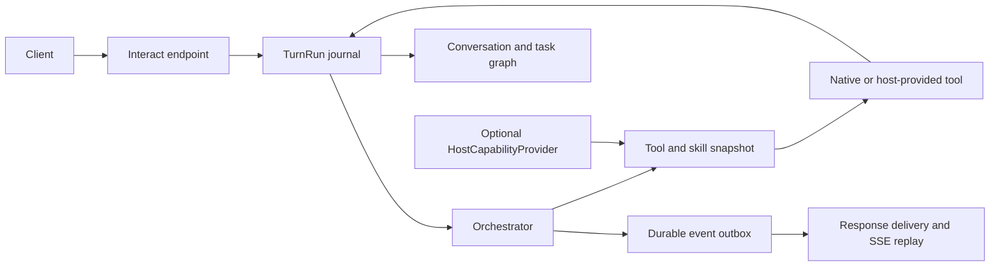

# jvagent harness excellence plan

**Prepared:** 2026-09-17
**Status:** accepted as GSD milestone v2.0 — Phases 1–5 implemented; see [`.planning/ROADMAP.md`](../.planning/ROADMAP.md)
**Audience:** jvagent maintainers and host-integration authors
**Execution model:** bounded coding-agent work packages with contract-first handoffs; one PLAN.md per HP under `.planning/phases/`

## 1. Aim

jvagent should be the dependable, graph-native harness for applications that need many agents, many users, and many simultaneous sessions without sacrificing model agency or Claude-skill compatibility.

The goal is not feature-count parity with other agent products. The goal is a stronger harness contract:

- Every turn has an isolated, durable identity.
- Every user-visible event has an ordered, replayable delivery record.
- Every side effect has an idempotency and recovery story.
- Every skill and tool is attributable, capability-limited, and safe to materialize for one caller.
- Every host can dock a dynamic tool and skill surface without jvagent learning the host's domain model.
- Every production claim is supported by fault, concurrency, and recovery evidence.

The model remains the pilot; tools remain controls; skills remain the flight plan. This roadmap makes the airframe reliable under failure and scale.

## 2. Non-negotiable architectural boundaries

### 2.1 Native multitenancy remains native

jvagent's persistent identity is already sufficient for host-neutral multitenancy:

```text
Agent → Memory → User(user_id) → Conversation(session_id) → Interaction
```

The canonical isolation key is therefore:

```text
(agent_id, user_id, session_id)
```

No `workspace_id`, organization model, App model, or other host product concept enters jvagent core. A host that has multiple logical scopes maps them to separate session ids and retains its scope map itself. jvagent passes its native identity to an optional host provider; the provider resolves host-specific authority outside the harness.

### 2.2 Thin harness stays thin

This plan does not add semantic routing, intent classification, domain extraction, or business workflows to the Orchestrator. Reliability mechanics belong in the harness; judgment belongs in skills and the model.

### 2.3 jvspatial remains the runtime state substrate

Durable run state, session state, tasks, delivery state, and graph-native memory use jvspatial primitives. A durable event transport, cache invalidation layer, or execution backend may be introduced behind protocols, but must not fork a second, competing business-state model.

### 2.4 Hosts extend through a narrow provider protocol

An embedded application can supply dynamic tools, skills, and grounding through a generic `HostCapabilityProvider`. jvagent sees only agent/user/session identity plus an opaque snapshot version; it never imports a host's services, graph models, or authorization code.

## 3. Current strengths to preserve

| Capability | Existing foundation | Preserve by |
| --- | --- | --- |
| Multi-user state | User uniqueness within an agent Memory graph; session-keyed Conversations | Keeping `agent_id + user_id + session_id` authoritative |
| Graph-native execution | Actions, tasks, conversations, and interactions are jvspatial graph participants | Adding structural nodes and edges, not parallel tables without lifecycle semantics |
| Model-led orchestration | Bounded think-act-observe loop; routing through tool choice | Keeping reliability mechanisms independent of semantic decisions |
| Skills | Native JV SOPs and drop-in Claude skill bundles | Maintaining `SKILL.md` as the authoring source and progressive disclosure |
| Tools | Native JSON-schema tool protocol, access checks, and dynamic surface | Adding per-invocation authority and result envelopes rather than bypass paths |
| Resilience | Model fallback, circuit breaking, budgets, response egress gate | Making state shared and recoverable across workers |
| Channels | ResponseBus and channel adapters | Replacing process-local delivery assumptions with durable delivery semantics |

## 4. Gaps to close

| Gap | Why it matters | Required result |
| --- | --- | --- |
| Process-local delivery and caches | A response or tool/skill surface can be absent or stale on another worker | Ordered, durable events and scope-safe snapshot caches |
| Soft plan resumption | A checklist survives, but in-memory observations and side-effect certainty do not | Checkpointed turn run with idempotent tool execution |
| Cross-worker identity races | Local locks do not prove active-active correctness | Store-backed identity upsert and renewable leases |
| Host integration via bespoke adapters | Each host risks coupling and cache leakage | One generic host capability protocol |
| Skill execution trust | Per-user sandboxing is useful but default subprocess isolation is not a hard security boundary | Signed manifests, capability limits, and selectable isolation backends |
| Observability | Logs explain parts of a run but do not reconstruct a reliable execution history | Correlated run/event/tool/delivery trace and replay tooling |
| Reliability evidence | Happy-path tests do not prove recovery or concurrency | Fault injection, crash recovery, multi-worker, and load suites |

## 5. Target runtime model



### 5.1 TurnRun

Introduce a graph-backed `TurnRun` record associated with one Interaction. It is execution metadata, not a second conversation model.

```text
accepted → running → waiting_tool → waiting_approval → running
         → completed | failed | cancelled | recovery_required
```

Each transition carries a monotonic sequence number, timestamp, reason, snapshot version, and correlation id. The journal stores safe checkpoints and references to larger observations; it does not persist unrestricted model chain-of-thought.

### 5.2 Tool execution record

Every mutating tool call receives a stable `invocation_id` before dispatch. The runtime persists:

- normalized tool name and validated input digest;
- idempotency key and dispatch attempt;
- authority/snapshot version used;
- outcome, error classification, and output reference;
- causal links to TurnRun, Interaction, and delivery events.

Tool authors remain responsible for domain-level exactly-once semantics, but the harness provides the durable invocation identity they need to implement it.

### 5.3 Event and delivery record

All streaming frames and final responses are appended to a durable per-session event stream before fan-out. Clients reconnect using a cursor. Delivery is at-least-once; message ids and event sequence make client and adapter deduplication deterministic. The single-egress invariant remains enforced at the response boundary.

### 5.4 Tool and skill snapshot

At turn admission, the Orchestrator receives one immutable `ToolSurfaceSnapshot`:

```text
snapshot_id
agent_id, user_id, session_id
native tool and skill descriptors
optional host-provided descriptors
trust/capability policy
created_at and expiry
```

Every cache key includes `snapshot_id`; no process-global cache may serve a tool or skill document outside its snapshot. A later turn may receive a newer snapshot. In-flight turns continue against the snapshot admitted at their start unless a host explicitly revokes it.

### 5.5 Generic host capability provider

The optional protocol is intentionally host-neutral:

```text
resolve_snapshot(agent_id, user_id, session_id) -> ToolSurfaceSnapshot
invoke(snapshot_id, invocation_id, tool_name, payload) -> ToolResult
load_skill(snapshot_id, skill_key) -> SkillMaterialization
invalidate(snapshot_selector) -> acknowledgement
```

The provider resolves all host-specific scope and authorization privately. jvagent only enforces snapshot lifetime, tool schema, invocation identity, and its own action-level access gates.

## 6. Execution packages

### Wave 0 — contracts and baseline evidence

#### HP-00: Harness contract ADRs and conformance suite

**Ownership:** architecture/runtime
**Files:** new ADRs, `SPEC.md`, `docs/ORCHESTRATOR.md`, `tests/conformance/`

- Define `TurnRun`, tool invocation, event, snapshot, and provider contracts.
- Specify delivery, cancellation, retry, idempotency, and recovery semantics.
- Publish the non-leakage rule: caches, tools, skills, and events are keyed by native identity plus snapshot.
- Establish a conformance suite runnable by native, embedded, and remote integrations.

**Acceptance:** contract fixtures define both valid and rejected transitions; no host-domain field appears in public jvagent models or APIs.

#### HP-01: Baseline reliability audit

**Ownership:** test/observability
**Depends on:** HP-00

- Inventory all process-local state: ResponseBus, tool catalogues, skill catalogues, circuit breakers, locks, and background work.
- Record current failure behavior for restart, duplicate delivery, concurrent session turns, model error, and interrupted tool calls.
- Add benchmark fixtures for short chat, tool-rich chat, streaming, long session, and many-user concurrency.

**Acceptance:** each process-local component has an owner, scope, replacement decision, and regression test target.

### Wave 1 — identity, snapshots, and safe caching

#### HP-02: Native identity and session admission

**Ownership:** memory/interact
**Depends on:** HP-00

- Formalize `(agent_id, user_id, session_id)` as the native admission identity.
- Add store-backed upsert-by-identity for User and Conversation where supported.
- Make concurrent session admission and turn ownership explicit, including cancellation and lease expiry.
- Add stable correlation ids from endpoint through background work and response delivery.

**Acceptance:** concurrent creates across workers produce one User and one Conversation; simultaneous turns on distinct sessions remain isolated; same-session policy is explicit and tested.

#### HP-03: ToolSurfaceSnapshot and cache discipline

**Ownership:** orchestrator/tools/skills
**Depends on:** HP-00, HP-02

- Replace scope-blind merged tool and skill caches with immutable snapshots.
- Key caches by snapshot id and invalidate by generation rather than clearing process globals per turn.
- Attach snapshot identity to model calls, tool calls, events, and traces.
- Preserve lean discovery (`find_tool`, `load_tool`, `find_skill`, `use_skill`) using snapshot-scoped catalogues.

**Acceptance:** two concurrent users and sessions receive only their own snapshots; dynamic tool/skill changes affect a new snapshot without contaminating any other caller.

### Wave 2 — durable turns and exactly-once-aware execution

#### HP-04: TurnRun journal and resumable execution

**Ownership:** orchestrator/memory
**Depends on:** HP-02

- Persist lifecycle transitions at tool and safe loop boundaries.
- Save plan state, current phase, admitted snapshot id, and safe observation references.
- Resume a recoverable run after process loss without rerunning completed tool invocations.
- Add explicit `recovery_required` for unsafe interruption rather than silently replaying work.

**Acceptance:** a crash after tool dispatch is diagnosable and recoverable; completed read tools are not repeated unnecessarily; unsafe writes require an explicit, visible recovery decision.

#### HP-05: Invocation ledger and idempotency adapters

**Ownership:** tool execution/actions
**Depends on:** HP-04

- Allocate `invocation_id` before every dispatch.
- Require mutating native tools to declare idempotency behavior.
- Add wrappers for idempotent, compensatable, and non-retryable actions.
- Preserve native tool calling, parallel sibling-tool dispatch, and action access checks.

**Acceptance:** retries reuse the invocation identity; a duplicate dispatch cannot duplicate a supported mutating effect; non-retryable tools produce a typed recovery state.

#### HP-06: Durable event outbox and resumable streaming

**Ownership:** response/channels
**Depends on:** HP-04

- Append outbound frames to a durable session stream before adapter delivery.
- Add event cursors and replay for SSE and channel adapters.
- Replace process-local proactive delivery assumptions with an outbox worker or catch-up protocol.
- Retain the response-bus egress gate as the sole final-text authority.

**Acceptance:** reconnecting clients replay missed frames in order without duplicate rendered messages; a reply created on one worker can be delivered by another.

### Wave 3 — distributed runtime and secure extensibility

#### HP-07: Active-active coordination

**Ownership:** runtime/operations
**Depends on:** HP-02, HP-04, HP-06

- Provide durable lease, lock, and ownership protocols for supported stores.
- Move circuit-breaker and admission state behind optional shared backends.
- Define graceful worker drain: stop admissions, transfer or mark active runs, continue delivery replay.
- Document the single-process fallback and its guarantees separately.

**Acceptance:** a two-worker test handles concurrent users, session contention, worker loss, and proactive delivery without lost or cross-delivered events.

#### HP-08: HostCapabilityProvider reference implementation

**Ownership:** integrations/SDK
**Depends on:** HP-03, HP-05

- Add the generic provider protocol and a local reference provider.
- Materialize host tools and skills through snapshots, never direct imports into the Orchestrator.
- Bind authority server-side and make it unavailable to model-generated payloads.
- Provide embedded and remote transport adapters with identical contract tests.

**Acceptance:** a sample host supplies per-session dynamic tools and skills; revocation takes effect at the next snapshot; jvagent remains unaware of the host's data model.

#### HP-09: Skill package and execution hardening

**Ownership:** skills/code execution/security
**Depends on:** HP-03, HP-05

- Define a signed skill manifest: source, digest, declared tools, requested execution capabilities, and trust tier.
- Keep JV and Claude skills as the two supported `SKILL.md` forms.
- Add selectable isolation backends for script-bearing Claude skills; document subprocess limits as development-only containment.
- Stage skills per native caller identity and snapshot, with deterministic cleanup and audit.

**Acceptance:** skill activation is reproducible from its digest; a revoked or changed skill cannot run under a stale snapshot; untrusted script skills are refused without an approved isolation backend.

### Wave 4 — operational excellence and release proof

#### HP-10: Trace, replay, and evaluation plane

**Ownership:** observability/evals
**Depends on:** HP-04, HP-05, HP-06

- Emit correlated traces for admission, model tick, tool invocation, event append, delivery, retry, and recovery.
- Build a redacted replay format that can reproduce a run against test models and tool doubles.
- Add conversation use-case evaluations for tool selection, skill activation, safety, recovery, and response uniqueness.
- Measure latency, token/cost, tool success, duplicate delivery, recovery time, and snapshot cache behavior.

**Acceptance:** an operator can explain any completed or failed turn from one correlation id without accessing another user's data.

#### HP-11: Performance and capacity work

**Ownership:** runtime/performance
**Depends on:** HP-03, HP-06, HP-07

- Benchmark snapshot creation, graph session load, streaming fan-out, long-session pruning, and parallel tool execution.
- Add indexes and pagination for journal/event queries on supported jvspatial stores.
- Set budgets for tool-catalogue size, event retention, observation size, and per-session backlog.
- Publish deployment profiles for local, single-worker, and active-active modes.

**Acceptance:** performance targets are measured under representative many-user/many-session load; no optimization weakens ordering, identity isolation, or egress guarantees.

#### HP-12: Release and compatibility evidence

**Ownership:** release/docs
**Depends on:** all prior packages

- Version all public contracts and publish migration guidance.
- Run full unit, integration, conformance, two-worker, crash-recovery, skill-isolation, and load lanes against release artifacts.
- Produce a deployment matrix showing guarantees by storage backend and execution mode.
- Mark unsupported combinations explicitly instead of relying on process-local behavior.

**Acceptance:** a release record identifies artifact digest, contract versions, supported topology, evidence, limitations, and rollback path.

## 7. Dependency map

```text
HP-00 ── HP-01
  │
  ├── HP-02 ── HP-04 ──┬── HP-05 ──┬── HP-08
  │                    │           └── HP-09   (HP-08 ∥ HP-09; both need HP-03 + HP-05)
  │                    ├── HP-06 ── HP-07
  │                    └── HP-10
  └── HP-03 ───────────┘

HP-03 + HP-06 + HP-07 ── HP-11 ── HP-12
```

## 8. Conformance criteria

| ID | Result |
| --- | --- |
| HC-01 | Native identity isolates concurrent users, agents, and sessions without host-specific fields in jvagent core |
| HC-02 | A tool/skill snapshot cannot leak across sessions or be reused after expiry/revocation |
| HC-03 | A crash before, during, and after tool dispatch has an explicit recovery result and never silently duplicates a supported side effect |
| HC-04 | SSE and channel delivery replay events in order using cursors and render each final response once |
| HC-05 | Two workers can serve different sessions concurrently and coordinate same-session ownership correctly |
| HC-06 | Worker loss preserves queued delivery and either resumes or safely marks active runs for recovery |
| HC-07 | JV and Claude skill bundles materialize from verified manifests into isolated caller slices |
| HC-08 | Native, embedded-host, and remote-host tool providers pass the same invocation and revocation contract suite |
| HC-09 | Model outage, retry, fallback, budget exhaustion, cancellation, and tool timeout leave an inspectable terminal run state |
| HC-10 | Trace/replay can reconstruct one run with redaction and prove no other user's content enters its evidence |
| HC-11 | Load tests preserve p95 targets and event ordering under many users and sessions |
| HC-12 | All guarantees are tied to an exact release artifact and documented deployment profile |

## 9. What this plan deliberately does not do

- Add host concepts such as workspaces, organizations, Apps, or domain schemas to jvagent.
- Turn the Orchestrator into a semantic router, workflow designer, or business-rule engine.
- Replace jvspatial or create a separate memory database that competes with graph state.
- Promise exactly-once execution for third-party side effects that do not expose an idempotency mechanism.
- Treat a subprocess resource limiter as a sandbox for untrusted code.
- Require every deployment to run active-active infrastructure; single-process mode remains supported with explicitly narrower guarantees.

## 10. Immediate next actions

1. Accept HP-00's neutral identity and snapshot contract before any implementation begins.
2. Run HP-01 as a short audit and attach a concrete list of all process-local state.
3. Start HP-02, HP-03, and HP-04 in parallel after the contract fixtures freeze.
4. Use the existing jvagent application example as the reference harness fixture; use a small independent host fixture for HP-08 rather than embedding another product's concepts in tests.
5. Do not claim active-active or crash-safe execution until HP-06 and HP-07 evidence exists.

## 11. Decisions to revisit after the foundation lands

- Which durable transport is supported first for event outbox and distributed coordination.
- Whether checkpoint and event retention have separate storage policies per supported backend.
- Whether background work uses the same TurnRun executor or a closely related durable worker contract.
- Whether external skills receive a publisher registry and revocation service after signed manifests and isolation backends are proven.
