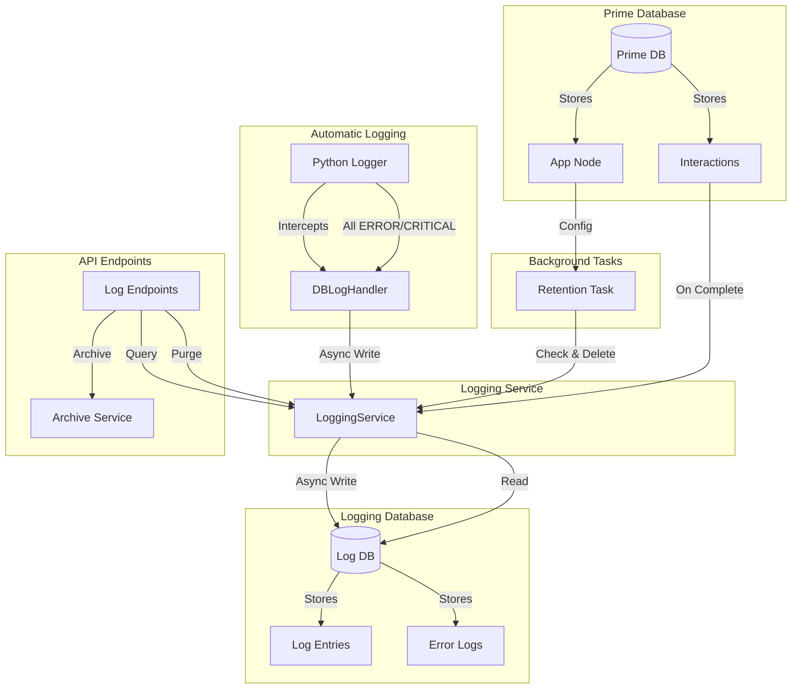

# Logging System

The jvagent logging system provides comprehensive logging with a separate database connection, enabling you to maintain complete audit trails of all interactions and errors without impacting the performance of the main application database.

## Overview

The logging system:

- **Maintains a separate database connection** - Logs are stored in a parallel database, keeping the main database focused on application data
- **Stores complete interaction entries** - Each log entry contains the full exported structure of the interaction
- **Mapped by application ID** - All logs are organized by the application node ID
- **Provides REST endpoints** - Query, archive, and purge logs via API
- **Configurable retention** - Automatic cleanup of old logs based on configurable retention windows
- **Non-blocking** - Logging happens asynchronously after interactions complete
- **Automatic error logging** - All ERROR/CRITICAL level logs are automatically persisted to the database via `DBLogHandler`

## Architecture



## Configuration

### Environment Variables

The logging system uses **jvspatial** environment variables (`JVSPATIAL_DB_LOGGING_*`, `JVSPATIAL_LOG_DB_*`); jvagent reads the same names when wiring `initialize_logging_database`.

- `JVSPATIAL_DB_LOGGING_ENABLED` - Global enable/disable for DB log handler setup (defaults to `true` via app.yaml / jvspatial)
- `JVSPATIAL_DB_LOGGING_LEVELS` - Comma-separated levels for jvspatial log config (jvagent also passes explicit levels including INTERACTION)
- `JVSPATIAL_LOG_DB_TYPE` - Database type (defaults to same as `JVSPATIAL_DB_TYPE`)
- `JVSPATIAL_LOG_DB_PATH` - Path for JSON/SQLite (defaults to `./jvagent_logs`)
- `JVSPATIAL_LOG_DB_URI` - MongoDB URI (if different from prime database)
- `JVSPATIAL_LOG_DB_NAME` - MongoDB database name (defaults to `jvagent_logs`)
- `JVSPATIAL_LOG_RETENTION_DEFAULT_DAYS` - Default retention period in days when unset in app.yaml (optional; `0` = indefinite); same variable read by jvspatial live env helpers

**Note:** Use `JVSPATIAL_DB_LOGGING_LEVELS` (comma-separated set of levels to persist), not any `JVAGENT_DB_LOGGING_*` or `JVAGENT_LOG_DB_*` name. There is no `JVAGENT_LOG_DB_LEVEL` in code paths.

### app.yaml Configuration

#### Context Section (Per-App Settings)

Add logging configuration to the `context` section of your `app.yaml`:

```yaml
context:
  name: My Application
  description: My jvagent application
  logging_enabled: true  # Enable/disable logging for this app
  log_retention_days: 60  # Retention window in days (default: 60)
  timezone: America/New_York  # Optional IANA timezone for app-level datetime (used by App.now())
```

#### Config Section (Application Defaults)

Add logging defaults to the `config` section:

```yaml
config:
  # ... existing config ...

  # Logging configuration (defaults - production will override)
  logging:
    enabled: true  # Global enable/disable flag
    database:
      type: json  # Same as prime DB type (defaults to same as prime)
      path: ./jvagent_logs  # For JSON/SQLite (defaults to ./jvagent_logs)
      # For MongoDB:
      # uri: mongodb://localhost:27017
      # db_name: jvagent_logs
    retention:
      default_days: 60  # Default retention period (can be overridden per app)
    archive:
      default_format: json  # json, csv
      default_storage: local  # local, s3
      default_path: ./logs_archive  # For local storage
```

### Configuration Precedence

Configuration is applied in the following order (highest to lowest priority):

1. **Environment variables** (highest priority)
2. **app.yaml `config.logging` section** (application defaults)
3. **app.yaml `context` section** (per-app overrides)
4. **Code defaults** (lowest priority)

## API Endpoints

### Get Logs

**GET** `/logs/applications/{app_id}/logs`

Query logs with filtering and pagination.

**Query Parameters:**
- `user_id` (optional) - Filter by user ID
- `conversation_id` (optional) - Filter by conversation ID
- `session_id` (optional) - Filter by session ID
- `start_time` (optional) - Start time filter (ISO datetime string)
- `end_time` (optional) - End time filter (ISO datetime string)
- `page` (default: 1) - Page number
- `page_size` (default: 50) - Items per page

**Response:**
```json
{
  "conversations": [
    {
      "conversation_id": "conv_123",
      "interactions": [
        {
          "log_id": "log_abc",
          "interaction_id": "int_xyz",
          "logged_at": "2024-01-01T12:00:00Z",
          "interaction_data": { /* complete interaction export */ }
        }
      ]
    }
  ],
  "pagination": {
    "page": 1,
    "page_size": 50,
    "total": 10,
    "total_pages": 1
  }
}
```

**Example:**
```bash
curl -X GET "http://localhost:8000/logs/applications/n.App.app/logs?user_id=usr_123&page=1&page_size=20" \
  -H "Authorization: Bearer {token}"
```

### Archive Logs

**POST** `/logs/applications/{app_id}/archive`

Export logs to file and delete from database.

**Request Body:**
```json
{
  "start_time": "2024-01-01T00:00:00Z",
  "end_time": "2024-01-31T23:59:59Z",
  "user_id": "usr_123",
  "conversation_id": "conv_456",
  "export_format": "json",
  "storage_location": "./logs_archive/my_archive.json"
}
```

**Response:**
```json
{
  "archived": true,
  "record_count": 150,
  "file_path": "/absolute/path/to/archive.json",
  "export_format": "json",
  "timestamp": "2024-02-01T10:00:00Z",
  "filters": {
    "app_id": "n.App.app",
    "user_id": "usr_123",
    "conversation_id": "conv_456",
    "start_time": "2024-01-01T00:00:00Z",
    "end_time": "2024-01-31T23:59:59Z"
  },
  "deleted_count": 150
}
```

### Purge Logs

**POST** `/logs/applications/{app_id}/purge`

Delete logs matching criteria.

**Request Body:**
```json
{
  "start_time": "2024-01-01T00:00:00Z",
  "end_time": "2024-01-31T23:59:59Z",
  "user_id": "usr_123",
  "conversation_id": "conv_456",
  "confirm": true
}
```

**Response:**
```json
{
  "deleted": 150
}
```

**Note:** The `confirm` parameter must be `true` to proceed with the purge operation.

### Get Retention Configuration

**GET** `/logs/applications/{app_id}/retention`

Get current retention configuration.

**Response:**
```json
{
  "retention_days": 60
}
```

### Set Retention Configuration

**PUT** `/logs/applications/{app_id}/retention`

Set retention window for an application.

**Request Body:**
```json
{
  "retention_days": 90
}
```

**Response:**
```json
{
  "retention_days": 90,
  "message": "Retention configuration updated successfully"
}
```

## Usage Examples

### Enabling/Disabling Logging

**Disable logging globally:**
```bash
export JVSPATIAL_DB_LOGGING_ENABLED=false
```

**Disable logging for a specific app (in app.yaml):**
```yaml
context:
  logging_enabled: false
```

### Querying Logs

**Get all logs for a user:**
```bash
curl -X GET "http://localhost:8000/logs/applications/{app_id}/logs?user_id=usr_123" \
  -H "Authorization: Bearer {token}"
```

**Get logs for a time range:**
```bash
curl -X GET "http://localhost:8000/logs/applications/{app_id}/logs?start_time=2024-01-01T00:00:00Z&end_time=2024-01-31T23:59:59Z" \
  -H "Authorization: Bearer {token}"
```

**Get logs for a specific conversation:**
```bash
curl -X GET "http://localhost:8000/logs/applications/{app_id}/logs?conversation_id=conv_456" \
  -H "Authorization: Bearer {token}"
```

### Archiving Logs

**Archive all logs for a time period:**
```bash
curl -X POST "http://localhost:8000/logs/applications/{app_id}/archive" \
  -H "Authorization: Bearer {token}" \
  -H "Content-Type: application/json" \
  -d '{
    "start_time": "2024-01-01T00:00:00Z",
    "end_time": "2024-01-31T23:59:59Z",
    "export_format": "json"
  }'
```

**Archive to specific location:**
```bash
curl -X POST "http://localhost:8000/logs/applications/{app_id}/archive" \
  -H "Authorization: Bearer {token}" \
  -H "Content-Type: application/json" \
  -d '{
    "start_time": "2024-01-01T00:00:00Z",
    "end_time": "2024-01-31T23:59:59Z",
    "export_format": "csv",
    "storage_location": "./my_archive.csv"
  }'
```

### Setting Retention Policies

**Set retention to 90 days:**
```bash
curl -X PUT "http://localhost:8000/logs/applications/{app_id}/retention" \
  -H "Authorization: Bearer {token}" \
  -H "Content-Type: application/json" \
  -d '{
    "retention_days": 90
  }'
```

## Best Practices

### When to Enable/Disable Logging

- **Enable logging** for production environments where audit trails are required
- **Disable logging** for development/testing to reduce overhead
- **Use per-app settings** to selectively enable logging for specific applications

### Retention Policy Recommendations

- **Short retention (30 days)**: For high-volume applications with limited storage
- **Medium retention (60 days)**: Default, balances storage and compliance needs
- **Long retention (90+ days)**: For compliance-sensitive applications

### Archive Strategies

- **Regular archiving**: Archive logs monthly or quarterly before retention cleanup
- **Compliance archiving**: Archive logs before purging to maintain compliance records
- **Selective archiving**: Archive specific user or conversation logs for investigation

### Performance Considerations

- **Separate database**: Logging uses a separate database connection, so it doesn't impact main database performance
- **Async logging**: Logging happens asynchronously after interactions complete, so it doesn't block responses
- **Indexed queries**: Logs are indexed by app_id, user_id, conversation_id, and logged_at for efficient querying

## Troubleshooting

### Logging Not Working

**Check if logging is enabled:**
1. Verify `JVSPATIAL_DB_LOGGING_ENABLED` environment variable (should be `true`)
2. Check app-level `logging_enabled` setting in app.yaml
3. Check application logs for any initialization errors

**Check database connection:**
1. Verify logging database is registered: Check server startup logs
2. Verify database path/permissions for JSON/SQLite
3. Verify MongoDB connection string if using MongoDB

### Database Connection Issues

**For JSON/SQLite:**
- Ensure the directory exists and is writable
- Check disk space availability
- Verify path configuration in environment variables or app.yaml

**For MongoDB:**
- Verify MongoDB is running
- Check connection string format
- Verify network connectivity
- Check authentication credentials

### Retention Not Applying

**Check retention configuration:**
1. Verify `log_retention_days` is set on the App node
2. Check if retention task is running (if implemented as background task)
3. Manually trigger retention via API if needed

**Check logs:**
- Review application logs for retention task errors
- Verify retention task has proper permissions to delete logs

## Data Flow

### Interaction Completion Flow

```
Interaction completes → Async task created → LoggingService.log_interaction()
→ Get app_id from agent → Export interaction → Write to log DB
```

### Query Flow

```
GET /logs/applications/{app_id}/logs → LoggingService.get_logs()
→ Query log DB with filters → Group by conversation → Sort & paginate → Return
```

### Archive Flow

```
POST /logs/applications/{app_id}/archive → ArchiveService.archive()
→ Query matching logs → Export to file/S3 → Delete from DB → Return metadata
```

### Retention Flow

```
Background task → For each app → Get retention_days → Query old logs
→ Delete expired logs → Log statistics
```

## Log Entry Structure

Each log entry contains:

- `app_id`: Application node ID
- `interaction_id`: Original interaction ID
- `conversation_id`: Parent conversation ID
- `session_id`: Session identifier
- `user_id`: User ID
- `logged_at`: Timestamp when logged
- `interaction_data`: Complete interaction export structure (includes all interaction fields, actions, directives, parameters, events, observability metrics, usage, etc.)

The `interaction_data` field contains the complete exported structure from the interaction, including all metadata, making it suitable for full audit trails and debugging.

## Automatic Database Logging

The jvagent logging system uses jvspatial's `DBLogHandler`, a custom Python logging handler that automatically intercepts all log records and persists them to the database. This eliminates the need for explicit database logging calls throughout the codebase.

### How It Works

`DBLogHandler` is automatically installed when the logging database is initialized (if logging is enabled). It:

1. **Intercepts all log records** from the Python logging system
2. **Filters by log level** using the level set from `JVSPATIAL_DB_LOGGING_LEVELS` / `config.logging.levels` (comma-separated names). jvagent adds the custom `INTERACTION` level when initializing the handler.
3. **Extracts context automatically** from:
   - Log record `details` parameter (explicit context)
   - Call stack inspection (finds Action/InteractWalker instances)
   - Context variables (`current_interaction_id`, `current_action_name`)
   - Log record metadata (module, function, line number)
4. **Logs asynchronously** to avoid blocking the main application flow
5. **Fails silently** - never raises exceptions to avoid breaking application execution

### Log level configuration

Which levels are persisted is controlled by **`JVSPATIAL_DB_LOGGING_LEVELS`** (or `config.logging.levels` in `app.yaml`): a comma-separated list such as `ERROR,CRITICAL` or `INTERACTION,ERROR,CRITICAL`. Only levels in that set (plus any custom levels you register and include) are stored; there is no separate minimum-threshold env var.

### Providing Explicit Context

While `DBLogHandler` automatically infers context from the call stack and context variables, you can provide explicit context using the `details` parameter in logging calls:

```python
import logging

logger = logging.getLogger(__name__)

# Log with explicit context
logger.error(
    "Something went wrong",
    exc_info=True,
    details={
        "agent_id": agent.id,
        "interaction_id": interaction.id,
        "session_id": session_id,
        "user_id": user_id,
        "action_class": "MyAction",
        "action_id": action.id,
        "action_label": action.label,
        "context": "on_enable",
        "error_code": "custom_error_code",
        "status_code": 500,
    }
)
```

The `details` parameter takes precedence over automatically inferred context, allowing you to override or supplement the inferred values.

### Context Inference Priority

Context is extracted in the following priority order:

1. **`record.details` dict** - Explicit context provided via `details` parameter
2. **Call stack inspection** - Finds Action and InteractWalker instances in the call stack
3. **Context variables** - `current_interaction_id`, `current_action_name`
4. **Log record metadata** - Module, function, line number

### Automatic Context Fields

The handler automatically extracts the following fields when available:

- `agent_id`: From Action.agent_id or InteractWalker.agent_id
- `interaction_id`: From context variable, InteractWalker.interaction.id, or details
- `session_id`: From InteractWalker.session_id or details
- `user_id`: From InteractWalker.user_id or details
- `action_class`: From Action instance in stack or details
- `action_id`: From Action.id in stack or details
- `action_label`: From Action.label in stack or details
- `context`: From function name (on_enable, execute, etc.) or details
- `error_code`: From details or default based on log level
- `status_code`: From details or default based on log level (500 for ERROR/CRITICAL, 200 for others)
- `log_level`: The actual log level (ERROR, WARNING, INFO, DEBUG, CRITICAL)

### Disabling Automatic Logging

Automatic database logging respects the existing logging configuration:

- **Global disable**: Set `JVSPATIAL_DB_LOGGING_ENABLED=false` to prevent handler installation
- **App-level disable**: Set `app.logging_enabled=false` to skip database logging for specific apps (handler still installed but skips logging)
- **Graceful degradation**: When disabled, logs still go to console/file handlers, only database logging is skipped

## Related Documentation

- [Interaction Logging](interaction-logging.md) - INTERACTION log level and interaction logging
- [Error Logging](error-logging.md) - Error logging and querying
- For jvspatial logging service and custom log levels, see the jvspatial documentation.

## Error Logging

The logging system also captures API errors for debugging and traceability. Error logs are stored in the same logging database as interaction logs, following the same patterns and retention policies.

**Note**: With `DBLogHandler` installed, all ERROR and CRITICAL level logs are automatically persisted to the database. The explicit error logging described below is primarily for API-level errors, while application-level errors are handled automatically by `DBLogHandler`.

### Error Log Structure

Each error log entry contains:

- `app_id`: Application node ID (indexed)
- `agent_id`: Agent node ID (indexed, if available)
- `user_id`: User ID (indexed, if available)
- `session_id`: Session identifier (if available)
- `interaction_id`: Interaction ID (if error occurred during interaction)
- `status_code`: HTTP status code (indexed)
- `error_code`: Machine-readable error code (indexed)
- `path`: Request path (indexed)
- `method`: HTTP method
- `request_id`: Request identifier
- `logged_at`: Timestamp when the error was logged (indexed)
- `error_data`: Complete error payload structure

The `error_data` field contains the full error context:

```json
{
  "status_code": 401,
  "error_code": "unauthorized",
  "message": "Invalid email or password",
  "timestamp": "2025-12-26T23:55:37.527388",
  "path": "/auth/login",
  "method": "POST",
  "request_id": "req_123",
  "details": {...},
  "user_id": "usr_123",
  "session_id": "sess_456",
  "interaction_id": "int_789",
  "traceback": "..."  // For 5xx errors only
}
```

### Error Logging Flow

Errors are automatically captured by the API error handler:

```
Error occurs → APIErrorHandler.handle_exception() → Extract app_id/agent_id
→ Build error payload → LoggingService.log_error() → Write to log DB
```

The error handler extracts:
- `app_id` from `App.get()` singleton
- `agent_id` from request path (e.g., `/agents/{agent_id}/...`)
- `user_id`, `session_id`, `interaction_id` from request state if available

### Querying Error Logs

#### Get Error Logs by Agent

```http
GET /logs/agents/{agent_id}?start_time=2025-01-01T00:00:00Z&end_time=2025-01-31T23:59:59Z&filter={"context.log_data.user_id":"usr_456"}&page=1&page_size=50
```

**Query Parameters:**
- `start_time`: Optional start time filter (ISO datetime string)
- `end_time`: Optional end time filter (ISO datetime string)
- `filter`: Optional MongoDB-style filter JSON. All keys must use `context.` prefix. Use `context.log_data.agent_id`, `context.log_data.user_id`, etc.
- `page`: Page number (default: 1)
- `page_size`: Items per page (default: 50)

**Response:**
```json
{
  "errors": [
    {
      "log_id": "log_abc123",
      "status_code": 401,
      "error_code": "unauthorized",
      "message": "Invalid email or password",
      "path": "/auth/login",
      "method": "POST",
      "app_id": "app_xyz",
      "agent_id": "agent_123",
      "user_id": "usr_456",
      "session_id": "sess_789",
      "interaction_id": "",
      "request_id": "req_abc",
      "logged_at": "2025-12-26T23:55:37.527388",
      "error_data": {...}
    }
  ],
  "pagination": {
    "page": 1,
    "page_size": 50,
    "total": 1,
    "total_pages": 1
  }
}
```

#### Get Error Logs by Application

```http
GET /logs/applications/{app_id}/errors?status_code=500&page=1&page_size=50
```

**Query Parameters:**
- `error_code`: Optional error code filter
- `status_code`: Optional HTTP status code filter
- `agent_id`: Optional agent ID filter
- `user_id`: Optional user ID filter
- `start_time`: Optional start time filter (ISO datetime string)
- `end_time`: Optional end time filter (ISO datetime string)
- `page`: Page number (default: 1)
- `page_size`: Items per page (default: 50)

### Purging Error Logs

#### Purge Error Logs by Agent

```http
POST /logs/agents/{agent_id}/errors/purge?confirm=true&status_code=500&start_time=2025-01-01T00:00:00Z
```

**Query Parameters:**
- `confirm`: **Required** - Must be `true` to proceed (safety flag)
- `error_code`: Optional error code filter
- `status_code`: Optional HTTP status code filter
- `user_id`: Optional user ID filter
- `start_time`: Optional start time filter (ISO datetime string)
- `end_time`: Optional end time filter (ISO datetime string)

**Response:**
```json
{
  "deleted": 42
}
```

### Error Log Indexes

Error logs are indexed for efficient querying:

- `app_id + logged_at` - Query errors by app and time range
- `app_id + error_code + logged_at` - Query specific error types by app
- `agent_id + logged_at` - Query errors by agent and time range
- `status_code + logged_at` - Query errors by HTTP status code
- `app_id + user_id + logged_at` - Query errors by app and user

### Retention and Archiving

Error logs follow the same retention policy as interaction logs:

- Retention period is configured at the application level (`log_retention_days`)
- The retention task automatically purges expired error logs
- Error logs can be archived using `ArchiveService.archive_error_logs()`

**Example: Archive Error Logs**

```python
from jvagent.logging.archive import get_archive_service
from datetime import datetime, timedelta

archive_service = get_archive_service()
result = await archive_service.archive_error_logs(
    app_id="app_123",
    status_code=500,
    start_time=datetime.now() - timedelta(days=30),
    export_format="json"
)
```

### Error Log Use Cases

1. **Debugging Production Issues**: Query error logs by status code, error code, or path to identify patterns
2. **User Support**: Look up errors by user_id to understand what went wrong for a specific user
3. **Monitoring**: Track error rates by agent, app, or error type over time
4. **Compliance**: Archive error logs for audit trails and compliance requirements
5. **Performance Analysis**: Identify frequently failing endpoints or error patterns

### Best Practices

1. **Monitor Error Rates**: Regularly query error logs to identify trends and issues
2. **Archive Old Logs**: Archive error logs before purging to maintain historical records
3. **Filter by Severity**: Use `status_code` filters to focus on critical errors (5xx)
4. **Correlate with Interactions**: Use `interaction_id` to correlate errors with specific interactions
5. **Retention Configuration**: Set appropriate retention periods based on compliance and storage requirements

---

## Executive Observability

When an agent uses the **SkillExecutive** pattern (`jvagent/skill_executive` —
see [`EXECUTIVE.md`](EXECUTIVE.md)), each turn appends an `executive_activation`
event to `Interaction.observability_metrics` alongside the per-`model_call`
events. It is queryable through the standard `GET /logs/agents/{agent_id}`
endpoint plus direct reads of the interaction node.

### `executive_activation` event (observability_metrics)

The orchestrator records one event per turn summarizing how it ran: the
continuation mode, the tools it invoked (in order), ticks consumed, and how
the turn ended. This is the turn-level trace the individual `model_call`
events don't capture. (Supersedes the retired `center_activation` event — the
Executive + Centers pattern was replaced by the single orchestrator in
ADR-0012/0013.)

Event shape:

```json
{
  "event_type": "executive_activation",
  "data": {
    "continuation_mode": "model_mediated",
    "flow_owner": null,
    "lock_active_flow": true,
    "tools_invoked": ["web_search__search", "respond"],
    "tick_count": 2,
    "budget": 16,
    "ended_via": "respond",
    "skills_used": []
  },
  "timestamp": 1780087622.2
}
```

- `continuation_mode`: `none` (no active flow), `locked` (deterministic
  turn-lock — surface restricted to the active flow's IA tool), or
  `model_mediated` (active flow surfaced, model chose).
- `flow_owner`: class name of the active flow's IA, or `null`.
- `tools_invoked`: tools the loop dispatched this turn, in order.
- `tick_count`: think-act-observe iterations (model calls) in the loop;
  `0` for a locked turn (dispatched without a model round-trip).
- `ended_via`: `reply` | `respond` | `ia_tool` | `final` | `locked` |
  `budget` | `no_decision` | `unknown`.

### Querying examples

```bash
# Fetch interactions whose turn ran in deterministic turn-lock mode
curl "http://localhost:8000/logs/agents/<agent_id>?filter={\"context.log_data.interaction_data.observability_metrics.data.continuation_mode\":\"locked\"}" \
  -H "Authorization: Bearer $TOKEN"
```

Per-turn token attribution is summed across the turn in `Interaction.usage`
(every `model_call` this turn, regardless of which tool issued it).

