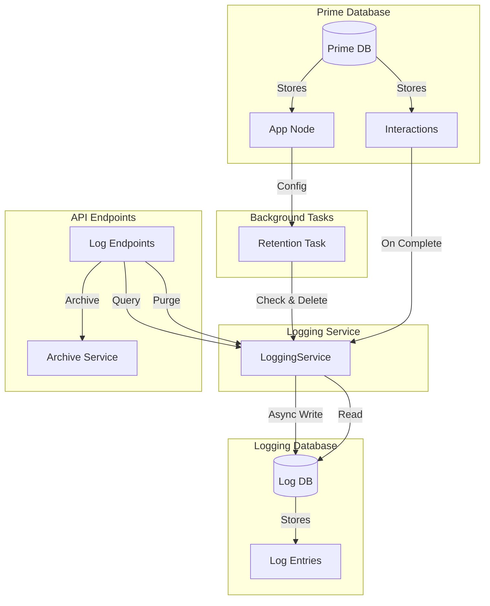

# Logging System

The jvagent logging system provides comprehensive interaction logging with a separate database connection, enabling you to maintain complete audit trails of all interactions without impacting the performance of the main application database.

## Overview

The logging system:

- **Maintains a separate database connection** - Logs are stored in a parallel database, keeping the main database focused on application data
- **Stores complete interaction entries** - Each log entry contains the full exported structure of the interaction
- **Mapped by application ID** - All logs are organized by the application node ID
- **Provides REST endpoints** - Query, archive, and purge logs via API
- **Configurable retention** - Automatic cleanup of old logs based on configurable retention windows
- **Non-blocking** - Logging happens asynchronously after interactions complete

## Architecture



## Configuration

### Environment Variables

The logging system can be configured via environment variables:

- `JVAGENT_LOGGING_ENABLED` - Global enable/disable flag (defaults to `true`)
- `JVAGENT_LOG_DB_TYPE` - Database type (defaults to same as `JVSPATIAL_DB_TYPE`)
- `JVAGENT_LOG_DB_PATH` - Path for JSON/SQLite (defaults to `./jvagent_logs`)
- `JVAGENT_LOG_DB_URI` - MongoDB URI (if different from prime database)
- `JVAGENT_LOG_DB_NAME` - MongoDB database name (defaults to `jvagent_logs`)
- `JVAGENT_LOG_RETENTION_DEFAULT_DAYS` - Default retention period in days (defaults to 60)

### app.yaml Configuration

#### Context Section (Per-App Settings)

Add logging configuration to the `context` section of your `app.yaml`:

```yaml
context:
  name: My Application
  description: My jvagent application
  logging_enabled: true  # Enable/disable logging for this app
  log_retention_days: 60  # Retention window in days (default: 60)
```

#### Config Section (Application Defaults)

Add logging defaults to the `config` section:

```yaml
config:
  # ... existing config ...
  
  # Logging configuration (defaults - production will override)
  logging:
    enabled: true  # Global enable/disable flag
    database:
      type: json  # Same as prime DB type (defaults to same as prime)
      path: ./jvagent_logs  # For JSON/SQLite (defaults to ./jvagent_logs)
      # For MongoDB:
      # uri: mongodb://localhost:27017
      # db_name: jvagent_logs
    retention:
      default_days: 60  # Default retention period (can be overridden per app)
    archive:
      default_format: json  # json, csv
      default_storage: local  # local, s3
      default_path: ./logs_archive  # For local storage
```

### Configuration Precedence

Configuration is applied in the following order (highest to lowest priority):

1. **Environment variables** (highest priority)
2. **app.yaml `config.logging` section** (application defaults)
3. **app.yaml `context` section** (per-app overrides)
4. **Code defaults** (lowest priority)

## API Endpoints

### Get Logs

**GET** `/logs/applications/{app_id}/logs`

Query logs with filtering and pagination.

**Query Parameters:**
- `user_id` (optional) - Filter by user ID
- `conversation_id` (optional) - Filter by conversation ID
- `session_id` (optional) - Filter by session ID
- `start_time` (optional) - Start time filter (ISO datetime string)
- `end_time` (optional) - End time filter (ISO datetime string)
- `page` (default: 1) - Page number
- `page_size` (default: 50) - Items per page

**Response:**
```json
{
  "conversations": [
    {
      "conversation_id": "conv_123",
      "interactions": [
        {
          "log_id": "log_abc",
          "interaction_id": "int_xyz",
          "logged_at": "2024-01-01T12:00:00Z",
          "interaction_data": { /* complete interaction export */ }
        }
      ]
    }
  ],
  "pagination": {
    "page": 1,
    "page_size": 50,
    "total": 10,
    "total_pages": 1
  }
}
```

**Example:**
```bash
curl -X GET "http://localhost:8000/logs/applications/n.App.app/logs?user_id=usr_123&page=1&page_size=20" \
  -H "Authorization: Bearer {token}"
```

### Archive Logs

**POST** `/logs/applications/{app_id}/archive`

Export logs to file and delete from database.

**Request Body:**
```json
{
  "start_time": "2024-01-01T00:00:00Z",
  "end_time": "2024-01-31T23:59:59Z",
  "user_id": "usr_123",
  "conversation_id": "conv_456",
  "export_format": "json",
  "storage_location": "./logs_archive/my_archive.json"
}
```

**Response:**
```json
{
  "archived": true,
  "record_count": 150,
  "file_path": "/absolute/path/to/archive.json",
  "export_format": "json",
  "timestamp": "2024-02-01T10:00:00Z",
  "filters": {
    "app_id": "n.App.app",
    "user_id": "usr_123",
    "conversation_id": "conv_456",
    "start_time": "2024-01-01T00:00:00Z",
    "end_time": "2024-01-31T23:59:59Z"
  },
  "deleted_count": 150
}
```

### Purge Logs

**POST** `/logs/applications/{app_id}/purge`

Delete logs matching criteria.

**Request Body:**
```json
{
  "start_time": "2024-01-01T00:00:00Z",
  "end_time": "2024-01-31T23:59:59Z",
  "user_id": "usr_123",
  "conversation_id": "conv_456",
  "confirm": true
}
```

**Response:**
```json
{
  "deleted": 150
}
```

**Note:** The `confirm` parameter must be `true` to proceed with the purge operation.

### Get Retention Configuration

**GET** `/logs/applications/{app_id}/retention`

Get current retention configuration.

**Response:**
```json
{
  "retention_days": 60
}
```

### Set Retention Configuration

**PUT** `/logs/applications/{app_id}/retention`

Set retention window for an application.

**Request Body:**
```json
{
  "retention_days": 90
}
```

**Response:**
```json
{
  "retention_days": 90,
  "message": "Retention configuration updated successfully"
}
```

## Usage Examples

### Enabling/Disabling Logging

**Disable logging globally:**
```bash
export JVAGENT_LOGGING_ENABLED=false
```

**Disable logging for a specific app (in app.yaml):**
```yaml
context:
  logging_enabled: false
```

### Querying Logs

**Get all logs for a user:**
```bash
curl -X GET "http://localhost:8000/logs/applications/{app_id}/logs?user_id=usr_123" \
  -H "Authorization: Bearer {token}"
```

**Get logs for a time range:**
```bash
curl -X GET "http://localhost:8000/logs/applications/{app_id}/logs?start_time=2024-01-01T00:00:00Z&end_time=2024-01-31T23:59:59Z" \
  -H "Authorization: Bearer {token}"
```

**Get logs for a specific conversation:**
```bash
curl -X GET "http://localhost:8000/logs/applications/{app_id}/logs?conversation_id=conv_456" \
  -H "Authorization: Bearer {token}"
```

### Archiving Logs

**Archive all logs for a time period:**
```bash
curl -X POST "http://localhost:8000/logs/applications/{app_id}/archive" \
  -H "Authorization: Bearer {token}" \
  -H "Content-Type: application/json" \
  -d '{
    "start_time": "2024-01-01T00:00:00Z",
    "end_time": "2024-01-31T23:59:59Z",
    "export_format": "json"
  }'
```

**Archive to specific location:**
```bash
curl -X POST "http://localhost:8000/logs/applications/{app_id}/archive" \
  -H "Authorization: Bearer {token}" \
  -H "Content-Type: application/json" \
  -d '{
    "start_time": "2024-01-01T00:00:00Z",
    "end_time": "2024-01-31T23:59:59Z",
    "export_format": "csv",
    "storage_location": "./my_archive.csv"
  }'
```

### Setting Retention Policies

**Set retention to 90 days:**
```bash
curl -X PUT "http://localhost:8000/logs/applications/{app_id}/retention" \
  -H "Authorization: Bearer {token}" \
  -H "Content-Type: application/json" \
  -d '{
    "retention_days": 90
  }'
```

## Best Practices

### When to Enable/Disable Logging

- **Enable logging** for production environments where audit trails are required
- **Disable logging** for development/testing to reduce overhead
- **Use per-app settings** to selectively enable logging for specific applications

### Retention Policy Recommendations

- **Short retention (30 days)**: For high-volume applications with limited storage
- **Medium retention (60 days)**: Default, balances storage and compliance needs
- **Long retention (90+ days)**: For compliance-sensitive applications

### Archive Strategies

- **Regular archiving**: Archive logs monthly or quarterly before retention cleanup
- **Compliance archiving**: Archive logs before purging to maintain compliance records
- **Selective archiving**: Archive specific user or conversation logs for investigation

### Performance Considerations

- **Separate database**: Logging uses a separate database connection, so it doesn't impact main database performance
- **Async logging**: Logging happens asynchronously after interactions complete, so it doesn't block responses
- **Indexed queries**: Logs are indexed by app_id, user_id, conversation_id, and logged_at for efficient querying

## Troubleshooting

### Logging Not Working

**Check if logging is enabled:**
1. Verify `JVAGENT_LOGGING_ENABLED` environment variable (should be `true`)
2. Check app-level `logging_enabled` setting in app.yaml
3. Check application logs for any initialization errors

**Check database connection:**
1. Verify logging database is registered: Check server startup logs
2. Verify database path/permissions for JSON/SQLite
3. Verify MongoDB connection string if using MongoDB

### Database Connection Issues

**For JSON/SQLite:**
- Ensure the directory exists and is writable
- Check disk space availability
- Verify path configuration in environment variables or app.yaml

**For MongoDB:**
- Verify MongoDB is running
- Check connection string format
- Verify network connectivity
- Check authentication credentials

### Retention Not Applying

**Check retention configuration:**
1. Verify `log_retention_days` is set on the App node
2. Check if retention task is running (if implemented as background task)
3. Manually trigger retention via API if needed

**Check logs:**
- Review application logs for retention task errors
- Verify retention task has proper permissions to delete logs

## Data Flow

### Interaction Completion Flow

```
Interaction completes → Async task created → LoggingService.log_interaction()
→ Get app_id from agent → Export interaction → Write to log DB
```

### Query Flow

```
GET /logs/applications/{app_id}/logs → LoggingService.get_logs()
→ Query log DB with filters → Group by conversation → Sort & paginate → Return
```

### Archive Flow

```
POST /logs/applications/{app_id}/archive → ArchiveService.archive()
→ Query matching logs → Export to file/S3 → Delete from DB → Return metadata
```

### Retention Flow

```
Background task → For each app → Get retention_days → Query old logs
→ Delete expired logs → Log statistics
```

## Log Entry Structure

Each log entry contains:

- `app_id`: Application node ID
- `interaction_id`: Original interaction ID
- `conversation_id`: Parent conversation ID
- `session_id`: Session identifier
- `user_id`: User ID
- `logged_at`: Timestamp when logged
- `interaction_data`: Complete interaction export structure (includes all interaction fields, actions, directives, parameters, events, observability metrics, etc.)

The `interaction_data` field contains the complete exported structure from the interaction, including all metadata, making it suitable for full audit trails and debugging.

