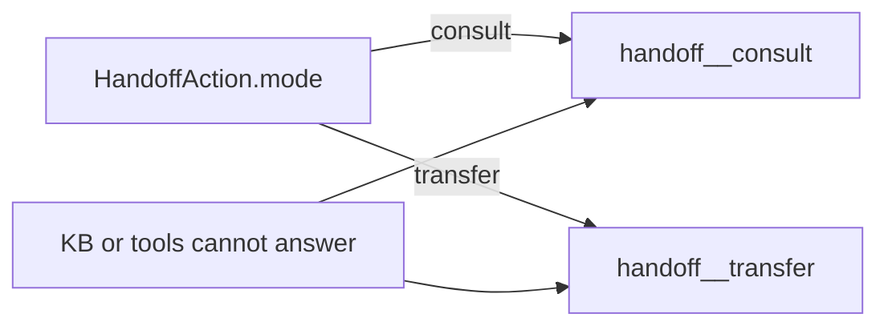

# Handoff Action (`jvagent/handoff_action`)

One mode at a time, selected by `HandoffAction.mode`. That mode is the only
tool set published. Pin those same tools on the orchestrator. Put allow and
deny rules only for that mode's tools. There is no handoff skill.

| Mode | Pin these tools | What it does |
|---|---|---|
| `consult` (default) | `handoff__consult`, `handoff__save_answer`, `handoff__update_chunk` | Ask staff, tell the user you will return, save the answer, and reply to the user. The current pending questions are injected into the staff-turn prompt as a parameter (id + question only) — no read tool. |
| `transfer` | `handoff__transfer` | Send staff a summary and tell the user a staff member will follow up; later messages run normally. |
| `observe` | `handoff__observe` | In a WhatsApp group, store a useful fact in PageIndex, add the other numbers to staff, and send nothing. |

## When FAQ / KB cannot answer

After a skill (for example `faq` or `product_search`) follows its search
protocol and still has no grounded answer, escalate using **the handoff tool
for the agent's configured mode**:

- **consult** → `handoff__consult` (customer's words in `message` sentence 1)
- **transfer** → `handoff__transfer` (short staff summary in `message`)

The orchestrator **auto routing** rule (below) uses the same trigger for
consult and transfer customers. Agent skills must **not** contradict that
(for example "do not hand off on empty FAQ" on a transfer agent). Prefer
**mode-neutral** skill wording ([Skill templates](#skill-templates)) so you
can switch modes in yaml only.



## Mode switch checklist

Change **all** of these when switching mode (pins and permissions do not
follow `mode` by themselves):

1. `HandoffAction.mode` → `consult` | `transfer` | `observe`
2. Orchestrator `pinned_tools` → that mode's tool list only (remove stale pins)
3. Remove the **previous** mode's `permissions.<channel>.tools` entries
4. Add the **new** mode's permissions map (consult matrix, transfer none, observe staff allow)
5. `handoff_channels` → use key `consult` or `transfer` matching mode (observe typically omits notify)
6. Align agent **skills** — see [Updating agent skills when HandoffAction mode changes](#updating-agent-skills-when-handoffaction-mode-changes) (mode-neutral text needs no edits)
7. **Smoke test** — empty FAQ, B2B escalation, staff answer (consult only)

## Common setup (all modes)

1. Add `jvagent/handoff_action` with `enabled: true`.
2. Populate `user_groups.HandoffAction.staff` on `jvagent/access_control_action`.
3. For **consult** or **transfer**, set `customer_contact: phone` | `email` for web/default.
4. Omit `parameters` on HandoffAction unless you intentionally override auto routing.
5. Pin **only** the active mode's tools on `jvagent/orchestrator`.

## Auto routing (no `parameters` block)

Leave `parameters` empty on the handoff action. Each turn the orchestrator
pools action parameters; HandoffAction supplies orchestration rule(s) from
**mode** and whether the **sender** is in `HandoffAction.staff`.

Handoff tools are **not** behind a skill. When an auto rule's condition
matches, it **overrides** the active skill and any skill procedure.

| Mode | Sender | Key | Condition (verbatim) | Response (summary) |
|---|---|---|---|---|
| consult | customer | `handoff_consult` | you cannot answer a customer question, or you cannot complete the request from the knowledge base and tools, or the request is outside what the store sells (a "do you sell X" question the knowledge base cannot answer) — a quote, stock confirmation, bulk or B2B order, an upset customer, or the user wants a person or wants something reported | Call `handoff__consult` now; relay only tool line; sentence 1 = customer's words; contact rules per channel |
| consult | staff | `handoff_consult_staff` | (unconditional; injected only for staff) | Staff-turn parameter carries `PENDING QUESTIONS: [{"id","question"}]`; choose matching ids and call `handoff__save_answer`; id rules for `pend_` and chunks |
| transfer | customer | `handoff_transfer` | *(same condition as consult customer)* | Call `handoff__transfer` with short summary; relay only tool line; keep helping on later turns |
| transfer | staff | `handoff_transfer_staff` | (unconditional; injected only for staff) | Do not call `handoff__transfer` for a message needing no escalation; reply in thread |
| observe | any | `handoff_observe` | the latest WhatsApp group message contains a fact, policy, or answer worth keeping | Call `handoff__observe`; no group message; no consult/transfer tools |

**Override:** a non-empty `parameters` list on the action in agent.yaml
**replaces** auto rules entirely. Use for custom agents or narrow transfer
behavior — see [Parameters override](#parameters-override).

The staff consult rule applies on every staff turn and lists the current
unanswered questions in the parameter; the model matches the staff message to
those ids.

## Skills vs handoff (rules of thumb)

- The orchestrator loop prefers **skills first** (`use_skill` before ad-hoc tools).
- FAQ is for customer **questions** answered from PageIndex, not staff **statements** or saves.
- Do **not** put `handoff__save_answer`, `handoff__update_chunk`, or
  "call handoff in FAQ description" in FAQ skills — that makes FAQ match staff
  turns and the model opens with `use_skill` before handoff routing.
- Use FAQ **Do not use when** / description so staff answers do **not** activate faq.
- When KB/tools cannot answer, call the mode's customer handoff tool; do not
  promise staff follow-up in prose instead of the tool when the auto rule applies.

## Updating agent skills when HandoffAction mode changes

**Goal:** Use **mode-neutral** skill text so switching consult ↔ transfer
requires **agent.yaml only**. Use mode-specific snippets only if the agent
will never change mode.

### What to change in skills

| Location | consult | transfer | observe (customer-facing skills) |
|----------|---------|----------|----------------------------------|
| Tool in procedures | `handoff__consult` | `handoff__transfer` | Do not reference customer handoff tools |
| `message` semantics | Customer's words, short (sentence 1) | Short staff summary | N/A |
| Empty KB / weak catalog | Call consult; relay tool line only | Call transfer; relay tool line only | N/A |
| After handoff | User waits for staff save + async reply | Continue helping on later messages | N/A |
| `allowed-tools` in skill frontmatter | Orchestrator pins handoff; listing optional | Same | Same |

### Skills that typically need handoff lines

| Skill | Where to patch |
|-------|----------------|
| `faq` | Step **EMPTY RESULT** / unscoped search empty |
| `product_search` | **Weak or empty results** |
| `salesmanship` | **Escalation triggers** / B2B row |
| `fab` | FAB doc gap / out of scope |
| `pageindex_with_links` | **Fallback response** |

### Mode-specific find/replace (if not using mode-neutral text)

**Permanently on consult:** replace `handoff__transfer` → `handoff__consult`;
remove "continue helping after handoff"; ensure empty KB calls consult, not prose.

**Permanently on transfer:** replace `handoff__consult` → `handoff__transfer`;
add "after transfer, keep helping when you can"; ensure empty KB calls transfer.

### Skill mistakes to avoid

- Hardcoding one tool name while yaml sets another mode.
- "Do not auto handoff on empty FAQ" on an agent whose mode expects KB-gap escalation.
- Staff tools in FAQ skill text → wrong routing on staff messages.
- `reply` with "a team member can confirm…" when the orchestration rule requires the handoff tool.
- Stale tool names in skill **description** / frontmatter.

### After skill edits

```bash
# Example: wrong tool names for current mode
rg 'handoff__consult|handoff__transfer' agents/<your-agent>/skills/
```

Re-run smoke: empty FAQ → correct tool; B2B → handoff; staff save (consult only).

## Skill templates

Copy into agent `SKILL.md` files (mode-neutral — works with consult or transfer yaml).

**FAQ — EMPTY RESULT (after search protocol, no usable hits):**

```markdown
Do not invent an answer. Call `handoff__consult` or `handoff__transfer`
according to this agent's HandoffAction mode (see OPERATING RULES for
`message`, contact, and relay). Relay only the tool return line; omit
`contact` on WhatsApp. Do not substitute prose (for example "a team member
can confirm") when the handoff orchestration rule applies.
```

**product_search — weak or empty (after optional `faq` if applicable):**

```markdown
If you still cannot answer from catalog and FAQ, do not invent products.
Call `handoff__consult` or `handoff__transfer` per HandoffAction mode and
OPERATING RULES; relay only the tool line.
```

**salesmanship — escalation:**

```markdown
When escalation applies, call `handoff__consult` or `handoff__transfer` per
HandoffAction mode with the appropriate `message` (customer words vs staff
summary). Relay only the tool line. After transfer, keep helping on later
messages when you can (transfer mode only).
```

**fab / pageindex — knowledge gap:**

```markdown
If search cannot ground an answer, do not invent detail. Call
`handoff__consult` or `handoff__transfer` per HandoffAction mode when the
orchestration rule applies.
```

Reference implementation: **Silvie** (`agents/silvie-ai/agents/silvies/silvie_ai`)
uses **transfer** mode with mode-neutral skill wording — see that agent's yaml
and `skills/*/SKILL.md`.

## Parameters override

A non-empty `parameters` list on `jvagent/handoff_action` **replaces** all
auto rules from mode. Use when an agent needs custom escalation logic without
changing jvagent code.

**Example — transfer with explicit-escalation only (no KB-gap auto transfer):**

```yaml
- action: jvagent/handoff_action
  context:
    enabled: true
    mode: transfer
    handoff_channels:
      transfer: whatsapp
    parameters:
      - scope: orchestration
        key: handoff_transfer_explicit
        condition: >-
          the user wants a person or wants something reported, and the
          conversation should move to staff
        response: >-
          Call handoff__transfer with a short summary. Do not reply in text.
          Relay only the tool line. Omit contact on WhatsApp. On later
          messages keep helping when you can.
```

Skills for such an agent should **not** require handoff on empty FAQ alone.

## Staff numbers and emails

Put every staff WhatsApp number and email in one list:
`user_groups.HandoffAction.staff` on `jvagent/access_control_action`.

```yaml
- action: jvagent/access_control_action
  context:
    user_groups:
      HandoffAction:
        staff:
          - "5926178650"        # WhatsApp number
          - "team@example.com"  # email
```

- **WhatsApp** (`handoff_channels` value `whatsapp`) — one staff number from
  the list is chosen at random per notification.
- **Email** (`handoff_channels` value `email`) — the first email is the
  recipient; the rest are CC'd.

**Customer contact** (`customer_contact`: `phone` | `email`) — which single
type to collect on web/default. On web, the first handoff call with no
resolved contact relays intro plus contact ask and does **not** notify staff;
the user's reply is passed as `contact` on the next tool call. WhatsApp
customers use the sender id automatically.

## Playbook: consult

**Use when** staff must answer into PageIndex and the customer gets an async
reply when staff saves.

**Not for** notify-and-continue-only workflows (use **transfer**).

### Setup

- `mode: consult`, `handoff_channels.consult: whatsapp` | `email`
- Pin three tools on orchestrator
- Permissions on **every channel** (`default`, `whatsapp`, …): customers →
  `handoff__consult` only; staff → save/update only

```yaml
- action: jvagent/orchestrator
  context:
    pinned_tools:
      - handoff__consult
      - handoff__save_answer
      - handoff__update_chunk
```

```yaml
- action: jvagent/handoff_action
  context:
    enabled: true
    mode: consult
    customer_contact: phone
    handoff_channels:
      consult: whatsapp
```

Permissions (repeat under each channel):

```yaml
permissions:
  default:
    tools:
      handoff__consult:
        deny: [{ group: staff, enabled: true }]
        allow: [{ group: all, enabled: true }]
      handoff__save_answer:
        deny: []
        allow: [{ group: staff, enabled: true }]
      handoff__update_chunk:
        deny: []
        allow: [{ group: staff, enabled: true }]
  whatsapp:
    tools:
      # same three-tool matrix
```

### Smoke tests

- Customer: policy question with empty PageIndex → `handoff__consult`, relay only
- Staff: answer matching pending → param ids + `handoff__save_answer`
- Customer receives async reply after save

Question ids start with `pend_` in the staff-turn `PENDING QUESTIONS` parameter.
Chunk ids start with `n.DocumentNode.` from `[EVENT]` Handoff chunk lines. A
`corr-` id is neither.

Customer relay: the completion reply is **generated** from model-facing steering
(topic echo + check-with-team + reply-on-response), so the orchestrator voices a
fresh acknowledgment per request. Each consult creates a new pending row and
notifies staff. `handoff__consult` records pending + notifies; staff use save
tools only. Setting `handoff_intro` and/or `consult_close` in `agent.yaml` forces
a deterministic literal relay instead (the old `intro + close` behavior).

## Playbook: transfer

**Use when** staff should be notified per issue and the bot keeps helping on
later customer messages.

**Not for** staff-ingest + auto-reply to customer (use **consult**).

### Setup

- `mode: transfer`, `handoff_channels.transfer: whatsapp` | `email`
- Pin **only** `handoff__transfer`
- **No** `permissions.*.tools` entries for handoff (staff list still used for notify targets)

```yaml
- action: jvagent/orchestrator
  context:
    pinned_tools:
      - handoff__transfer
```

```yaml
- action: jvagent/handoff_action
  context:
    enabled: true
    mode: transfer
    customer_contact: phone
    handoff_channels:
      transfer: whatsapp
```

### Smoke tests

- Customer: "Do you offer delivery?" with empty FAQ → `handoff__transfer`, relay only
- Customer: later message → bot can still help (catalog, etc.)
- Staff sender → no spurious `handoff__transfer` for staff messages

`handoff__transfer` generates its completion reply the same way (steering, not a
canned sentence); an optional contact ask is added on web when unresolved.
Optional yaml: `handoff_intro`, `transfer_close`, `consult_close` — setting any of
them reverts to a fixed literal relay. Relay only what the tool returns.

**Contact resolution:** provided `contact`, then saved `handoff_contact`, then
`user_id` when it matches `customer_contact` kind. On WhatsApp omit `contact`.
For **group** consults or transfers, Handoff prefers the participant phone from
`whatsapp_payload` (deep scan of nested JIDs, wwebjs `get_message_by_id` when
needed, LID→phone), then saved `handoff_contact` / `handoff_whatsapp_author`.
When no participant phone is available (after payload scan, optional
`get_message_by_id`, and saved-context fallbacks), it stores the **group chat id**
(dispatch `user_id`, e.g. `120363…`) as `user_contact` so consult can create
pending rows without asking for a personal number. Staff notify stays a DM to staff; saved
answers go back to the **group thread** (`send_message` with `is_group=True`).
Group ids are never used as a staff DM target.

## Playbook: observe

**Use in** a WhatsApp group to capture facts silently.

**Not for** customer FAQ/catalog agents (unless a separate agent instance handles customers).

### Setup

- `mode: observe` (no customer handoff notify channel required)
- Pin **only** `handoff__observe`
- Allow `handoff__observe` for **staff** on `whatsapp`

```yaml
- action: jvagent/orchestrator
  context:
    pinned_tools:
      - handoff__observe
```

```yaml
- action: jvagent/handoff_action
  context:
    enabled: true
    mode: observe
```

```yaml
permissions:
  whatsapp:
    tools:
      handoff__observe:
        deny: []
        allow: [{ group: staff, enabled: true }]
```

Group messages are admitted via `whatsapp_direct_all_group_messages`. Model
sends **nothing** to the group; facts append to `handoff.md`.

### Smoke tests

- Group message with useful policy fact → `handoff__observe`, no group reply
- No `handoff__consult` / `handoff__transfer` on customer skills for this agent

## Tool visibility and permissions

Deny is checked before allow. Repeat the `tools` block under every channel
you use. List only the **active mode's** tools.

After pins, each name under `permissions[channel].tools` is dropped when
`has_tool_access` is false. **Consult:** customers see `handoff__consult` only;
staff see save/update tools. **Transfer:** no handoff `tools` entries.
**Observe:** staff allow on `handoff__observe` only.

## Staff save confirmation and customer reply

After `handoff__save_answer` or `handoff__update_chunk`, the tool returns a
terminal `Tell the user:` directive. The orchestrator sends that sentence to
the staff sender. The model must not rewrite the confirmation.

When the pending question has a customer contact, the action also sends a
separate WhatsApp or email message: thank them for their patience, remind them
of the question, then give the answer.

## PageIndex

Saved answers and observed facts go to `doc_name="handoff.md"`,
`metadata={"access": "public"}`.

Notify delivery uses `handoff_notify_action_type` (default `WhatsAppAction`)
or `handoff_email_action_type` (default `EmailAction`).

## License

See the application-level [LICENSE](../../../../LICENSE).

## Author

**Tharick Jairam** · jvagent/handoff_action / V75 Inc.
