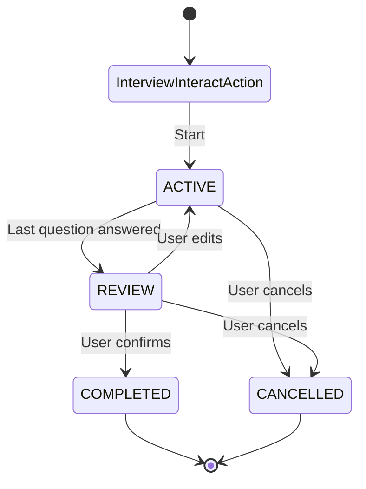

# Interview Action

A state-machine-based interview system for gathering structured information from users through multi-turn conversations with validation, revision, and confirmation flows.

## Overview

The Interview Action provides a reusable way to collect responses from users in a coordinated, multi-turn conversation. It implements a state machine that manages the interview lifecycle from initialization through completion or cancellation.

### Key Features

- **State Machine Architecture**: Four distinct states (ACTIVE, REVIEW, COMPLETED, CANCELLED) with clear transitions
- **Entry Point**: InterviewInteractAction serves as the neutral/entry state (replaces IDLE)
- **Three-Tier Validation**: VALID, VALID_WITH_FLAG, and INVALID response validation
- **Flexible Revision Handling**: Support for mid-interview and post-interview revisions
- **Streamlined Dialog Flow**: Immediate storage of valid responses without intermediate confirmations
- **Question Node System**: Dynamic registration of question nodes with configurable validation rules

## State Machine

The interview follows a state machine pattern with the following states and transitions:



### State Descriptions

- **InterviewInteractAction**: Entry point and neutral state - initializes sessions and routes to ACTIVE
- **ACTIVE**: Actively asking questions and collecting responses
- **REVIEW**: Presenting summary for user confirmation
- **COMPLETED**: Interview successfully completed
- **CANCELLED**: Interview cancelled by user

## Architecture

### Core Components

#### 1. InterviewInteractAction (Root Orchestrator)
The main action that coordinates all state actions and question nodes. Located in `interview_interact_action.py`.

#### 2. State Actions
Each state has its own `InteractAction` class:
- **InterviewInteractAction**: Entry point and orchestrator (serves as IDLE/neutral state)
- **ActiveStateInteractAction**: Handles question-answering phase
- **ReviewStateInteractAction**: Manages confirmation and editing
- **CompletedStateInteractAction**: Finalizes interview
- **CancelledStateInteractAction**: Handles cancellation

#### 3. InterviewSession Node
Persistent node that stores:
- Current state
- Question schema/index
- Collected responses
- Validation results per question
- Active question tracking
- Timestamps

#### 4. QuestionNode
Represents individual interview questions with:
- Question text and constraints
- Three-tier validation logic
- Required vs optional flags
- Validation rules

#### 5. InterviewWalker
Orchestrates state transitions and routes to appropriate state actions based on session state.

## File Structure

```
interview/
├── __init__.py                    # Package initialization
├── interview_interact_action.py   # Root orchestrator
├── info.yaml                      # Action metadata
├── README.md                      # This file
├── core/
│   ├── __init__.py
│   ├── interview_session.py       # InterviewSession Node
│   ├── interview_walker.py        # InterviewWalker
│   ├── question_node.py            # QuestionNode
│   └── validation.py               # Validation enums
└── states/
    ├── __init__.py
    ├── active_state.py             # ActiveStateInteractAction
    ├── review_state.py             # ReviewStateInteractAction
    ├── completed_state.py          # CompletedStateInteractAction
    └── cancelled_state.py          # CancelledStateInteractAction
```

## Configuration

### Question Schema

The `state_index` attribute defines the interview questions:

```python
state_index: List[Dict[str, Any]] = [
    {
        "name": "user_name",
        "question": "What's your full name?",
        "constraints": {
            "description": "The user's full name",
            "instructions": "Must include first and last name",
            "type": "string",
        },
        "required": True
    },
    {
        "name": "user_email",
        "question": "What is your email?",
        "constraints": {
            "description": "The user's email address",
            "type": "string",
            "format": "email"
        },
        "required": True
    },
]
```

### Question Configuration Fields

- **name**: Unique identifier for the question (required)
- **question**: Question text to ask the user
- **constraints**: Validation constraints dictionary
  - **description**: Description of what information is needed
  - **instructions**: Additional instructions for the LLM
  - **type**: Expected data type ("string", "number", "integer")
  - **format**: Format specification (e.g., "email")
  - **pattern**: Regex pattern for validation
  - **validator**: Custom validation function
  - **ambiguous_patterns**: Patterns that trigger VALID_WITH_FLAG
- **required**: Whether the question is required (default: False)

## Validation System

### Three-Tier Validation

The system uses three validation outcomes:

1. **VALID**: Response meets all constraints
   - Stored immediately
   - System moves to next question (no confirmation)

2. **VALID_WITH_FLAG**: Minor ambiguity but acceptable
   - Stored immediately
   - System asks clarifying follow-up
   - Example: "next Tuesday" → asks for specific time

3. **INVALID**: Response doesn't meet constraints
   - Not stored
   - System provides feedback and re-asks
   - Example: Missing last name in full name field

### Validation Example

```python
# In QuestionNode.validate_response()
if constraints.get("format") == "email":
    email_pattern = r'^[a-zA-Z0-9._%+-]+@[a-zA-Z0-9.-]+\.[a-zA-Z]{2,}$'
    if not re.match(email_pattern, value):
        return ValidationStatus.INVALID, "Please provide a valid email address"
```

## Usage Examples

### Streamlined Dialog Flow

```
System: "Hi! Let's book your appointment. What's your full name?"
User: "Jane Smith" ✓
[No confirmation - system stores and moves on]

System: "What service would you like? We offer haircuts, coloring, styling."
User: "haircut" ✓
[No confirmation - system stores and moves on]

System: "When would you like to come in?"
User: "next Tuesday"
[VALID_WITH_FLAG - stored, asks for clarification]

System: "Got it. Which time works best: 2 PM, 3 PM, or 4 PM?"
User: "3 PM" ✓

System: "Perfect! Here's what I have:
Name: Jane Smith
Service: Haircut
Time: Tuesday at 3 PM
Everything correct? You can say 'yes', 'no', or edit a specific detail."

User: "Can we make it 4 PM instead?"
System: "Changing time to 4 PM. Updated:
Name: Jane Smith ✓
Service: Haircut ✓
Time: Tuesday at 4 PM
All set?"

User: "Yes"
System: "Appointment booked for Tuesday at 4 PM. You'll get a confirmation. Thanks!"
```

### Revision Handling

#### Mid-Interview Revision
```
User: "Actually, change my name to Jane Wilson"
System: "Updated name to Jane Wilson. Now, [continue with current question]..."
```

#### Post-Interview Revision
```
User: "Can I change the service to coloring?"
System: "Changing service to coloring. Updated summary: [show updated]..."
```

## Implementation Details

### State Transitions

State transitions are managed by the `InterviewSession` node:

```python
session.transition_to(InterviewState.ACTIVE)
await session.save()
```

### Response Storage

Responses are stored immediately when validated as VALID or VALID_WITH_FLAG:

```python
if validation_status == ValidationStatus.VALID:
    session.set_response(field, value)
    await session.save()
```

### Revision Detection

Uses hybrid approach: keyword matching + LLM extraction:

```python
# Keyword patterns
revision_keywords = ["change", "update", "actually", "correction"]

# LLM extraction to identify field
if has_revision_keyword:
    field = await self._llm_extract_revision_field(utterance, session)
```

## API Integration

The Interview Action integrates with the jvagent interact subsystem:

1. **InteractWalker** routes to `InterviewInteractAction`
2. **InterviewWalker** loads/creates `InterviewSession`
3. **InterviewWalker** routes to appropriate state action
4. State action processes interaction and updates session
5. State transitions occur based on conditions

## Lifecycle Hooks

- `on_register()`: Creates and connects all state actions and question nodes
- `on_reload()`: Re-registers all components (same as on_register)
- `execute()`: Routes to InterviewWalker for state-based execution

## Best Practices

1. **Question Design**: Make questions clear and specific
2. **Validation Rules**: Use appropriate validation levels (don't over-validate)
3. **Error Messages**: Provide helpful feedback for INVALID responses
4. **Revision Keywords**: Configure revision detection keywords appropriately
5. **State Persistence**: Always save session after state transitions

## Troubleshooting

### Session Not Found
- Ensure conversation exists before creating session
- Check that InterviewSession is properly connected to Conversation

### State Not Transitioning
- Verify session.save() is called after transition_to()
- Check that all required questions are answered before REVIEW

### Validation Not Working
- Ensure QuestionNode.validate_response() is implemented
- Check that constraints are properly configured

## Future Enhancements

- [ ] Custom validation functions per question
- [ ] Conditional question logic (skip questions based on previous answers)
- [ ] Multi-language support
- [ ] Voice interface support
- [ ] Analytics and reporting
