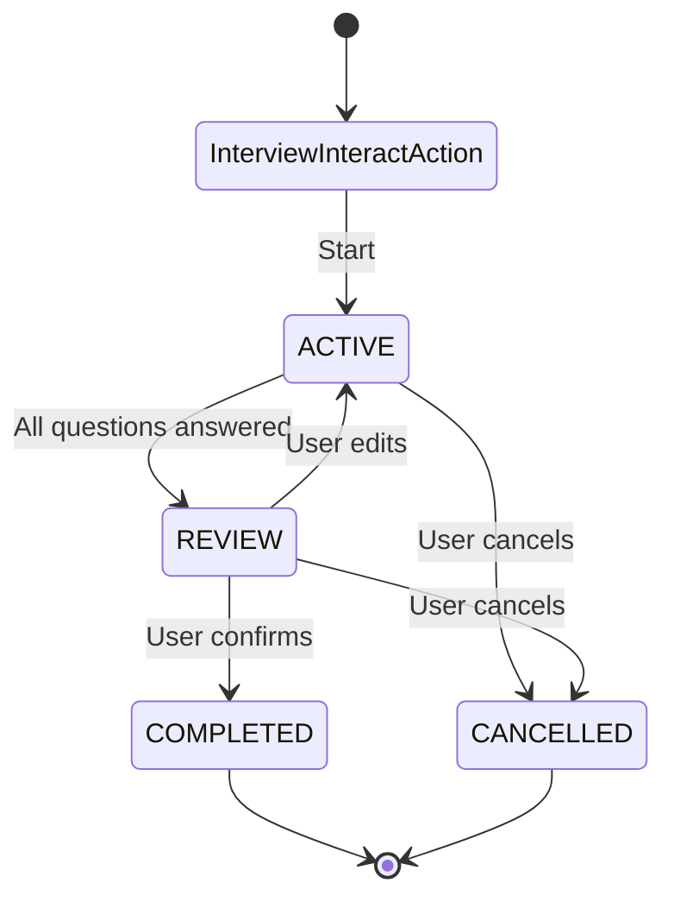

# Interview Action

A reusable, extensible interview system for gathering structured information from users through multi-turn conversations with validation, revision, and confirmation flows.

## Overview

The Interview Action provides a reusable way to collect responses from users in a coordinated, multi-turn conversation. It manages the interview lifecycle from initialization through completion or cancellation using a unified orchestrator pattern.

**Key Design**: `InterviewInteractAction` is an abstract base class that developers extend to create multiple interview flows (e.g., registration, onboarding) within the same agent. Each interview maintains its own per-user session attached to Conversation nodes with type identification.

### Key Features

- **Abstract Base Class Pattern**: Extend `InterviewInteractAction` to create custom interview flows
- **Multiple Interviews Per Agent**: Run registration, onboarding, and other interviews simultaneously
- **Per-User Session Isolation**: Sessions attached to Conversation nodes for user separation
- **Type-Based Session Management**: Sessions identified by `interview_type` field (survives action rebuilds)
- **Unified Classification System**: Single LLM call detects intent (CANCELLATION, CONFIRMATION, UPDATE, SUBMISSION, NONE) and extracts field values
- **DSPy Integration**: Optional DSPy-based classification with typed signatures, optimizable with teleprompters
- **State-Aware Classification**: Enhanced rules for accurate intent detection (e.g., "no" in REVIEW state = UPDATE, not CONFIRMATION)
- **Unified Orchestrator**: All state logic and directive generation handled within the main InterviewInteractAction class
- **Logical State Management**: Four distinct states (ACTIVE, REVIEW, COMPLETED, CANCELLED) with clear transitions
- **Same-Interaction State Transitions**: State transitions happen within the same interaction when appropriate
- **Three-Tier Validation**: VALID, VALID_WITH_FLAG, and INVALID response validation
- **Custom Handlers & Validators**: Process input and validate responses with custom logic
- **Completion Handlers**: Register completion handlers via `@on_interview_complete` decorator
- **Question Node Rebuilding**: Automatically rebuilds question nodes when `question_index` changes
- **agent.yaml Overrides**: Override `question_index` and prompt templates in agent configuration
- **Standard Anchors**: Automatically includes standard anchors for common interview scenarios (cancellation, correction, review confirmation, etc.) - no need to specify them in each implementation
- **Enhanced UPDATE Handling**: When UPDATE intent has null field, shows summary and prompts for field selection

## State Machine

The interview follows a state machine pattern with the following states and transitions:



### State Descriptions

- **InterviewInteractAction**: Entry point - manages sessions and orchestrates the interview flow
- **ACTIVE**: Actively asking questions and collecting responses. Transitions to REVIEW when all questions are answered.
- **REVIEW**: Presenting summary for user confirmation. Transitions to COMPLETED on confirmation or back to ACTIVE on updates.
- **COMPLETED**: Interview successfully completed (with optional data processing via completion handlers)
- **CANCELLED**: Interview cancelled by user. Session is cleaned up and removed.

## Architecture

### Core Components

#### 1. InterviewInteractAction (Abstract Base Class)
The abstract base class that orchestrates the complete interview flow. **Must be extended** to create concrete interview implementations.

**Key Methods:**
- `on_register()`: Builds question node chain from `question_index`
- `on_reload()`: Rebuilds question nodes if `question_index` changed
- `execute()`: Loads/creates session, classifies intent, and generates directives
- `_classify_and_extract()`: Unified classification and extraction using single LLM call
- `_generate_directive()`: Routes to state-specific directive generation
- `_generate_active_directive()`: Handles ACTIVE state (question flow, updates)
- `_generate_review_directive()`: Handles REVIEW state (summary, confirmation, edits)
- `_generate_completed_directive()`: Handles COMPLETED state (calls completion handlers)
- `_generate_cancelled_directive()`: Handles CANCELLED state (cleanup)
- `_build_question_nodes()`: Builds QuestionNode chain from `question_index`

**Unified Classification:**
The system uses a single unified prompt (`INTERVIEW_PROMPT_TEMPLATE`) that:
- Accepts both utterance and interpretation (when available)
- Detects intent: CANCELLATION, CONFIRMATION, UPDATE, SUBMISSION, or NONE
- Extracts field values for SUBMISSION intent
- Identifies update fields and values for UPDATE intent
- All in a single LLM call for efficiency and consistency

#### 2. InterviewSession Node
Persistent node that stores:
- `interview_type`: Class name of the interview action (for filtering)
- Current state
- Question schema/index
- Collected responses
- Validation results per question
- Active question tracking
- Timestamps

**Methods:**
- `reset()`: Reset session to initial state
- `cleanup()`: Delete session from graph
- `extract_data()`: Extract collected data for processing

#### 3. QuestionNode
Represents individual interview questions with:
- Question text and constraints
- Three-tier validation logic
- Custom input handlers (`process_input()`)
- Custom validators
- Required vs optional flags
- Condition matching for tree traversal

#### 4. QuestionWalker
Specialized walker that traverses QuestionNodes in a tree-based arrangement:
- Finds next unanswered question based on conditional branches
- Processes input via QuestionNode handlers
- Validates responses via QuestionNode validators
- Returns directives for the next question
- Respects conditional branching based on previous answers

#### 5. QuestionEdge
Specialized edge connecting QuestionNodes with optional condition metadata:
- Stores condition information for conditional traversal
- Condition format: `{"question": "question_name", "equals": "value"}`

#### 6. InteractWalker
Standard walker used throughout. The interview action receives session via conversation queries.

### Standard Anchors

All interview implementations automatically include standard anchors that cover common interview flow scenarios. These standard anchors ensure proper routing classification for scenarios that apply to all interviews, regardless of the specific implementation.

**Standard anchors are automatically merged with implementation-specific anchors** (implementation-specific anchors first, then standard anchors appended). This means you don't need to specify standard anchors in your implementation - they're included automatically.

#### Standard Anchor Categories

1. **Cancellation** (any state):
   - "User requests to cancel interview process"
   - "User wants to stop the interview"
   - "User wants to abort the interview"
   - "User wants to exit the interview"

2. **Correction/Update** (ACTIVE or REVIEW states):
   - "User indicates that not all information is correct"
   - "User wants to change previously provided information"
   - "User wants to update their answers"
   - "User wants to correct their responses"
   - "User indicates information needs to be changed"

3. **Review Confirmation** (REVIEW state):
   - "User confirms the information is correct"
   - "User approves the summary"
   - "User confirms all information is accurate"

4. **General Interview Continuation** (intermediate states):
   - "User is answering interview questions"
   - "User is providing interview information"
   - "User is responding to interview prompts"

#### How It Works

- Standard anchor templates are defined in the `InterviewInteractAction` base class as `_standard_interview_anchor_templates`
- They are automatically contextualized with the class name (e.g., "SignupInterviewInteractAction") in `_merge_standard_anchors()`
- This helps distinguish multiple interview instances coexisting in a single agent
- They are automatically merged with implementation-specific anchors in `on_register()` and `on_reload()`
- Implementation-specific anchors are listed first, followed by context-specific standard anchors
- Duplicates are automatically removed while preserving order

#### Example

```python
class MyInterviewAction(InterviewInteractAction):
    anchors: List[str] = attribute(
        default_factory=lambda: [
            "User wants to start my interview",  # Implementation-specific
            "User is providing my interview data",  # Implementation-specific
            # Standard anchors (cancellation, correction, etc.) are automatically added
        ]
    )
```

The final anchors list will include:
1. "User wants to start my interview"
2. "User is providing my interview data"
3. All standard anchors contextualized with class name (e.g., "User cancels MyInterviewAction", "User answers MyInterviewAction question", etc.)

## File Structure

```
interview/
├── __init__.py                    # Package initialization
├── interview_interact_action.py   # Abstract base class (unified orchestrator)
├── prompts.py                     # Prompt templates
├── info.yaml                      # Action metadata
├── README.md                      # This file
├── core/
│   ├── __init__.py
│   ├── interview_session.py       # InterviewSession Node
│   ├── question_node.py           # QuestionNode
│   ├── question_walker.py         # QuestionWalker for tree traversal
│   ├── question_edge.py           # QuestionEdge with conditions
│   └── validation.py              # Validation enums
└── dspy/
    ├── __init__.py                 # DSPy package exports
    ├── signatures.py               # DSPy signatures for classification
    └── modules.py                  # DSPy modules (InterviewClassifier)
```

## Usage

### Basic Example: Extending InterviewInteractAction

```python
from jvagent.action.interview.interview_interact_action import InterviewInteractAction
from jvspatial.core.annotations import attribute
from typing import Any, Dict, List

class RegistrationInterviewAction(InterviewInteractAction):
    """User registration interview."""
    
    description: str = "User registration interview flow"
    
    # Anchors for InteractRouter routing
    # Standard interview anchors (cancellation, correction, review confirmation, etc.) are
    # automatically included. You only need to specify implementation-specific anchors.
    anchors: List[str] = attribute(
        default_factory=lambda: [
            # Initial entry anchors - when user wants to start registration
            "User wants to register",
            "User requests registration",
            "User asks to sign up",
            "User wants to create an account",
            # Intermediate state anchors - when user is answering registration questions
            "User is providing registration information",
            "User is answering registration questions",
            "User is completing registration form",
            "User responds to registration prompt",
            # Note: Standard anchors (cancellation, correction, review confirmation, etc.)
            # are automatically merged with these implementation-specific anchors
        ],
        description="Anchor statements for InteractRouter routing. Standard interview anchors are automatically included."
    )
    
    question_index: List[Dict[str, Any]] = attribute(
        default_factory=lambda: [
            {
                "name": "user_name",
                "question": "What's your full name?",
                "constraints": {
                    "description": "The user's full name",
                    "instructions": "Must include first and last name",
                    "type": "string",
                },
                "required": True
            },
            {
                "name": "user_email",
                "question": "What is your email?",
                "constraints": {
                    "description": "The user's email address",
                    "type": "string",
                    "format": "email"
                },
                "required": True
            },
        ],
        description="List of question configurations. Can be overridden in agent.yaml"
    )
```

### Overriding in agent.yaml

```yaml
actions:
  - type: RegistrationInterviewAction
    enabled: true
    anchors:
      - "User wants to register"
      - "User requests registration"
      - "User is providing registration information"
      - "User is answering registration questions"
      # Note: Standard anchors are automatically merged with these when the action is registered
    question_index:
      - name: user_name
        question: "What's your full name?"
        constraints:
          description: "The user's full name"
          instructions: "Must include first and last name"
          type: "string"
        required: true
      - name: user_email
        question: "What is your email?"
        constraints:
          description: "The user's email address"
          type: "string"
          format: "email"
        required: true
```

## Question Schema

### Question Configuration Fields

- **name**: Unique identifier for the question (required)
- **question**: Question text to ask the user
- **constraints**: Validation constraints dictionary
  - **description**: Description of what information is needed
  - **instructions**: Additional instructions for the LLM
  - **type**: Expected data type ("string", "number", "integer")
  - **format**: Format specification (e.g., "email")
  - **pattern**: Regex pattern for validation
  - **input_handler**: String reference to function that processes raw input before validation (or use `@input_handler` decorator)
  - **input_validator**: String reference to function that validates responses (or use `@input_validator` decorator)
  - **ambiguous_patterns**: Patterns that trigger VALID_WITH_FLAG
- **required**: Whether the question is required (default: False)
- **branches**: Optional list of conditional branches (see Tree-Based Questions below)
- **default_next**: Optional fallback question name if no branch conditions match

### Tree-Based Questions with Conditional Branching

The interview system supports tree-based question arrangements where the next question can be determined conditionally based on previous answers. This enables dynamic interview flows that adapt to user responses.

#### Branch Configuration

Each question can define `branches` with conditions that determine which question to ask next:

```python
question_index = [
    {
        "name": "user_type",
        "question": "Are you a premium or standard user?",
        "constraints": {
            "description": "User account type",
            "type": "string"
        },
        "required": True,
        "branches": [
            {
                "condition": {"question": "user_type", "equals": "premium"},
                "target": "premium_features"
            },
            {
                "condition": {"question": "user_type", "equals": "standard"},
                "target": "standard_setup"
            }
        ],
        "default_next": "contact_info"  # If no condition matches
    },
    {
        "name": "premium_features",
        "question": "Which premium features interest you?",
        "branches": [
            {
                "condition": {"question": "premium_features", "equals": "advanced"},
                "target": "advanced_config"
            }
        ],
        "default_next": "contact_info"
    },
    {
        "name": "standard_setup",
        "question": "Standard setup question",
        "default_next": "contact_info"
    },
    {
        "name": "contact_info",
        "question": "What's your contact information?"
    }
]
```

#### Branch Condition Format

Each branch condition uses simple equality matching:

```python
{
    "condition": {
        "question": "question_name",  # Name of the question to check
        "equals": "expected_value"     # Value to match (must be exact match)
    },
    "target": "next_question_name"    # Question name to traverse to if condition matches
}
```

#### How It Works

1. **QuestionWalker** traverses the question tree starting from the first unanswered question
2. When a question has `branches`, it evaluates each condition against `session.responses`
3. If a condition matches, traversal continues to the `target` question
4. If no condition matches, `default_next` is used (if provided)
5. If no `default_next` and no branches, linear flow continues to next question in list

#### Linear Questions (No Branches)

Questions without `branches` work as before - they follow linear order or use `default_next`:

```python
question_index = [
    {
        "name": "question1",
        "question": "First question"
        # No branches - will go to next question in list or default_next if specified
    },
    {
        "name": "question2",
        "question": "Second question"
    }
]
```

#### Example: User Onboarding Flow

```python
question_index = [
    {
        "name": "account_type",
        "question": "What type of account do you want? (personal/business)",
        "branches": [
            {"condition": {"question": "account_type", "equals": "business"}, "target": "business_details"},
            {"condition": {"question": "account_type", "equals": "personal"}, "target": "personal_details"}
        ]
    },
    {
        "name": "business_details",
        "question": "What's your company name?",
        "default_next": "contact_info"
    },
    {
        "name": "personal_details",
        "question": "What's your full name?",
        "default_next": "contact_info"
    },
    {
        "name": "contact_info",
        "question": "What's your email address?"
    }
]
```

### Custom Input Handlers

Process raw input before validation (e.g., normalize time expressions):

**Recommended Approach: Use Decorators**

The cleanest way to register handlers is using the `@input_handler` decorator:

```python
from jvagent.action.interview.interview_interact_action import (
    InterviewInteractAction,
    input_handler,
)
from jvagent.action.interview.core.interview_session import InterviewSession
from jvagent.memory import Interaction

@input_handler('available_times')
def normalize_time_expression(
    raw_input: str, 
    session: InterviewSession,
    interaction: Interaction
) -> str:
    """Convert 'next Tuesday' to specific date."""
    # Can access interaction.user_id, interaction.utterance, etc.
    # Implementation here
    return normalized_date

class MyInterviewAction(InterviewInteractAction):
    question_index = [
        {
            "name": "available_times",
            "constraints": {
                # Handler is automatically found via decorator
            }
        }
    ]
```


**Alternative: String References in question_index**

You can also specify handlers as string references in `question_index`:

```python
question_index = [
    {
        "name": "available_times",
        "constraints": {
            # Use full module path or function name (if in same module)
            "input_handler": "jvagent.actions.namespace.my_action.normalize_time_expression",
            # Or just function name if in the same module:
            # "input_handler": "normalize_time_expression",
        }
    }
]
```

In agent.yaml:
```yaml
constraints:
  input_handler: "module.path.function_name"
```

### Custom Validators

Validate responses with custom logic:

**Recommended Approach: Use Decorators**

The cleanest way to register validators is using the `@input_validator` decorator:

```python
from jvagent.action.interview.interview_interact_action import (
    InterviewInteractAction,
    input_validator,
)

@input_validator('user_email')
def validate_email_domain(value: str, session: InterviewSession) -> Tuple[ValidationStatus, Optional[str]]:
    """Check if email domain is allowed."""
    if "@company.com" not in value:
        return ValidationStatus.INVALID, "Only company emails are allowed"
    return ValidationStatus.VALID, None

class MyInterviewAction(InterviewInteractAction):
    question_index = [
        {
            "name": "user_email",
            "constraints": {
                # Validator is automatically found via decorator
            }
        }
    ]
```

**Alternative: String References in question_index**

You can also specify validators as string references in `question_index`:

```python
question_index = [
    {
        "name": "user_email",
        "constraints": {
            # Use full module path or function name (if in same module)
            "input_validator": "jvagent.actions.namespace.my_action.validate_email_domain",
            # Or just function name if in the same module:
            # "input_validator": "validate_email_domain",
        }
    }
]
```


**String Reference Formats:**
- Full module path: `"package.module.function_name"` (recommended for reliability)
- Function name only: `"function_name"` (searches loaded modules, may have collisions)
- Module-qualified: `"module_name.function_name"` (tries to import module)

**Resolution Priority:**
1. Decorator-registered handlers/validators (checked first)
2. String references in `question_index` constraints (fallback)

Validators can return:
- `(ValidationStatus, message)`: Status and feedback message
- `(ValidationStatus, message, corrected_value)`: Status, feedback message, and autocorrected value
- `bool`: True for VALID, False for INVALID

**Autocorrection Support:**
Validators can return a corrected value as the third element of the tuple. If provided, the system will store the corrected value instead of the original input. This is useful for fuzzy matching scenarios (e.g., correcting "next tuesday" to a specific date, or matching "morning" to "9:00 AM").

## Unified Classification System

The interview system uses a single unified prompt (`INTERVIEW_PROMPT_TEMPLATE`) that combines intent detection and field extraction in one LLM call. This approach is more efficient and ensures consistency.

### Classification Backend Options

The system supports two classification backends:

1. **Legacy Prompt-Based Classification** (default): Uses a structured prompt template with JSON response format
2. **DSPy-Based Classification** (optional): Uses typed DSPy signatures that can be optimized with DSPy teleprompters

Enable DSPy classification by setting `use_dspy=True` in your interview action:

```python
class MyInterviewAction(InterviewInteractAction):
    use_dspy: bool = attribute(
        default=True,
        description="Use DSPy module for classification"
    )
```

**Benefits of DSPy Integration:**
- Typed signatures for better structure and validation
- Optimizable with DSPy teleprompters (BootstrapFewShot, MIPROv2, etc.)
- Evaluable with `dspy.Evaluate` for performance measurement
- Consistent interface regardless of backend

### Intent Detection

The system detects five intent types with state-aware rules:

- **CANCELLATION**: User wants to cancel/stop the interview
  - Highest priority, overrides all other intents
  - Can occur in any state
  
- **CONFIRMATION**: User confirms/approves information (only in REVIEW state)
  - Only applies to positive affirmations ("yes", "correct", "looks good", etc.)
  - **CRITICAL**: "No" is NOT a CONFIRMATION indicator
  
- **UPDATE**: User wants to change/update a previously answered field
  - **State-Aware Rule**: In REVIEW state, "no" (rejecting confirmation) = UPDATE
  - When field is null, system shows summary and asks which field to change
  - Uses interpretation field when available for better context
  
- **SUBMISSION**: User is providing answers to unanswered questions
  - Extracts field values from message and conversation history
  
- **NONE**: No clear intent or conversational filler

### State-Aware Classification Rules

The classification system includes state-aware rules for better accuracy:

- **"No" in REVIEW state**: Classified as UPDATE (rejecting confirmation), not CONFIRMATION
- **Interpretation context**: When interpretation indicates "not correct" or "wrong", prefers UPDATE intent
- **Field normalization**: Handles string "null" values from JSON parsing, normalizing them to Python None

### Input Processing

The unified prompt accepts both:
- **User's utterance**: The raw user message
- **Interpretation**: LLM-generated interpretation of user intent (when available)

Both are provided to the prompt when available, giving the classification system more context for accurate intent detection and extraction. The interpretation field is particularly useful for distinguishing between "no" as rejection (UPDATE) vs "no" as answer to a question (SUBMISSION).

### Classification Result

The `ClassificationResult` dataclass contains:
- `intent`: Detected intent type
- `confidence`: Confidence score (0.0-1.0)
- `extracted_data`: Extracted field values (for SUBMISSION intent)
- `field`: Field name (for UPDATE intent, null if unclear)
- `value`: Field value (for UPDATE intent, null if not provided)

### UPDATE Intent Handling

When UPDATE intent is detected:

1. **With field specified**: Processes the update inline using QuestionNode validation
2. **Without field (null)**: Shows summary of current information and prompts user to specify which field to change
3. **Field normalization**: Automatically handles string "null" values from JSON parsing

### State Transitions

State transitions happen within the same interaction when appropriate:
- **ACTIVE → REVIEW**: When all required questions are answered
- **REVIEW → COMPLETED**: When CONFIRMATION intent is detected
- **REVIEW → ACTIVE**: When UPDATE intent is detected and processed
- **Any → CANCELLED**: When CANCELLATION intent is detected

## Validation System

### Three-Tier Validation

1. **VALID**: Response meets all constraints
   - Stored immediately
   - System moves to next question

2. **VALID_WITH_FLAG**: Minor ambiguity but acceptable
   - Stored immediately
   - System asks clarifying follow-up
   - Example: "next Tuesday" → asks for specific time

3. **INVALID**: Response doesn't meet constraints
   - Not stored
   - System provides feedback and re-asks

## Data Handling Patterns

### Pattern A: Use Completion Handler Decorator (Recommended)

Use the `@on_interview_complete` decorator to register a completion handler:

```python
from jvagent.action.interview.interview_interact_action import (
    InterviewInteractAction,
    on_interview_complete,
)
from jvagent.action.interview.core.interview_session import InterviewSession
from jvagent.action.interact.interact_walker import InteractWalker

@on_interview_complete('MyInterviewAction')
async def handle_interview_completion(
    session: InterviewSession,
    visitor: InteractWalker
) -> None:
    """Process data when interview completes."""
    data = session.export_data()
    # Store in user profile, database, etc.
    user = await visitor.interaction.get_conversation().get_user()
    user.preferences = data["responses"]
    await user.save()

class MyInterviewAction(InterviewInteractAction):
    # Handler is automatically found via decorator
    question_index = [...]
```

**Note:** Completion handlers are the recommended approach. The system automatically calls registered handlers when the interview transitions to COMPLETED state.

### Pattern B: Separate Data Handler Action

Create a separate `InteractAction` that processes completed sessions:

```python
class AppointmentDataHandlerAction(InteractAction):
    weight: int = -30  # Runs after interview
    
    async def execute(self, visitor: InteractWalker) -> None:
        conversation = await visitor.interaction.get_conversation()
        session = await conversation.node(
            node=InterviewSession,
            interview_type="AppointmentInterviewAction",
            state=InterviewState.COMPLETED,
        )
        if session and not session.context.get("processed"):
            data = session.extract_data()
            await self.create_appointment(data["responses"])
            session.context["processed"] = True
            await session.save()
```

### Pattern C: Callback in Interview Action

Override `on_interview_complete()` in your interview action (if implemented).

## Session Management

### Per-User Isolation

Sessions are attached to Conversation nodes, ensuring each user has their own sessions:

```python
# Session is created and attached to conversation
session = await InterviewSession.create(
    agent_id=self.agent_id,
    conversation_id=conversation.id,
    interview_type=self.get_class_name(),  # e.g., "RegistrationInterviewAction"
    question_index=self.question_index,
    state=InterviewState.ACTIVE,
)
await conversation.connect(session)
```

### Type-Based Loading

Sessions are queried by `interview_type` to support multiple interviews per agent:

```python
session = await conversation.node(
    node=[{'InterviewSession': {
        "state": {"$nin": [InterviewState.COMPLETED.value, InterviewState.CANCELLED.value]}
    }}],
    interview_type="RegistrationInterviewAction",
)
```

### Action Rebuild Resilience

Sessions store `interview_type` as metadata, so they persist even when interview actions are destroyed and rebuilt during agent reconfiguration.

## Session Lifecycle

### Reset Session

```python
await session.reset()  # Clears responses, resets to ACTIVE
```

### Cleanup Session

```python
await session.cleanup()  # Deletes session from graph
```

### Extract Data

```python
data = session.extract_data()  # Returns dict with responses and metadata
```

## Question Node Rebuilding

When `question_index` changes (via `on_reload()`), question nodes are automatically rebuilt:

1. Detects changes by comparing existing node labels with expected labels
2. Disconnects and deletes old question nodes
3. Rebuilds question node chain from new `question_index`

## Completion Handling

**Use `@on_interview_complete` Decorator**

Register a completion handler using the decorator:

```python
from jvagent.action.interview.interview_interact_action import (
    InterviewInteractAction,
    on_interview_complete,
)
from jvagent.action.interview.core.interview_session import InterviewSession
from jvagent.action.interact.interact_walker import InteractWalker
from jvagent.action.interact.base import InteractAction

@on_interview_complete('InterviewActionName')
async def handle_completion(
    session: InterviewSession,
    visitor: InteractWalker,
    action: InteractAction
) -> None:
    """Process collected data when interview completes."""
    data = session.extract_data()
    # Process data, send notifications, etc.
    await action.respond(visitor, directives=["Thank you! Your data has been processed."])
    # Clean up session after processing
    await session.cleanup()
```

The completion handler is called automatically when the interview transitions to COMPLETED state.

## Multiple Interviews Per Agent

You can run multiple interview types in the same agent:

```python
# In agent configuration
actions:
  - type: RegistrationInterviewAction
    enabled: true
  - type: OnboardingInterviewAction
    enabled: true
  - type: AppointmentInterviewAction
    enabled: true
```

Each maintains its own sessions via `interview_type` identification.

## Best Practices

1. **Question Design**: Make questions clear and specific
2. **Validation Rules**: Use appropriate validation levels
3. **Custom Handlers**: Use input handlers for normalization, validators for business logic
4. **Data Processing**: Choose appropriate pattern (A, B, or C) based on complexity
5. **Session Cleanup**: Clean up sessions after data is processed
6. **Type Identification**: Always use unique class names for interview types
7. **DSPy Classification**: Enable `use_dspy=True` for optimizable and evaluable classification
8. **State-Aware Responses**: Be aware that "no" in REVIEW state means UPDATE (rejecting confirmation), not CONFIRMATION

## Troubleshooting

### Session Not Found
- Ensure conversation exists before creating session
- Check that `interview_type` matches the class name
- Verify session is attached to conversation

### State Not Transitioning
- Verify `session.save()` is called after `transition_to()`
- Check that all required questions are answered before REVIEW

### Question Nodes Not Rebuilding
- Ensure `on_reload()` is called when `question_index` changes
- Check that question names in `question_index` match expected format

### Custom Handlers Not Working
- Verify handler is callable (for Python code) or importable (for agent.yaml)
- Check that handler signature matches: `(raw_input: str, session: InterviewSession) -> Any`

## Examples

### Example 1: Basic Registration Interview

```python
from jvagent.action.interview.interview_interact_action import InterviewInteractAction
from jvspatial.core.annotations import attribute
from typing import Any, Dict, List

class RegistrationInterviewAction(InterviewInteractAction):
    """User registration interview with default state behavior.
    
    Sessions are identified by interview_type='RegistrationInterviewAction'
    and attached to Conversation nodes for per-user persistence.
    
    Note: question_index can also be defined in agent.yaml to override this.
    """
    
    description: str = "User registration interview flow"
    
    # Anchors for InteractRouter routing
    # Standard interview anchors (cancellation, correction, review confirmation, etc.)
    # are automatically included - you only need to specify implementation-specific anchors
    anchors: List[str] = attribute(
        default_factory=lambda: [
            # Initial entry anchors
            "User wants to register",
            "User requests registration",
            "User asks to sign up",
            # Intermediate state anchors
            "User is providing registration information",
            "User is answering registration questions",
            # Note: Standard anchors are automatically merged with these
        ],
        description="Anchor statements for InteractRouter routing. Standard interview anchors are automatically included."
    )
    
    question_index: List[Dict[str, Any]] = attribute(
        default_factory=lambda: [
            {
                "name": "user_name",
                "question": "What's your full name?",
                "constraints": {
                    "description": "The user's full name",
                    "instructions": "Must include first and last name",
                    "type": "string",
                },
                "required": True
            },
            {
                "name": "user_email",
                "question": "What is your email?",
                "constraints": {
                    "description": "The user's email address",
                    "type": "string",
                    "format": "email"
                },
                "required": True
            },
        ],
        description="List of question configurations. Can be overridden in agent.yaml"
    )
```

### Example 2: Onboarding with Custom Completion Handler

```python
from jvagent.action.interview.interview_interact_action import (
    InterviewInteractAction,
    on_interview_complete,
)
from jvagent.action.interview.core.interview_session import InterviewSession
from jvagent.action.interact.interact_walker import InteractWalker
from jvagent.action.interact.base import InteractAction
from jvspatial.core.annotations import attribute
from typing import Any, Dict, List
import logging

logger = logging.getLogger(__name__)


@on_interview_complete('OnboardingInterviewAction')
async def handle_onboarding_completion(
    session: InterviewSession,
    visitor: InteractWalker,
    action: InteractAction
) -> None:
    """Process onboarding data when interview completes."""
    data = session.extract_data()
    
    # Example: Store in user profile
    conversation = await visitor.interaction.get_conversation()
    user = await conversation.get_user()
    
    if user:
        # Store preferences from onboarding
        user.preferences = {
            "communication_preference": data["responses"].get("comm_pref"),
            "interests": data["responses"].get("interests"),
            "timezone": data["responses"].get("timezone"),
        }
        await user.save()
        logger.info(f"Onboarding data saved to user profile: {user.id}")
    
    # Send custom completion message
    await action.respond(visitor, directives=["Welcome aboard! Your preferences have been saved."])
    
    # Clean up session after processing
    await session.cleanup()


class OnboardingInterviewAction(InterviewInteractAction):
    """Onboarding interview with custom completion handling.
    
    Sessions identified by interview_type='OnboardingInterviewAction'.
    Uses @on_interview_complete decorator to process data on completion.
    """
    
    description: str = "User onboarding interview flow"
    
    question_index: List[Dict[str, Any]] = attribute(
        default_factory=lambda: [
            {
                "name": "comm_pref",
                "question": "How would you like to receive updates?",
                "constraints": {
                    "description": "Communication preference (email, SMS, etc.)",
                    "type": "string",
                },
                "required": True
            },
            {
                "name": "interests",
                "question": "What topics interest you?",
                "constraints": {
                    "description": "User interests",
                    "type": "string",
                },
                "required": False
            },
            {
                "name": "timezone",
                "question": "What's your timezone?",
                "constraints": {
                    "description": "User timezone",
                    "type": "string",
                },
                "required": True
            },
        ],
        description="List of question configurations. Can be overridden in agent.yaml"
    )
```

### Example 3: Appointment Booking with Separate Data Handler

```python
from jvagent.action.interact.base import InteractAction
from jvagent.action.interact.interact_walker import InteractWalker
from jvagent.action.interview.interview_interact_action import InterviewInteractAction
from jvagent.action.interview.core.interview_session import InterviewSession
from jvagent.action.interview.core.validation import InterviewState
from jvspatial.core.annotations import attribute
import logging

logger = logging.getLogger(__name__)


class AppointmentDataHandlerAction(InteractAction):
    """Separate action to process appointment data after interview.
    
    This demonstrates Pattern B: handling interview data in a separate
    InteractAction that runs after the interview completes.
    """
    
    description: str = "Process appointment booking data from completed interviews"
    weight: int = -30  # Runs after interview actions
    
    async def execute(self, visitor: InteractWalker) -> None:
        """Process completed appointment interview sessions."""
        conversation = await visitor.interaction.get_conversation()
        if not conversation:
            return
        
        # Query for completed appointment interview session
        session = await conversation.node(
            node=InterviewSession,
            interview_type="AppointmentInterviewAction",
            state=InterviewState.COMPLETED,
        )
        
        if session:
            # Check if already processed
            if session.context.get("processed"):
                return
            
            # Extract and process appointment data
            data = session.extract_data()
            await self.create_appointment(data["responses"])
            
            # Mark as processed
            session.context["processed"] = True
            await session.save()
            
            logger.info(f"Processed appointment from session {session.id}")
    
    async def create_appointment(self, responses: dict) -> None:
        """Create appointment from interview data."""
        appointment_time = responses.get("preferred_time")
        service_type = responses.get("service_type")
        contact_info = responses.get("contact_email")
        
        logger.info(f"Creating appointment: {service_type} at {appointment_time}")
        # Create appointment in external system
        # await appointment_service.create(...)


class AppointmentInterviewAction(InterviewInteractAction):
    """Appointment booking interview.
    
    Data is processed by separate AppointmentDataHandlerAction.
    Sessions identified by interview_type='AppointmentInterviewAction'.
    """
    
    description: str = "Appointment booking interview flow"
    
    question_index: List[Dict[str, Any]] = attribute(
        default_factory=lambda: [
            {
                "name": "service_type",
                "question": "What service would you like to book?",
                "constraints": {
                    "description": "Type of service",
                    "type": "string",
                },
                "required": True
            },
            {
                "name": "preferred_time",
                "question": "What time works best for you?",
                "constraints": {
                    "description": "Preferred appointment time",
                    "type": "string",
                },
                "required": True
            },
            {
                "name": "contact_email",
                "question": "What's your email for confirmation?",
                "constraints": {
                    "description": "Contact email",
                    "type": "string",
                    "format": "email"
                },
                "required": True
            },
        ],
        description="List of question configurations. Can be overridden in agent.yaml"
    )
```

### Example 4: Signup Interview (Production Example)

See `examples/jvagent_app/agents/jvagent/example_agent/actions/jvagent/signup_interview_interact_action/` for a production example that replaces the original hardcoded questions.

### Example 5: Using DSPy Classification

Enable DSPy-based classification for optimizable and evaluable classification:

```python
from jvagent.action.interview.interview_interact_action import InterviewInteractAction
from jvspatial.core.annotations import attribute

class MyInterviewAction(InterviewInteractAction):
    """Interview with DSPy classification enabled."""
    
    use_dspy: bool = attribute(
        default=True,
        description="Use DSPy module for classification (enables optimization via DSPy teleprompters)"
    )
    
    question_index: List[Dict[str, Any]] = attribute(
        default_factory=lambda: [
            # ... question configurations ...
        ]
    )
```

**Benefits:**
- Typed signatures provide better structure and validation
- Can be optimized with DSPy teleprompters for improved performance
- Can be evaluated with `dspy.Evaluate` to measure classification accuracy
- Same interface as legacy classification, just with different backend
