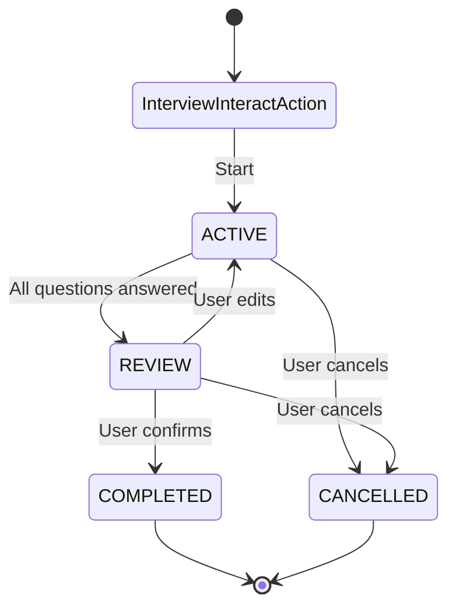

# Interview Action

A reusable, extensible state-machine-based interview system for gathering structured information from users through multi-turn conversations with validation, revision, and confirmation flows.

## Overview

The Interview Action provides a reusable way to collect responses from users in a coordinated, multi-turn conversation. It implements a state machine that manages the interview lifecycle from initialization through completion or cancellation.

**Key Design**: `InterviewInteractAction` is an abstract base class that developers extend to create multiple interview flows (e.g., registration, onboarding) within the same agent. Each interview maintains its own per-user session attached to Conversation nodes with type identification.

### Key Features

- **Abstract Base Class Pattern**: Extend `InterviewInteractAction` to create custom interview flows
- **Multiple Interviews Per Agent**: Run registration, onboarding, and other interviews simultaneously
- **Per-User Session Isolation**: Sessions attached to Conversation nodes for user separation
- **Type-Based Session Management**: Sessions identified by `interview_type` field (survives action rebuilds)
- **State Machine Architecture**: Four distinct states (ACTIVE, REVIEW, COMPLETED, CANCELLED) with clear transitions
- **Three-Tier Validation**: VALID, VALID_WITH_FLAG, and INVALID response validation
- **Custom Handlers & Validators**: Process input and validate responses with custom logic
- **Extensible State Actions**: Override state actions for custom completion handling
- **Question Node Rebuilding**: Automatically rebuilds question nodes when `question_index` changes
- **agent.yaml Overrides**: Override `question_index` in agent configuration

## State Machine

The interview follows a state machine pattern with the following states and transitions:



### State Descriptions

- **InterviewInteractAction**: Entry point - initializes sessions and routes to state actions
- **ACTIVE**: Actively asking questions and collecting responses
- **REVIEW**: Presenting summary for user confirmation
- **COMPLETED**: Interview successfully completed (with optional data processing)
- **CANCELLED**: Interview cancelled by user

## Architecture

### Core Components

#### 1. InterviewInteractAction (Abstract Base Class)
The abstract base class that coordinates all state actions and question nodes. **Must be extended** to create concrete interview implementations.

**Key Methods:**
- `on_register()`: Creates state actions and builds question node chain
- `on_reload()`: Rebuilds question nodes if `question_index` changed
- `execute()`: Loads/creates session and routes to state actions
- `_build_question_nodes()`: Builds QuestionNode chain from `question_index`

#### 2. State Actions
Each state has its own `InteractAction` class that self-checks `session.state`:
- **ActiveStateInteractAction**: Handles question-answering phase
- **ReviewStateInteractAction**: Manages confirmation and editing
- **CompletedStateInteractAction**: Finalizes interview (extensible with hooks)
- **CancelledStateInteractAction**: Handles cancellation

#### 3. InterviewSession Node
Persistent node that stores:
- `interview_type`: Class name of the interview action (for filtering)
- Current state
- Question schema/index
- Collected responses
- Validation results per question
- Active question tracking
- Timestamps

**Methods:**
- `reset()`: Reset session to initial state
- `cleanup()`: Delete session from graph
- `extract_data()`: Extract collected data for processing

#### 4. QuestionNode
Represents individual interview questions with:
- Question text and constraints
- Three-tier validation logic
- Custom input handlers (`process_input()`)
- Custom validators
- Required vs optional flags

#### 5. InteractWalker
Standard walker used throughout. State actions receive session via `visitor.interview_session`.

## File Structure

```
interview/
├── __init__.py                    # Package initialization
├── interview_interact_action.py   # Abstract base class
├── info.yaml                      # Action metadata
├── README.md                      # This file
├── core/
│   ├── __init__.py
│   ├── interview_session.py       # InterviewSession Node
│   ├── question_node.py            # QuestionNode
│   └── validation.py               # Validation enums
├── states/
│   ├── __init__.py
│   ├── active_state.py             # ActiveStateInteractAction
│   ├── review_state.py             # ReviewStateInteractAction
│   ├── completed_state.py          # CompletedStateInteractAction
│   └── cancelled_state.py          # CancelledStateInteractAction
```

## Usage

### Basic Example: Extending InterviewInteractAction

```python
from jvagent.action.interview.interview_interact_action import InterviewInteractAction
from jvspatial.core.annotations import attribute
from typing import Any, Dict, List

class RegistrationInterviewAction(InterviewInteractAction):
    """User registration interview."""
    
    description: str = "User registration interview flow"
    
    # REQUIRED: Anchors for InteractRouter routing
    # Must cover both initial entry and intermediate states (when answering questions)
    anchors: List[str] = attribute(
        default_factory=lambda: [
            # Initial entry anchors - when user wants to start registration
            "User wants to register",
            "User requests registration",
            "User asks to sign up",
            "User wants to create an account",
            # Intermediate state anchors - when user is answering registration questions
            "User is providing registration information",
            "User is answering registration questions",
            "User is completing registration form",
            "User responds to registration prompt",
        ],
        description="Anchor statements for InteractRouter routing"
    )
    
    question_index: List[Dict[str, Any]] = attribute(
        default_factory=lambda: [
            {
                "name": "user_name",
                "question": "What's your full name?",
                "constraints": {
                    "description": "The user's full name",
                    "instructions": "Must include first and last name",
                    "type": "string",
                },
                "required": True
            },
            {
                "name": "user_email",
                "question": "What is your email?",
                "constraints": {
                    "description": "The user's email address",
                    "type": "string",
                    "format": "email"
                },
                "required": True
            },
        ],
        description="List of question configurations. Can be overridden in agent.yaml"
    )
```

### Overriding in agent.yaml

```yaml
actions:
  - type: RegistrationInterviewAction
    enabled: true
    anchors:
      - "User wants to register"
      - "User requests registration"
      - "User is providing registration information"
      - "User is answering registration questions"
    question_index:
      - name: user_name
        question: "What's your full name?"
        constraints:
          description: "The user's full name"
          instructions: "Must include first and last name"
          type: "string"
        required: true
      - name: user_email
        question: "What is your email?"
        constraints:
          description: "The user's email address"
          type: "string"
          format: "email"
        required: true
```

## Question Schema

### Question Configuration Fields

- **name**: Unique identifier for the question (required)
- **question**: Question text to ask the user
- **constraints**: Validation constraints dictionary
  - **description**: Description of what information is needed
  - **instructions**: Additional instructions for the LLM
  - **type**: Expected data type ("string", "number", "integer")
  - **format**: Format specification (e.g., "email")
  - **pattern**: Regex pattern for validation
  - **input_handler**: String reference to function that processes raw input before validation (or use `@input_handler` decorator)
  - **input_validator**: String reference to function that validates responses (or use `@input_validator` decorator)
  - **ambiguous_patterns**: Patterns that trigger VALID_WITH_FLAG
- **required**: Whether the question is required (default: False)

### Custom Input Handlers

Process raw input before validation (e.g., normalize time expressions):

**Recommended Approach: Use Decorators**

The cleanest way to register handlers is using the `@input_handler` decorator:

```python
from jvagent.action.interview.interview_interact_action import (
    InterviewInteractAction,
    input_handler,
)
from jvagent.action.interview.core.interview_session import InterviewSession
from jvagent.memory import Interaction

@input_handler('available_times')
def normalize_time_expression(
    raw_input: str, 
    session: InterviewSession,
    interaction: Interaction
) -> str:
    """Convert 'next Tuesday' to specific date."""
    # Can access interaction.user_id, interaction.utterance, etc.
    # Implementation here
    return normalized_date

class MyInterviewAction(InterviewInteractAction):
    question_index = [
        {
            "name": "available_times",
            "constraints": {
                # Handler is automatically found via decorator
            }
        }
    ]
```


**Alternative: String References in question_index**

You can also specify handlers as string references in `question_index`:

```python
question_index = [
    {
        "name": "available_times",
        "constraints": {
            # Use full module path or function name (if in same module)
            "input_handler": "jvagent.actions.namespace.my_action.normalize_time_expression",
            # Or just function name if in the same module:
            # "input_handler": "normalize_time_expression",
        }
    }
]
```

In agent.yaml:
```yaml
constraints:
  input_handler: "module.path.function_name"
```

### Custom Validators

Validate responses with custom logic:

**Recommended Approach: Use Decorators**

The cleanest way to register validators is using the `@input_validator` decorator:

```python
from jvagent.action.interview.interview_interact_action import (
    InterviewInteractAction,
    input_validator,
)

@input_validator('user_email')
def validate_email_domain(value: str, session: InterviewSession) -> Tuple[ValidationStatus, Optional[str]]:
    """Check if email domain is allowed."""
    if "@company.com" not in value:
        return ValidationStatus.INVALID, "Only company emails are allowed"
    return ValidationStatus.VALID, None

class MyInterviewAction(InterviewInteractAction):
    question_index = [
        {
            "name": "user_email",
            "constraints": {
                # Validator is automatically found via decorator
            }
        }
    ]
```

**Alternative: String References in question_index**

You can also specify validators as string references in `question_index`:

```python
question_index = [
    {
        "name": "user_email",
        "constraints": {
            # Use full module path or function name (if in same module)
            "input_validator": "jvagent.actions.namespace.my_action.validate_email_domain",
            # Or just function name if in the same module:
            # "input_validator": "validate_email_domain",
        }
    }
]
```

**Note**: For backward compatibility, `validator` is still supported but `input_validator` is preferred.

**String Reference Formats:**
- Full module path: `"package.module.function_name"` (recommended for reliability)
- Function name only: `"function_name"` (searches loaded modules, may have collisions)
- Module-qualified: `"module_name.function_name"` (tries to import module)

**Resolution Priority:**
1. Decorator-registered handlers/validators (checked first)
2. String references in `question_index` constraints (fallback)

Validators can return:
- `(ValidationStatus, message)`: Status and feedback message
- `bool`: True for VALID, False for INVALID

## Validation System

### Three-Tier Validation

1. **VALID**: Response meets all constraints
   - Stored immediately
   - System moves to next question

2. **VALID_WITH_FLAG**: Minor ambiguity but acceptable
   - Stored immediately
   - System asks clarifying follow-up
   - Example: "next Tuesday" → asks for specific time

3. **INVALID**: Response doesn't meet constraints
   - Not stored
   - System provides feedback and re-asks

## Data Handling Patterns

### Pattern A: Use Completion Handler Decorator (Recommended)

Use the `@on_interview_complete` decorator to register a completion handler:

```python
from jvagent.action.interview.interview_interact_action import (
    InterviewInteractAction,
    on_interview_complete,
)
from jvagent.action.interview.core.interview_session import InterviewSession
from jvagent.action.interact.interact_walker import InteractWalker

@on_interview_complete('MyInterviewAction')
async def handle_interview_completion(
    session: InterviewSession,
    visitor: InteractWalker
) -> None:
    """Process data when interview completes."""
    data = session.export_data()
    # Store in user profile, database, etc.
    user = await visitor.interaction.get_conversation().get_user()
    user.preferences = data["responses"]
    await user.save()

class MyInterviewAction(InterviewInteractAction):
    # Handler is automatically found via decorator
    question_index = [...]
```

**Alternative: Extend CompletedState**

You can still override `on_complete()` by extending CompletedStateInteractAction:

```python
from jvagent.action.interview.states.completed_state import CompletedStateInteractAction

class CustomCompletedState(CompletedStateInteractAction):
    async def on_complete(self, session: InterviewSession, visitor: InteractWalker) -> None:
        """Process data when interview completes."""
        data = session.export_data()
        # Store in user profile, database, etc.
        user = await visitor.interaction.get_conversation().get_user()
        user.preferences = data["responses"]
        await user.save()
    
    async def should_cleanup_session(self, session: InterviewSession) -> bool:
        return True  # Cleanup after processing
```

Then use in your interview action:
```python
async def on_register(self) -> None:
    # ... create state actions ...
    completed_action = await CustomCompletedState.create(agent_id=self.agent_id)
    # ... connect actions ...
```

### Pattern B: Separate Data Handler Action

Create a separate `InteractAction` that processes completed sessions:

```python
class AppointmentDataHandlerAction(InteractAction):
    weight: int = -30  # Runs after interview
    
    async def execute(self, visitor: InteractWalker) -> None:
        conversation = await visitor.interaction.get_conversation()
        session = await conversation.node(
            node=InterviewSession,
            interview_type="AppointmentInterviewAction",
            state=InterviewState.COMPLETED,
        )
        if session and not session.context.get("processed"):
            data = session.extract_data()
            await self.create_appointment(data["responses"])
            session.context["processed"] = True
            await session.save()
```

### Pattern C: Callback in Interview Action

Override `on_interview_complete()` in your interview action (if implemented).

## Session Management

### Per-User Isolation

Sessions are attached to Conversation nodes, ensuring each user has their own sessions:

```python
# Session is created and attached to conversation
session = await InterviewSession.create(
    agent_id=self.agent_id,
    conversation_id=conversation.id,
    interview_type=self.get_class_name(),  # e.g., "RegistrationInterviewAction"
    question_index=self.question_index,
    state=InterviewState.ACTIVE,
)
await conversation.connect(session)
```

### Type-Based Loading

Sessions are queried by `interview_type` to support multiple interviews per agent:

```python
session = await conversation.node(
    node=[{'InterviewSession': {
        "state": {"$nin": [InterviewState.COMPLETED.value, InterviewState.CANCELLED.value]}
    }}],
    interview_type="RegistrationInterviewAction",
)
```

### Action Rebuild Resilience

Sessions store `interview_type` as metadata, so they persist even when interview actions are destroyed and rebuilt during agent reconfiguration.

## Session Lifecycle

### Reset Session

```python
await session.reset()  # Clears responses, resets to ACTIVE
```

### Cleanup Session

```python
await session.cleanup()  # Deletes session from graph
```

### Extract Data

```python
data = session.extract_data()  # Returns dict with responses and metadata
```

## Question Node Rebuilding

When `question_index` changes (via `on_reload()`), question nodes are automatically rebuilt:

1. Detects changes by comparing existing node labels with expected labels
2. Disconnects and deletes old question nodes
3. Rebuilds question node chain from new `question_index`

## State Extensibility

### Completion Handling

**Recommended: Use `@on_interview_complete` Decorator**

Register a completion handler using the decorator:

```python
@on_interview_complete('InterviewActionName')
async def handle_completion(session: InterviewSession, visitor: InteractWalker) -> None:
    # Process collected data
    pass
```

**Alternative: CompletedState Hooks**

You can still extend `CompletedStateInteractAction` and override:
- `on_complete(session, visitor)`: Process data on completion
- `get_completion_message(session)`: Customize completion message
- `should_cleanup_session(session)`: Control cleanup behavior

### ActiveState

Can be extended to customize question processing, revision handling, etc.

### ReviewState

Can be extended to customize summary formatting, edit detection, etc.

## Multiple Interviews Per Agent

You can run multiple interview types in the same agent:

```python
# In agent configuration
actions:
  - type: RegistrationInterviewAction
    enabled: true
  - type: OnboardingInterviewAction
    enabled: true
  - type: AppointmentInterviewAction
    enabled: true
```

Each maintains its own sessions via `interview_type` identification.

## Best Practices

1. **Question Design**: Make questions clear and specific
2. **Validation Rules**: Use appropriate validation levels
3. **Custom Handlers**: Use input handlers for normalization, validators for business logic
4. **Data Processing**: Choose appropriate pattern (A, B, or C) based on complexity
5. **Session Cleanup**: Clean up sessions after data is processed
6. **Type Identification**: Always use unique class names for interview types

## Troubleshooting

### Session Not Found
- Ensure conversation exists before creating session
- Check that `interview_type` matches the class name
- Verify session is attached to conversation

### State Not Transitioning
- Verify `session.save()` is called after `transition_to()`
- Check that all required questions are answered before REVIEW

### Question Nodes Not Rebuilding
- Ensure `on_reload()` is called when `question_index` changes
- Check that question names in `question_index` match expected format

### Custom Handlers Not Working
- Verify handler is callable (for Python code) or importable (for agent.yaml)
- Check that handler signature matches: `(raw_input: str, session: InterviewSession) -> Any`

## Examples

### Example 1: Basic Registration Interview

```python
from jvagent.action.interview.interview_interact_action import InterviewInteractAction
from jvspatial.core.annotations import attribute
from typing import Any, Dict, List

class RegistrationInterviewAction(InterviewInteractAction):
    """User registration interview with default state behavior.
    
    Sessions are identified by interview_type='RegistrationInterviewAction'
    and attached to Conversation nodes for per-user persistence.
    
    Note: question_index can also be defined in agent.yaml to override this.
    """
    
    description: str = "User registration interview flow"
    
    # REQUIRED when using InteractRouter: Anchors for intelligent routing
    anchors: List[str] = attribute(
        default_factory=lambda: [
            # Initial entry anchors
            "User wants to register",
            "User requests registration",
            "User asks to sign up",
            # Intermediate state anchors
            "User is providing registration information",
            "User is answering registration questions",
        ],
        description="Anchor statements for InteractRouter routing"
    )
    
    question_index: List[Dict[str, Any]] = attribute(
        default_factory=lambda: [
            {
                "name": "user_name",
                "question": "What's your full name?",
                "constraints": {
                    "description": "The user's full name",
                    "instructions": "Must include first and last name",
                    "type": "string",
                },
                "required": True
            },
            {
                "name": "user_email",
                "question": "What is your email?",
                "constraints": {
                    "description": "The user's email address",
                    "type": "string",
                    "format": "email"
                },
                "required": True
            },
        ],
        description="List of question configurations. Can be overridden in agent.yaml"
    )
```

### Example 2: Onboarding with Custom Completion Handler

```python
from jvagent.action.interview.interview_interact_action import InterviewInteractAction
from jvagent.action.interview.states.completed_state import CompletedStateInteractAction
from jvagent.action.interview.core.interview_session import InterviewSession
from jvagent.action.interact.interact_walker import InteractWalker
from jvspatial.core.annotations import attribute
import logging

logger = logging.getLogger(__name__)


class CustomOnboardingCompletedState(CompletedStateInteractAction):
    """Custom completion handler that processes onboarding data."""
    
    async def on_complete(self, session: InterviewSession, visitor: InteractWalker) -> None:
        """Process onboarding data when interview completes."""
        data = session.extract_data()
        
        # Example: Store in user profile
        conversation = await visitor.interaction.get_conversation()
        user = await conversation.get_user()
        
        if user:
            # Store preferences from onboarding
            user.preferences = {
                "communication_preference": data["responses"].get("comm_pref"),
                "interests": data["responses"].get("interests"),
                "timezone": data["responses"].get("timezone"),
            }
            await user.save()
            logger.info(f"Onboarding data saved to user profile: {user.id}")
    
    async def get_completion_message(self, session: InterviewSession) -> str:
        """Custom completion message."""
        return "Welcome aboard! Your preferences have been saved."
    
    async def should_cleanup_session(self, session: InterviewSession) -> bool:
        """Cleanup after data is processed."""
        return True


class OnboardingInterviewAction(InterviewInteractAction):
    """Onboarding interview with custom completion handling.
    
    Sessions identified by interview_type='OnboardingInterviewAction'.
    Uses CustomOnboardingCompletedState to process data on completion.
    """
    
    description: str = "User onboarding interview flow"
    
    question_index: List[Dict[str, Any]] = attribute(
        default_factory=lambda: [
            {
                "name": "comm_pref",
                "question": "How would you like to receive updates?",
                "constraints": {
                    "description": "Communication preference (email, SMS, etc.)",
                    "type": "string",
                },
                "required": True
            },
            {
                "name": "interests",
                "question": "What topics interest you?",
                "constraints": {
                    "description": "User interests",
                    "type": "string",
                },
                "required": False
            },
            {
                "name": "timezone",
                "question": "What's your timezone?",
                "constraints": {
                    "description": "User timezone",
                    "type": "string",
                },
                "required": True
            },
        ],
        description="List of question configurations. Can be overridden in agent.yaml"
    )
    
    async def on_register(self) -> None:
        """Override to use custom completed state."""
        from jvagent.action.interview.states.active_state import ActiveStateInteractAction
        from jvagent.action.interview.states.review_state import ReviewStateInteractAction
        from jvagent.action.interview.states.cancelled_state import CancelledStateInteractAction
        
        # Create state actions (use custom completed state)
        active_action = await ActiveStateInteractAction.create(agent_id=self.agent_id)
        review_action = await ReviewStateInteractAction.create(agent_id=self.agent_id)
        completed_action = await CustomOnboardingCompletedState.create(agent_id=self.agent_id)
        cancelled_action = await CancelledStateInteractAction.create(agent_id=self.agent_id)
        
        # Connect state actions according to state diagram flow
        await self.connect(active_action)
        await active_action.connect(review_action)
        await active_action.connect(cancelled_action)
        await review_action.connect(completed_action)
        await review_action.connect(active_action, direction="both")
        await review_action.connect(cancelled_action)
        
        # Build QuestionNode chain
        await self._build_question_nodes(active_action)
        
        logger.info(f"OnboardingInterviewAction: Registered with custom completion handler")
```

### Example 3: Appointment Booking with Separate Data Handler

```python
from jvagent.action.interact.base import InteractAction
from jvagent.action.interact.interact_walker import InteractWalker
from jvagent.action.interview.interview_interact_action import InterviewInteractAction
from jvagent.action.interview.core.interview_session import InterviewSession
from jvagent.action.interview.core.validation import InterviewState
from jvspatial.core.annotations import attribute
import logging

logger = logging.getLogger(__name__)


class AppointmentDataHandlerAction(InteractAction):
    """Separate action to process appointment data after interview.
    
    This demonstrates Pattern B: handling interview data in a separate
    InteractAction that runs after the interview completes.
    """
    
    description: str = "Process appointment booking data from completed interviews"
    weight: int = -30  # Runs after interview actions
    
    async def execute(self, visitor: InteractWalker) -> None:
        """Process completed appointment interview sessions."""
        conversation = await visitor.interaction.get_conversation()
        if not conversation:
            return
        
        # Query for completed appointment interview session
        session = await conversation.node(
            node=InterviewSession,
            interview_type="AppointmentInterviewAction",
            state=InterviewState.COMPLETED,
        )
        
        if session:
            # Check if already processed
            if session.context.get("processed"):
                return
            
            # Extract and process appointment data
            data = session.extract_data()
            await self.create_appointment(data["responses"])
            
            # Mark as processed
            session.context["processed"] = True
            await session.save()
            
            logger.info(f"Processed appointment from session {session.id}")
    
    async def create_appointment(self, responses: dict) -> None:
        """Create appointment from interview data."""
        appointment_time = responses.get("preferred_time")
        service_type = responses.get("service_type")
        contact_info = responses.get("contact_email")
        
        logger.info(f"Creating appointment: {service_type} at {appointment_time}")
        # Create appointment in external system
        # await appointment_service.create(...)


class AppointmentInterviewAction(InterviewInteractAction):
    """Appointment booking interview.
    
    Data is processed by separate AppointmentDataHandlerAction.
    Sessions identified by interview_type='AppointmentInterviewAction'.
    """
    
    description: str = "Appointment booking interview flow"
    
    question_index: List[Dict[str, Any]] = attribute(
        default_factory=lambda: [
            {
                "name": "service_type",
                "question": "What service would you like to book?",
                "constraints": {
                    "description": "Type of service",
                    "type": "string",
                },
                "required": True
            },
            {
                "name": "preferred_time",
                "question": "What time works best for you?",
                "constraints": {
                    "description": "Preferred appointment time",
                    "type": "string",
                },
                "required": True
            },
            {
                "name": "contact_email",
                "question": "What's your email for confirmation?",
                "constraints": {
                    "description": "Contact email",
                    "type": "string",
                    "format": "email"
                },
                "required": True
            },
        ],
        description="List of question configurations. Can be overridden in agent.yaml"
    )
```

### Example 4: Signup Interview (Production Example)

See `examples/jvagent_app/agents/jvagent/example_agent/actions/jvagent/signup_interview_interact_action/` for a production example that replaces the original hardcoded questions.
