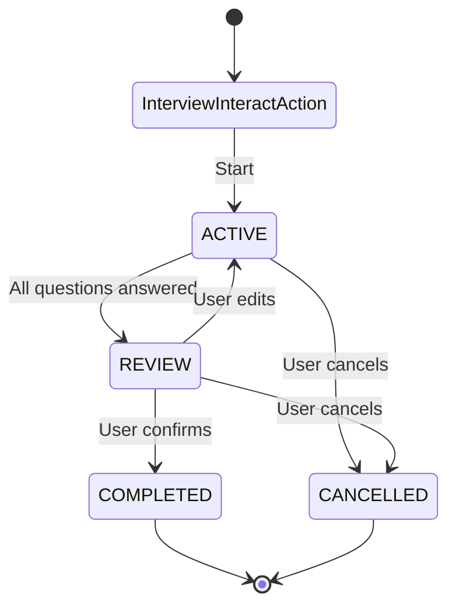

# Interview Action

A reusable, extensible interview system for gathering structured information from users through multi-turn conversations with validation, revision, and confirmation flows.

## Overview

The Interview Action provides a reusable way to collect responses from users in a coordinated, multi-turn conversation. It manages the interview lifecycle from initialization through completion or cancellation using a unified orchestrator pattern.

**Key Design**: `InterviewInteractAction` is an abstract base class that developers extend to create multiple interview flows (e.g., registration, onboarding) within the same agent. Each interview maintains its own per-user session attached to Conversation nodes with type identification.

### Key Features

- **Abstract Base Class Pattern**: Extend `InterviewInteractAction` to create custom interview flows
- **Multiple Interviews Per Agent**: Run registration, onboarding, and other interviews simultaneously
- **Per-User Session Isolation**: Sessions attached to Conversation nodes for user separation
- **Type-Based Session Management**: Sessions identified by `interview_type` field (survives action rebuilds)
- **Unified Classification System**: Single LLM call detects intent (CANCELLATION, CONFIRMATION, UPDATE, SUBMISSION, NONE) and extracts field values
- **DSPy Integration**: Optional DSPy-based classification with typed signatures, optimizable with teleprompters
- **State-Aware Classification**: Enhanced rules for accurate intent detection (e.g., "no" in REVIEW state = UPDATE, not CONFIRMATION)
- **Service Layer Architecture**: Modular design with specialized service classes for classification, state handling, and response processing
- **Logical State Management**: Four distinct states (ACTIVE, REVIEW, COMPLETED, CANCELLED) with clear transitions
- **Same-Interaction State Transitions**: State transitions happen within the same interaction when appropriate
- **Two-Tier Validation**: VALID and INVALID response validation using `ValidationStatus` enum (VALID can include optional feedback messages for clarification)
- **Custom Handlers & Validators**: Process input and validate responses with custom logic
- **Branch Functions**: Define custom Python functions for complex branching logic with full access to session data and graph context
- **Branch Function Caching**: Automatically cache branch function results and track dependencies for performance optimization; smart invalidation when responses change
- **Intelligent Response Pruning**: Automatically remove responses from questions no longer reachable when branching paths change
- **Input Context**: Supply questions with extra context via static `input_context` (hardcoded dict) or dynamic `input_context_provider` (decorated function)
- **Data Input Fields**: Extract values directly from `visitor.data` for file uploads and REST call data (bypasses LLM extraction)
- **Completion Handlers**: Register completion handlers via `@on_interview_complete` decorator
- **Review Override**: Customize the list of values shown in the Review state via `@input_review_override` (omit, format, or adapt items before display)
- **Question Node Rebuilding**: Automatically rebuilds question nodes when `question_graph` changes
- **agent.yaml Overrides**: Override `question_graph` in `context:` and model/templates in `config:` (see Configuration)
- **Standard Anchors**: Automatically includes standard anchors for common interview scenarios (cancellation, correction, review confirmation, etc.) - no need to specify them in each implementation
- **Enhanced UPDATE Handling**: When UPDATE intent has null field, shows summary and prompts for field selection

## State Machine

The interview follows a state machine pattern with the following states and transitions:



### State Descriptions

- **InterviewInteractAction**: Entry point - manages sessions and orchestrates the interview flow
- **ACTIVE**: Actively asking questions and collecting responses. Transitions to REVIEW when all questions are answered.
- **REVIEW**: Presenting summary for user confirmation. Transitions to COMPLETED on confirmation or back to ACTIVE on updates.
- **COMPLETED**: Interview successfully completed (with optional data processing via completion handlers)
- **CANCELLED**: Interview cancelled by user. Session is cleaned up and removed.

## Architecture

### Module layout

The interview action is split into focused packages under `core/`:

| Package | Responsibility |
|---------|----------------|
| **foundation** | Shared types, enums, config dataclasses, prompts, decorators, exceptions. No dependency on other interview packages. |
| **classification** | Intent classification and extraction (LLM or DSPy). `ClassificationHandler` + strategy-style `IntentHandler` implementations. |
| **graph** | Question/state graph: `QuestionNode`, `StateNode`, `QuestionWalker`, `QuestionGraphBuilder`, validators, branch evaluation. |
| **state** | State machine and state-specific directive generation (`StateHandler`, `InterviewStateMachine`). |
| **processing** | Response validation/storage (`ResponseProcessor`) and directive assembly (`DirectiveBuilder`). |
| **session** | Session entity and orchestration service (`InterviewSession`, `InterviewService`). |
| **utils** | Constants, JSON/session helpers, cache utilities. |

Dependency direction: foundation ← utils; classification, graph, state, processing, session depend on foundation (and optionally utils). The action and `InterviewService` orchestrate these; they do not depend on each other’s internals.

### Core Components

#### 1. InterviewInteractAction (Abstract Base Class)
The abstract base class that orchestrates the complete interview flow. **Must be extended** to create concrete interview implementations.

**Key Methods:**
- `on_register()`: Builds question node chain from `question_graph`
- `on_reload()`: Rebuilds question nodes if `question_graph` changed
- `execute()`: Loads/creates session, classifies intent, and generates directives via `InterviewService`

**Service Layer Architecture:**
The interview system uses a service layer pattern with specialized components:
- `InterviewService`: Orchestrates classification, state handling, and directive generation
- `StateHandler`: Generates state-specific directives (ACTIVE, REVIEW, COMPLETED, CANCELLED)
- `ResponseProcessor`: Processes, validates, and stores user responses
- `ClassificationHandler`: Handles intent classification and field extraction (optional DSPy `InterviewClassifier` when `use_dspy` is enabled)
- `QuestionGraphBuilder`: Builds QuestionNode and StateNode graph from `question_graph`
- `InterviewStateMachine`: Manages state transitions with validation

**Unified Classification:**
The system uses a single unified prompt (`INTERVIEW_PROMPT`) that:
- Accepts both utterance and interpretation (when available)
- Detects intent: CANCELLATION, CONFIRMATION, UPDATE, SUBMISSION, or NONE
- Extracts field values for SUBMISSION intent
- Identifies update fields and values for UPDATE intent
- All in a single LLM call for efficiency and consistency

**Data Input Fields:**
Fields with `data_input_field` configured are automatically excluded from LLM extraction. Values are extracted directly from `visitor.data` and treated as SUBMISSION intent, bypassing the LLM classification for those specific fields. This enables file uploads and other binary data to be handled without LLM processing.

#### 2. InterviewSession Node
Persistent node that stores:
- `interview_type`: Class name of the interview action (for filtering)
- Current state
- Question schema/index
- Collected responses
- Validation results per question
- Active question tracking
- Timestamps

**Methods:**
- `reset()`: Reset session to initial state
- `cleanup()`: Delete session from graph
- `extract_data()`: Extract collected data for processing

#### 3. QuestionNode
Represents individual interview questions with:
- Question text and constraints
- Two-tier validation logic (VALID/INVALID)
- Custom input handlers (`process_input()`)
- Custom validators
- Required vs optional flags
- Condition matching for tree traversal

#### 4. QuestionWalker
Specialized walker that traverses QuestionNodes in a tree-based arrangement:
- Finds next unanswered question based on conditional branches
- Processes input via QuestionNode handlers
- Validates responses via QuestionNode validators
- Returns directives for the next question
- Respects conditional branching based on previous answers

#### 5. QuestionEdge
Specialized edge connecting QuestionNodes with optional condition metadata:
- Stores condition information for conditional traversal
- Condition format: `{"op": "equals", "value": "value"}` (question is implicit from branch context)

#### 6. QuestionBranchEvaluator
Provides unified condition matching logic for conditional branching:
- Static utility for evaluating branch conditions
- Supports both operator-based and function-based conditions
- Used by QuestionWalker for tree traversal
- Ensures functions only execute after questions are answered

#### 7. InterviewService
Service layer that orchestrates interview components:
- Coordinates between classification, state handling, and response processing
- Provides unified interface for interview operations

#### 8. StateHandler
Encapsulates state-specific directive generation logic:
- Generates directives based on current interview state
- Handles state transitions and flow control

#### 9. ResponseProcessor
Consolidates logic for processing, validating, and storing user responses:
- Processes extracted field values
- Handles directive overrides (append and replace modes)
- Manages field validation and storage

#### 10. InterviewClassifier
Handles intent classification and field extraction:
- Unified LLM-based classification and extraction
- Supports both prompt-based and DSPy-based backends

#### 11. InteractWalker
Standard walker used throughout. The interview action receives session via conversation queries.

### Standard Anchors

All interview implementations automatically include standard anchors that cover common interview flow scenarios. These standard anchors ensure proper routing classification for scenarios that apply to all interviews, regardless of the specific implementation.

**Standard anchors are automatically merged with implementation-specific anchors** (implementation-specific anchors first, then standard anchors appended). This means you don't need to specify standard anchors in your implementation - they're included automatically.

#### Standard Anchor Categories

1. **Cancellation** (any state):
   - "User requests to cancel interview process"
   - "User wants to stop the interview"
   - "User wants to abort the interview"
   - "User wants to exit the interview"

2. **Correction/Update** (ACTIVE or REVIEW states):
   - "User indicates that not all information is correct"
   - "User wants to change previously provided information"
   - "User wants to update their answers"
   - "User wants to correct their responses"
   - "User indicates information needs to be changed"

3. **Review Confirmation** (REVIEW state):
   - "User confirms the information is correct"
   - "User approves the summary"
   - "User confirms all information is accurate"

4. **General Interview Continuation** (intermediate states):
   - "User is answering interview questions"
   - "User is providing interview information"
   - "User is responding to interview prompts"

#### How It Works

- Standard anchor templates are defined in the `InterviewInteractAction` base class as `_standard_interview_anchor_templates`
- They are automatically contextualized with the class name (e.g., "SignupInterviewInteractAction") in `_merge_standard_anchors()`
- This helps distinguish multiple interview instances coexisting in a single agent
- They are automatically merged with implementation-specific anchors in `on_register()` and `on_reload()`
- Implementation-specific anchors are listed first, followed by context-specific standard anchors
- Duplicates are automatically removed while preserving order

#### Example

```python
class MyInterviewAction(InterviewInteractAction):
    anchors: List[str] = attribute(
        default_factory=lambda: [
            "User wants to start my interview",  # Implementation-specific
            "User is providing my interview data",  # Implementation-specific
            # Standard anchors (cancellation, correction, etc.) are automatically added
        ]
    )
```

The final anchors list will include:
1. "User wants to start my interview"
2. "User is providing my interview data"
3. All standard anchors contextualized with class name (e.g., "User cancels MyInterviewAction", "User answers MyInterviewAction question", etc.)

## File Structure

```
interview/
├── __init__.py                    # Package initialization (exports decorators)
├── interview_interact_action.py   # Abstract base class (orchestrator)
├── decorators.py                  # Decorator functions (@input_handler, @input_validator, @input_review_override, etc.)
├── prompts.py                     # Prompt templates
├── info.yaml                      # Action metadata
├── README.md                      # This file
├── core/
│   ├── __init__.py
│   ├── foundation/                # Core types & configuration
│   │   ├── enums.py               # InterviewState, ValidationStatus, Intent, ContextKey
│   │   ├── exceptions.py          # Custom exceptions
│   │   └── config.py              # Configuration objects
│   ├── graph/                     # Question graph domain
│   │   ├── question_node.py       # QuestionNode
│   │   ├── question_edge.py       # QuestionEdge with conditions
│   │   ├── question_walker.py     # QuestionWalker for tree traversal
│   │   ├── question_branch_evaluator.py  # QuestionBranchEvaluator (condition matching)
│   │   ├── question_graph_builder.py  # QuestionGraphBuilder (question graph construction)
│   │   ├── graph_validator.py     # QuestionGraphValidator
│   │   └── condition_operators.py # ConditionOperator
│   ├── state/                      # State management
│   │   ├── state_machine.py       # InterviewStateMachine (state transitions)
│   │   ├── state_node.py          # StateNode
│   │   └── state_handlers.py      # StateHandler (state-specific directives)
│   ├── classification/            # Classification & intent
│   │   ├── classification_handler.py  # ClassificationHandler (intent classification)
│   │   └── intent_handlers.py     # Intent handlers (strategy pattern)
│   ├── processing/                 # Response processing & directives
│   │   ├── response_processor.py  # ResponseProcessor (response processing)
│   │   └── directive_builder.py  # DirectiveBuilder
│   ├── session/                    # Session & service orchestration
│   │   ├── interview_session.py   # InterviewSession Node
│   │   └── interview_service.py   # InterviewService (orchestration layer)
│   └── utils/                      # Utilities
│       ├── session_utils.py       # Session utilities
│       ├── cache_utils.py         # Cache utilities
│       └── constants.py           # Constants
└── dspy/
    ├── __init__.py                 # DSPy package exports
    ├── signatures.py               # DSPy signatures for classification
    └── modules.py                  # DSPy modules (InterviewClassifier)
```

## Configuration

### Configuration Structure

The interview system uses a hierarchical configuration structure accessed via `action.config`. Model-related keys use the **`model_`** prefix (e.g. `model_action_type`, `model_temperature`, `model_max_tokens`).

```python
# Access configuration
config = action.config

# Model configuration (model_ prefix for model-related keys)
config.model.model_action_type      # "OpenAILanguageModelAction"
config.model.model                  # "gpt-4o"
config.model.model_temperature     # 0.1
config.model.model_max_tokens       # 4096
config.model.use_history            # True
config.model.max_statement_length  # 400
config.model.history_limit          # 5

# Template configuration
config.templates.summary_header           # Summary header template
config.templates.summary_item             # Summary item template
config.templates.review_confirmation      # Review confirmation directive
config.templates.confirmation_instructions # Default confirmation instructions
config.templates.confirmation_prompt      # Default confirmation prompt
config.templates.review_unclear_edit      # Unclear edit directive
config.templates.review_unclear_general   # Unclear general directive
config.templates.update_prompt_for_value  # Update prompt template
config.templates.completion_message       # Completion message
config.templates.cancellation_message     # Cancellation message
config.templates.question_directive       # Question directive template
config.templates.required_field_decline   # Required field decline template
config.templates.interview_prompt         # Interview classification prompt
config.templates.interview_classification_signature  # DSPy signature

# State event messages (via helper function)
config.templates.get_state_event_message("ACTIVE", class_name)
config.templates.get_state_event_message("REVIEW", class_name)
config.templates.get_state_event_message("COMPLETED", class_name)
config.templates.get_state_event_message("CANCELLED", class_name)

# Classification configuration
config.classification.context_list_compact_threshold  # 5
config.classification.context_options_text            # "options available"
config.classification.decline_value                   # "n/a"

# DSPy integration
config.use_dspy  # False (enable DSPy-based classification)
```

### Overriding Configuration in agent.yaml

Interview config (model, templates, use_dspy) must go under the action's **`config:`** block, not `context:`. The loader merges `config:` into the action's config dict, which `InterviewConfig.from_dict()` consumes. Use `context:` only for action attributes (e.g. `enabled`, `description`, `weight`, `anchors`, `question_graph`).

**Model config keys** (under `config:`): use the `model_` prefix for model-related settings — `model_action_type`, `model`, `model_temperature`, `model_max_tokens`. Context/history keys have no prefix: `use_history`, `max_statement_length`, `history_limit`.

```yaml
actions:
  - action: jvagent/my_interview_action
    context:
      enabled: true
      description: "My interview flow"
      weight: -50
      anchors: ["User wants to ..."]
    config:
      # Model (InterviewConfig.model) - model_ prefix for model-related keys
      model_action_type: "OpenAILanguageModelAction"
      model: "gpt-4o-mini"
      model_temperature: 0.2
      model_max_tokens: 2048
      use_history: true
      max_statement_length: 400
      history_limit: 10
      use_dspy: false
      # Template overrides (InterviewConfig.templates)
      completion_message: "Tell the user: All set! Your information has been saved."
      review_confirmation: |
        Here's a summary of your responses:
        {summary}
        
        {instructions}
        {prompt}
      
      # Classification (InterviewConfig.classification)
      classification:
        context_list_compact_threshold: 10
        decline_value: "skipped"
```

### Accessing Templates in Code

When extending the interview system, access templates via `self.config.templates`:

```python
class CustomInterviewAction(InterviewInteractAction):
    async def custom_method(self, session, visitor):
        # Access templates
        templates = self.config.templates
        
        # Use template
        message = templates.completion_message
        
        # Format template
        directive = templates.question_directive.format(
            question="What is your name?",
            description="User's full name",
            context_section="",
            instructions="Please provide first and last name"
        )
        
        # Get state event message
        event = templates.get_state_event_message("ACTIVE", self.get_class_name())
```

## Usage

### Basic Example: Extending InterviewInteractAction

```python
from jvagent.action.interview import InterviewInteractAction
from jvspatial.core.annotations import attribute
from typing import Any, Dict, List

class RegistrationInterviewAction(InterviewInteractAction):
    """User registration interview."""
    
    description: str = "User registration interview flow"
    
    # Anchors for InteractRouter routing
    # Standard interview anchors (cancellation, correction, review confirmation, etc.) are
    # automatically included. You only need to specify implementation-specific anchors.
    anchors: List[str] = attribute(
        default_factory=lambda: [
            # Initial entry anchors - when user wants to start registration
            "User wants to register",
            "User requests registration",
            "User asks to sign up",
            "User wants to create an account",
            # Intermediate state anchors - when user is answering registration questions
            "User is providing registration information",
            "User is answering registration questions",
            "User is completing registration form",
            "User responds to registration prompt",
            # Note: Standard anchors (cancellation, correction, review confirmation, etc.)
            # are automatically merged with these implementation-specific anchors
        ],
        description="Anchor statements for InteractRouter routing. Standard interview anchors are automatically included."
    )
    
    question_graph: List[Dict[str, Any]] = attribute(
        default_factory=lambda: [
            {
                "name": "user_name",
                "question": "What's your full name?",
                "constraints": {
                    "description": "The user's full name",
                    "instructions": "Must include first and last name",
                    "type": "string",
                },
                "required": True
            },
            {
                "name": "user_email",
                "question": "What is your email?",
                "constraints": {
                    "description": "The user's email address",
                    "type": "string",
                    "format": "email"
                },
                "required": True
            },
        ],
        description="List of question configurations. Can be overridden in agent.yaml"
    )
```

### Overriding in agent.yaml

```yaml
actions:
  - type: RegistrationInterviewAction
    enabled: true
    anchors:
      - "User wants to register"
      - "User requests registration"
      - "User is providing registration information"
      - "User is answering registration questions"
      # Note: Standard anchors are automatically merged with these when the action is registered
    question_graph:
      - name: user_name
        question: "What's your full name?"
        constraints:
          description: "The user's full name"
          instructions: "Must include first and last name"
          type: "string"
        required: true
      - name: user_email
        question: "What is your email?"
        constraints:
          description: "The user's email address"
          type: "string"
          format: "email"
        required: true
```

## Question Schema

### Question Configuration Fields

- **name**: Unique identifier for the question (required)
- **question**: Question text to ask the user
- **constraints**: Validation constraints dictionary
  - **description**: Description of what information is needed
  - **instructions**: Additional instructions for the LLM
  - **type**: Expected data type ("string", "number", "integer")
  - **format**: Format specification (e.g., "email")
  - **pattern**: Regex pattern for validation
  - **input_handler**: String reference to function that processes raw input before validation (or use `@input_handler` decorator)
  - **input_validator**: String reference to function that validates responses (or use `@input_validator` decorator)
  - **data_input_field**: Key name in `visitor.data` dictionary to extract value from (e.g., "whatsapp_media"). When specified, the field is excluded from LLM extraction and values are extracted directly from `visitor.data`. Useful for file uploads and other data passed via REST calls.
  - **ambiguous_patterns**: Patterns that trigger VALID status with optional feedback message for clarification
- **input_context**: Optional dictionary of static context data to provide with the question (e.g., available options, metadata). See Context Data section for details.
- **input_context_provider**: Optional string reference to a registered input context provider function (use `@input_context_provider` decorator). The function returns a dictionary of context data dynamically at runtime. See Context Data section for details.
- **Branch Functions**: Register custom branch functions using `@branch_function` decorator for complex branching logic (see Branch Functions section below)
- **required**: Whether the question is required (default: False)
- **branches**: Optional list of conditional branches (see Tree-Based Questions below). Supports both operator-based conditions (`{"op": "equals", "value": "yes"}`) and function-based conditions (`{"function": "function_name"}` or `{"function": "function_name", "op": ">=", "value": 8}`)
- **default_next**: Optional fallback question name if no branch conditions match

### Tree-Based Questions with Conditional Branching

The interview system supports tree-based question arrangements where the next question can be determined conditionally based on previous answers. This enables dynamic interview flows that adapt to user responses.

#### Branch Configuration

Each question can define `branches` with conditions that determine which question to ask next:

```python
question_graph = [
    {
        "name": "user_type",
        "question": "Are you a premium or standard user?",
        "constraints": {
            "description": "User account type",
            "type": "string"
        },
        "required": True,
        "branches": [
            {
                "condition": {"op": "equals", "value": "premium"},
                "target": "premium_features"
            },
            {
                "condition": {"op": "equals", "value": "standard"},
                "target": "standard_setup"
            }
        ],
        "default_next": "contact_info"  # If no condition matches
    },
    {
        "name": "premium_features",
        "question": "Which premium features interest you?",
        "branches": [
            {
                "condition": {"op": "equals", "value": "advanced"},
                "target": "advanced_config"
            }
        ],
        "default_next": "contact_info"
    },
    {
        "name": "standard_setup",
        "question": "Standard setup question",
        "default_next": "contact_info"
    },
    {
        "name": "contact_info",
        "question": "What's your contact information?"
    }
]
```

#### Branch Condition Format

Each branch condition evaluates against the question that owns the branch (question is implicit). Two condition formats are supported:

**Operator-Based Condition:**
```python
{
    "condition": {
        "op": "equals",           # Operator (equals, >=, <=, in, exists, etc.)
        "value": "expected_value"  # Value to match (required for most operators)
    },
    "target": "next_question_name"  # Question name to traverse to if condition matches
}
```

**Function-Based Condition:**
```python
{
    "condition": {
        "function": "function_name"  # Name of registered branch function
    },
    "target": "next_question_name"
}
```

Or with operator evaluation:
```python
{
    "condition": {
        "function": "function_name",  # Function returns a value
        "op": ">=",                   # Operator to evaluate function result
        "value": 8                    # Expected value for comparison
    },
    "target": "next_question_name"
}
```

**Note**: The question is always implicit - conditions evaluate against the question that owns the branch. For example, if `is_sensitive` has a branch with condition `{"op": "equals", "value": "yes"}`, it evaluates `is_sensitive == "yes"`. For function-based conditions, the function receives the session and visitor, allowing it to access all session data and graph context.

#### Branch Functions

Branch functions allow you to define custom Python functions that evaluate complex branching conditions with full access to session data and graph context. This enables sophisticated branching logic that goes beyond simple operator-based comparisons.

**Function Registration:**

Use the `@branch_function` decorator to register branch functions in your interview action class:

```python
from jvagent.action.interview import branch_function
from jvagent.action.interview.core.session.interview_session import InterviewSession
from jvagent.action.interact.interact_walker import InteractWalker

@branch_function()
def check_contains_sensitive_info(
    session: InterviewSession,
    visitor: InteractWalker
) -> bool:
    """Check if report contains sensitive keywords.
    
    Returns True to branch to is_sensitive question, False to continue normal flow.
    """
    description = session.responses.get('report_description', '').lower()
    sensitive_keywords = ['abuse', 'assault', 'violence', 'threat', 'harassment']
    
    # Use session.context to store analysis for later use
    has_sensitive = any(keyword in description for keyword in sensitive_keywords)
    session.context['contains_sensitive_keywords'] = has_sensitive
    
    return has_sensitive
```

**Function Signature:**

All branch functions must accept two parameters:
- `session: InterviewSession` - Full access to session responses, context, and question index
- `visitor: InteractWalker` - Access to graph traversal, conversation, and user data

Functions can be either sync or async.

**Return Types - Two Patterns:**

1. **Boolean Return (Direct Branching)**: Function returns `bool` directly
   ```python
   "condition": {"function": "check_contains_sensitive_info"}
   ```
   - If function returns `True`, branch is taken
   - If function returns `False`, branch is skipped
   - No operator needed - result is used directly

2. **Value Return with Operator**: Function returns any value, evaluated with an operator
   ```python
   "condition": {"function": "calculate_urgency_score", "op": ">=", "value": 8}
   ```
   - Function returns a value (e.g., `int`, `str`, etc.)
   - Value is evaluated using the specified operator and expected value
   - Supports all operators: `equals`, `>=`, `<=`, `in`, `contains`, `matches`, etc.

**Usage in question_graph:**

```python
question_graph = [
    {
        "name": "report_description",
        "question": "Describe the incident you'd like to report in a single message.",
        "constraints": {
            "description": "A full description of the incident or grievance being reported.",
            "type": "string",
        },
        "required": True
    },
    {
        "name": "report_media",
        "question": "Please upload any images of the incident if you have them.",
        "constraints": {
            "description": "Images of the incident uploaded via WhatsApp media.",
            "type": "list",
            "data_input_field": "whatsapp_media",
        },
        "branches": [
            {
                "condition": {"function": "check_contains_sensitive_info"},
                "target": "is_sensitive"
            }
        ],
        "default_next": "reporting_on_behalf",
        "required": False
    },
    {
        "name": "is_sensitive",
        "question": "I noticed that the report includes sensitive information. Would you like to keep it private?",
        "constraints": {
            "type": "string",
            "options": ["yes", "no"],
        },
        "branches": [
            {
                "condition": {"op": "equals", "value": "yes"},
                "target": "REVIEW"
            }
        ],
        "required": True
    }
]
```

**Key Behaviors:**

- Branch functions are only evaluated **after** the question is answered (prevents premature execution during graph traversal)
- Functions have full access to `session.responses`, `session.context`, and `session.question_graph`
- Functions can use `visitor` to traverse the graph, access conversation history, or query user data
- You can mix function-based and operator-based conditions in the same `branches` list
- Functions can store computed values in `session.context` for later use or inter-function communication

**When Functions Execute:**

- Functions execute when the question owning the branch is answered (via `_update_reachable_questions`)
- During graph traversal (before question is answered), function conditions return `False` without executing
- This ensures functions only run when they have meaningful data to evaluate

**Example: Complex Branching with Visitor Access**

```python
@branch_function()
async def check_duplicate_report(
    session: InterviewSession,
    visitor: InteractWalker
) -> bool:
    """Check if similar report exists using graph traversal."""
    description = session.responses.get('report_description', '')
    location = session.responses.get('report_location', '')
    
    # Access conversation via visitor
    from jvagent.memory import Conversation
    conversation = await visitor.nodes(direction="out", node=Conversation)
    if conversation:
        # Query for similar reports in the system
        # similar_reports = await search_reports(description, location)
        # return len(similar_reports) > 0
        pass
    
    return False

@branch_function()
async def calculate_risk_score(
    session: InterviewSession,
    visitor: InteractWalker
) -> int:
    """Calculate risk score 1-10 based on multiple factors.
    
    Returns numeric score to be evaluated with >= operator.
    """
    description = session.responses.get('report_description', '').lower()
    location = session.responses.get('report_location', '')
    
    score = 5  # base score
    
    # Content analysis
    if 'emergency' in description or 'urgent' in description:
        score += 3
    if 'immediate' in description or 'danger' in description:
        score += 2
    
    # Store in context for later use
    session.context['risk_score'] = score
    return score
```

**Mixing Function-Based and Operator-Based Conditions:**

You can combine both types of conditions in the same `branches` list:

```python
"branches": [
    {
        "condition": {"function": "check_similarity"},
        "target": "duplicate_warning"
    },
    {
        "condition": {"op": "equals", "value": "no"},
        "target": "CANCELLED"
    },
    {
        "condition": {"function": "get_priority", "op": "in", "value": ["high", "critical"]},
        "target": "escalate"
    }
]
```

#### How It Works

1. **QuestionWalker** traverses the question tree starting from the first unanswered question
2. When a question has `branches`, it evaluates each condition:
   - **Operator-based conditions**: Evaluated against `session.responses[question_name]`
   - **Function-based conditions**: Functions are called with `session` and `visitor` (only after question is answered)
3. If a condition matches, traversal continues to the `target` question
4. If no condition matches, `default_next` is used (if provided)
5. If no `default_next` and no branches, linear flow continues to next question in list

**Important**: Function-based conditions are only evaluated after the question is answered. During graph traversal (before the question is answered), function conditions return `False` without executing the function. This prevents premature execution and ensures functions only run when they have meaningful data to evaluate.

#### Branch Function Caching & Performance Optimization

Branch functions are automatically cached for performance optimization. When a branch function is executed, its result is cached along with tracking of which responses it accessed. This enables:

**Automatic Dependency Tracking**

The `@branch_function` decorator automatically tracks which response keys are accessed during execution:

```python
@branch_function()
async def analyze_report(session: InterviewSession, visitor: InteractWalker) -> bool:
    # These accesses are automatically tracked:
    description = session.responses.get('report_description')  # Dependency tracked
    location = session.responses.get('report_location')        # Dependency tracked
    
    # Compute complex analysis...
    return len(description) > 100
```

**Transparent Result Caching**

- First execution: Function runs normally, result is cached with its dependencies
- Subsequent accesses: Cached result returned if all dependencies unchanged
- Dependency change: Cache invalidated, function re-executed only if dependency value changed

**Performance Benefits**

For expensive operations (ML inference, external APIs, complex computation):

```python
@branch_function()
async def check_sentiment_risk(session: InterviewSession, visitor: InteractWalker) -> bool:
    """Expensive ML operation - automatically cached."""
    description = session.responses.get('report_description')
    
    # Call ML model (expensive operation)
    sentiment = await ml_service.analyze_sentiment(description)  # Called once, cached
    risk_score = sentiment['negative_score']
    
    return risk_score > 0.7
```

Without caching, this ML call would happen every time the session is accessed. With caching:
- **First call**: ML service invoked, result cached with `dependencies: ['report_description']`
- **Same description**: Cached result returned (0 cost)
- **Changed description**: ML service invoked only once (not repeatedly)

**Smart Cache Invalidation**

When a response is updated, only branch functions that depend on that response are invalidated:

```python
# User updates report_description
session.update_response('report_description', new_value)

# Automatic behavior:
# 1. Branch cache for check_sentiment_risk is invalidated (depends on report_description)
# 2. Branch cache for other functions remains valid if they don't depend on it
# 3. Next evaluation of check_sentiment_risk triggers re-execution
```

**Response Pruning on Path Changes**

When a branch function result changes due to a response update, and the branching path changes, responses from questions on the old path are automatically pruned (removed):

```python
question_graph = [
    {
        "name": "report_description",
        "branches": [
            {"condition": {"function": "check_contains_sensitive"}, "target": "sensitive_handling"},
            {"condition": {"op": "exists"}, "target": "normal_flow"}
        ]
    },
    {
        "name": "sensitive_handling",
        "question": "Handle sensitive content...",
        "default_next": "confirm"
    },
    {
        "name": "normal_flow",
        "question": "Normal processing...",
        "default_next": "confirm"
    },
    {
        "name": "confirm",
        "question": "Confirm your report?"
    }
]

# Flow:
# 1. User enters "Safe report" → check_contains_sensitive returns False → normal_flow path
# 2. User answers normal_flow question
# 3. User updates report_description to "Unsafe content"
# 4. check_contains_sensitive returns True → sensitive_handling path (path changed!)
# 5. Response from normal_flow question is automatically pruned (no longer on valid path)
# 6. Session follows sensitive_handling path instead
```

Pruned responses are recorded in audit trail for debugging and potential undo operations.

**No Code Changes Required**

Caching is completely automatic:
- Existing branch functions work unchanged
- No configuration needed
- Transparent performance optimization
- All operations logged for debugging

#### Branch Reset Behavior

Branch evaluation and response management is automatically handled whenever responses change, ensuring the interview path always matches the current state.

**When Branches Are Re-Evaluated**

Branches are automatically re-evaluated in two scenarios:

1. **After a Question is Answered** (`_update_reachable_questions`): When a user completes a question, all branches owned by that question are evaluated to determine the next target
2. **When a Response is Updated** (`_update_reachable_questions`): When a user modifies a previous answer in the UPDATE state, branches are re-evaluated to detect path changes

**Automatic Response Pruning on Path Changes**

When branch re-evaluation detects a path change (the branching target changes from the previous evaluation), responses from questions on the old path are automatically removed:

```python
# Example: Sensitive content branching
question_graph = [
    {
        "name": "report_description",
        "question": "Describe the incident.",
        "branches": [
            {"condition": {"function": "has_sensitive_content"}, "target": "privacy_prompt"},
            {"condition": {"op": "exists"}, "target": "normal_flow"}
        ]
    },
    {
        "name": "privacy_prompt",
        "question": "Keep this report private?",
        "required": True,
        "default_next": "REVIEW"
    },
    {
        "name": "normal_flow",
        "question": "How did you discover this issue?",
        "required": True,
        "default_next": "REVIEW"
    }
]

# Session flow:
# 1. User enters "I found a bug" → has_sensitive_content() returns False → normal_flow path
# 2. User answers normal_flow question: "Code review" (response stored)
# 3. In REVIEW state, user selects UPDATE on report_description
# 4. User changes to "Abuse incident" → has_sensitive_content() returns True → privacy_prompt path (CHANGED!)
# 5. Response from normal_flow question ("Code review") is automatically pruned
# 6. Session is now on privacy_prompt path, ready for the privacy question
```

**Pruning Behavior Details**

- **Triggered by**: Path change detected during branch re-evaluation (old_target != new_target)
- **Scope**: Only responses from questions no longer reachable on the new path are removed
- **Preserved**: All responses on the new path remain intact
- **Audit Trail**: Pruned responses are recorded in `session.update_history` with timestamps for debugging
- **Automatic**: No manual intervention required - the system handles all path detection and pruning

**Example: Complex Multi-Level Branching**

```python
# Scenario: Incident categorization with cascading branches
question_graph = [
    {
        "name": "incident_type",
        "question": "What type of incident?",
        "branches": [
            {"condition": {"op": "equals", "value": "safety"}, "target": "safety_branch"},
            {"condition": {"op": "equals", "value": "property"}, "target": "property_branch"}
        ]
    },
    {
        "name": "safety_branch",
        "question": "Is anyone injured?",
        "branches": [
            {"condition": {"op": "equals", "value": "yes"}, "target": "injury_details"},
            {"condition": {"op": "equals", "value": "no"}, "target": "REVIEW"}
        ]
    },
    {
        "name": "injury_details",
        "question": "Describe injuries and medical attention needed.",
        "default_next": "REVIEW"
    },
    {
        "name": "property_branch",
        "question": "Describe the property damage.",
        "default_next": "REVIEW"
    }
]

# Automatic path reset example:
# 1. User: "safety" → "yes" → answers injury_details
# 2. In REVIEW, user updates incident_type to "property"
# 3. All responses after the change point (safety_branch, injury_details) are pruned
# 4. Session now ready for property_branch path
```

**Performance Considerations**

- **Efficient Detection**: Path change detection uses cached branch results; only invalidated branches are re-evaluated
- **Minimal Pruning**: Only responses no longer reachable are removed - reachable responses preserved
- **Logging**: All path changes and pruning operations are logged at DEBUG level for troubleshooting

```python
# Debug logs show the flow:
# DEBUG: Evaluating branch condition for 'incident_type'
# DEBUG: Branch cache HIT for function 'get_incident_category'. Using cached result.
# DEBUG: Branch condition MATCHED: incident_type -> safety_branch (cached)
# DEBUG: Branch condition INVALIDATED due to response change
# DEBUG: Detecting path change for 'incident_type'
# DEBUG: Path CHANGED: safety_branch -> property_branch
# DEBUG: Pruning response from unreachable question: 'injury_details'
```

#### Linear Questions (No Branches)


Questions without `branches` work as before - they follow linear order or use `default_next`:

```python
question_graph = [
    {
        "name": "question1",
        "question": "First question"
        # No branches - will go to next question in list or default_next if specified
    },
    {
        "name": "question2",
        "question": "Second question"
    }
]
```

#### Example: User Onboarding Flow

```python
question_graph = [
    {
        "name": "account_type",
        "question": "What type of account do you want? (personal/business)",
        "branches": [
            {"condition": {"op": "equals", "value": "business"}, "target": "business_details"},
            {"condition": {"op": "equals", "value": "personal"}, "target": "personal_details"}
        ]
    },
    {
        "name": "business_details",
        "question": "What's your company name?",
        "default_next": "contact_info"
    },
    {
        "name": "personal_details",
        "question": "What's your full name?",
        "default_next": "contact_info"
    },
    {
        "name": "contact_info",
        "question": "What's your email address?"
    }
]
```

### Custom Input Handlers

Process raw input before validation (e.g., normalize time expressions):

**Recommended Approach: Use Decorators**

The cleanest way to register handlers is using the `@input_handler` decorator:

```python
from jvagent.action.interview import (
    InterviewInteractAction,
    input_handler,
)
from jvagent.action.interview.core.session.interview_session import InterviewSession
from jvagent.memory import Interaction

@input_handler('available_times')
def normalize_time_expression(
    raw_input: str, 
    session: InterviewSession,
    interaction: Interaction
) -> str:
    """Convert 'next Tuesday' to specific date."""
    # Can access interaction.user_id, interaction.utterance, etc.
    # Implementation here
    return normalized_date

class MyInterviewAction(InterviewInteractAction):
    question_graph = [
        {
            "name": "available_times",
            "constraints": {
                # Handler is automatically found via decorator
            }
        }
    ]
```


**Alternative: String References in question_graph**

You can also specify handlers as string references in `question_graph`:

```python
question_graph = [
    {
        "name": "available_times",
        "constraints": {
            # Use full module path or function name (if in same module)
            "input_handler": "jvagent.actions.namespace.my_action.normalize_time_expression",
            # Or just function name if in the same module:
            # "input_handler": "normalize_time_expression",
        }
    }
]
```

In agent.yaml:
```yaml
constraints:
  input_handler: "module.path.function_name"
```

### Custom Validators

Validate responses with custom logic:

**Recommended Approach: Use Decorators**

The cleanest way to register validators is using the `@input_validator` decorator:

```python
from jvagent.action.interview import (
    InterviewInteractAction,
    input_validator,
)
from jvagent.action.interview.core.enums import ValidationStatus

@input_validator('user_email')
def validate_email_domain(value: str, session: InterviewSession) -> Tuple[ValidationStatus, Optional[str]]:
    """Check if email domain is allowed."""
    if "@company.com" not in value:
        return ValidationStatus.INVALID, "Only company emails are allowed"
    return ValidationStatus.VALID, None

class MyInterviewAction(InterviewInteractAction):
    question_graph = [
        {
            "name": "user_email",
            "constraints": {
                # Validator is automatically found via decorator
            }
        }
    ]
```

**Alternative: String References in question_graph**

You can also specify validators as string references in `question_graph`:

```python
question_graph = [
    {
        "name": "user_email",
        "constraints": {
            # Use full module path or function name (if in same module)
            "input_validator": "jvagent.actions.namespace.my_action.validate_email_domain",
            # Or just function name if in the same module:
            # "input_validator": "validate_email_domain",
        }
    }
]
```


**String Reference Formats:**
- Full module path: `"package.module.function_name"` (recommended for reliability)
- Function name only: `"function_name"` (searches loaded modules, may have collisions)
- Module-qualified: `"module_name.function_name"` (tries to import module)

**Resolution Priority:**
1. Decorator-registered handlers/validators (checked first)
2. String references in `question_graph` constraints (fallback)

Validators can return:
- `(ValidationStatus, message)`: Status and feedback message
- `(ValidationStatus, message, corrected_value)`: Status, feedback message, and autocorrected value
- `bool`: True for VALID, False for INVALID

**Autocorrection Support:**
Validators can return a corrected value as the third element of the tuple. If provided, the system will store the corrected value instead of the original input. This is useful for fuzzy matching scenarios (e.g., correcting "next tuesday" to a specific date, or matching "morning" to "9:00 AM").

### Data Input Fields (Direct Extraction from visitor.data)

For fields that receive data directly from REST calls (e.g., file uploads, binary data), you can use `data_input_field` to extract values directly from the `visitor.data` dictionary, bypassing LLM extraction entirely.

**How It Works:**
- When `data_input_field` is specified in a question's constraints, the system checks `visitor.data` for a matching key
- If the key exists, the value is extracted and treated as a SUBMISSION (new data)
- The field is automatically excluded from LLM extraction (not included in `entities_to_extract`)
- Values go through the same validation pipeline (input handlers and validators) as LLM-extracted values

**Example: File Upload via WhatsApp Media**

```python
question_graph = [
    {
        "name": "report_media",
        "question": "Please upload any images of the incident if you have them.",
        "constraints": {
            "description": "Images of the incident uploaded via WhatsApp media.",
            "type": "list",
            "data_input_field": "whatsapp_media"  # Maps to visitor.data["whatsapp_media"]
        },
        "required": False
    }
]
```

**REST Call Payload:**
```json
{
  "channel": "whatsapp",
  "data": {
    "whatsapp_media": [
      "http://www.imageabc.com/image.jpg",
      "http://www.imageabe.com/image2.jpg"
    ]
  },
  "session_id": "sess_2965a1c7e4d6426c",
  "user_id": "5926555555",
  "utterance": "I've attached media"
}
```

**Key Behaviors:**
- **Exclusion from LLM**: Fields with `data_input_field` are not sent to the LLM for extraction
- **Always SUBMISSION**: Data input values are always treated as SUBMISSION intent, regardless of whether the field already has a value in the session
- **Validation Pipeline**: Values still go through `process_input()` and `validate_response()` if handlers/validators are registered
- **Coexistence**: Works alongside LLM extraction - other fields without `data_input_field` are still extracted by the LLM

**Use Cases:**
- File uploads (images, documents, etc.)
- Binary data passed via REST calls
- Pre-processed data that shouldn't be extracted from text
- Data that comes from external systems rather than user utterances

### Context Data

**`input_context`** and **`input_context_provider`** let you attach extra data to a question so the user sees options, metadata, or personalized choices. Use **`input_context`** when the data is fixed (e.g. a list of locations or timezone). Use **`input_context_provider`** when the data must be computed at runtime (e.g. available slots from an API, options derived from earlier answers). Both are optional; omit them for questions that need no extra context.

**Static Context Data (`input_context`):**

Static context is hardcoded directly in the question configuration:

```python
question_graph = [
    {
        "name": "preferred_location",
        "question": "Which location would you prefer?",
        "constraints": {
            "description": "User's preferred training location",
            "type": "string",
        },
        "input_context": {
            "available_locations": ["New York", "San Francisco", "Chicago", "Austin"],
            "timezone": "America/New_York"
        },
        "required": True
    }
]
```

**Dynamic Context Data (`input_context_provider`):**

Register a provider with the **`@input_context_provider`** decorator. Use **`@input_context_provider()`** (no argument) to register by the function’s `__name__`, or **`@input_context_provider("custom_name")`** to register under a custom name that you reference in the question’s `input_context_provider` string.

```python
from jvagent.action.interview import (
    InterviewInteractAction,
    input_context_provider,
)
from jvagent.action.interview.core.session.interview_session import InterviewSession
from jvagent.action.interact.interact_walker import InteractWalker
from typing import Dict, Any

# No name: provider name defaults to the function's __name__ ('get_available_times')
@input_context_provider()
async def get_available_times(
    session: InterviewSession,
    visitor: InteractWalker
) -> Dict[str, Any]:
    """Dynamically fetch available training times.
    
    This could query an external calendar API, database, or compute
    availability based on session data.
    """
    # Example: Fetch from external calendar API
    # available_slots = await calendar_api.get_availability()
    
    # For demonstration, return static data
    return {
        "available_times": [
            "Monday 9:00 AM - 11:00 AM",
            "Tuesday 2:00 PM - 4:00 PM",
            "Friday 5:00 PM - 7:00 PM"
        ],
        "timezone": "EST",
        "last_updated": "2024-01-15T10:00:00Z"
    }

class MyInterviewAction(InterviewInteractAction):
    question_graph = [
        {
            "name": "preferred_time",
            "question": "When would you like to schedule your training?",
            "input_context_provider": "get_available_times",  # References the decorated function
            "constraints": {
                "description": "User's preferred training time",
                "type": "string",
            },
            "required": True
        }
    ]
```

**Function Signature:**

Context data provider functions must accept two parameters:
- `session: InterviewSession` - Access to session responses, context, and question index
- `visitor: InteractWalker` - Access to graph traversal, conversation, and user data

Functions can be either sync or async and must return a `Dict[str, Any]`.

**How Context Data is Used:**

1. **Question Directives**: Context data is formatted and included in the question prompt shown to the user
2. **Classification**: Context helps the LLM understand valid responses for better extraction accuracy
3. **Validation**: Context can inform validators about valid options
4. **Input Handlers**: Handlers can access the question config to see context data

**Context Data Format:**

The context data dictionary supports flexible structure:

```python
{
    # List of options (most common use case)
    "available_options": ["Option A", "Option B", "Option C"],
    
    # Structured data
    "time_slots": [
        {"time": "9:00 AM", "available": True, "spots": 5},
        {"time": "2:00 PM", "available": False, "spots": 0}
    ],
    
    # Metadata
    "timezone": "America/New_York",
    "last_updated": "2024-01-15T10:00:00Z",
    "note": "Times are in Eastern Standard Time"
}
```

**Combining Static and Dynamic Context:**

You can use both `input_context` and `input_context_provider` together. Dynamic context takes precedence:

```python
{
    "name": "preferred_time",
    "question": "When would you like to schedule your training?",
    "input_context": {
        "timezone": "EST",  # Static metadata
    },
    "input_context_provider": "get_available_times",  # Dynamic times
    "constraints": {
        "description": "User's preferred training time",
        "type": "string",
    },
    "required": True
}
```

**Example: Personalized Options Based on User Profile:**

```python
@input_context_provider()
async def get_personalized_courses(
    session: InterviewSession,
    visitor: InteractWalker
) -> Dict[str, Any]:
    """Provide course options based on user's skill level."""
    # Get user's skill level from previous answer
    skill_level = session.responses.get('skill_level', 'beginner')
    
    # Fetch appropriate courses
    if skill_level == 'beginner':
        courses = ["Intro to Python", "Web Development Basics", "Git Fundamentals"]
    elif skill_level == 'intermediate':
        courses = ["Advanced Python", "React Deep Dive", "System Design"]
    else:  # advanced
        courses = ["Machine Learning", "Distributed Systems", "Performance Optimization"]
    
    return {
        "available_courses": courses,
        "skill_level": skill_level,
        "note": f"These courses are recommended for {skill_level} level"
    }
```

**Example: External API Integration:**

```python
@input_context_provider()
async def get_shipping_options(
    session: InterviewSession,
    visitor: InteractWalker
) -> Dict[str, Any]:
    """Fetch real-time shipping options based on destination."""
    destination = session.responses.get('shipping_address', '')
    
    # Call external shipping API
    # shipping_api = await get_shipping_api()
    # options = await shipping_api.get_rates(destination)
    
    # Example return
    return {
        "shipping_methods": [
            "Standard (5-7 days) - $5.99",
            "Express (2-3 days) - $12.99",
            "Overnight - $24.99"
        ],
        "destination": destination,
        "currency": "USD"
    }
```

**Benefits:**

- **Better User Experience**: Users see relevant options without having to guess
- **Improved Extraction**: LLM has context about valid responses for accurate field extraction
- **Dynamic Personalization**: Context can adapt based on user's previous responses
- **External Integration**: Fetch real-time data from APIs, databases, or services

**Notes:**

- Context data providers are called when the question is presented to the user
- If a provider function fails, the system falls back to static context (if available)
- Context data is optional - questions without context continue to work as before
- Context data is included in the classification context to help the LLM extract valid values

### Directive Overrides

Customize agent responses after a field value is successfully validated and stored using the `@input_directive_override` decorator. This allows you to conditionally replace or append to the default directive based on the stored value.

**Recommended Approach: Use Decorators**

The cleanest way to register directive overrides is using the `@input_directive_override` decorator:

```python
from jvagent.action.interview import (
    InterviewInteractAction,
    input_directive_override,
)
from jvagent.action.interview.core.session.interview_session import InterviewSession
from jvagent.memory import Interaction
from jvagent.action.interact.interact_walker import InteractWalker
from typing import Optional, Union, Tuple

@input_directive_override('user_email')
async def custom_email_directive(
    field_name: str,
    value: str,
    session: InterviewSession,
    interaction: Interaction,
    visitor: InteractWalker
) -> Optional[Union[str, Tuple[str, str]]]:
    """Custom directive after email is collected."""
    # Check if email domain matches specific criteria
    if '@example.com' in value:
        # Replace default directive
        return "Tell the user: Thank you for using your work email! We'll send you special updates."
    # Return None to use default directive
    return None

class MyInterviewAction(InterviewInteractAction):
    question_graph = [
        {
            "name": "user_email",
            "constraints": {
                # Override is automatically found via decorator
            }
        }
    ]
```

**Override Function Signature:**

The override function must accept five parameters:
- `field_name: str` - Name of the field that was just stored
- `value: Any` - The value that was stored
- `session: InterviewSession` - Interview session for context
- `interaction: Interaction` - Current interaction
- `visitor: InteractWalker` - Walker for context

**Return Values:**

The override function can return:
- `None` - Use default directive (no override)
- `str` - Replace default directive with this string
- `Tuple[str, str]` - First element is mode ("append" or "replace"), second is directive string

**Append vs Replace:**

You can specify whether to append to or replace the default directive:

```python
@input_directive_override('user_name')
async def append_name_directive(
    field_name: str,
    value: str,
    session: InterviewSession,
    interaction: Interaction,
    visitor: InteractWalker
) -> Optional[Union[str, Tuple[str, str]]]:
    """Append custom message after name is collected."""
    # Append mode: custom directive is appended after the next question directive
    # If there's a next question, it's queued first, then the custom directive
    # If there's no next question (interview complete), only the custom directive is queued
    return ("append", f"Tell the user: Nice to meet you, {value}!")

@input_directive_override('user_email')
async def replace_email_directive(
    field_name: str,
    value: str,
    session: InterviewSession,
    interaction: Interaction,
    visitor: InteractWalker
) -> Optional[Union[str, Tuple[str, str]]]:
    """Replace default directive for email."""
    # Replace mode: only the custom directive is queued, no next question directive
    return ("replace", "Tell the user: Your email has been recorded. We'll send you updates soon!")
```

**Append Mode Behavior:**
- **With next question**: Next question directive is queued first, then the custom directive(s)
- **Without next question**: Only the custom directive(s) are queued (interview may be complete)

### Review Override

Customize the list of values shown in the Review state (before the user confirms) using the `@input_review_override` decorator. The override receives a key-value map of collected interview data (field name to value) and returns a dict used only for rendering the summary. Modifications are **for display only** and do not alter the values stored in the interview session. The decorator has no parameters and applies only to the `InterviewInteractAction` subclass defined in the same module.

**Handler signature:** `(session: InterviewSession, data: Dict[str, Any]) -> Dict[str, Any]` (sync or async). Omit fields by dropping keys from the returned dict; format by changing values. Display name is derived from the key when rendering.

**Example:**

```python
from jvagent.action.interview import (
    InterviewInteractAction,
    input_review_override,
)
from jvagent.action.interview.core.session.interview_session import InterviewSession
from typing import Any, Dict

@input_review_override
def adapt_review_for_display(
    session: InterviewSession,
    data: Dict[str, Any],
) -> Dict[str, Any]:
    """Omit optional fields when empty; display only, session unchanged."""
    return {k: v for k, v in data.items() if v not in (None, "", "n/a")}

class MyInterviewAction(InterviewInteractAction):
    question_graph = [...]
```
- Custom directives are **always** queued in append mode, regardless of whether a next question exists

**When Overrides Are Triggered:**

Directive overrides are checked:
- After a field value is successfully validated and stored (VALID status)
- In both SUBMISSION flow (when answering questions) and UPDATE flow (when updating existing values)
- Before the default directive is sent to the user

**Important Notes:**

- Override functions can be either sync or async
- Overrides only apply after successful validation - invalid values won't trigger overrides
- Multiple fields can have overrides - each is checked independently after its value is stored
- In append mode, custom directives are always queued, even if there's no next question
- In replace mode, only the custom directive is queued and the normal flow is prevented from finding the next question

## Unified Classification System

The interview system uses a single unified prompt (`INTERVIEW_PROMPT`) that combines intent detection and field extraction in one LLM call. This approach is more efficient and ensures consistency.

### Classification Backend Options

The system supports two classification backends:

1. **Prompt-Based Classification** (default): Uses a structured prompt template with JSON response format
2. **DSPy-Based Classification** (optional): Uses typed DSPy signatures that can be optimized with DSPy teleprompters

Enable DSPy classification by setting `use_dspy=True` in your interview action:

```python
class MyInterviewAction(InterviewInteractAction):
    use_dspy: bool = attribute(
        default=True,
        description="Use DSPy module for classification"
    )
```

**Benefits of DSPy Integration:**
- Typed signatures for better structure and validation
- Optimizable with DSPy teleprompters (BootstrapFewShot, MIPROv2, etc.)
- Evaluable with `dspy.Evaluate` for performance measurement
- Consistent interface regardless of backend

### Intent Detection

The system detects intent types using the `Intent` enum with state-aware rules:

- **Intent.CANCELLATION**: User wants to cancel/stop the interview
  - Highest priority, overrides all other intents
  - Can occur in any state
  
- **Intent.CONFIRMATION**: User confirms/approves information (only in REVIEW state)
  - Only applies to positive affirmations ("yes", "correct", "looks good", etc.)
  - **CRITICAL**: "No" is NOT a CONFIRMATION indicator
  
- **Intent.UPDATE**: User wants to change/update a previously answered field
  - **State-Aware Rule**: In REVIEW state, "no" (rejecting confirmation) = UPDATE
  - When field is null, system shows summary and asks which field to change
  - Uses interpretation field when available for better context
  
- **Intent.SUBMISSION**: User is providing answers to unanswered questions
  - Extracts field values from message and conversation history
  - Also includes values from `data_input_field` (extracted directly from `visitor.data`, bypassing LLM)
  
- **Intent.DECLINE**: User declines to answer a non-required question
  - Stores "n/a" for declined optional fields
  
- **Intent.NONE**: No clear intent or conversational filler

### State-Aware Classification Rules

The classification system includes state-aware rules for better accuracy:

- **"No" in REVIEW state**: Classified as UPDATE (rejecting confirmation), not CONFIRMATION
- **Interpretation context**: When interpretation indicates "not correct" or "wrong", prefers UPDATE intent
- **Field normalization**: Handles string "null" values from JSON parsing, normalizing them to Python None

### Input Processing

The unified prompt accepts both:
- **User's utterance**: The raw user message
- **Interpretation**: LLM-generated interpretation of user intent (when available)

Both are provided to the prompt when available, giving the classification system more context for accurate intent detection and extraction. The interpretation field is particularly useful for distinguishing between "no" as rejection (UPDATE) vs "no" as answer to a question (SUBMISSION).

### Classification Result

The `ClassificationResult` dataclass contains:
- `intent`: Detected intent type
- `confidence`: Confidence score (0.0-1.0)
- `extracted_data`: Extracted field values (for SUBMISSION intent)
- `field`: Field name (for UPDATE intent, null if unclear)
- `value`: Field value (for UPDATE intent, null if not provided)

### UPDATE Intent Handling

When UPDATE intent is detected:

1. **With field specified**: Processes the update inline using QuestionNode validation
2. **Without field (null)**: Shows summary of current information and prompts user to specify which field to change
3. **Field normalization**: Automatically handles string "null" values from JSON parsing

### State Transitions

State transitions happen within the same interaction when appropriate:
- **ACTIVE → REVIEW**: When all required questions are answered
- **REVIEW → COMPLETED**: When CONFIRMATION intent is detected
- **REVIEW → ACTIVE**: When UPDATE intent is detected and processed
- **Any → CANCELLED**: When CANCELLATION intent is detected

## Validation System

### Two-Tier Validation

The validation system uses the `ValidationStatus` enum with two statuses:

1. **ValidationStatus.VALID**: Response meets all constraints
   - Stored immediately
   - System moves to next question
   - Can optionally include a feedback message for clarification (e.g., for ambiguous values like "next Tuesday")
   - Example: "next Tuesday" → stores value and optionally asks for specific time via feedback

2. **ValidationStatus.INVALID**: Response doesn't meet constraints
   - Not stored
   - System provides feedback and re-asks the question

## Data Handling Patterns

### Pattern A: Use Completion Handler Decorator (Recommended)

Use the `@on_interview_complete` decorator to register a completion handler:

```python
from jvagent.action.interview import (
    InterviewInteractAction,
    on_interview_complete,
)
from jvagent.action.interview.core.interview_session import InterviewSession
from jvagent.action.interact.interact_walker import InteractWalker

@on_interview_complete('MyInterviewAction')
async def handle_interview_completion(
    session: InterviewSession,
    visitor: InteractWalker
) -> None:
    """Process data when interview completes."""
    data = session.export_data()
    # Store in user profile, database, etc.
    user = await visitor.interaction.get_conversation().get_user()
    user.preferences = data["responses"]
    await user.save()

class MyInterviewAction(InterviewInteractAction):
    # Handler is automatically found via decorator
    question_graph = [...]
```

**Note:** Completion handlers are the recommended approach. The system automatically calls registered handlers when the interview transitions to COMPLETED state.

### Pattern B: Separate Data Handler Action

Create a separate `InteractAction` that processes completed sessions:

```python
class AppointmentDataHandlerAction(InteractAction):
    weight: int = -30  # Runs after interview
    
    async def execute(self, visitor: InteractWalker) -> None:
        conversation = await visitor.interaction.get_conversation()
        session = await conversation.node(
            node=InterviewSession,
            interview_type="AppointmentInterviewAction",
            state=InterviewState.COMPLETED,
        )
        if session and not session.context.get("processed"):
            data = session.extract_data()
            await self.create_appointment(data["responses"])
            session.context["processed"] = True
            await session.save()
```

### Pattern C: Callback in Interview Action

Override `on_interview_complete()` in your interview action (if implemented).

## Session Management

### Per-User Isolation

Sessions are attached to Conversation nodes, ensuring each user has their own sessions:

```python
# Session is created and attached to conversation
session = await InterviewSession.create(
    agent_id=self.agent_id,
    conversation_id=conversation.id,
    interview_type=self.get_class_name(),  # e.g., "RegistrationInterviewAction"
    question_graph=self.question_graph,
    state=InterviewState.ACTIVE,
)
await conversation.connect(session)
```

### Type-Based Loading

Sessions are queried by `interview_type` to support multiple interviews per agent:

```python
session = await conversation.node(
    node=[{'InterviewSession': {
        "state": {"$nin": [InterviewState.COMPLETED.value, InterviewState.CANCELLED.value]}
    }}],
    interview_type="RegistrationInterviewAction",
)
```

### Action Rebuild Resilience

Sessions store `interview_type` as metadata, so they persist even when interview actions are destroyed and rebuilt during agent reconfiguration.

## Session Lifecycle

### Reset Session

```python
await session.reset()  # Clears responses, resets to ACTIVE
```

### Cleanup Session

```python
await session.cleanup()  # Deletes session from graph
```

### Extract Data

```python
data = session.extract_data()  # Returns dict with responses and metadata
```

## Question Node Rebuilding

When `question_graph` changes (via `on_reload()`), question nodes are automatically rebuilt:

1. Detects changes by comparing existing node labels with expected labels
2. Disconnects and deletes old question nodes
3. Rebuilds question node chain from new `question_graph`

## Completion Handling

**Use `@on_interview_complete` Decorator**

Register a completion handler using the decorator:

```python
from jvagent.action.interview import (
    InterviewInteractAction,
    on_interview_complete,
)
from jvagent.action.interview.core.interview_session import InterviewSession
from jvagent.action.interact.interact_walker import InteractWalker
from jvagent.action.interact.base import InteractAction

@on_interview_complete('InterviewActionName')
async def handle_completion(
    session: InterviewSession,
    visitor: InteractWalker,
    action: InteractAction
) -> None:
    """Process collected data when interview completes."""
    data = session.extract_data()
    # Process data, send notifications, etc.
    await action.respond(visitor, directives=["Thank you! Your data has been processed."])
    # Clean up session after processing
    await session.cleanup()
```

The completion handler is called automatically when the interview transitions to COMPLETED state.

## Multiple Interviews Per Agent

You can run multiple interview types in the same agent:

```python
# In agent configuration
actions:
  - type: RegistrationInterviewAction
    enabled: true
  - type: OnboardingInterviewAction
    enabled: true
  - type: AppointmentInterviewAction
    enabled: true
```

Each maintains its own sessions via `interview_type` identification.

## Best Practices

1. **Question Design**: Make questions clear and specific
2. **Validation Rules**: Use appropriate validation levels
3. **Custom Handlers**: Use input handlers for normalization, validators for business logic
4. **Data Processing**: Choose appropriate pattern (A, B, or C) based on complexity
5. **Session Cleanup**: Clean up sessions after data is processed
6. **Type Identification**: Always use unique class names for interview types
7. **DSPy Classification**: Enable `use_dspy=True` for optimizable and evaluable classification
8. **State-Aware Responses**: Be aware that "no" in REVIEW state means UPDATE (rejecting confirmation), not CONFIRMATION

## Troubleshooting

### Session Not Found
- Ensure conversation exists before creating session
- Check that `interview_type` matches the class name
- Verify session is attached to conversation

### State Not Transitioning
- Verify `session.save()` is called after `transition_to()`
- Check that all required questions are answered before REVIEW

### Question Nodes Not Rebuilding
- Ensure `on_reload()` is called when `question_graph` changes
- Check that question names in `question_graph` match expected format

### Custom Handlers Not Working
- Verify handler is callable (for Python code) or importable (for agent.yaml)
- Check that handler signature matches: `(raw_input: str, session: InterviewSession) -> Any`

## Performance & Optimization

### Branch Function Caching

Branch functions are automatically cached for performance optimization. The system tracks which response keys each branch function accesses and intelligently manages cache validity.

**How It Works:**

1. **First Execution**: Function runs normally, result is cached with dependency metadata
2. **Cache Hit**: When accessed again with unchanged dependencies, cached result is returned instantly
3. **Dependency Change**: When a dependent response changes, cache is automatically invalidated
4. **Re-execution**: Function is only re-executed if a dependency value actually changed

**Checking Cache Status:**

Enable debug logging to observe cache operations:

```python
import logging
logging.getLogger('jvagent.action.interview.core.graph.question_branch_evaluator').setLevel(logging.DEBUG)
logging.getLogger('jvagent.action.interview.core.utils.cache_utils').setLevel(logging.DEBUG)
```

Example log output:
```
DEBUG: Branch cache set for key 'report_description:check_sentiment:a1b2c3d4' with dependencies: {'report_description'}
DEBUG: Branch cache HIT for function 'check_sentiment' on question 'report_description'. Using cached result: True
DEBUG: Branch cache invalidated 1 entries due to response change: report_description
DEBUG: Recorded branch path for 'report_description': target='sensitive_handling'
```

**Performance Impact:**

For expensive branch functions (ML inference, external APIs, complex computation):

```python
@branch_function()
async def analyze_sentiment(session: InterviewSession, visitor: InteractWalker) -> bool:
    # Without caching: Runs every time session is accessed
    # With caching: Runs once, result cached until report_description changes
    sentiment = await ml_service.analyze(session.responses.get('report_description'))
    return sentiment['negative_score'] > 0.7
```

**Impact on Session Performance:**
- First interaction: Slight overhead for dependency tracking (~1-2ms per function)
- Subsequent interactions: 10-100x faster (from 100ms to 1-10ms depending on function cost)
- Average savings: 80-95% reduction in expensive function calls for typical multi-turn sessions

**Best Practices:**

1. **Access Session Data Conservatively**: Only access response keys you need (reduces cache entry size)
   ```python
   # Good: Access only what's needed
   description = session.responses.get('report_description')
   return len(description) > 100
   
   # Avoid: Accessing unnecessary data
   # for key in session.responses:
   #     # This would track all responses as dependencies
   ```

2. **Use session.context for Analysis Results**: Store computed values for reuse
   ```python
   @branch_function()
   async def classify_report(session: InterviewSession, visitor: InteractWalker) -> str:
       description = session.responses.get('report_description')
       
       # Perform expensive classification
       category = await classifier.classify(description)
       
       # Store for other handlers to reuse
       session.context['report_category'] = category
       return category
   ```

3. **Leverage Operator-Based Branches for Simple Logic**: Only use function-based branches for complex logic
   ```python
   # Good: Use operator-based for simple comparisons (no caching overhead)
   {"condition": {"op": "equals", "value": "premium"}, "target": "premium_flow"}
   
   # Good: Use function-based for complex logic
   {"condition": {"function": "check_fraud_risk"}, "target": "verification"}
   ```

**Automatic Response Pruning:**

When a branch function result changes due to a response update, responses from questions on the old path are automatically removed:

```python
# Session flow:
# 1. User enters "Safe content" → normal flow path
# 2. Answers questions on normal flow path
# 3. User updates to "Unsafe content" → sensitive flow path
# 4. Responses from normal flow questions automatically pruned
# 5. Session continues on sensitive flow path
```

This ensures interview state remains consistent when branching paths change.

**Monitoring Cache Statistics:**

For production monitoring, check cache contents in session.context:

```python
# Access cache for debugging (question name -> resolved target)
cache_data = session.context.get('_branch_cache', {})
print(f"Cached branch targets: {len(cache_data)}")

pruned_data = session.context.get('_pruned_responses', {})
if pruned_data:
    print(f"Pruned responses: {list(pruned_data.keys())}")
```

## Examples

### Example 1: Basic Registration Interview

```python
from jvagent.action.interview import InterviewInteractAction
from jvspatial.core.annotations import attribute
from typing import Any, Dict, List

class RegistrationInterviewAction(InterviewInteractAction):
    """User registration interview with default state behavior.
    
    Sessions are identified by interview_type='RegistrationInterviewAction'
    and attached to Conversation nodes for per-user persistence.
    
    Note: question_graph can also be defined in agent.yaml to override this.
    """
    
    description: str = "User registration interview flow"
    
    # Anchors for InteractRouter routing
    # Standard interview anchors (cancellation, correction, review confirmation, etc.)
    # are automatically included - you only need to specify implementation-specific anchors
    anchors: List[str] = attribute(
        default_factory=lambda: [
            # Initial entry anchors
            "User wants to register",
            "User requests registration",
            "User asks to sign up",
            # Intermediate state anchors
            "User is providing registration information",
            "User is answering registration questions",
            # Note: Standard anchors are automatically merged with these
        ],
        description="Anchor statements for InteractRouter routing. Standard interview anchors are automatically included."
    )
    
    question_graph: List[Dict[str, Any]] = attribute(
        default_factory=lambda: [
            {
                "name": "user_name",
                "question": "What's your full name?",
                "constraints": {
                    "description": "The user's full name",
                    "instructions": "Must include first and last name",
                    "type": "string",
                },
                "required": True
            },
            {
                "name": "user_email",
                "question": "What is your email?",
                "constraints": {
                    "description": "The user's email address",
                    "type": "string",
                    "format": "email"
                },
                "required": True
            },
        ],
        description="List of question configurations. Can be overridden in agent.yaml"
    )
```

### Example 2: Onboarding with Custom Completion Handler

```python
from jvagent.action.interview import (
    InterviewInteractAction,
    on_interview_complete,
)
from jvagent.action.interview.core.interview_session import InterviewSession
from jvagent.action.interact.interact_walker import InteractWalker
from jvagent.action.interact.base import InteractAction
from jvspatial.core.annotations import attribute
from typing import Any, Dict, List
import logging

logger = logging.getLogger(__name__)


@on_interview_complete('OnboardingInterviewAction')
async def handle_onboarding_completion(
    session: InterviewSession,
    visitor: InteractWalker,
    action: InteractAction
) -> None:
    """Process onboarding data when interview completes."""
    data = session.extract_data()
    
    # Example: Store in user profile
    conversation = await visitor.interaction.get_conversation()
    user = await conversation.get_user()
    
    if user:
        # Store preferences from onboarding
        user.preferences = {
            "communication_preference": data["responses"].get("comm_pref"),
            "interests": data["responses"].get("interests"),
            "timezone": data["responses"].get("timezone"),
        }
        await user.save()
        logger.info(f"Onboarding data saved to user profile: {user.id}")
    
    # Send custom completion message
    await action.respond(visitor, directives=["Welcome aboard! Your preferences have been saved."])
    
    # Clean up session after processing
    await session.cleanup()


class OnboardingInterviewAction(InterviewInteractAction):
    """Onboarding interview with custom completion handling.
    
    Sessions identified by interview_type='OnboardingInterviewAction'.
    Uses @on_interview_complete decorator to process data on completion.
    """
    
    description: str = "User onboarding interview flow"
    
    question_graph: List[Dict[str, Any]] = attribute(
        default_factory=lambda: [
            {
                "name": "comm_pref",
                "question": "How would you like to receive updates?",
                "constraints": {
                    "description": "Communication preference (email, SMS, etc.)",
                    "type": "string",
                },
                "required": True
            },
            {
                "name": "interests",
                "question": "What topics interest you?",
                "constraints": {
                    "description": "User interests",
                    "type": "string",
                },
                "required": False
            },
            {
                "name": "timezone",
                "question": "What's your timezone?",
                "constraints": {
                    "description": "User timezone",
                    "type": "string",
                },
                "required": True
            },
        ],
        description="List of question configurations. Can be overridden in agent.yaml"
    )
```

### Example 3: Appointment Booking with Separate Data Handler

```python
from jvagent.action.interact.base import InteractAction
from jvagent.action.interact.interact_walker import InteractWalker
from jvagent.action.interview import InterviewInteractAction
from jvagent.action.interview.core.interview_session import InterviewSession
from jvagent.action.interview.core.enums import InterviewState
from jvspatial.core.annotations import attribute
import logging

logger = logging.getLogger(__name__)


class AppointmentDataHandlerAction(InteractAction):
    """Separate action to process appointment data after interview.
    
    This demonstrates Pattern B: handling interview data in a separate
    InteractAction that runs after the interview completes.
    """
    
    description: str = "Process appointment booking data from completed interviews"
    weight: int = -30  # Runs after interview actions
    
    async def execute(self, visitor: InteractWalker) -> None:
        """Process completed appointment interview sessions."""
        conversation = await visitor.interaction.get_conversation()
        if not conversation:
            return
        
        # Query for completed appointment interview session
        session = await conversation.node(
            node=InterviewSession,
            interview_type="AppointmentInterviewAction",
            state=InterviewState.COMPLETED,
        )
        
        if session:
            # Check if already processed
            if session.context.get("processed"):
                return
            
            # Extract and process appointment data
            data = session.extract_data()
            await self.create_appointment(data["responses"])
            
            # Mark as processed
            session.context["processed"] = True
            await session.save()
            
            logger.info(f"Processed appointment from session {session.id}")
    
    async def create_appointment(self, responses: dict) -> None:
        """Create appointment from interview data."""
        appointment_time = responses.get("preferred_time")
        service_type = responses.get("service_type")
        contact_info = responses.get("contact_email")
        
        logger.info(f"Creating appointment: {service_type} at {appointment_time}")
        # Create appointment in external system
        # await appointment_service.create(...)


class AppointmentInterviewAction(InterviewInteractAction):
    """Appointment booking interview.
    
    Data is processed by separate AppointmentDataHandlerAction.
    Sessions identified by interview_type='AppointmentInterviewAction'.
    """
    
    description: str = "Appointment booking interview flow"
    
    question_graph: List[Dict[str, Any]] = attribute(
        default_factory=lambda: [
            {
                "name": "service_type",
                "question": "What service would you like to book?",
                "constraints": {
                    "description": "Type of service",
                    "type": "string",
                },
                "required": True
            },
            {
                "name": "preferred_time",
                "question": "What time works best for you?",
                "constraints": {
                    "description": "Preferred appointment time",
                    "type": "string",
                },
                "required": True
            },
            {
                "name": "contact_email",
                "question": "What's your email for confirmation?",
                "constraints": {
                    "description": "Contact email",
                    "type": "string",
                    "format": "email"
                },
                "required": True
            },
        ],
        description="List of question configurations. Can be overridden in agent.yaml"
    )
```

### Example 4: Signup Interview (Production Example)

See `examples/jvagent_app/agents/jvagent/example_agent/actions/jvagent/signup_interview_interact_action/` for a production example that replaces the original hardcoded questions.

### Example 5: Using DSPy Classification

Enable DSPy-based classification for optimizable and evaluable classification:

```python
from jvagent.action.interview import InterviewInteractAction
from jvspatial.core.annotations import attribute

class MyInterviewAction(InterviewInteractAction):
    """Interview with DSPy classification enabled."""
    
    use_dspy: bool = attribute(
        default=True,
        description="Use DSPy module for classification (enables optimization via DSPy teleprompters)"
    )
    
    question_graph: List[Dict[str, Any]] = attribute(
        default_factory=lambda: [
            # ... question configurations ...
        ]
    )
```

**Benefits:**
- Typed signatures provide better structure and validation
- Can be optimized with DSPy teleprompters for improved performance
- Can be evaluated with `dspy.Evaluate` to measure classification accuracy
- Same interface as prompt-based classification, just with different backend
