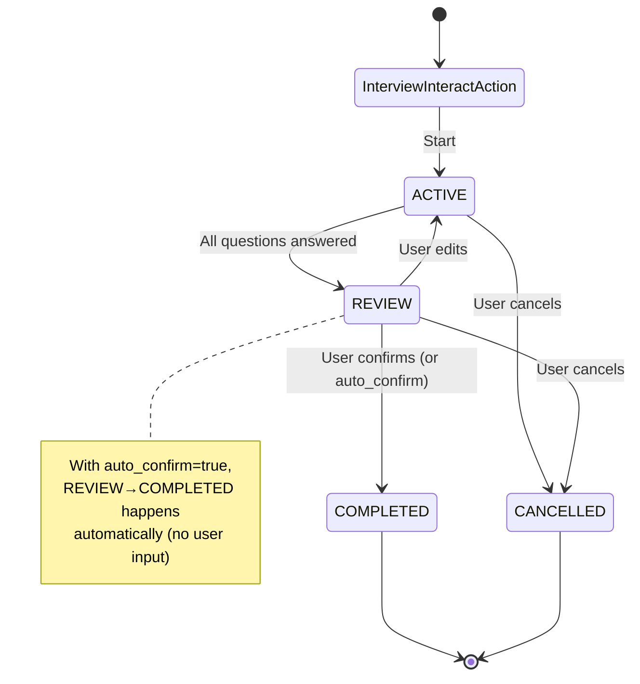

# Architecture

## State Machine

The interview follows a state machine pattern with the following states and transitions:



### State Descriptions

- **InterviewInteractAction**: Entry point - manages sessions and orchestrates the interview flow
- **ACTIVE**: Actively asking questions and collecting responses. Transitions to REVIEW when all questions are answered.
- **REVIEW**: Presenting summary for user confirmation. Transitions to COMPLETED on confirmation or back to ACTIVE on updates. With `auto_confirm=true`, automatically transitions to COMPLETED without showing the confirmation prompt.
- **COMPLETED**: Interview successfully completed (with optional data processing via completion handlers)
- **CANCELLED**: Interview cancelled by user. Session is cleaned up and removed.

## Module Layout

The interview action is split into focused packages under `core/`:

| Package | Responsibility |
|---------|----------------|
| **foundation** | Shared types, enums, config dataclasses, prompts, decorators, exceptions. No dependency on other interview packages. |
| **classification** | Intent classification and extraction (LLM). `ClassificationHandler` + strategy-style `IntentHandler` implementations. |
| **graph** | Question/state graph: `QuestionNode`, `StateNode`, `QuestionWalker`, `QuestionGraphBuilder`, validators, branch evaluation. |
| **state** | State machine and state-node directive generation (`InterviewStateMachine`, `StateNode`). |
| **processing** | Response validation/storage (`ResponseProcessor`) and directive assembly (`DirectiveBuilder`). |
| **session** | Session entity and orchestration service (`InterviewSession`, `InterviewService`). |
| **utils** | Constants, JSON/session helpers, cache utilities. |

Dependency direction: foundation ← utils; classification, graph, state, processing, session depend on foundation (and optionally utils). The action and `InterviewService` orchestrate these; they do not depend on each other's internals.

## Core Components

### 1. InterviewInteractAction (Abstract Base Class)

The abstract base class that orchestrates the complete interview flow. **Must be extended** to create concrete interview implementations.

**Key Methods:**
- `on_register()`: Builds question node chain from `question_graph`
- `on_reload()`: Rebuilds question nodes if `question_graph` changed
- `execute()`: Loads/creates session, classifies intent, and spawns `InterviewWalker` to traverse the graph

**Core Components:**
The interview system uses specialized components following the data-spatial walker-node pattern:
- `ClassificationHandler`: Handles intent classification and field extraction via prompt-based classification
- `QuestionGraphBuilder`: Builds QuestionNode and StateNode graph from `question_graph`
- `InterviewWalker`: Traverses the question graph using `@on_visit` decorators
- `StateNode`: Manages state transitions with validation (includes transition rules)

**Unified Classification:**
The system uses a single unified prompt (`INTERVIEW_PROMPT`) that:
- Accepts both utterance and interpretation (when available)
- Detects intent: CANCELLATION, CONFIRMATION, UPDATE, SUBMISSION, or NONE
- Extracts field values for SUBMISSION intent
- Identifies update fields and values for UPDATE intent
- All in a single LLM call for efficiency and consistency

**Data Input Fields:**
Fields with `data_input_field` configured are automatically excluded from LLM extraction. Values are extracted directly from `visitor.data` and treated as SUBMISSION or UPDATE intent (depending on whether the field already has a value), bypassing the LLM classification for those specific fields. When the key is absent in `visitor.data`, the current question (first unanswered) is auto-populated with `"N/A"`. This enables file uploads and other binary data to be handled without LLM processing.

### 2. InterviewSession Node

Persistent node that stores:
- `interview_type`: Class name of the interview action (for filtering)
- Current state
- Question schema/index
- Collected responses
- Validation results per question
- Active question tracking
- Timestamps

**Methods:**
- `reset()`: Reset session to initial state
- `cleanup()`: Delete session from graph
- `extract_data()`: Extract collected data for processing

### 3. QuestionNode

Represents individual interview questions with:
- Question text and constraints
- Two-tier validation logic (VALID/INVALID)
- Custom input handlers (`process_input()`)
- Custom validators
- Required vs optional flags
- Condition matching for tree traversal

### 4. InterviewWalker

Specialized walker that traverses QuestionNodes using the walker-node pattern:
- Uses `@on_visit` decorators for automatic node dispatch
- Finds next unanswered question based on conditional branches
- Processes input via QuestionNode handlers
- Validates responses via QuestionNode validators
- Returns directives for the next question
- Respects conditional branching based on previous answers

### 5. QuestionEdge

Specialized edge connecting QuestionNodes with optional condition metadata:
- Stores condition information for conditional traversal
- Condition format: `{"op": "equals", "value": "value"}` (question is implicit from branch context)

### 6. QuestionBranchEvaluator

Provides unified condition matching logic for conditional branching:
- Static utility for evaluating branch conditions
- Supports both operator-based and function-based conditions
- Used by InterviewWalker for tree traversal
- Ensures functions only execute after questions are answered

### 7. StateNode & State Handlers

Manages interview state transitions and state-specific behavior:
- `StateNode`: Represents interview states (REVIEW, COMPLETED, CANCELLED) in the question graph
- Includes state transition validation logic (VALID_TRANSITIONS map)
- Registers and calls state handlers via decorators:
  - `@on_interview_review`: Customize review experience
  - `@on_interview_complete`: Process completion data
  - `@on_interview_cancelled`: Handle cancellation

### 8. QuestionPathWalker

Lightweight walker for path discovery and post-update sync:
- `find_next_target`: Finds next unanswered question on active path (uses existing cache)
- `get_reachable_questions`: Collects all reachable question names (uses existing cache)
- `sync`: Post-update sync—invalidates cache, traverses full path, prunes unreachable responses

### 9. ClassificationHandler

Handles intent classification and field extraction:
- Unified LLM-based classification and extraction
- Prompt-based classification with chain-of-verification reasoning

### 10. DirectiveBuilder

Handles directive formatting and generation:
- Formats review summaries
- Builds confirmation directives
- Generates completion and cancellation messages
- Queues directives to the InteractWalker

## Standard Anchors

All interview implementations automatically include standard anchors that cover common interview flow scenarios. These standard anchors ensure proper routing classification for scenarios that apply to all interviews, regardless of the specific implementation.

**Standard anchors are automatically merged with implementation-specific anchors** (implementation-specific anchors first, then standard anchors appended). This means you don't need to specify standard anchors in your implementation - they're included automatically.

### Standard Anchor Categories

1. **Cancellation** (any state):
   - "User requests to cancel interview process"
   - "User wants to stop the interview"
   - "User wants to abort the interview"
   - "User wants to exit the interview"

2. **Correction/Update** (ACTIVE or REVIEW states):
   - "User indicates that not all information is correct"
   - "User wants to change previously provided information"
   - "User wants to update their answers"
   - "User wants to correct their responses"
   - "User indicates information needs to be changed"

3. **Review Confirmation** (REVIEW state):
   - "User confirms the information is correct"
   - "User approves the summary"
   - "User confirms all information is accurate"

4. **General Interview Continuation** (intermediate states):
   - "User is answering interview questions"
   - "User is providing interview information"
   - "User is responding to interview prompts"

### How It Works

- Standard anchor templates are defined in the `InterviewInteractAction` base class as `_standard_interview_anchor_templates`
- They are automatically contextualized with the class name (e.g., "SignupInterviewInteractAction") in `_merge_standard_anchors()`
- This helps distinguish multiple interview instances coexisting in a single agent
- They are automatically merged with implementation-specific anchors in `on_register()` and `on_reload()`
- Implementation-specific anchors are listed first, followed by context-specific standard anchors
- Duplicates are automatically removed while preserving order

### Example

```python
class MyInterviewAction(InterviewInteractAction):
    anchors: List[str] = attribute(
        default_factory=lambda: [
            "User wants to start my interview",  # Implementation-specific
            "User is providing my interview data",  # Implementation-specific
            # Standard anchors (cancellation, correction, etc.) are automatically added
        ]
    )
```

The final anchors list will include:
1. "User wants to start my interview"
2. "User is providing my interview data"
3. All standard anchors contextualized with class name (e.g., "User cancels MyInterviewAction", "User answers MyInterviewAction question", etc.)

## File Structure

```
interview/
├── __init__.py                    # Package initialization (exports decorators)
├── interview_interact_action.py   # Abstract base class (orchestrator)
├── info.yaml                      # Action metadata
├── README.md                      # Overview
├── docs/                          # Detailed documentation
└── core/
    ├── __init__.py
    ├── foundation/                # Core types & configuration
    │   ├── enums.py               # InterviewState, ValidationStatus, Intent, ContextKey
    │   ├── exceptions.py          # Custom exceptions
    │   ├── config.py              # Configuration objects
    │   ├── decorators.py          # Decorator functions for handlers/validators
    │   └── prompts.py             # Prompt templates
    ├── graph/                     # Question graph domain
    │   ├── question_node.py       # QuestionNode
    │   ├── question_edge.py      # QuestionEdge with conditions
    │   ├── interview_walker.py    # InterviewWalker for graph traversal
    │   ├── question_path_walker.py  # QuestionPathWalker (path discovery + sync)
    │   ├── state_node.py          # StateNode (includes transition validation)
    │   ├── question_branch_evaluator.py  # QuestionBranchEvaluator (condition matching)
    │   ├── question_graph_builder.py  # QuestionGraphBuilder (question graph construction)
    │   ├── graph_validator.py     # QuestionGraphValidator
    │   └── condition_operators.py # ConditionOperator
    ├── classification/            # Classification & intent
    │   └── classification_handler.py  # ClassificationHandler (intent classification)
    ├── processing/                 # Directives
    │   └── directive_builder.py  # DirectiveBuilder
    ├── session/                    # Session management
    │   └── interview_session.py   # InterviewSession Node
    └── utils/                      # Utilities
        ├── session_utils.py       # Session utilities
        ├── cache_utils.py         # Cache utilities
        ├── handler_utils.py       # Handler invocation utilities
        ├── json_utils.py          # JSON parsing utilities
        └── constants.py            # Constants
```
