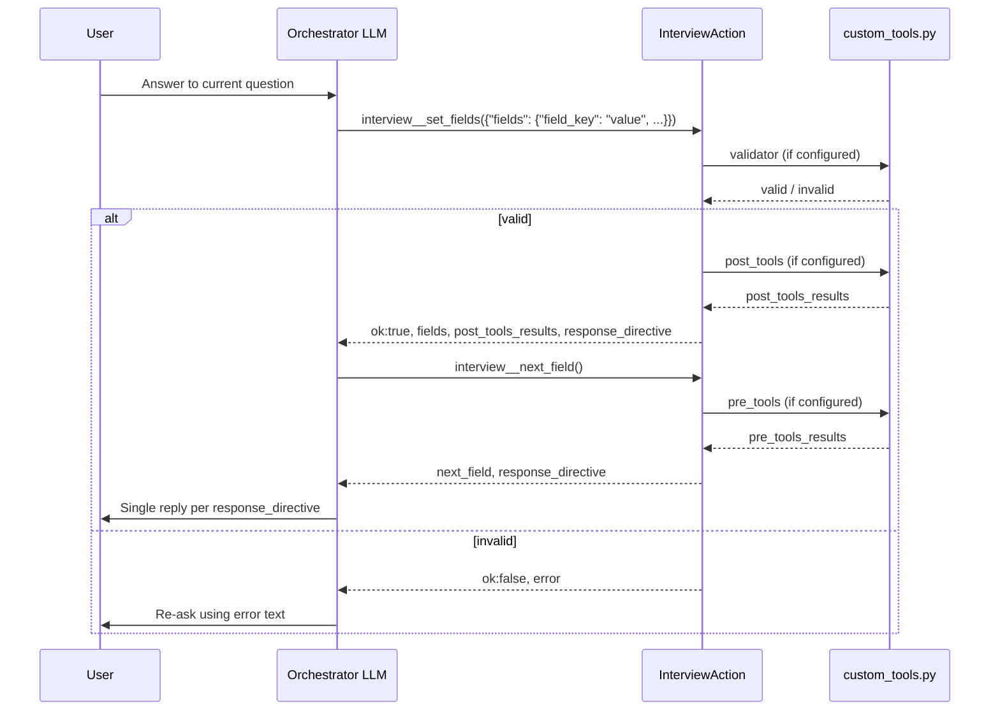

# Multi-Turn Interview Flow

How a skills-v2 interview progresses across user turns when the orchestrator drives the conversation via `interview__*` tools.

Turn flow assumes the **[thin harness principle](../../../../docs/thin-harness.md)** and [interview profile](thin-harness.md): the LLM drives each turn from the composed SOP; `InterviewAction` does not inject prep observations or auto-chain tools server-side.

## Roles

| Actor | Responsibility |
|-------|----------------|
| **User** | Sends messages each turn |
| **Orchestrator LLM** | Reads composed procedure (`SkillDoc.body`), calls tools, replies per `response_directive` |
| **InterviewAction** | Session CRUD, validation, hook execution, task tracking |
| **`SKILL.md` frontmatter `interview:`** | Field definitions, validators, hooks, tools, review/completion |
| **`SKILL.md` body** | Per-skill behavioral rules (standard procedure composed via extends) |
| **`scripts/custom_tools.py`** | Business logic referenced by `function:` names |

The LLM decides *which* question to ask and *when* to call tools. The action enforces validation, runs hooks, and returns structured observations the LLM must read before advancing.

## Session states

```
active → review → completed
  ↓         ↓
cancelled  cancelled
```

| Status | Meaning |
|--------|---------|
| `active` | Collecting fields |
| `review` | Summary shown; awaiting confirmation or edits |
| `completed` | `interview__complete()` finished; session cleared |
| `cancelled` | `interview__cancel()` or custom reset; session cleared |

State is stored on `InterviewSession.status` inside `conversation.context["interview"]`.

## Turn 0 — Skill activation

```
User message → Orchestrator selects use_skill("<skill_name>")
            → InterviewAction.on_skill_activate()
            → _handle_start(): create or resume session (no auto-store on activation)
            → SKILL task created if task-lock: true
            → InterviewAction adopts/tags active SKILL task for interview lifecycle updates
            → orchestrator applies generic task-lock routing from active SKILL task
```

On every turn (including activation), the model follows base `SKILL.md` intent routing:

- Classify the user's message (answer, correct/update, multi-answer, cancel, etc.).
- Call the matching tool (`interview__set_fields`, `interview__next_field`, `interview__reset`, …).
- Chain follow-up tools per SOP (e.g. `set_fields` → `next_field` → reply).

Task-lock behavior is generic at orchestrator level; interview runtime does not provide task-lock prep hooks.

### Anti-pattern: chat-only roleplay before activation

If the model skips `use_skill` and asks field prompts via `reply` alone, there is no session and answers are not stored. Per base SOP, values from chat turns before `use_skill` are not reused; the user may need to repeat one field once. Fix: follow base SOP **Activation (session gate)** — `use_skill` first, then `interview__next_field`, then `reply`.

### Field extraction

The model extracts values from the full latest utterance and passes them as one `fields` map to `interview__set_fields`. Validators are the only server-side gate — there is no re-extraction path. `set_fields` processes every submitted field in field-definition order (`pre_processor -> validator -> store -> post_processor`) and returns per-field `results` plus `response_directive`/`next_tool` — it does not repeat field metadata (that lives in `field_reference` from activation, re-pullable via `interview__get_status`). Branch settlement is **incremental**: a field that an earlier field in the same call makes unreachable is skipped before its validator runs and reported in `ignored`; fields removed from the active path after storage are reported in `pruned`.

## Turn N — Typical collection turn



### Rules per turn

1. **One action per turn** — each tool returns one composed `response_directive` and may include `response_directives_queue` for transparency.
2. **Read `ok` first** — if `ok: false`, handle the error; `post_tools` did not run.
3. **Read hook results** — inspect `post_tools_results` / `pre_tools_results` before calling `next_field` or `review`.
4. **`response_directive` wins** — when it conflicts with `next_field`, follow the directive.

## Turn-lock (`task-lock: true`)

When a skill declares `task-lock: true`, the orchestrator stays in the active skill flow until the interview completes or cancels. This is fully generic orchestrator behavior driven by active SKILL tasks.

This keeps multi-turn interviews on-rails without hardcoding interview logic in the orchestrator.

## Optional fields

For `required: false` questions:

- User declines → `interview__skip_field(field)` then `interview__next_field()`.
- Do not call `interview__review()` while optional fields remain in `next_field` unless the procedure explicitly allows it.

## Branching without a state machine

Branching is **procedure-driven**, not graph-evaluated:

| Mechanism | How branching works |
|-----------|---------------------|
| `post_processor` | Returns `next_tool: interview__review` → LLM calls `interview__review()` |
| Custom validator | Returns `interview_complete: true` → stop; post-processors skipped |
| Review handler | Returns `terminate: true` → deliver message; no `interview__complete()` |
| `session.context` | Post-processors set flags (e.g. `escalate`, `otp_pending`) read by later hooks or SKILL.md |
| Skill tools | e.g. `send_otp` — LLM calls `{skill}__{tool}` explicitly |
| Custom reset | `handlers.reset` — LLM calls `interview__reset()` |
| `fields[].branches` | `when` / `goto` / `else` — declarative routing after field save |

Document branches in `SKILL.md` and implement side effects in hooks.

### Collectible path vs active projection (prune)

Path resolution uses two walks ([`flow.py`](../flow.py)):

| Walk | API | Stops when | Drives |
|------|-----|------------|--------|
| **Collectible** | `compute_collectible_path_names` | First field without a stored value (and not skipped) | `missing_required`, `awaiting_fields`, `resolve_next_field_name`, `next_field` |
| **Active projection** | `compute_active_path_for_prune` | Unresolved branch point only (no linear fallback through `branches` without a match/`else`) | `prune_unreachable_fields` only |

On an empty session, collectible path is typically just the first field (e.g. signup `user_name` only) — downstream branch targets are not listed in `missing_required` until the branch-determining field is answered. Unanswered branch points with no matching `else` stop the active projection at that field (e.g. onboarding `has_account` before `existing_email` is chosen).

`compute_collectible_path_names` is an alias for the collectible prefix path.

### Branch path invalidation (corrections)

When the user corrects a field that determines a branch (`fields[].branches`), prune recomputes the **active projection** from stored values and **removes only off-path fields** — answers on the new path that remain valid (e.g. `contact` after `user_type` premium→standard, or `phone_number` after email branch pivot) are preserved.

- Pruned field names are recorded in `session.context.pruned_fields` and may appear as `pruned` on `interview__set_fields` responses (fields skipped in-call as off-path appear as `ignored`).
- Prune also clears `skipped_fields` entries for pruned fields.
- `missing_required`, `awaiting_fields`, and `resolve_next_field_name` use the **collectible** prefix; after a correction, call `interview__next_field` when `next_tool` is chained — do not assume every spec field is still collected.
- Activation (`use_skill`) returns `awaiting_fields`, `field_keys`, and `field_hints` (branch-aware) — not the full `field_definitions` catalog. Use `interview__get_status` when you need the complete schema.

## Review and completion turns

```
All required fields collected (+ optional handled)
  → interview__review()
  → built-in summary OR `handlers.review` (confirmation framing via `review_confirmation_directive` or `confirm: auto`)
  → if terminate: true → stop (escalation path)
  → else user confirms → interview__complete()
  → completion handler → `clear_interview_context()` (honors `retain_context_keys`), SKILL task closed
```

If the user wants to edit during review, call `interview__set_fields` for the field(s) and re-run `interview__review()`.

## Cancel and restart

| Path | When | Effect |
|------|------|--------|
| `interview__cancel()` | User explicitly cancels (default skills) | Clear session, cancel tasks |
| `interview__reset()` | User wants to start over (default) | Clears collected fields/skips **in place** (session stays active, task stays open); returns `next_tool: interview__next_field` |
| `interview__reset()` + `handlers.reset` | Skill overrides reset (e.g. onboarding) | Routes to custom handler — may cancel-and-exit instead of restart |
| New session after complete/cancel | User starts again | Call `use_skill("<name>")` again |

Skills that replace cancel semantics may set `disabled-tools: [interview__cancel]` and set `handlers.reset`.

## Task model

| Task | Owner | Purpose |
|------|-------|---------|
| SKILL | Orchestrator skill runtime | Turn-lock for `task-lock: true` skills |

InterviewAction lifecycle updates operate on the same SKILL task. Custom completion handlers may persist profile data to task `data` before completing it.

## Reference procedure

The framework-standard tool loop lives in [`../SKILL.md`](../SKILL.md) and is prepended to each interview skill's `SkillDoc.body` at discovery. Per-skill exceptions belong in the custom `SKILL.md` body — see [`../docs/skill_custom_instructions.md`](../docs/skill_custom_instructions.md).

Examples:

- [`examples/example_interview/SKILL.md`](../examples/example_interview/SKILL.md) — reference custom rules
- zoon-ai `onboarding_interview/`, `pre_alert_interview/` — production behavioral rules
- jvagent example app `signup_interview/` — demo signup flow
