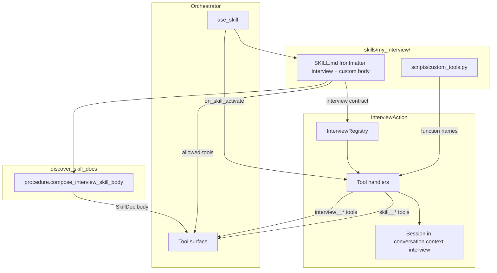

# Interview Action (`jvagent/interview_action`)

LLM-driven interview framework for structured data collection. The orchestrator LLM reads the composed interview procedure (`SkillDoc.body` = standard tool loop + per-skill custom rules) and calls granular tools to conduct interviews. `InterviewAction` manages session state, validation, hook orchestration, and tool registration — it does not drive the conversation itself.

**Custom interview skills** are two-file packages under `agents/<ns>/<agent>/skills/<name>/` ([ADR-0023 placement standard](../../.planning/adr/0023-skill-placement-standard.md)). Copy [`examples/example_interview/`](examples/example_interview/) as a template, set `extends: action:jvagent/interview_action`, `requires-actions: [InterviewAction]`, and `locked-in: true` for turn-lock.

**Agent entry point:** [CLAUDE.md](CLAUDE.md)

## Documentation

### Reading paths

| Audience | Start with |
|----------|------------|
| **Building a new interview skill** | [Quick start](#quick-start) → [docs/extending.md](docs/extending.md) → [examples/example_interview/](examples/example_interview/) |
| **AI agent editing this package** | [CLAUDE.md](CLAUDE.md) |
| **Debugging a stuck turn** | [docs/troubleshooting.md](docs/troubleshooting.md) → [docs/multi-turn-flow.md](docs/multi-turn-flow.md) |
| **Authoring `SKILL.md` body only** | [docs/skill_custom_instructions.md](docs/skill_custom_instructions.md) (base SOP: [SKILL.md](SKILL.md)) |

### How-to guides

| Guide | Covers |
|-------|--------|
| [docs/thin-harness.md](../../../docs/thin-harness.md) | **Thin harness principle** (jvagent-wide) |
| [docs/thin-harness.md](docs/thin-harness.md) | **Interview profile** — subsystem invariants |
| [docs/frontmatter-schema.md](docs/frontmatter-schema.md) | Canonical `interview:` YAML schema (fields, handlers, confirm) |
| [docs/multi-turn-flow.md](docs/multi-turn-flow.md) | Turn-by-turn lifecycle, turn-lock, session states, branching |
| [docs/extending.md](docs/extending.md) | Validators, pre/post processors, review/completion, skill tools |
| [docs/troubleshooting.md](docs/troubleshooting.md) | Common failures, symptom → fix |

Skill placement convention (action-backed vs pure SOP): [jvagent/skills/README.md](../../skills/README.md).

## Two-file skill package

Every interview skill is a self-contained folder:

| File | Responsibility |
|------|----------------|
| `SKILL.md` | **Frontmatter `interview:`** — fields, validators, processors, skill_tools, handlers (machine contract). **Body** — custom behavioral rules only (standard procedure is composed via extends) |
| `scripts/custom_tools.py` | **Business logic** — validators, pre/post hooks, custom tools, review/completion handlers |

```
skills/my_interview/
├── SKILL.md          # frontmatter.interview + custom instructions body
└── scripts/
    └── custom_tools.py
```

Declare the machine contract under `interview:` in `SKILL.md` frontmatter (not a standalone yaml file).

## Quick start

1. **Scaffold (optional)** — `jvagent skill create-interview <agent_ref> <skill_name>` copies [`examples/example_interview/`](examples/example_interview/) into `agents/<ns>/<agent>/skills/<skill_name>/`.
2. **Or copy manually** from [`examples/example_interview/`](examples/example_interview/) to `agents/<ns>/<agent>/skills/<your_skill_name>/`.
3. **Rename consistently** — `name` in `SKILL.md` frontmatter must match the folder name (e.g. `skills/feedback_interview/` → `name: feedback_interview`).
4. **Implement functions** in `scripts/custom_tools.py` for every `function:` name referenced in frontmatter `interview:` (builtin validators like `phone` and `email` need no custom function).
5. **Validate the contract** — `jvagent skill validate agents/<ns>/<agent>/skills/<your_skill_name>/SKILL.md` checks that frontmatter `function:` refs resolve in `custom_tools.py`.
6. **Write custom instructions** in `SKILL.md` body — when to use, session overrides, and behavioral rules. Add `extends: action:jvagent/interview_action`; do not copy the base procedure into the body.
7. **Register the skill** in [`agent.yaml`](../../../agent.yaml) orchestrator `skills:` list.
8. **Declare allowed tools** in `SKILL.md` frontmatter — list every `interview__*` tool plus any `{skill}__{tool}` custom tools.
9. **(Optional)** Set `confirm: auto` when review should chain to `interview__complete` without asking the user — see [docs/frontmatter-schema.md](docs/frontmatter-schema.md#confirm-mode).
10. **(Optional)** Add to `auto_start_skills_on_new_user` in `agent.yaml` if the skill should activate automatically for new users.

> **Important:** Reference packages live under `interview_action/examples/` (not auto-discovered). Live skills go in the app action overlay `skills/` path.

## Thin harness principle

Interview skills **must** follow the thin harness split documented in [platform thin-harness](../../../docs/thin-harness.md) and the [interview profile](docs/thin-harness.md):

- **Thin:** `InterviewAction` + turn-lock hooks — session, validation, hook dispatch, raw tool JSON only.
- **Thick:** composed SOP (base + custom instructions) + `interview:` contract + `custom_tools.py`.

Do not reintroduce server-side turn steering (prep observations, auto-store on activation, inlined next-question merges, frontmatter extractors, or orchestrator-forced tool chains). AI agents extending this framework should treat the [interview profile](docs/thin-harness.md) as a regression checklist before merging.

## Architecture



### Session lifecycle

1. Orchestrator calls `use_skill("<skill_name>")`.
2. `InterviewAction.on_skill_activate()` runs `_handle_start()`:
   - Creates or resumes an `InterviewSession` in `conversation.context["interview"]`.
   - Creates an `INTERVIEW` task owned by `InterviewAction`.
3. On turn-lock turns, the orchestrator calls generic bound-action hooks on `InterviewAction` (via `skill_tasks.apply_locked_skill_turn` — **not** interview-specific orchestrator code):
   - `skill_runtime_ready(skill_name, visitor)` — session + contract loaded
   - `prepare_locked_skill_turn(skill_name, visitor)` — runtime-ready gate only (no prep observations or directives)
   - `prune_turn_tools(tools, visible, visitor)` — drop interview tools when runtime not ready
4. The LLM reads observations and drives the flow until `interview__complete()` or cancel.

Set `binds_tools_to_visitor = True` on `InterviewAction` so tool dispatch receives the live visitor.

### Dual task model

- **SKILL task** — created when `locked-in: true` in `SKILL.md`; keeps the orchestrator in the active flow. On completion, skills may persist collected profile data to `task.data` (see [SKILL task data persistence](#skill-task-data-persistence)).
- **INTERVIEW task** — owned by `InterviewAction`; tracks interview progress for UI/task store.

### Function loading

`hooks.load_hook_function()` resolves functions from `skills/<name>/scripts/custom_tools.py`. Functions are called with signature-filtered kwargs via `hooks.call_hook()`:

| Injected kwarg | When available |
|----------------|----------------|
| `session` | Always (current `InterviewSession`) |
| `visitor` | Always |
| `interview_action` | Always |
| `config` | Handler/completion calls |
| `extracted_values` | Review/completion handlers |
| `review_data` | Review/completion handlers |

Custom validators receive `session` (in addition to `value`, `visitor`, `interview_action`) so they can read `session.context` and collected fields during validation.

## `interview:` contract reference

Machine contract lives under the `interview:` key in `SKILL.md` frontmatter (loaded by `InterviewRegistry` via `load_interview_spec_from_skill`).

**Canonical schema:** [docs/frontmatter-schema.md](docs/frontmatter-schema.md) — all keys, branching, `confirm` mode, strict allowlist parsing.

### Quick shape

```yaml
interview:
  title: My Interview
  summary: Purpose summary for task tracking
  confirm: manual   # or auto
  fields:
    - key: phone_number
      prompt: What is your phone number?
      guidance: 10-digit number — not filler alone.
      validator: phone
      validator_args:
        exact_length: 10
      pre_processor: [suggest_phone]
      post_processor: cache_lookup
      branches:
        - when: { function: flow_branch_is, op: equals, value: signup }
          goto: email
      else: next_field_key
  skill_tools:
    - name: send_otp
      description: When OTP is required…
      function: send_otp
      parameters: {}
  handlers:
    review: example_review
    complete: example_complete
    reset: reset_my_interview   # optional
```

**Rules:**

- Only `skill_tools` entries become LLM tools (`{skill}__{name}`). Processors, validators, and `handlers.*` run automatically — never list them as tools.
- Validators are **strings** plus optional `validator_args` — nested `{function, kwargs}` objects are rejected.
- Custom validators return JSON or dict with `valid`, `value`, `error`; may set `interview_complete`, `response_directive`, `retain_context_keys` on success.
- Reset: model calls `interview__reset()`; foundation routes to `handlers.reset` when set.
- Utterance extraction is **model-owned** via `interview__set_fields`; the server has no extraction path — validators are the only gate (no frontmatter extractors).

## `SKILL.md` reference

### Frontmatter

```yaml
---
name: my_interview
description: When to use this skill...
spec: jv
locked-in: true
requires-actions:
  - InterviewAction
extends: action:jvagent/interview_action
# Additive — list custom LLM tools only; base interview__* tools are inherited
allowed-tools:
  - my_interview__send_otp
# Optional — remove base tools this skill replaces or must not expose
disabled-tools:
  - interview__cancel
interview:
  title: My Interview
  summary: Purpose summary for task tracking
  confirm: manual
  fields: []
  handlers:
    review: my_review
    complete: my_complete
    reset: reset_my_interview
tags: [tag1, tag2]
---
```

| Field | Purpose |
|-------|---------|
| `name` | Must match folder name and `interview` skill identity |
| `extends` | Inherits base procedure + merges base `allowed-tools` from action `SKILL.md` |
| `interview` | Machine contract — fields, processors, skill_tools, handlers, confirm |
| `requires-actions` | Runtime dependencies — orchestrator verifies these are enabled |
| `allowed-tools` | **Additive** custom LLM tools merged onto inherited base tools |
| `disabled-tools` | Base tools to remove from the merged set (e.g. `interview__cancel` when reset handler replaces cancel) |
| `locked-in` | When `true`, creates a SKILL task that locks the active flow |

### Body (custom instructions only)

At discovery, `discover_skill_docs` prepends the framework [standard procedure](SKILL.md) to each interview skill's body. Authors write only:

1. **When to use** — 1–3 bullets.
2. **Rules** — behavioral exceptions (OTP gates, `exists: true` stop, post_tool branching).
3. **Session overrides** — cancel/reset tools.
4. **Custom tool callouts** — when non-obvious.

Do **not** list fields as Procedure steps or Flow overview — field order and prompts come from frontmatter `interview.fields` and runtime `next_fields`. See [docs/skill_custom_instructions.md](docs/skill_custom_instructions.md).

### Reply rules (enforce in every skill)

- Each tool returns **one** `response_directive` — do **one** thing per turn.
- **`response_directive` beats `next_fields`** when they conflict.
- Use `interview__set_fields` with args `{"fields": {"field_key": "value", ...}}` — never put field keys at the top level.
- Always call `interview__review()` before `interview__complete()` (unless review sets `terminate: true`).
- Never reuse field values from older chat turns.

## `custom_tools.py` function types

Organize the file into labeled sections (see [example](examples/example_interview/scripts/custom_tools.py)):

| Type | Referenced in | Return type | LLM-callable? |
|------|---------------|-------------|---------------|
| Validator | `fields[].validator` | JSON string or `dict` | No |
| Pre-processor | `fields[].pre_processor` | Dict or `interview_tool_response` JSON | No |
| Post-processor | `fields[].post_processor` | `interview_tool_response` JSON | No |
| Skill tool | `interview.skill_tools` | `interview_tool_response` JSON (preferred) or `dict` | Yes (`{skill}__{name}`) |
| Review handler | `handlers.review` | `Dict` with `response_directive` | No |
| Reset handler | `handlers.reset` | `interview_tool_response` or dict with `response_directive` | No |
| Completion handler | `handlers.complete` | `Dict` with `response_directive`, optional `retain_context_keys` | No |

LLM-facing custom tools should use `interview_tool_response()` for a consistent envelope (`ok`, `status`, `system_message`, `response_directive`). The framework also accepts plain `dict` returns via `_finalize_tool_response`.

### Response helpers

Use helpers from [`responses.py`](responses.py) — do not invent ad-hoc directive formats:

```python
from jvagent.action.interview_action.responses import (
    call_tool_directive,
    interview_tool_response,
    tell_user_directive,
    no_session_directive,
)

# Tell the LLM to reply to the user
tell_user_directive("What is your name?")

# Tell the LLM to call a tool
call_tool_directive("interview__review")

# Build a full tool response
interview_tool_response(
    ok=True,
    status="ok",
    next_tool="interview__review",
    response_directive=call_tool_directive("interview__review"),
)
```

## Core `interview__*` tools

Primary tools registered by [`tools.py`](tools.py). Sessions start via `use_skill` → `on_skill_activate`.

| Tool | Purpose |
|------|---------|
| `interview__set_fields(fields)` | Validate and store one or more fields; runs `post_processor` hooks per field on success |
| `interview__skip_field(field)` | Skip an optional field |
| `interview__next_field()` | Resolve next unanswered field; runs `pre_processor` hooks |
| `interview__get_status()` | Session metadata: `fields`, `missing_required`, `skipped_fields`, `confirm`, `status` (no embedded next field) |
| `interview__review()` | Present summary (or custom review handler) |
| `interview__complete()` | Finalize (or custom completion handler) |
| `interview__cancel()` | Cancel and clear session |
| `interview__reset()` | Clear progress and restart; returns `next_tool: interview__next_field` hint (model chains explicitly) |

### Chaining gate

Always read `ok` from tool responses before advancing:

- `ok: false` → handle the error; post-processors do **not** run.
- `ok: true` → read `post_tools_results` / `pre_tools_results` before calling `next_field`.

## Response envelope

All tools return JSON with these key fields:

| Field | Purpose |
|-------|---------|
| `ok` | Chaining gate — must be `true` to advance |
| `status` | Machine-readable status (`ok`, `error`, `validation_failed`, etc.) |
| `fields` | All collected field values |
| `missing_required` | Required field keys on the collectible path not yet collected |
| `awaiting_fields` | Unanswered collectible-path fields (`key`, `prompt`, `guidance`, `required`) — use for `set_fields` key mapping |
| `field_awareness` | Human-readable line: awaiting field key + question prompt; tool handlers upsert one `[EVENT]` snapshot per interaction (latest field wins) |
| `next_field` | Next question object from `interview__next_field` |
| `field_definitions` | Full spec catalog on `interview__get_status` only (not on activation) |
| `response_directive` | Single next action for the LLM |
| `pre_tools_results` | Outcomes from pre_tool hooks |
| `post_tools_results` | Outcomes from post_tool hooks |

### Hook result keys

Pre/post processor results are slimmed via `HOOK_RESULT_KEYS` in [`responses.py`](responses.py) before reaching the LLM:

| Key | Meaning |
|-----|---------|
| `ok` / `status` | Hook outcome |
| `value` / `error` / `error_code` | Result detail |
| `system_message` | Context for the model about what happened (not a user reply) |
| `response_directive` | Override directive for this hook result — wins over the default chain hint |
| `next_tool` | Suggested next tool to call (e.g. `interview__review`) |
| `interview_complete` | Interview is done server-side — session cleared, task closed |

Skill-specific signals (e.g. an "already registered" stop or an OTP gate) are expressed through `response_directive` / `next_tool` / `system_message` — there are no special-cased keys in the foundation. `interview_complete` may also appear on the top-level `interview__set_fields` response when a custom validator sets it (post_processors are skipped for that field).

## Builtin validators

Defined in [`validators.py`](validators.py):

| Name | Purpose | Common kwargs |
|------|---------|---------------|
| `phone` | Phone number (digits only) | `exact_length`, `min_length`, `max_length` |
| `email` | Email address | `pattern` |
| `name` | Person name | — |
| `number` | Numeric value | — |
| `date` | Date string | — |
| `date_past` | Date in the past | — |
| `date_future` | Date in the future | — |
| `yes_no` | Yes/no answer | — |
| `text` | Free text | `min_length`, `max_length` |
| `address` | Address string | — |
| `description` | Description text | `min_length`, `max_length` |
| `list` | Value from allowed list | `items` |

Custom validators go in `scripts/custom_tools.py` and are referenced by function name in `interview.fields[].validator`.

## Intent routing (model extracts)

The model classifies each user message per base `SKILL.md` (answer, correct/update, multi-answer, cancel, etc.) and calls the appropriate tool. The server validates and stores via `interview__set_fields`; it does **not** auto-inject `next_field` or scan utterances at prep time.

After successful stores, the model chains `interview__next_field` or `interview__review` per SOP — no server-side `merge_auto_*` inlining.

Corrections to previously stored fields use `interview__set_fields` at any time (mid-interview or at review).

## Patterns from live skills

| Pattern | Onboarding | Pre-alert | Example |
|---------|------------|-----------|---------|
| Pre-tool suggestion | `get_phone_number`, `suggest_email_from_task` | — | `suggest_email` |
| Post-tool branch | `verify_phone_number` (stop if exists), `verify_email` (OTP branch) | `check_tracking_status` (`next_tool: interview__review`) | `check_low_rating` (`next_tool: interview__review`) |
| Validator completes flow | `validate_otp_code` (`interview_complete`) | — | — |
| LLM custom tools | `send_otp`, `process_id_card` | none | — |
| Custom reset | `handlers.reset` → `reset_onboarding` (cancel-and-exit) | base `interview__reset` | base default |
| Custom review | default (built-in summary) | `pre_alert_review` (terminate path) | `example_review` (terminate path) |
| Cancel behavior | `interview__reset` (routes to reset handler) | `interview__cancel` | `interview__cancel` |
| SKILL task persistence | yes — all three completion paths | no | no |
| External API | `ZoonAPIAction` (lookup, OTP, create) | `ZoonAPIAction.create_pre_alert` | mock (stores in context) |
| Auto-start | yes (`auto_start_skills_on_new_user`) | no | no |

### When to use each pattern

- **Pre-tools** — suggest a value the system already knows (WhatsApp phone, email from a prior completed SKILL task). The LLM must confirm before `set_field`.
- **Post-tools** — run side effects after a field is saved (API lookup, branching). The LLM reads results; never calls the hook manually.
- **Validator-side completion** — when confirming a value should finish the interview (OTP verify). Return `interview_complete: true` and `response_directive` from the validator; do not use a `post_tool` for the same step.
- **LLM skill tools** — operations the LLM must initiate (send OTP, image extraction). Declare in `interview.skill_tools` and additive `allowed-tools`.
- **Custom reset** — when cancel/start-over needs skill-specific behavior, set `handlers.reset` (same pattern as review). Model calls `interview__reset()`.
- **Custom review** — when review can terminate without completion (status lookup, escalation) or needs special formatting.
- **Custom completion** — always required; calls external APIs or persists final data.

### Onboarding-specific patterns

**OTP flow (email mismatch or update-phone):**

1. `verify_email` post_tool detects different phone → sets `otp_pending`, stores `email_lookup_customer` in `session.context` — does **not** send OTP.
2. LLM calls `onboarding_interview__send_otp` → sets `otp_sent` in context.
3. If sent → ask `otp_code`; if not → `interview__skip_field("otp_code")`.
4. `validate_otp_code` validator calls `confirm_whatsapp_otp` and returns `interview_complete: true` on success.

**Cancel / reset (`reset_onboarding` via `handlers.reset`):**

Onboarding disables `interview__cancel` and routes cancel/start-over through `interview__reset()` → `reset_onboarding` handler. Clears session, cancels SKILL + INTERVIEW tasks, informs the user onboarding was cancelled and is required to chat, then **stops** — no `interview__next_field`. User re-initiates via `use_skill`.

### SKILL task data persistence

Skills with `locked-in: true` can write profile data to the active SKILL task before completion via `TaskHandle.update()`. Onboarding uses helpers in `custom_tools.py`:

| Helper | Purpose |
|--------|---------|
| `_persist_skill_task_data` | Merge `fields`, `account_number`, `flow_mode` into active SKILL task `data` |
| `_get_completed_skill_fields` | Read `data.fields` from the latest completed SKILL task (e.g. reuse email on update-phone) |
| `_fields_from_customer` | Map Zoon API customer object → interview field names |
| `_build_completion_task_fields` | Merge API customer + session values (OTP path) |
| `_fields_from_extracted_values` | Normalize collected values for new account creation |
| `_normalize_task_fields` | Keep only profile keys; strip `otp_code` and empty values |

**Three completion paths** all persist the same normalized shape:

| Path | Trigger | Fields source |
|------|---------|---------------|
| Existing customer | `verify_phone_number` finds customer | `_fields_from_customer` from API response |
| OTP success | `validate_otp_code` confirms OTP | `_build_completion_task_fields` (session + `email_lookup_customer`) |
| New account | `complete_onboarding` when `status == 200` | `_fields_from_extracted_values` |

Completed task data shape:

```json
{
  "fields": {
    "phone_number": "5926431530",
    "email": "user@example.com",
    "full_name": "Jane Doe",
    "id_number": "12345678",
    "date_of_birth": "01-01-1990"
  },
  "account_number": "GEO100188",
  "flow_mode": "onboard"
}
```

Also sets `conversation.context["customer_id"]` and `user_is_onboarded: "completed"` on terminal paths.

## Testing

Existing tests under `tests/action/interview_action/`:

| Test file | What it covers |
|-----------|----------------|
| `test_skill_tool_names.py` | Hook functions are NOT exposed as LLM tools; custom tools ARE |
| `test_interview_set_field_validation.py` | Validator accept/reject, OTP flow, `interview_complete` from validator |
| `test_interview_skill_activate.py` | Contract loading, skill activation |
| `test_interview_task_lifecycle.py` | Task isolation between interview types |
| `test_interview_next_field.py` | Pre-tool execution, next question ordering |
| `test_interview_tool_response_envelope.py` | Response envelope shape |
| `test_set_fields.py` | Batch store, mid-interview corrections, review corrections |
| `test_check_customer_exists.py` | `verify_phone_number` stop path, field mapper helpers |
| `test_reset_onboarding.py` | Cancel-and-exit behavior for `reset_onboarding` via `interview.reset` |
| `test_complete_onboarding.py` | Account creation task persistence |

### Checklist for a new skill

- [ ] `SKILL.md` `name` matches folder name; frontmatter includes `interview:` block
- [ ] Every `function:` name in `interview:` has a matching function in `custom_tools.py`
- [ ] Hook functions (processors, validators, handlers) are **not** in `interview.skill_tools`
- [ ] LLM-callable tools are in both `interview.skill_tools` and additive `allowed-tools` (do not re-list base `interview__*` tools)
- [ ] Custom reset (if needed) uses `handlers.reset` — not a separate LLM tool
- [ ] `SKILL.md` body is custom rules only — no per-field Procedure steps (standard procedure is composed via extends)
- [ ] Terminal paths return `retain_context_keys` only for keys that must survive `clear_interview_context()`
- [ ] Validators return correct shape (`valid`, `value`, `error`); use `interview_complete` + `response_directive` when validation finishes the interview
- [ ] Post-tools return `interview_tool_response` with `response_directive`
- [ ] LLM custom tools return `interview_tool_response` with clear `response_directive` (especially stop/cancel paths)
- [ ] If persisting to SKILL task data, normalize fields and call `_persist_skill_task_data` before `handle.complete()` / `_close_task`
- [ ] Review handler returns `response_directive`; terminate path sets `terminate: true`
- [ ] Completion handler returns `response_directive` with user-facing message
- [ ] Skill registered in `agent.yaml` orchestrator `skills:` list
- [ ] `requires-actions` lists all dependencies (`InterviewAction`, `ZoonAPIAction`, etc.) — **gate only**; lifecycle hooks bind via `extends: action:jvagent/interview_action` (or sole lifecycle-capable required Action), not `agent.yaml` order

## Reference implementations

| Path | Notes |
|------|-------|
| [examples/example_interview/](examples/example_interview/) | Copy template — **not** auto-discovered; copy to `agents/.../skills/<name>/` |
| `examples/jvagent_app/.../skills/signup_interview/` | jvagent demo signup interview |
| `zoon-ai/agents/zoon/zoon_ai/skills/onboarding_interview/` | Production onboarding — OTP, ID extraction, SKILL task persistence |
| `zoon-ai/agents/zoon/zoon_ai/skills/pre_alert_interview/` | Production pre-alert — hook branching, custom review terminate path |

## License

See the application-level [LICENSE](../../../../../../../../jvagent/LICENSE).
