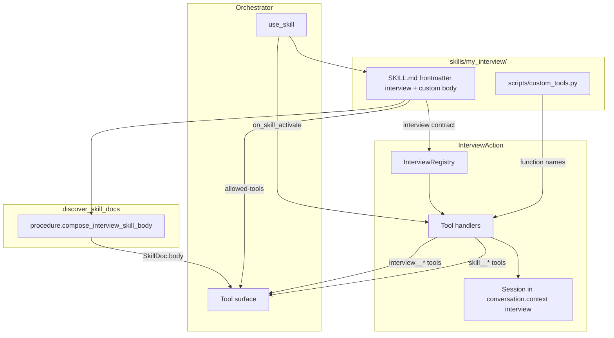

# Interview Action (`jvagent/interview_action`)

LLM-driven interview framework for structured data collection. The orchestrator LLM reads the composed interview procedure (`SkillDoc.body` = standard tool loop + per-skill custom rules) and calls granular tools to conduct interviews. `InterviewAction` manages session state, validation, hook orchestration, and tool registration — it does not drive the conversation itself.

**Custom interview skills** are action-backed packages under `skills/<name>/` (app overlay: `agents/.../actions/jvagent/interview_action/skills/`). Copy [`examples/example_interview/`](examples/example_interview/) as a template, set `extends: action:jvagent/interview_action`, `requires-actions: [InterviewAction]`, and `locked-in: true` for turn-lock.

**Agent entry point:** [CLAUDE.md](CLAUDE.md)

## Documentation

### Reading paths

| Audience | Start with |
|----------|------------|
| **Building a new interview skill** | [Quick start](#quick-start) → [docs/extending.md](docs/extending.md) → [examples/example_interview/](examples/example_interview/) |
| **AI agent editing this package** | [CLAUDE.md](CLAUDE.md) |
| **Debugging a stuck turn** | [docs/troubleshooting.md](docs/troubleshooting.md) → [docs/multi-turn-flow.md](docs/multi-turn-flow.md) |
| **Authoring `SKILL.md` body only** | [docs/skill_custom_instructions.md](docs/skill_custom_instructions.md) (base SOP: [SKILL.md](SKILL.md)) |

### How-to guides

| Guide | Covers |
|-------|--------|
| [docs/multi-turn-flow.md](docs/multi-turn-flow.md) | Turn-by-turn lifecycle, turn-lock, session states, branching |
| [docs/extending.md](docs/extending.md) | Validators, pre/post tools, review/completion, LLM custom tools |
| [docs/troubleshooting.md](docs/troubleshooting.md) | Common failures, symptom → fix |

Skill placement convention (action-backed vs pure SOP): [jvagent/skills/README.md](../../skills/README.md).

## Two-file skill package

Every interview skill is a self-contained folder:

| File | Responsibility |
|------|----------------|
| `SKILL.md` | **Frontmatter `interview:`** — questions, validators, hooks, tools, review/completion (machine contract). **Body** — custom behavioral rules only (standard procedure is composed via extends) |
| `scripts/custom_tools.py` | **Business logic** — validators, pre/post hooks, custom tools, review/completion handlers |

```
skills/my_interview/
├── SKILL.md          # frontmatter.interview + custom instructions body
└── scripts/
    └── custom_tools.py
```

> **Deprecated:** Standalone `interview.yaml` is still loaded with a warning when present, but new skills should declare the contract under `interview:` in `SKILL.md` frontmatter.

## Quick start

1. **Copy the reference skill** from [`examples/example_interview/`](examples/example_interview/) to your app overlay at `agents/<ns>/<agent>/actions/jvagent/interview_action/skills/<your_skill_name>/`.
2. **Rename consistently** — `name` in `SKILL.md` frontmatter must match the folder name (e.g. `skills/feedback_interview/` → `name: feedback_interview`).
3. **Implement functions** in `scripts/custom_tools.py` for every `function:` name referenced in frontmatter `interview:`.
4. **Write custom instructions** in `SKILL.md` body — when to use, session overrides, and behavioral rules. Add `extends: action:jvagent/interview_action`; do not copy the base procedure into the body.
5. **Register the skill** in [`agent.yaml`](../../../agent.yaml) orchestrator `skills:` list.
6. **Declare allowed tools** in `SKILL.md` frontmatter — list every `interview__*` tool plus any `{skill}__{tool}` custom tools.
7. **(Optional)** Add field-seeding regex in [`core/field_extractors.py`](core/field_extractors.py) if your custom validators should extract values from the user's opening message.
8. **(Optional)** Add to `auto_start_skills_on_new_user` in `agent.yaml` if the skill should activate automatically for new users.

> **Important:** Reference packages live under `interview_action/examples/` (not auto-discovered). Live skills go in the app action overlay `skills/` path.

## Architecture



### Session lifecycle

1. Orchestrator calls `use_skill("<skill_name>")`.
2. `InterviewAction.on_skill_activate()` runs `_handle_start()`:
   - Creates or resumes an `InterviewSession` in `conversation.context["interview"]`.
   - Seeds fields from the user's opening message via `field_extractors.py`.
   - Runs `post_tools` for any seeded fields.
   - Creates an `INTERVIEW` task owned by `InterviewAction`.
3. On turn-lock turns, the orchestrator calls generic bound-action hooks on `InterviewAction` (via `skill_tasks.apply_locked_skill_turn` — **not** interview-specific orchestrator code):
   - `skill_runtime_ready(skill_name, visitor)` — session + contract loaded
   - `prepare_locked_skill_turn(skill_name, visitor)` — mechanical `interview__next_question` seed
   - `prune_turn_tools(tools, visible, visitor)` — drop interview tools when runtime not ready
4. The LLM reads observations and drives the flow until `interview__complete()` or cancel.

Set `binds_tools_to_visitor = True` on `InterviewAction` so tool dispatch receives the live visitor.

### Dual task model

- **SKILL task** — created when `locked-in: true` in `SKILL.md`; keeps the orchestrator in the active flow. On completion, skills may persist collected profile data to `task.data` (see [SKILL task data persistence](#skill-task-data-persistence)).
- **INTERVIEW task** — owned by `InterviewAction`; tracks interview progress for UI/task store.

### Function loading

`InterviewAction._load_custom_function()` resolves functions from `skills/<name>/scripts/custom_tools.py` (or `custom_tools.py` at the skill root). Functions are called with signature-filtered kwargs:

| Injected kwarg | When available |
|----------------|----------------|
| `session` | Always (current `InterviewSession`) |
| `visitor` | Always |
| `interview_action` | Always |
| `config` | Handler/completion calls |
| `extracted_values` | Review/completion handlers |
| `review_data` | Review/completion handlers |

Custom validators receive `session` (in addition to `value`, `visitor`, `interview_action`) so they can read `session.context` and collected fields during validation.

## `interview:` contract reference

Machine contract lives under the `interview:` key in `SKILL.md` frontmatter (loaded by `InterviewRegistry` via `load_interview_spec_from_skill`). Standalone `interview.yaml` is a deprecated fallback only.

### Top-level fields (`interview:`)

| Field | Required | Purpose |
|-------|----------|---------|
| `name` | yes | Skill identifier — must match folder name and `SKILL.md` `name` |
| `title` | yes | Human-readable title for task tracking |
| `description` | yes | Purpose summary (used in task descriptions) |
| `questions` | yes | Ordered list of fields to collect |
| `tools` | no | LLM-callable custom tools (become `{skill}__{tool}`) |
| `review` | no | Custom review handler (default: built-in summary) |
| `completion` | yes | Post-review completion handler |

### Question fields

| Field | Default | Purpose |
|-------|---------|---------|
| `name` | `""` | Field key stored in session |
| `question` | `""` | Prompt text for the LLM |
| `description` | `""` | Guidance for the LLM |
| `required` | `true` | Whether field must be collected |
| `validator` | — | Inline `{function, kwargs}` or shorthand string |
| `pre_tools` | `[]` | Functions to run before asking (from `custom_tools.py`) |
| `post_tools` | `[]` | Functions to run after field is saved |

### Validator spec

Inline on a question:

```yaml
validator:
  function: phone
  kwargs:
    exact_length: 10
```

Or shorthand for builtin validators:

```yaml
validator:
  function: email
```

Custom validators reference function names in `scripts/custom_tools.py`. Return a **JSON string** or a **dict** with the same shape:

```json
{"valid": true, "value": "...", "validator": "validate_rating"}
{"valid": false, "error": "...", "value": "...", "validator": "validate_rating"}
```

Validators may also return extra keys forwarded into `interview__set_field` on success:

| Key | Effect |
|-----|--------|
| `interview_complete` | Stops the interview; `post_tools` for that field are skipped; session cleared |
| `response_directive` | Tells the LLM what to do next (welcome message, stop, etc.) |
| `retain_context_keys` | `conversation.context` keys to keep after terminal cleanup |

Use this when validation itself completes the flow (e.g. OTP confirmation in `validate_otp_code`) instead of a `post_tool`.

### Tools section

Only functions listed in frontmatter `interview.tools` become LLM-callable tools prefixed `{skill_name}__{tool_name}`. Reset handlers use `interview.reset` (not `interview.tools`).

```yaml
tools:
  - name: send_otp
    description: "When OTP is required..."
    function: send_otp
    parameters: {}
```

**Rule:** Hook functions (`pre_tools`, `post_tools`, validators, review, reset, completion) are **not** exposed as LLM tools. Only `interview.tools` entries are registered as `{skill}__{name}`.

### Review, reset, and completion

```yaml
review:
  function: example_review
  description: "Custom review logic"

reset:
  function: reset_my_interview
  description: "Optional — override start-over or cancel-and-exit behavior"

completion:
  function: example_complete
  description: "Called by interview__complete after user confirms"
```

Review/completion handlers return a `Dict` with at least `directive` (user-facing message). Reset handlers return `interview_tool_response(...)` or a dict with `response_directive` / `status`. The model always calls `interview__reset_interview()` — the foundation routes to `reset.function` when set.

Optional keys for review: `terminate`, `modified_values`, `additional_data`, `custom_message`.

## `SKILL.md` reference

### Frontmatter

```yaml
---
name: my_interview
description: When to use this skill...
spec: jv
locked-in: true
requires-actions:
  - InterviewAction
extends: action:jvagent/interview_action
# Additive — list custom LLM tools only; base interview__* tools are inherited
allowed-tools:
  - my_interview__send_otp
# Optional — remove base tools this skill replaces or must not expose
disabled-tools:
  - interview__cancel
interview:
  title: My Interview
  description: Purpose summary for task tracking
  questions: []
  reset:
    function: reset_my_interview
    description: Optional custom reset handler
  completion:
    function: my_complete
tags: [tag1, tag2]
---
```

| Field | Purpose |
|-------|---------|
| `name` | Must match folder name and `interview` skill identity |
| `extends` | Inherits base procedure + merges base `allowed-tools` from action `SKILL.md` |
| `interview` | Machine contract — questions, hooks, tools, review, reset, completion |
| `requires-actions` | Runtime dependencies — orchestrator verifies these are enabled |
| `allowed-tools` | **Additive** custom LLM tools merged onto inherited base tools |
| `disabled-tools` | Base tools to remove from the merged set (e.g. `interview__cancel` when reset handler replaces cancel) |
| `locked-in` | When `true`, creates a SKILL task that locks the active flow |

### Body (custom instructions only)

At discovery, `discover_skill_docs` prepends the framework [standard procedure](SKILL.md) to each interview skill's body. Authors write only:

1. **When to use** — 1–3 bullets.
2. **Rules** — behavioral exceptions (OTP gates, `exists: true` stop, post_tool branching).
3. **Session overrides** — cancel/reset tools.
4. **Custom tool callouts** — when non-obvious.

Do **not** list fields as Procedure steps or Flow overview — question order and prompts come from frontmatter `interview.questions` and runtime `next_questions`. See [docs/skill_custom_instructions.md](docs/skill_custom_instructions.md).

### Reply rules (enforce in every skill)

- Each tool returns **one** `response_directive` — do **one** thing per turn.
- **`response_directive` beats `next_questions`** when they conflict.
- Use `interview__set_field(field=..., value=...)` — parameter is `field`, **not** `name`.
- Always call `interview__review()` before `interview__complete()` (unless review sets `terminate: true`).
- Never reuse field values from older chat turns.

## `custom_tools.py` function types

Organize the file into labeled sections (see [example](examples/example_interview/scripts/custom_tools.py)):

| Type | Referenced in | Return type | LLM-callable? |
|------|---------------|-------------|---------------|
| Validator | `question.validator.function` | JSON string or `dict` | No |
| Pre-tool | `question.pre_tools` | Dict or `interview_tool_response` JSON | No |
| Post-tool | `question.post_tools` | `interview_tool_response` JSON | No |
| Custom tool | `interview.tools` | `interview_tool_response` JSON (preferred) or `dict` | Yes (`{skill}__{name}`) |
| Review handler | `interview.review.function` | `Dict` with `directive` | No |
| Reset handler | `interview.reset.function` | `interview_tool_response` or dict with `response_directive` | No |
| Completion handler | `interview.completion.function` | `Dict` with `directive`, optional `retain_context_keys` | No |

LLM-facing custom tools should use `interview_tool_response()` for a consistent envelope (`ok`, `status`, `system_message`, `response_directive`). The framework also accepts plain `dict` returns via `_finalize_tool_response`.

### Response helpers

Use helpers from [`core/responses.py`](core/responses.py) — do not invent ad-hoc directive formats:

```python
from jvagent.action.interview_action.core.responses import (
    call_tool_directive,
    interview_tool_response,
    tell_user_directive,
    no_session_directive,
)

# Tell the LLM to reply to the user
tell_user_directive("What is your name?")

# Tell the LLM to call a tool
call_tool_directive("interview__review")

# Build a full tool response
interview_tool_response(
    ok=True,
    status="ok",
    skip_to_review=True,
    response_directive=call_tool_directive("interview__review"),
)
```

## Core `interview__*` tools

Eight fixed tools registered by [`core/tools.py`](core/tools.py). Sessions start via `use_skill` → `on_skill_activate` (there is no `interview__init`).

| Tool | Purpose |
|------|---------|
| `interview__set_field(field, value)` | Validate and store; runs `post_tools` on success |
| `interview__get_field(field)` | Read a stored value |
| `interview__skip_field(field)` | Skip an optional field |
| `interview__next_question()` | Get next unanswered question; runs `pre_tools` |
| `interview__get_status()` | Full session dump |
| `interview__review()` | Present summary (or custom review handler) |
| `interview__complete()` | Finalize (or custom completion handler) |
| `interview__cancel()` | Cancel and clear session |

### Chaining gate

Always read `ok` from tool responses before advancing:

- `ok: false` → handle the error; `post_tools` do **not** run.
- `ok: true` → read `post_tools_results` / `pre_tools_results` before calling `next_question`.

## Response envelope

All tools return JSON with these key fields:

| Field | Purpose |
|-------|---------|
| `ok` | Chaining gate — must be `true` to advance |
| `status` | Machine-readable status (`ok`, `error`, `validation_failed`, etc.) |
| `fields` | All collected field values |
| `missing_required` | Required fields not yet collected |
| `next_questions` | Questions the LLM should ask next |
| `response_directive` | Single next action for the LLM |
| `pre_tools_results` | Outcomes from pre_tool hooks |
| `post_tools_results` | Outcomes from post_tool hooks |

### Post-tool result keys

Exposed to the LLM via `POST_TOOL_RESULT_KEYS` in [`core/responses.py`](core/responses.py):

| Key | Meaning |
|-----|---------|
| `skip_to_review` | Jump to `interview__review()` — skip remaining questions |
| `interview_complete` | Interview is done server-side — stop |
| `exists` | Entity already exists (e.g. registered customer) — stop |
| `otp_pending` | OTP required — LLM must call `{skill}__send_otp` before asking for `otp_code` |
| `next_tool` | Suggested next tool to call |
| `response_directive` | Override directive for this hook result |

`interview_complete` may also appear on the top-level `interview__set_field` response when a custom validator sets it (post_tools are skipped for that field).

## Builtin validators

Defined in [`core/validators.py`](core/validators.py):

| Name | Purpose | Common kwargs |
|------|---------|---------------|
| `phone` | Phone number (digits only) | `exact_length`, `min_length`, `max_length` |
| `email` | Email address | `pattern` |
| `name` | Person name | — |
| `number` | Numeric value | — |
| `date` | Date string | — |
| `date_past` | Date in the past | — |
| `date_future` | Date in the future | — |
| `yes_no` | Yes/no answer | — |
| `text` | Free text | `min_length`, `max_length` |
| `address` | Address string | — |
| `description` | Description text | `min_length`, `max_length` |
| `list` | Value from allowed list | `items` |

Custom validators go in `scripts/custom_tools.py` and are referenced by function name in `interview.questions[].validator`.

## Field seeding

On skill activation, [`core/field_extractors.py`](core/field_extractors.py) attempts to extract field values from the user's opening message (e.g. a tracking number in "Please track 291421515335"). Builtin validators (`email`, `phone`, `date_past`) and known custom validators (`validate_tracking_number`, `validate_id_number`, `validate_invoice_value`) have extraction logic.

To add seeding for a new custom validator, add a branch in `extract_candidates_for_question()` in [`core/field_extractors.py`](core/field_extractors.py).

## Patterns from live skills

| Pattern | Onboarding | Pre-alert | Example |
|---------|------------|-----------|---------|
| Pre-tool suggestion | `get_phone_number`, `suggest_email_from_task` | — | `suggest_email` |
| Post-tool branch | `verify_phone_number` (stop if exists), `verify_email` (OTP branch) | `check_tracking_status` (skip_to_review) | `check_low_rating` (skip_to_review) |
| Validator completes flow | `validate_otp_code` (`interview_complete`) | — | — |
| LLM custom tools | `send_otp`, `process_id_card` | none | — |
| Custom reset | `interview.reset` → `reset_onboarding` (cancel-and-exit) | base `interview__reset_interview` | base default |
| Custom review | default (built-in summary) | `pre_alert_review` (terminate path) | `example_review` (terminate path) |
| Cancel behavior | `interview__reset_interview` (routes to reset handler) | `interview__cancel` | `interview__cancel` |
| SKILL task persistence | yes — all three completion paths | no | no |
| External API | `ZoonAPIAction` (lookup, OTP, create) | `ZoonAPIAction.create_pre_alert` | mock (stores in context) |
| Auto-start | yes (`auto_start_skills_on_new_user`) | no | no |

### When to use each pattern

- **Pre-tools** — suggest a value the system already knows (WhatsApp phone, email from a prior completed SKILL task). The LLM must confirm before `set_field`.
- **Post-tools** — run side effects after a field is saved (API lookup, branching). The LLM reads results; never calls the hook manually.
- **Validator-side completion** — when confirming a value should finish the interview (OTP verify). Return `interview_complete: true` and `response_directive` from the validator; do not use a `post_tool` for the same step.
- **LLM custom tools** — operations the LLM must initiate (send OTP, image extraction). Declare in `interview.tools` and additive `allowed-tools`.
- **Custom reset** — when cancel/start-over needs skill-specific behavior, declare `interview.reset.function` (same pattern as review). Model calls `interview__reset_interview()`.
- **Custom review** — when review can terminate without completion (status lookup, escalation) or needs special formatting.
- **Custom completion** — always required; calls external APIs or persists final data.

### Onboarding-specific patterns

**OTP flow (email mismatch or update-phone):**

1. `verify_email` post_tool detects different phone → sets `otp_pending`, stores `email_lookup_customer` in `session.context` — does **not** send OTP.
2. LLM calls `onboarding_interview__send_otp` → sets `otp_sent` in context.
3. If sent → ask `otp_code`; if not → `interview__skip_field("otp_code")`.
4. `validate_otp_code` validator calls `confirm_whatsapp_otp` and returns `interview_complete: true` on success.

**Cancel / reset (`reset_onboarding` via `interview.reset`):**

Onboarding disables `interview__cancel` and routes cancel/start-over through `interview__reset_interview()` → `reset_onboarding` handler. Clears session, cancels SKILL + INTERVIEW tasks, informs the user onboarding was cancelled and is required to chat, then **stops** — no `interview__next_question`. User re-initiates via `use_skill`.

### SKILL task data persistence

Skills with `locked-in: true` can write profile data to the active SKILL task before completion via `TaskHandle.update()`. Onboarding uses helpers in `custom_tools.py`:

| Helper | Purpose |
|--------|---------|
| `_persist_skill_task_data` | Merge `fields`, `account_number`, `flow_mode` into active SKILL task `data` |
| `_get_completed_skill_fields` | Read `data.fields` from the latest completed SKILL task (e.g. reuse email on update-phone) |
| `_fields_from_customer` | Map Zoon API customer object → interview field names |
| `_build_completion_task_fields` | Merge API customer + session values (OTP path) |
| `_fields_from_extracted_values` | Normalize collected values for new account creation |
| `_normalize_task_fields` | Keep only profile keys; strip `otp_code` and empty values |

**Three completion paths** all persist the same normalized shape:

| Path | Trigger | Fields source |
|------|---------|---------------|
| Existing customer | `verify_phone_number` finds customer | `_fields_from_customer` from API response |
| OTP success | `validate_otp_code` confirms OTP | `_build_completion_task_fields` (session + `email_lookup_customer`) |
| New account | `complete_onboarding` when `status == 200` | `_fields_from_extracted_values` |

Completed task data shape:

```json
{
  "fields": {
    "phone_number": "5926431530",
    "email": "user@example.com",
    "full_name": "Jane Doe",
    "id_number": "12345678",
    "date_of_birth": "01-01-1990"
  },
  "account_number": "GEO100188",
  "flow_mode": "onboard"
}
```

Also sets `conversation.context["customer_id"]` and `user_is_onboarded: "completed"` on terminal paths.

## Testing

Existing tests under `agents/zoon-ai/tests/`:

| Test file | What it covers |
|-----------|----------------|
| `test_skill_tool_names.py` | Hook functions are NOT exposed as LLM tools; custom tools ARE |
| `test_interview_set_field_validation.py` | Validator accept/reject, OTP flow, `interview_complete` from validator |
| `test_interview_skill_activate.py` | Contract loading, skill activation |
| `test_interview_task_lifecycle.py` | Task isolation between interview types |
| `test_interview_next_question.py` | Pre-tool execution, next question ordering |
| `test_interview_tool_response_envelope.py` | Response envelope shape |
| `test_field_extractors.py` | Field seeding from user messages |
| `test_check_customer_exists.py` | `verify_phone_number` stop path, field mapper helpers |
| `test_reset_onboarding.py` | Cancel-and-exit behavior for `reset_onboarding` via `interview.reset` |
| `test_complete_onboarding.py` | Account creation task persistence |

### Checklist for a new skill

- [ ] `SKILL.md` `name` matches folder name; frontmatter includes `interview:` block
- [ ] Every `function:` name in `interview:` has a matching function in `custom_tools.py`
- [ ] Hook functions (pre/post tools, validators) are **not** in `interview.tools`
- [ ] LLM-callable tools are in both `interview.tools` and additive `allowed-tools` (do not re-list base `interview__*` tools)
- [ ] Custom reset (if needed) uses `interview.reset.function` — not a separate LLM tool
- [ ] `SKILL.md` body is custom rules only — no per-field Procedure steps (standard procedure is composed via extends)
- [ ] Terminal paths return `retain_context_keys` only for keys that must survive `clear_interview_context()`
- [ ] Validators return correct shape (`valid`, `value`, `error`); use `interview_complete` + `response_directive` when validation finishes the interview
- [ ] Post-tools return `interview_tool_response` with `response_directive`
- [ ] LLM custom tools return `interview_tool_response` with clear `response_directive` (especially stop/cancel paths)
- [ ] If persisting to SKILL task data, normalize fields and call `_persist_skill_task_data` before `handle.complete()` / `_close_task`
- [ ] Review handler returns `directive`; terminate path sets `terminate: true`
- [ ] Completion handler returns `directive` with user-facing message
- [ ] Skill registered in `agent.yaml` orchestrator `skills:` list
- [ ] `requires-actions` lists all dependencies (`InterviewAction`, `ZoonAPIAction`, etc.)

## Reference implementations

| Path | Notes |
|------|-------|
| [examples/example_interview/](examples/example_interview/) | Copy template — **not** auto-discovered; activate via app overlay `skills/` |
| `examples/jvagent_app/.../actions/jvagent/interview_action/skills/signup_interview/` | jvagent demo signup interview |
| `zoon-ai/agents/zoon/zoon_ai/actions/jvagent/interview_action/skills/onboarding_interview/` | Production onboarding — OTP, ID extraction, SKILL task persistence |
| `zoon-ai/agents/zoon/zoon_ai/actions/jvagent/interview_action/skills/pre_alert_interview/` | Production pre-alert — hook branching, custom review terminate path |

## License

See the application-level [LICENSE](../../../../../../../../jvagent/LICENSE).

## Author

**Tharick Jairam** · zoon/interview_action | V75 Inc.
