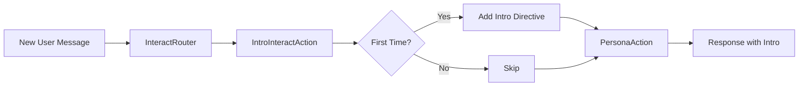

# IntroInteractAction

Introductory action for welcoming first-time users with a customizable introduction message.

## Overview

The `IntroInteractAction` detects first-time users and adds an introductory directive that PersonaAction includes in the response. This ensures new users receive a proper welcome and important information on their first interaction.

## Features

- **First-Time Detection**: Automatically identifies first-time users using the Interaction's `is_new_user()` method
- **Directive Pattern**: Adds introductory message as a directive for PersonaAction to incorporate
- **Customizable Prompt**: Configurable introduction message via agent.yaml
- **One-Time Execution**: Only runs on the first interaction, subsequent interactions skip it
- **Health Check**: Validates configuration on startup

## Installation

### 1. Add to agent.yaml

Add the IntroInteractAction to your agent's configuration:

```yaml
actions:
  - package_name: actions.jvagent.intro_interact_action.IntroInteractAction
    label: intro_interact_action
    context:
      enabled: true
      weight: -50  # Runs before PersonaAction
      prompt: |
        In a natural and brief manner:
        a. Introduce yourself by name and explain your role
        b. Refer the first-time user to read your AI policy at https://platform.trueselph.com/policy before continuing. It contains our privacy policy.
```

### 2. Restart jvagent

```powershell
cd c:\Users\isoke\Projects\jvagent\examples\jvagent_app
jvagent run
```

## Configuration

### Attributes

| Attribute | Type | Default | Description |
|-----------|------|---------|-------------|
| `prompt` | str | Default intro message | Introductory message for first-time users |
| `weight` | int | -50 | Execution order (lower = earlier) |
| `anchors` | list | [] | Routing anchors (empty for conditional execution) |

### Execution Order

The action's weight of `-50` ensures it runs:
-  **After** InteractRouter (weight: -100)
- ✅ **Before** PersonaAction (weight: 0)

This allows the intro directive to be included in the persona's response.

## How It Works



1. **Detection**: Checks if `interaction.is_new_user()` returns `True`
2. **Directive**: Adds the configured prompt as a directive
3. **Delegation**: PersonaAction incorporates the directive into its response
4. **One-Time**: Subsequent interactions skip this action

## Example Usage

### First Interaction

```
User: "Hello"

[IntroInteractAction executes]
→ Adds directive: "Introduce yourself and mention privacy policy"

PersonaAction generates:
"Hi! I'm JvAgent, your helpful AI assistant. Before we continue, please
review our AI policy at https://platform.trueselph.com/policy which contains
our privacy policy. How can I help you today?"
```

### Subsequent Interactions

```
User: "What can you do?"

[IntroInteractAction skips - not first time]

PersonaAction generates:
"I can help you with various tasks such as..."
```

## Customization

### Custom Introduction Message

Modify the `prompt` in agent.yaml:

```yaml
context:
  prompt: |
    Welcome! I'm your AI assistant.
    Before we begin, please note:
    - I'm here to help with your questions
    - All conversations are private
    - Learn more at https://yourcompany.com/about-ai
```

### Different Execution Order

Change the `weight` to adjust when it runs:

```yaml
context:
  weight: -75  # Run earlier (closer to InteractRouter)
```

## Technical Details

### Directive Pattern

The action uses the standard directive pattern:

```python
# Add directive to interaction
visitor.add_directive(self.prompt)
await interaction.save()

# Generate response via PersonaAction (handles retrieval, calling, and persistence)
await self.respond(visitor)
```

PersonaAction automatically incorporates all directives when generating responses.

### First-Time User Detection

Uses the Interaction class's built-in method:

```python
def is_new_user(self) -> bool:
    """Check if this is a new user interaction."""
    return len(self.actions) == 0 and len(self.events) == 0
```

This checks if there are no prior actions or events in the interaction.

## Health Check

The action includes a health check that validates configuration:

```python
async def healthcheck(self) -> bool | dict:
    if not self.prompt:
        return {
            "status": False,
            "message": "Prompt is not set",
            "severity": "error",
        }
    return True
```

## Comparison with Jac Version

This Python implementation replicates the functionality of the original `intro_interact_action.jac`:

| Feature | Jac Version | Python Version |
|---------|-------------|----------------|
| First-time detection | `visitor.interaction_node.is_new_user()` | `interaction.is_new_user()` |
| Directive | `visitor.interaction_node.add_directive()` | `interaction.add_directive()` |
| Health check | ✅ | ✅ |
| Configurable prompt | ✅ | ✅ |
| Execution control | `touch()` method | Conditional in `execute()` |

## Files Created

- [`intro_interact_action.py`](file:///c:/Users/isoke/Projects/jvagent/examples/jvagent_app/actions/jvagent/intro_interact_action/intro_interact_action.py) - Main action class
- [`__init__.py`](file:///c:/Users/isoke/Projects/jvagent/examples/jvagent_app/actions/jvagent/intro_interact_action/__init__.py) - Package init
- [`info.yaml`](file:///c:/Users/isoke/Projects/jvagent/examples/jvagent_app/actions/jvagent/intro_interact_action/info.yaml) - Package metadata
