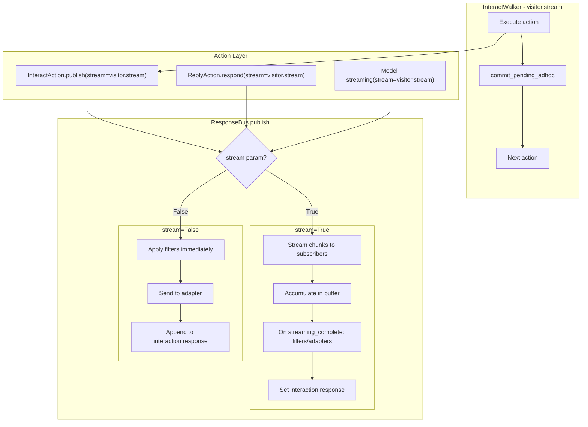

# Response Bus and Channel Adapter System

This guide documents the ResponseBus and the channel adapter system for delivering messages to external destinations (WhatsApp, web, SMS, etc.).

## Overview

The ResponseBus is the central service for publishing response content from InteractActions. It manages streaming vs non-streaming delivery, applies channel filters, routes adhoc messages to channel adapters, and keeps interaction.response in sync. Channel adapters:

- **Auto-register** when actions are registered
- **Auto-receive** adhoc messages when published for their channel
- **Zero manual wiring** required

## ResponseBus Design

Stream mode is determined by `visitor.stream` and passed through to `publish()`. The walker executes actions, commits pending adhoc content after each action, then proceeds to the next action. ResponseBus accumulates streaming chunks and only applies filters/adapters when a complete adhoc message is ready (non-streaming: immediately; streaming: when `streaming_complete=True` or on commit/finalize).



**Key behavior:**

- **Non-streaming (`stream=False`)**: Filters and adapters run immediately; content is appended to `interaction.response`.
- **Streaming (`stream=True`, `streaming_complete=False`)**: Chunks are sent to subscribers and accumulated; no filters/adapters yet.
- **Streaming (`stream=True`, `streaming_complete=True`)**: Full content is run through filters/adapters, `interaction.response` is set, and the accumulator is cleared.
- **Simulated streaming**: When the client requests streaming (`stream=True`) but an action publishes whole content in one call (e.g. non-streaming model or cached response), ResponseBus auto-detects this and splits the content using language-model tokenization (`chunking.chunk_text_by_lm_tokens`). Subscribers receive token-sized `stream_chunk` messages so the UX matches real token-by-token streaming; strings with no spaces are split into subword tokens.
- **Action boundaries**: After each action, the walker calls `commit_pending_adhoc(interaction_id, interaction)` so any accumulated streaming content is finalized (filters/adapters, append to interaction, save) before the next action runs.
- **Finalize**: `finalize_interaction()` calls `commit_pending_adhoc`, emits an internal final signal to subscribers, then cleans up buffers.

The public API for publishing is `publish()`; there is no `publish_message()`.

### Simulated streaming (LM tokenization)

When `stream=True` but content is published as a single whole message (e.g. non-streaming model or cached response), ResponseBus simulates streaming so the client still sees token-by-token delivery. Chunking uses **language-model tokenization** via `jvagent.action.response.chunking.chunk_text_by_lm_tokens()`:

- Uses tiktoken encoding `cl100k_base` (same as GPT-4 / Claude).
- Yields one token at a time; strings with no spaces are split into subword tokens.
- No chunk-size settings; boundaries are determined by the tokenizer.
- If tiktoken is unavailable, falls back to character-by-character so no-space strings still stream.

See `chunking.py` for `chunk_text_by_lm_tokens()` for ResponseBus simulated streaming.

## Architecture

### Components

1. **ResponseBus**: Central message bus that routes adhoc messages through filters to registered adapters
2. **ChannelFilter**: Base class for message transformation filters (execute before adapters)
3. **ChannelAdapter**: Base class for all channel adapters
4. **Action Integration**: Actions create and register filters and adapters in their `on_register()` method (for new registrations) and `on_startup()` method (for app restarts)

### How It Works

**Initial Registration:**
```
1. Action.on_register() creates ChannelAdapter instance
   ↓
2. Adapter.initialize() gets ResponseBus and registers itself
   ↓
3. ResponseBus stores single adapter per channel (replaces existing if any)
```

**App Restart:**
```
1. App starts and loads actions from database
   ↓
2. Action.on_startup() is called for all loaded actions
   ↓
3. Adapter.initialize() re-registers adapter with ResponseBus
   ↓
4. Adapter ready to receive messages
```

**Message Delivery:**
```
1. When adhoc message is published with channel="whatsapp"
   ↓
2. ResponseBus applies registered filters (in priority order)
   ↓
3. ResponseBus calls adapter.send(message) with transformed message
   ↓
4. Adapter sends message to external API
```

### Key Features

- **Single Adapter Per Channel**: Only one adapter per channel is maintained (serverless-friendly)
- **Direct Routing**: Adapters receive messages directly - no session subscriptions needed
- **Zero Manual Wiring**: No code in InteractWalker or elsewhere needs to manage adapters
- **Automatic Discovery**: ResponseBus automatically routes messages to registered adapters
- **Simple Interface**: Single `send()` method to implement
- **Serverless-Safe**: Adapters are replaced on registration, preventing orphaned instances

## Implementing a Channel Adapter

### Step 1: Create the Adapter Class

Create a new adapter class that inherits from `ChannelAdapter`:

```python
from jvagent.action.response.channel_adapter import ChannelAdapter
from jvagent.action.response.message import ResponseMessage

class MyChannelAdapter(ChannelAdapter):
    """Adapter for MyChannel integration."""

    def __init__(self, action: Any = None):
        """Initialize adapter.

        Args:
            action: Your Action instance (for accessing config)
        """
        super().__init__(channel="mychannel")
        self.action = action  # Store action for accessing config

    async def send(self, message: ResponseMessage) -> bool:
        """Send message to external API.

        This method is called by ResponseBus when an adhoc message is published
        for this adapter's channel.

        Args:
            message: ResponseMessage to send (contains user_id, session_id, content, etc.)

        Returns:
            True if sent successfully, False otherwise
        """
        # Extract recipient from message.user_id (no database queries needed!)
        if not message.user_id:
            logger.error(f"Cannot send message {message.id} - no user_id in message")
            return False

        # Send to your external API
        try:
            # Your API call here using message.user_id
            # response = await my_api.send(message.user_id, message.content)
            return True
        except Exception as e:
            logger.error(f"Error sending message: {e}", exc_info=True)
            return False
```

### Step 2: Integrate with Your Action

In your Action class, create and initialize the adapter in both `on_register()` and `on_startup()`:

```python
from jvagent.action.base import Action
from .my_channel_adapter import MyChannelAdapter

class MyChannelAction(Action):
    """Action for MyChannel integration."""

    api_url: Optional[str] = attribute(default=None)
    api_key: Optional[str] = attribute(default=None)

    async def on_register(self) -> None:
        """Called when action is registered.

        Creates and initializes the channel adapter for automatic
        message delivery via the response bus.
        """
        # Create adapter instance with action reference
        adapter = MyChannelAdapter(action=self)

        # Initialize the adapter (gets ResponseBus and registers itself)
        if await adapter.initialize():
            # Adapter is now stored in ResponseBus registry, no need for private reference
            pass

    async def on_startup(self) -> None:
        """Called when app starts and action is loaded from database.

        Re-initializes the channel adapter when the app restarts.
        This ensures adapters work correctly after app restarts.
        """
        # Only initialize if action is enabled and configured
        if not self.enabled:
            return

        if not self.is_configured():
            return

        # Reinitialize adapter (create new instance for clean state)
        adapter = MyChannelAdapter(action=self)
        if await adapter.initialize():
            logger.info(f"MyChannelAdapter initialized on app startup for channel '{adapter.channel}'")
        else:
            logger.error("MyChannelAdapter initialization failed on startup. Messages will NOT be delivered.")
```

### Step 3: Publish Messages

Messages are automatically delivered to adapters when published with the matching channel via `publish()`:

```python
# In an InteractAction or anywhere with access to response_bus
await visitor.response_bus.publish(
    session_id=session_id,
    content="Hello, world!",
    channel="mychannel",  # Must match adapter's channel
    stream=False,  # Non-streaming: filters/adapters run immediately
    interaction_id=interaction.id if interaction else None,
    interaction=interaction,  # Optional: avoids DB lookup for append
    user_id="user@example.com",  # User identifier (recipient) - required for channel adapters
    streaming_complete=True,  # Single message; only relevant when stream=True
)
```

## Example: WhatsApp Adapter

See `jvagent/action/whatsapp/whatsapp_adapter.py` for a complete implementation example.

### WhatsAppAction Integration

```python
class WhatsAppAction(Action):
    api_url: Optional[str] = attribute(default=None)
    api_key: Optional[str] = attribute(default=None)

    async def on_register(self) -> None:
        """Called when action is first registered."""
        adapter = WhatsAppAdapter(action=self)
        if await adapter.initialize():
            # Adapter is now stored in ResponseBus registry, no need for private reference
            pass

    async def on_startup(self) -> None:
        """Called when app starts and action is loaded from database.

        Re-initializes the channel adapter when the app restarts.
        """
        if not self.enabled or not self.is_configured():
            return
        adapter = WhatsAppAdapter(action=self)
        if await adapter.initialize():
            logger.info(f"WhatsAppAdapter initialized on app startup for channel '{adapter.channel}'")
        else:
            logger.error("WhatsAppAdapter initialization failed on startup. Messages will NOT be delivered.")
```

### WhatsAppAdapter Implementation

```python
class WhatsAppAdapter(ChannelAdapter):
    def __init__(self, action: Any = None):
        super().__init__(channel="whatsapp")
        self.action = action

    async def send(self, message: ResponseMessage) -> bool:
        # Use message.user_id directly (no database queries needed!)
        if not message.user_id:
            return False

        # Use self.action.api_url and self.action.api_key
        # Send to WhatsApp API using message.user_id
        # Note: message.content is already transformed by filters
        ...
```

## Channel Filters

Channel filters transform message content before delivery to channel adapters. Filters execute in a chain, allowing multiple transformations to be applied in sequence based on priority.

### Overview

Channel filters provide a clean separation between content transformation and message delivery:

- **Filters**: Transform message content (markdown, HTML, formatting, etc.)
- **Adapters**: Deliver messages to external APIs

Filters execute **before** adapters, ensuring transformed content is delivered.

### Key Features

- **Multi-Channel Support**: Single filter can handle multiple channels
- **Filter Chaining**: Multiple filters can execute in sequence, ordered by priority
- **In-Place Transformation**: Filters modify `message.content` directly
- **Priority-Based Execution**: Lower priority numbers execute first

### How It Works

**Filter Registration:**
```
1. Action.on_register() creates ChannelFilter instance
   ↓
2. Filter.initialize() gets ResponseBus and registers itself
   ↓
3. ResponseBus stores filter in priority-sorted list
```

**Message Transformation:**
```
1. Message published with channel="whatsapp"
   ↓
2. ResponseBus finds all filters for "whatsapp" channel
   ↓
3. Filters execute in priority order (lower first)
   ↓
4. Each filter transforms message.content in-place
   ↓
5. Transformed message delivered to adapter
```

### Implementing a Channel Filter

#### Step 1: Create the Filter Class

Create a new filter class that inherits from `ChannelFilter`:

```python
from jvagent.action.response.channel_filter import ChannelFilter
from jvagent.action.response.message import ResponseMessage

class MyChannelFilter(ChannelFilter):
    """Filter for MyChannel message transformation."""

    def __init__(self, channels: List[str] = None, priority: int = 100):
        """Initialize filter.

        Args:
            channels: List of channel names (defaults to ["mychannel"])
            priority: Execution order (default 100, lower executes first)
        """
        if channels is None:
            channels = ["mychannel"]
        super().__init__(channels=channels, priority=priority)

    async def filter(self, message: ResponseMessage) -> None:
        """Transform message content in-place.

        This method is called by ResponseBus before routing to adapters.
        Modify message.content directly to transform the message.

        Args:
            message: ResponseMessage to transform (modified in-place)
        """
        if not message.content:
            return

        # Apply transformations
        message.content = message.content.replace("**", "*")
        # ... more transformations
```

#### Step 2: Integrate with Your Action

Register the filter in both `on_register()` and `on_startup()`:

```python
from jvagent.action.base import Action
from .my_channel_filter import MyChannelFilter
from .my_channel_adapter import MyChannelAdapter

class MyChannelAction(Action):
    """Action for MyChannel integration."""

    async def on_register(self) -> None:
        """Register filter and adapter."""
        # Register filter first (transforms messages)
        filter = MyChannelFilter(channels=["mychannel"], priority=100)
        await filter.initialize()

        # Register adapter (sends messages)
        adapter = MyChannelAdapter(action=self)
        await adapter.initialize()

    async def on_startup(self) -> None:
        """Re-initialize filter and adapter on app restart."""
        if not self.enabled or not self.is_configured():
            return

        # Re-register filter
        filter = MyChannelFilter(channels=["mychannel"], priority=100)
        await filter.initialize()

        # Re-register adapter
        adapter = MyChannelAdapter(action=self)
        await adapter.initialize()
```

### Example: WhatsApp Filter

See `jvagent/action/whatsapp/whatsapp_filter.py` for a complete implementation.

The WhatsAppFilter transforms markdown and HTML to WhatsApp-compatible formatting:

```python
class WhatsAppFilter(ChannelFilter):
    def __init__(self, channels: List[str] = None, priority: int = 100):
        if channels is None:
            channels = ["whatsapp"]
        super().__init__(channels=channels, priority=priority)

    async def filter(self, message: ResponseMessage) -> None:
        """Transform message for WhatsApp formatting."""
        if not message.content:
            return

        message.content = (
            message.content.replace("**", "*")      # Markdown bold -> WhatsApp bold
            .replace("<br/>", "\n")                  # HTML break -> newline
            .replace("<b>", "*")                      # HTML bold -> WhatsApp bold
            .replace("</b>", "*")
        )
```

### Filter Priority and Chaining

Multiple filters can be registered for the same channel. They execute in priority order:

- **Lower priority executes first**: A filter with `priority=50` executes before `priority=100`
- **Default priority is 100**: If not specified, filters use priority 100
- **Chaining**: Each filter receives the message after previous filters have transformed it

Example with multiple filters:

```python
# Filter 1: Convert markdown (priority 50 - executes first)
markdown_filter = MarkdownFilter(channels=["whatsapp"], priority=50)
await markdown_filter.initialize()

# Filter 2: Add channel-specific formatting (priority 100 - executes second)
formatting_filter = WhatsAppFormattingFilter(channels=["whatsapp"], priority=100)
await formatting_filter.initialize()
```

### When to Use Filters vs. Adapters

**Use Filters For:**
- Content transformation (markdown, HTML, formatting)
- Channel-specific formatting rules
- Text replacements and sanitization
- Adding prefixes/suffixes

**Use Adapters For:**
- API communication
- Message delivery logic
- Chunking long messages (channel-specific)
- Error handling and retries

**Best Practice**: Keep transformation logic in filters, delivery logic in adapters.

## API Reference

### ChannelFilter Methods

#### `async def initialize() -> bool`

Initializes the filter by:
1. Getting ResponseBus instance from App
2. Registering itself with ResponseBus

**Must be called** after instantiation. Typically called in:
- `on_register()` - When action is first registered
- `on_startup()` - When app restarts and action is loaded from database

Returns `True` if initialization succeeded, `False` otherwise.

#### `async def filter(message: ResponseMessage) -> None`

Transforms the message content in-place. This method is called by ResponseBus before routing messages to adapters.

**Must be implemented** by subclasses.

Modifies `message.content` directly. No return value (all transformations are in-place).

#### `def applies_to_channel(channel: str) -> bool`

Checks if this filter applies to a specific channel.

Returns `True` if filter applies to the channel, `False` otherwise.

### ChannelAdapter Methods

#### `async def initialize() -> bool`

Initializes the adapter by:
1. Getting ResponseBus instance from App
2. Registering itself with ResponseBus

**Must be called** after instantiation. Typically called in:
- `on_register()` - When action is first registered
- `on_startup()` - When app restarts and action is loaded from database

Returns `True` if initialization succeeded, `False` otherwise.

#### `async def send(message: ResponseMessage) -> bool`

Sends the message to the external API. This method is called by ResponseBus when an adhoc message is published for this adapter's channel.

**Must be implemented** by subclasses.

**Note**: The message content has already been transformed by filters before reaching the adapter.

Returns `True` if message was sent successfully, `False` otherwise.

### ResponseBus Methods

#### `async def register_channel_filter(filter: ChannelFilter) -> None`

Registers a channel filter with the response bus. Filters are stored in priority order (lower priority executes first). Multiple filters can be registered for the same channel. Called automatically by `filter.initialize()`.

#### `async def register_channel_adapter(adapter: ChannelAdapter) -> None`

Registers a channel adapter with the response bus. Replaces any existing adapter for the same channel (single adapter per channel). This ensures serverless-friendly behavior where adapters are replaced on cold starts. Called automatically by `adapter.initialize()`.

#### `async def publish(...) -> ResponseMessage`

Publishes adhoc content. Stream mode and `streaming_complete` control accumulation and when filters/adapters run.

**Non-streaming (`stream=False`)**: Applies filters, sends to adapter, appends to `interaction.response`, notifies subscribers.

**Streaming (`stream=True`, `streaming_complete=False`)**: Accumulates chunk, emits `stream_chunk` to subscribers only.

**Streaming (`stream=True`, `streaming_complete=True`)**: Joins accumulated chunks, applies filters, sends to adapter, sets `interaction.response`, emits final signal, clears accumulator.

**Parameters:**
- `session_id`: Session identifier (required)
- `content`: Message content or chunk (required)
- `channel`: Target channel (required)
- `stream`: From `visitor.stream`; if True, content may be streamed in chunks (default: False)
- `interaction_id`: Parent interaction ID (optional)
- `interaction`: Interaction instance; if provided, avoids DB lookup for append (optional)
- `user_id`: User identifier (recipient) - **required for channel adapters** (optional)
- `metadata`: Additional metadata (optional)
- `streaming_complete`: True for last chunk or single message; only relevant when `stream=True` (default: True)

#### `async def commit_pending_adhoc(interaction_id: str, interaction: Any) -> None`

Commits any pending streaming adhoc content for the interaction. Finalizes accumulated content (filters/adapters), writes to `interaction.response`, and saves. Called by the walker between action transitions so the next action sees persisted response state.

#### `async def finalize_interaction(interaction_id: str, interaction: Any, session_id: str, channel: str = "default") -> None`

Finalizes an interaction: calls `commit_pending_adhoc`, attaches observability events to the interaction if present, emits an internal final signal to subscribers (no filters/adapters), then cleans up message/observability/adhoc buffers for the interaction.

## Message Types (Internal)

ResponseBus uses these message types internally. Channel filters and adapters only receive **adhoc** content (after accumulation when streaming).

- **`adhoc`**: Full message content delivered to filters and adapters; appended to `interaction.response`
- **`stream_chunk`**: Streaming chunk sent to subscribers only; not filtered or routed to adapters
- **`final`**: End-of-stream signal sent to subscribers only; not filtered or routed to adapters

## Thought vs User Messages

Response messages now carry structural routing fields so clients and adapters can handle model thoughts separately from user-facing content:

- `category`: `"user"` (default) or `"thought"`
- `thought_type`: optional subtype for thought messages (`reasoning`, `tool_call`, `tool_result`, `status`)
- `segment_id`: optional grouping key so streamed chunks can be assembled into one thought segment in the client

### Delivery Rules

- User messages keep existing behavior: filters/adapters apply and content can be appended to `interaction.response`.
- Thought messages are never appended to `interaction.response`; they are appended to `interaction.agent_trace`.
- Thought messages relay to channel adapters only when **both** are true:
  - `publish(..., category="thought", relay_to_adapters=True)`
  - adapter sets `deliver_thoughts = True`
- Thought messages pass through channel filters only when filter sets `applies_to_thoughts = True`.

### Streaming and Accumulation

- User streams continue to accumulate by `interaction_id`.
- Thought streams accumulate independently by `(interaction_id, segment_id)` to prevent cross-contamination with user response chunks.
- `commit_pending_thoughts()` flushes pending thought segments (for action boundaries/finalization), applies opt-in filters/adapters, and persists thought entries to `interaction.agent_trace`.

## Best Practices

### Filters

1. **Transform In-Place**: Always modify `message.content` directly - don't return a new value
2. **Handle Empty Content**: Check if `message.content` exists before transforming
3. **Use Appropriate Priority**: Set priority based on transformation order needs (lower = earlier)
4. **Multi-Channel Support**: Use filter for multiple channels if transformation logic is shared
5. **Keep Filters Focused**: Each filter should handle a specific transformation concern

### Adapters

1. **Pass Action Instance**: Always pass your action instance to the adapter so it can access configuration (API keys, URLs, etc.)

2. **Don't Store References**: Don't store adapter or filter references on Action instances. They are stored in ResponseBus.

3. **Handle Errors Gracefully**: Always wrap API calls in try/except and return `False` on failure

4. **Return Boolean**: Always return `True` on success and `False` on failure from `send()`

5. **Pass user_id**: Always pass `user_id` parameter when publishing adhoc messages for channel adapters. The user_id is included directly in the ResponseMessage object, eliminating the need for database queries in adapters.

6. **No Database Queries**: Adapters should use `message.user_id` directly - never query the database for recipient information. This ensures low latency and loose coupling.

7. **Log Appropriately**: Use appropriate log levels (warning for recoverable errors, error for failures)

8. **Serverless Considerations**: The single adapter per channel design ensures that adapters are automatically replaced on registration, preventing orphaned instances in serverless environments

9. **Content Already Transformed**: Adapters receive messages that have already been transformed by filters - don't duplicate transformation logic

## Troubleshooting

### Filter Not Transforming Messages

1. **Check channel name**: Ensure the channel in `publish()` matches the filter's channels list
2. **Verify initialization**: Make sure `filter.initialize()` was called and returned `True` in `on_register()` or `on_startup()`
3. **Streaming**: Filters run only when a full adhoc message is delivered (non-streaming immediately; streaming when `streaming_complete=True` or on commit)
4. **Check priority**: Verify filter priority if multiple filters are registered
5. **App restart**: If filter worked before restart but not after, ensure `on_startup()` is implemented to re-initialize the filter

### Adapter Not Receiving Messages

1. **Check channel name**: Ensure the channel in `publish()` matches the adapter's channel
2. **Verify initialization**: Make sure `adapter.initialize()` was called and returned `True` in `on_register()` or `on_startup()`
3. **Streaming**: Adapters receive only full adhoc content (non-streaming immediately; streaming when `streaming_complete=True` or on commit)
4. **App restart**: If adapter worked before restart but not after, ensure `on_startup()` is implemented to re-initialize the adapter

### Messages Not Being Delivered

1. **Check `send()` return value**: Ensure it's returning `True` on success
2. **Check logs**: Look for error messages in adapter and filter logs
3. **Verify user_id**: Ensure `user_id` parameter is passed when publishing adhoc messages. Adapters require `message.user_id` to be set.
4. **Verify initialization**: Check that both filter and adapter were successfully initialized
5. **Check for errors**: ResponseBus properly awaits filter.filter() and adapter.send() and logs errors immediately
6. **Check filter transformations**: Verify filters are not removing or corrupting message content
